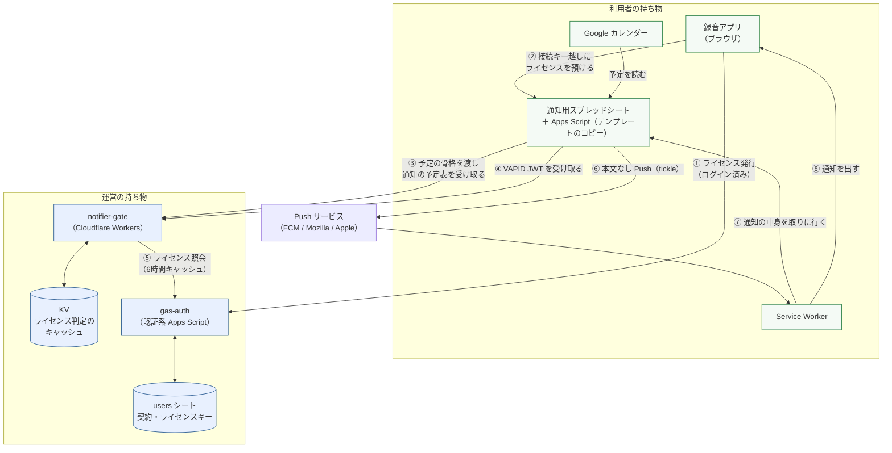
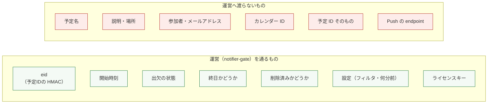
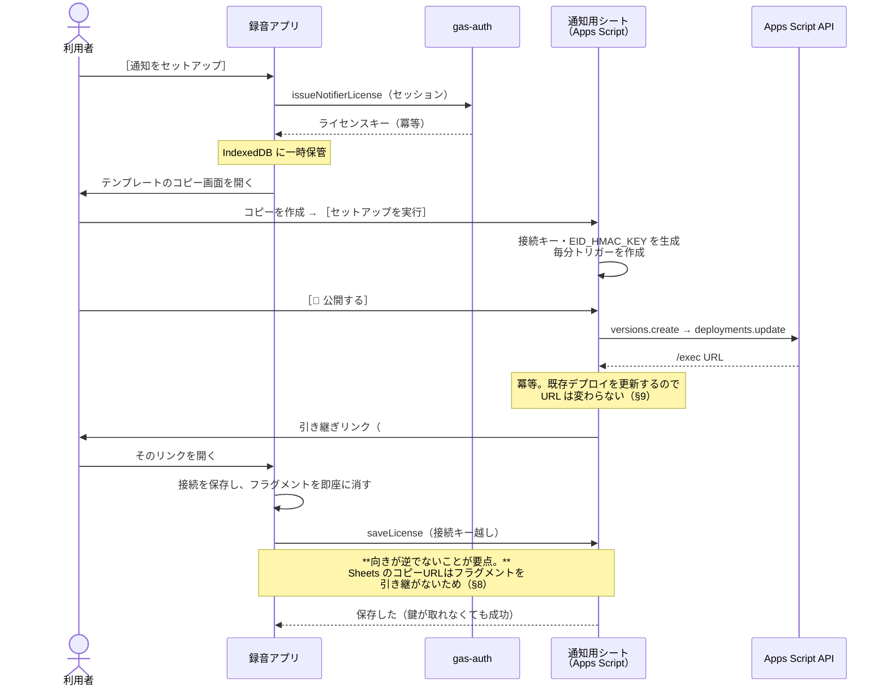
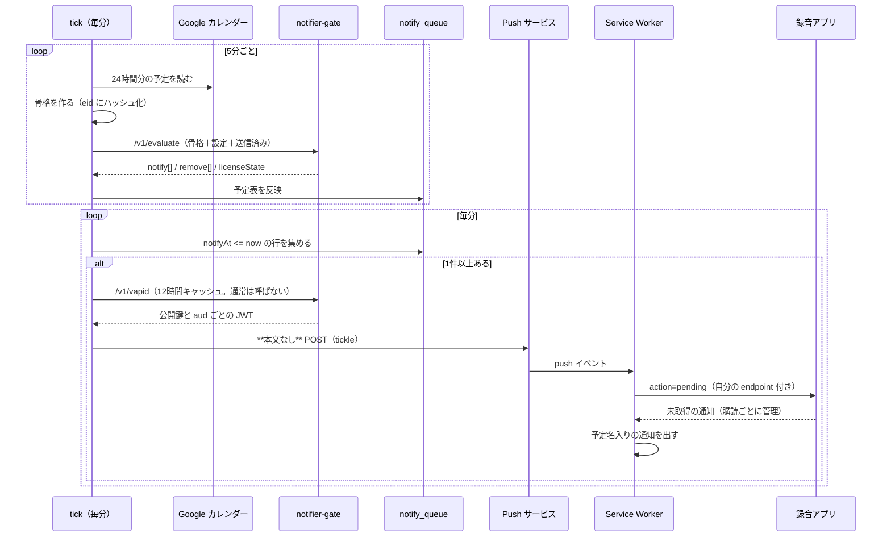
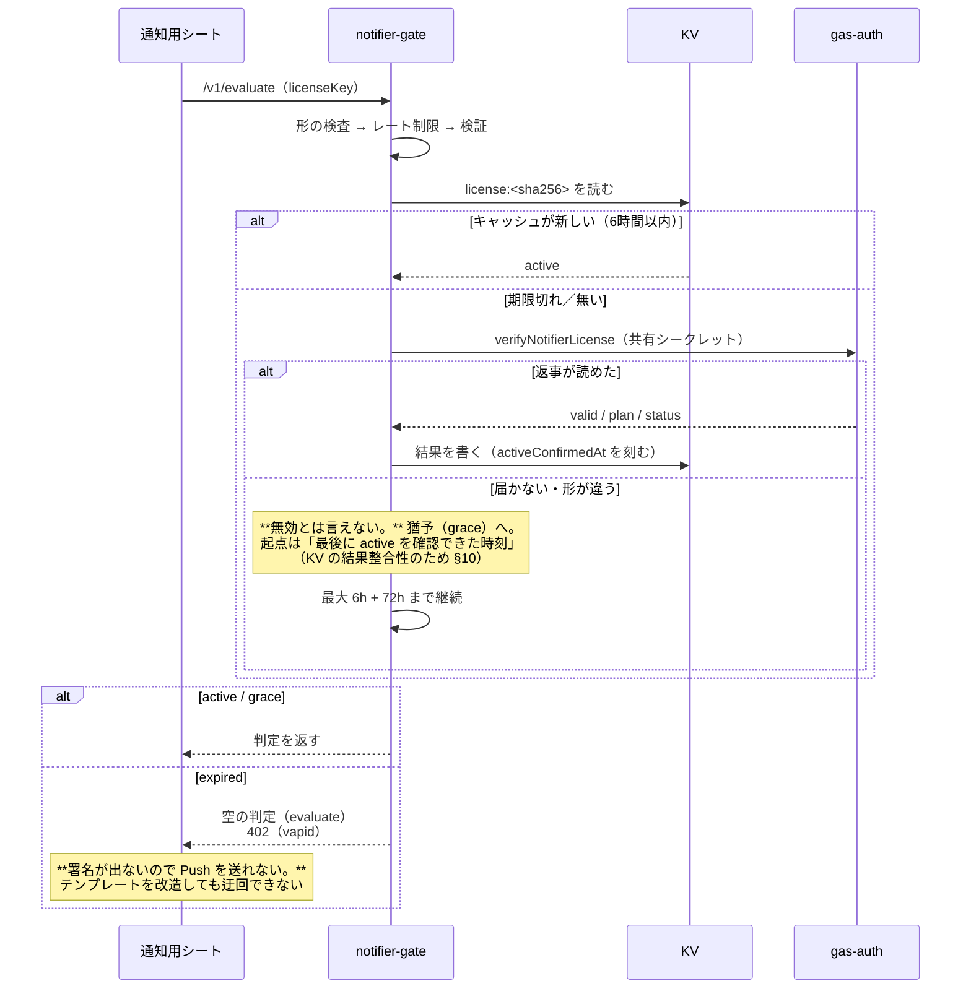

# カレンダー通知 V2｜設計書

作成: 2026年8月11日

**全体像を1枚で掴むための文書。** 個々の判断理由は
[notifier-design-notes.md](./notifier-design-notes.md) にあり、ここでは重複させず参照する。

> 2026-08-11 に、通知は本番の録音アプリからテスト環境へ移設した
> （[notifier-v2-resume.md](./notifier-v2-resume.md)）。
> **この文書は移設と無関係に、V2 の設計そのものを記述する。**
> 図の「録音アプリ」は、いまは `/apps/voice-recorder/` にある。

---

## 1. 全体構成

### 運営を通るもの／通らないもの

**「送らないよう気をつける」ではなく「送られても受け取らない」で守っている。**
`evaluate.mjs` の `validateEvents` が、許可した項目以外を含む要求を**丸ごと拒否**する
（[notifier-design-notes.md](./notifier-design-notes.md) §3）。

`eid` は利用者ごとの秘密鍵（`EID_HMAC_KEY`）で HMAC-SHA256 にかけた値で、
**運営は元の予定IDへ戻せない。** 利用者が違えば同じ予定でも別の値になるため、
運営側で「同じ会議に出ている2人」を突き合わせることもできない。

---

## 2. シーケンス

### 2-1. セットアップ

**利用者がキーを貼る欄は無い。** コードの貼り付けも無い（V1 の jsrsasign が消えた）。

### 2-2. 通知の定常フロー

**本文を送らない**のは Apps Script に ECDH / HKDF が無いためで、
結果として「予定名が Push サービスを通らない」という利点にもなっている（§6-1）。

### 2-3. ライセンスの検証と失効

---

## 3. コンポーネント一覧

### 3-1. 運営側

| ファイル | 責務 |
| --- | --- |
| `workers/notifier-gate/src/index.mjs` | ルータ。全エンドポイントで「形の検査 → レート制限 → ライセンス検証」の順に通す |
| `　　同 evaluate.mjs` | **通知するかどうかの判定**（要件 §6 の順序）。許可外の項目を含む要求を拒否 |
| `　　同 license.mjs` | ライセンス照会・キャッシュ・猶予の判定 |
| `　　同 vapid.mjs` | ES256 署名（WebCrypto）。aud のホスト制限 |
| `　　同 ratelimit.mjs` | KV の固定窓カウンタ。断るときに `retryAfterSec` を返す |
| `　　同 diagnostics.mjs` | 失敗の記録。**書き出す直前に秘密を伏せる** |
| `　　同 constants.mjs` | 判定に関わる定数の集約。ここを変えると全利用者に効く |
| `gas-auth/Notifier.gs` | ライセンスの発行（利用者向け）と照会（Workers 向け） |

### 3-2. 利用者側（テンプレート）

| ファイル | 責務 |
| --- | --- |
| `gas-notifier/CalendarSync.gs` | `tick`。カレンダーを読み、骨格を作り、ゲートへ渡し、キューへ反映 |
| `　　同 Gate.gs` | ゲートの窓口。JWT のキャッシュと**失敗後のクールダウン** |
| `　　同 Push.gs` | 本文なし Push の送信。404/410 で購読を掃除 |
| `　　同 Api.gs` | Web アプリの入口。action はホワイトリスト |
| `　　同 Store.gs` | シート I/O と Script Properties |
| `　　同 Setup.gs` | ワンボタン公開（Apps Script API）・接続キーの生成 |
| `　　同 SidebarSetup.html` | セットアップのウィザード |

### 3-3. 録音アプリ側

| ファイル | 責務 |
| --- | --- |
| `notifier-panel.js` | 画面制御。**録音のコードを混ぜない**（テストが文字列で見張る） |
| `notifier-client.js` | GAS への通信。POST は text/plain（プリフライト回避） |
| `notifier-config.js` | 接続情報の保管（IndexedDB）・URL の正規化・引き継ぎの解釈 |
| `notifier-messages.js` | 通知の文言と URL の組み立て（純関数） |
| `sw.js` | push の受信と表示。開く先は `registration.scope` から組み立てる |

### 3-4. データの置き場所

| 置き場所 | 何が入るか | 誰が読めるか |
| --- | --- | --- |
| **Script Properties**（利用者のシート） | 接続キー・ライセンスキー・`EID_HMAC_KEY`・VAPID キャッシュ・公開URL・最後のゲート失敗 | そのシートの持ち主のみ |
| **シート**（同上） | `settings` / `subscriptions` / `notify_queue` / `sent_log`。**予定名はここにしか無い** | 同上 |
| **KV**（運営） | `license:<sha256>` と `rl:<scope>:<hash>:<窓>` | 運営のみ |
| **users シート**（運営） | 契約・`notifier_license_key`（Q列） | 運営のみ |
| **IndexedDB**（ブラウザ） | 接続情報（`/exec` URL と接続キー）・引き渡し前のライセンスキー | その端末のみ |
| **localStorage**（同上） | 設定の**表示キャッシュのみ**（正はシート側） | 同上 |

### 3-5. シークレットの所在

| シークレット | 置き場所 | 読み返せるか |
| --- | --- | --- |
| `VAPID_PRIVATE_KEY` / `VAPID_PUBLIC_KEY` | Workers のシークレット | **不可**（登録前に `check-vapid-keys.mjs` で確かめる） |
| `AUTH_GAS_SHARED_SECRET` | Workers のシークレット ＋ gas-auth の Script Property（**同じ値**） | 不可 / 可 |
| `EID_HMAC_KEY` | 利用者の Script Properties | 可（持ち主のみ） |
| 接続キー | 同上。ブラウザ側は IndexedDB | 可 |
| ライセンスキー | `users` の Q列 ＋ 利用者の Script Properties | 可 |

> **アクセストークンはどこにも保存しない**（`ScriptApp.getOAuthToken()` は
> サーバー側関数の中だけで使い、クライアントへ渡さない）。
> ログにも出さない（`diagnostics.mjs` が伏せる）。

---

## 4. 設計判断の記録（ADR）

### ADR-1. Push は本文なし（tickle）にする

- **文脈**: Web Push の本文は購読ごとの鍵から ECDH + HKDF で導いた鍵で暗号化する決まりだが、**Apps Script に ECDH も HKDF も無い。**
- **決定**: 本文を送らず、Service Worker が `action=pending` で中身を取りに行く。
- **結果**: 予定名が Push サービスを通らない。一方で「取りに行けないと汎用文言が出る」経路が生まれ、これが宿題 B-04（2台目に届かない）の温床になった（V2 で解決）。
- 詳細 → [design-notes §6](./notifier-design-notes.md)

### ADR-2. 判定と署名を運営側へ移す（ライセンスゲート）

- **文脈**: V1 は利用者の Apps Script が判定も署名も持っており、**コピーした人は解約後も通知を受け取り続けられた。** サブスクリプションとして成立していなかった。
- **決定**: 判定（`/v1/evaluate`）と VAPID JWT の発行（`/v1/vapid`）を運営の Workers へ移す。
- **理由**: 判定だけ止めても、テンプレートを改造すれば自前の判定で送れてしまう。**署名の側でも止める**ことで、コピー・改変では迂回できない位置になる。
- **代償**: 動かすのに3者（Workers・gas-auth・テンプレート）が揃う必要がある。どれか1つ欠けると通知が出ない。
- 詳細 → [design-notes §1](./notifier-design-notes.md)

### ADR-3. VAPID の鍵はサービス全体で1ペア

- **文脈**: 鍵を利用者ごとに持つ案もあった。
- **決定**: 1ペアを運営が持ち、`/v1/vapid` で配る。
- **理由**: ブラウザの購読は `applicationServerKey` に紐づく。**鍵を差し替えると全利用者の購読が無効になる**ため、鍵の数だけ「壊せる範囲」が増える。1つに集めたうえで、ローテーション手順を README に固定した。
- **代償**: 鍵の事故が全体に及ぶ。だから登録前に `check-vapid-keys.mjs` でペアを検証する（ADR-5）。

### ADR-4. jsrsasign を捨てる

- **文脈**: V1 は約500KB のライブラリを利用者に手で貼らせて ES256 署名を作っていた。貼り忘れ・順序違い・途中で切れた、のいずれも「通知が届かない」という同じ症状になり、原因が見えなかった。
- **決定**: 署名を Workers へ移す。WebCrypto の `crypto.subtle.sign`（ECDSA/P-256）は JWS がそのまま要求する `r||s` の64バイトを返す。
- **結果**: 利用者側から貼り付け工程が消え、同時にライセンスの効きどころにもなった。**外部ライブラリは0件。**

### ADR-5. レート制限は「失敗したときの振る舞い」とセットで決める

- **文脈**: `/v1/vapid` を1時間4回に制限していた。JWT は12時間キャッシュされるので定常状態では十分——**という見積もりが実機で破綻した。**
- **何が起きたか**: 鍵が取れない → 保存されない → 次の操作でまた取りに行く。`saveLicense` が鍵の先取りに失敗して action ごと失敗を返していたため、ブラウザ側がライセンスキーを消さず、**画面を開くたびに引き渡しをやり直した。** 正規の操作2回で枠を使い切り、**成功しないと減らないのに呼べないから成功しない**状態になった。
- **決定**: 上限を20回へ上げたうえで、**増幅の経路を3層で塞ぐ。**
  1. `saveLicense` は鍵が取れなくても成功を返す（この action の仕事はキーを預かること）
  2. `gateVapid_` は失敗したら次に試してよい時刻を控え、その間は呼ばない
  3. ゲートは断るときに `retryAfterSec` を返す（当てずっぽうで再試行させない）
- **教訓**: **上限だけを決めて、失敗時の振る舞いを決めないと罠になる。**
- 詳細 → [design-notes §10](./notifier-design-notes.md)

### ADR-6. 猶予の起点は「最後に active を確認できた時刻」

- **文脈**: 認証系が不調なとき、有効な契約の通知を止めたくない。当初は「最初に照会へ失敗した時刻」から72時間としていた。
- **問題**: **KV は結果整合である。** 書き込みが全 colo へ行き渡るまでに時間差があり、その間に古いレコードを読む colo が「今から猶予開始」と書き直す。書き込みは後勝ちなので、**打ち切り時刻が後ろへずれ続けうる。**
- **決定**: 起点を「最後に active を確認できた時刻」へ寄せた。照会が成功した一度きりの事実なので、どの colo も同じ値を写すだけになる。古いレコードを読んだ場合も起点が**より過去**になり、安全側に倒れる。

### ADR-7. 実機で踏んだ主要な穴と恒久対策

**A節を完走するまでに5件を直した。症状はすべて「通知の鍵が × のまま」に見えたが、原因はいずれも別だった。**

| # | 症状 | 実際の原因 | 恒久対策 |
| --- | --- | --- | --- |
| 1 | 未公開なのに引き継ぎ画面へ直行 | `getService().getUrl()` が未公開でも値を返す | 公開URLは `deployWebApp()` が保存したものだけを正とした（fail closed） |
| 2 | 接続情報がリロードで消えたように見える | **保存はされていた。復元されたことが画面から分からなかった** | 先に保存する順序へ変更＋接続キー欄に「保存済み」の印。テストを「保存→空表示化→開き直し→復元→無入力で使う」の実順序で固定 |
| 3 | ［公開する］が 403 から進まない | GCP プロジェクトで Apps Script API が未有効 | 403 を2種類に分け、**手動公開を主経路**にした（Workspace の既定プロジェクトでは自力設定が重すぎる） |
| 4 | `/v1/vapid` が 500 | VAPID 秘密鍵の形式不一致。**例外の内容がログに出ていなかった** | 段階つき診断ログ（`phase=import-key` など）＋登録前の検証コマンド。**「内部情報を返さない」は応答の話であってログの話ではない** |
| 5 | 鍵が取れないまま直らない | **`/v1/vapid` が全件 429** | ADR-5 |

> **4 と 5 では `wrangler tail` の `Ok` を「HTTP 成功」と読み違え、切り分けが2往復遅れた。**
> `Ok` は「例外を投げずに応答を返した」という意味で、**429 も 402 も `Ok` と出る。**
> 読み方は [notifier-v2-rollout.md](./notifier-v2-rollout.md)。

### ADR-8. 応答の形は「実物」で固定する

- **文脈**: ゲートと Apps Script は別々に書かれており、応答の形が2か所にある。**片方だけ変えても、どちらのテストも通ってしまう。**
- **実際に起きた事故**: gas-auth は `{success:true, data}` を返すのに、Workers は `{ok:true, data}` を見ていた。両方のテストが緑のまま、本番だけが動かなかった。
- **決定**: **本物の Worker を走らせて得た応答**をフィクスチャにし、それを Apps Script 側のテストへそのまま流す（`tests/helpers/gate-fixtures.mjs`）。整形しない。どちらかの形が変われば、もう片方のテストが落ちる。

---

## 5. 関連文書

| 文書 | 何が書いてあるか |
| --- | --- |
| [notifier-design-notes.md](./notifier-design-notes.md) | 個々の判断理由（配布物に含めない場所） |
| [notifier-v2-rollout.md](./notifier-v2-rollout.md) | 運営者の公開手順・`wrangler tail` の読み方 |
| [notifier-v2-test-run.md](./notifier-v2-test-run.md) | 実機検証の手順（検証専用スケジュール） |
| [notifier-v2-acceptance-checklist.md](./notifier-v2-acceptance-checklist.md) | 受け入れの記録（A節まで完了） |
| [notifier-v2-resume.md](./notifier-v2-resume.md) | 本番へ戻す手順 |
| [calendar-notifier-setup.md](./calendar-notifier-setup.md) | 利用者向けの手順 |
| [workers/notifier-gate/README.md](../workers/notifier-gate/README.md) | ゲートの運用（鍵・デプロイ・エンドポイント） |
| [backlog.md](./backlog.md) | 未対応の宿題（B-08〜B-11 が通知まわり） |
