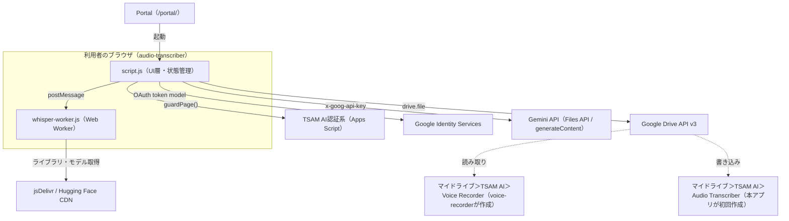
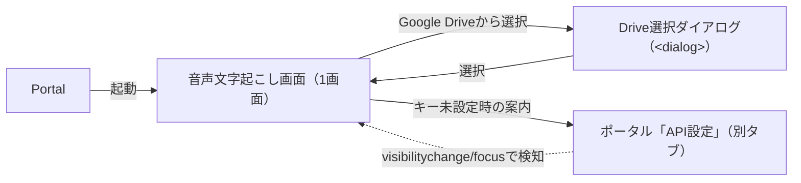

# 音声文字起こしアプリ（audio-transcriber）基本設計書

対象要件: [01_requirements.md](./01_requirements.md) / 既存仕様書
[docs/specs/audio-transcriber-requirements-v1.md](../../specs/audio-transcriber-requirements-v1.md)

## 1. システム構成

サーバーコードを持たない静的フロントエンドである。`public/production-app/audio-transcriber/`
配下のHTML／CSS／ES ModulesのみをTSAM AIのホスティング（`public/`配下の静的ルート）から配信する。

当社サーバーはどこにも登場しない。通信先はCSP（`index.html`の`<meta>`）で固定する
（01_requirements.md NFR-03）。

## 2. コンポーネント一覧と責務

| ファイル | 責務 |
| --- | --- |
| `index.html` | 画面構造、CSP（ページ限定meta）、`guardPage()`が通るまで`hidden`にする`<main>` |
| `config.js` | 定数（OAuth設定・フォルダ名・上限値・モデル一覧・プロンプト文）と表示整形関数。値を書き換える唯一の場所 |
| `state.js` | 画面状態の状態機械。DOM・fetchに依存しない純粋な状態管理。`subscribe`/`update`/`transition` |
| `oauth.js` | GISによるDriveアクセストークンの取得。トークンはモジュールクロージャのメモリ上のみに保持 |
| `drive-client.js` | Drive API v3呼び出し。フォルダ解決（名前→ID）、音声一覧、ダウンロード、TXTアップロード、エラー分類 |
| `audio-loader.js` | 音声の検証（`<audio>`メタデータ）とPCM化（`decodeAudioData`）、区間分割 |
| `whisper-transcriber.js` | UIスレッド側の端末内文字起こし窓口。Workerとの通信、区間分割実行、WebGPU→WASM切替の制御 |
| `whisper-worker.js` | Web Worker本体。Transformers.js（CDN）でWhisperパイプラインを構築し推論する |
| `gemini-transcriber.js` | Gemini REST呼び出し（モデル一覧・Files APIアップロード・待機・`generateContent`・削除） |
| `result-exporter.js` | 結果の整形（ファイル名生成・タイムスタンプ整形・話者名置換）、コピー・ダウンロードの薄い包み |
| `script.js` | UI層。DOM更新・イベント受付・エラー文言変換・各モジュールの結線。ロジック本体は持たない |
| `style.css` | 画面スタイル。`data-app-state`/`data-tone`による状態表示、`prefers-reduced-motion`対応 |

外部（TSAM AI共通資産）から参照するモジュール:

| モジュール | 用途 |
| --- | --- |
| `public/auth/session.js` の `guardPage` | ログインセッションの検証 |
| `public/auth/config.js` の `setScreenDepth` | 相対リンクの深さ指定 |
| `public/auth/keystore.js` の `KeyStore` / `PROVIDERS` / `isKeyStoreAvailable` | Gemini APIキーの保管庫 |
| `public/auth/auth.css` | 共通ボタン・フォームのスタイル |

## 3. 外部インターフェース一覧

| 連携先 | 通信方式 | 用途 |
| --- | --- | --- |
| Google Identity Services | `<script>`読み込み＋`google.accounts.oauth2` のポップアップトークンフロー | Driveアクセストークンの取得（`drive.file`） |
| Google Drive API v3 | REST（`fetch`、`Authorization: Bearer` ヘッダー） | フォルダ解決・音声一覧・ダウンロード・TXTアップロード |
| Gemini API | REST（`fetch`、`x-goog-api-key` ヘッダー） | モデル一覧・Files APIアップロード（resumable）・状態確認・`generateContent`・削除 |
| jsDelivr CDN | `import`（Web Worker内、ESモジュール） | Transformers.js本体の取得（バージョン固定） |
| Hugging Face CDN | Transformers.js内部が発行する`fetch` | Whisperモデルファイルの取得 |
| TSAM AI認証系（Apps Script） | `public/auth/api.js`経由のREST | セッション検証（`guardPage()`が内部で呼ぶ。本アプリはAPIを直接叩かない） |

## 4. データ設計概要

本アプリ自身のデータベース・スプレッドシートは持たない。永続化はすべてGoogle DriveまたはKeyStore
（`localStorage`）に委ねる。

| 保存先 | エンティティ | 所有・作成 |
| --- | --- | --- |
| Google Drive「マイドライブ＞TSAM AI＞Voice Recorder」 | 音声ファイル（MP3等） | `voice-recorder`が作成。本アプリは読むだけで作らない |
| Google Drive「マイドライブ＞TSAM AI＞Audio Transcriber」 | 文字起こし結果のTXT | 本アプリが初回保存時に作成 |
| `localStorage`（`tsam-api-keys`） | Gemini APIキー（プロバイダー名をキーにしたJSON） | `public/auth/keystore.js`（KeyStore）が所有。本アプリは`get`/`has`のみ使用 |
| ブラウザメモリ（モジュールクロージャ） | OAuthアクセストークン、解決済みフォルダID、画面状態（`state.js`） | 本アプリ。再読み込みで消える |
| ブラウザキャッシュ（HTTPキャッシュ） | Transformers.js本体・Whisperモデルファイル | ブラウザが管理。2回目以降は再ダウンロードしない |

Drive上のフォルダ・ファイルはIDで固定登録せず、「名前＋親フォルダ」からその都度解決する
（フォルダIDは利用者ごとに異なるため）。詳細スキーマは
[03_detailed-design.md](./03_detailed-design.md) §3。

## 5. 画面一覧と画面遷移

単一ページ（`index.html`）＋モーダルダイアログ（Drive選択）で構成する。別画面への遷移は
Portal・ポータル「API設定」への外部リンクのみ。

画面内はセクション（1.音声選択 → 2.方式選択 → 3.設定 → 4.実行 → 5.結果）を縦に並べた単一フォームで、
`state.js`の状態（`idle`/`file-selected`/`loading-model`/`uploading`/`transcribing`/`completed`/
`cancelled`/`error`）に応じて`script.js`の`render()`がDOMを書き換える。画面遷移（URL変化）は発生しない。

## 6. 認証・認可方式

3種類の資格情報を独立して扱う。

| 資格情報 | 方式 | 保持場所 | 有効期間 |
| --- | --- | --- | --- |
| TSAM AIログインセッション | `guardPage()`によるサーバー確認（トークン） | `public/auth/session.js`が管理（本アプリのスコープ外） | サーバー側のセッション有効期限 |
| Google Driveアクセストークン | GIS トークンモデル（暗黙フロー、リフレッシュトークン無し） | `oauth.js`のモジュールクロージャ変数のみ | ページ滞在中のみ。再読み込みで消え、再認可が必要 |
| Gemini APIキー | 利用者が事前にポータル「API設定」で登録（KeyStore） | `localStorage`（`tsam-api-keys`） | 利用者が明示的に削除するまで。ログアウトでは消えない |

起動時は`guardPage({ next: 'portal' })`を通過するまで`<main>`を`hidden`のままにし、通過後にのみ
描画する。Google連携は「Google Driveから選択」または「Googleドライブへ保存」を押した時だけ求め、
ページを開いただけでは認可を要求しない。Gemini APIキーは画面が「有無」だけを確認し
（`KeyStore.has()`）、値を読むのは実行直前の`KeyStore.get()`1回のみに限定する。

## 7. エラー処理方針

層ごとに専用のエラークラスとエラーコード定数を持ち、`script.js`の`describeError()`が一元的に
日本語文言へ変換してから画面へ出す。例外の`message`やAPI応答本文をそのまま表示しない。

| エラークラス | 発生源 | 例 |
| --- | --- | --- |
| `AudioError` | `audio-loader.js` | 未対応形式、デコード失敗、サイズ・長さ超過 |
| `DriveAuthError` | `oauth.js` | ポップアップが閉じられた、スコープ未付与 |
| `DriveError` | `drive-client.js` | 401/403/429、フォルダ未検出・重複 |
| `WhisperError` | `whisper-transcriber.js` / `whisper-worker.js` | モデル読み込み失敗、メモリ不足 |
| `GeminiError` | `gemini-transcriber.js` | APIキー不正、割り当て超過、音声未対応モデル |

中断（AbortController経由）はエラーの一種として扱わず、`isCancellation()`で判別して
「処理を中止しました。」という中立の文言に振り分ける。詳細は
[03_detailed-design.md](./03_detailed-design.md) §6。

## 8. 運用・デプロイ構成

- `public/production-app/audio-transcriber/`にビルド不要の静的ファイルとして配置する。
- デプロイは手動実行（`npm run deploy`）。`main`へのマージのみでは公開されない。
- Portal（`public/portal/app-registry.js`）に`id: 'audio-transcriber'`として登録済みで、
  `href: 'production-app/audio-transcriber/'`から起動する。
- テストは`tests/unit/audio-transcriber.mjs`（Node実行、Chrome不要）。DOM・Web Worker・
  実際のGoogle/Gemini通信・音声デコードを要する部分は自動テストの対象外で、実ブラウザでの
  確認記録はテスト環境版`public/apps/audio-transcriber/README.md`に引き継がれている
  （既存仕様書 文書情報欄）。

## 9. 主要な設計判断と採らなかった選択肢

既存仕様書 §12（採用しなかった案とその理由）を土台に、実装レベルの判断を補足する。

- **REST直叩き（SDK不使用）**: npmビルドを持たない構成のため、`@google/genai`のようなSDK導入は
  バンドラの追加を要し既存構成を崩す。Files API／`generateContent`は追加依存なしのRESTで足りる。
- **WebGPU失敗時はWorkerごと作り直す**: 同一Worker内で`device`だけを変えてパイプラインを
  再構築しても、ONNX Runtimeが最初に解決したバックエンドを保持し続けるため効かない（実測）。
  Workerを`terminate()`して作り直すことで確実に切り替える。モデルファイルはブラウザキャッシュに
  残るため、再ダウンロードは発生しない。
- **Gemini APIキーはKeyStore方式（都度入力を採らない）**: 本番の正はKeyStore
  （[keystore-spec-v1.md](../../specs/keystore-spec-v1.md)）。都度入力は入力の手間に加え、
  キーの扱いがアプリごとにばらつく。ポータル「API設定」に管理の入口を一本化した。
- **Voice Recorderフォルダを自動作成しない**: 見つからない場合に作成すると、録音アプリが実際に
  使っているのとは別の空フォルダが増え、利用者を混乱させる。
- **Google Pickerを使わない**: 固定フォルダの読み取りで用途が足りており、Pickerは追加のCSP許可
  （`apis.google.com`等）とブラウザキーを要する。
- **サーバー側での変換・キューを持たない**: 長時間音声の受信・処理が静的構成のホスティングでは
  成立せず、当社サーバーが音声内容を預かることにもなる。
