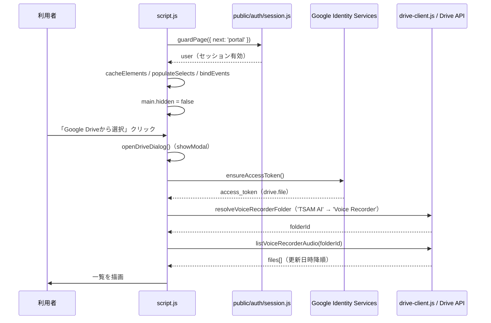
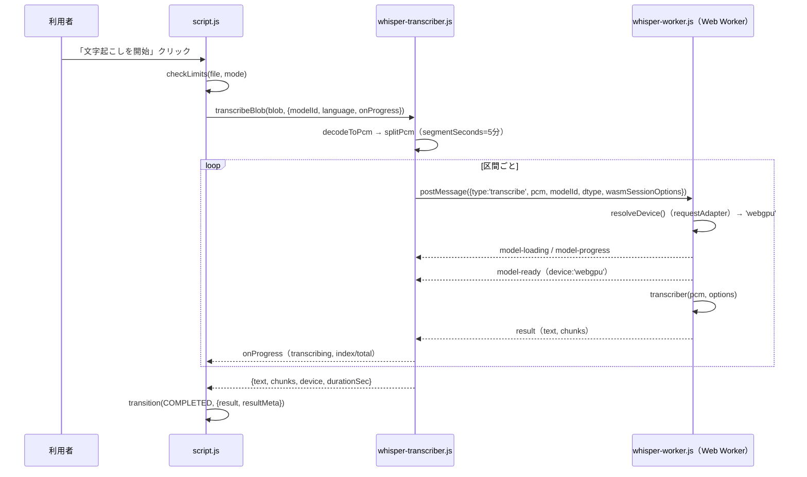
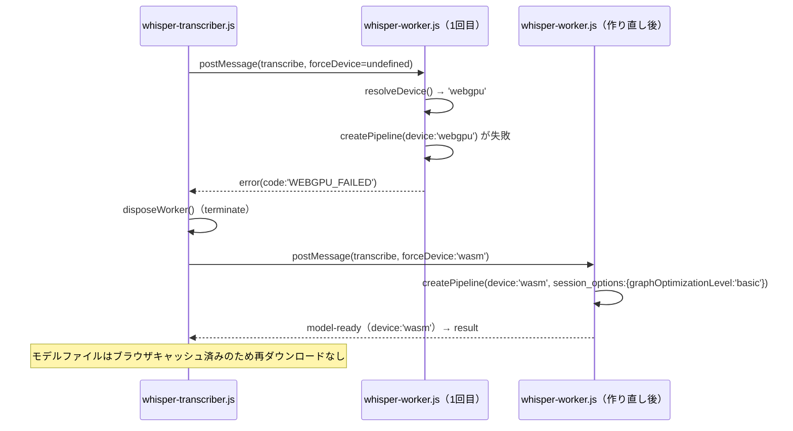
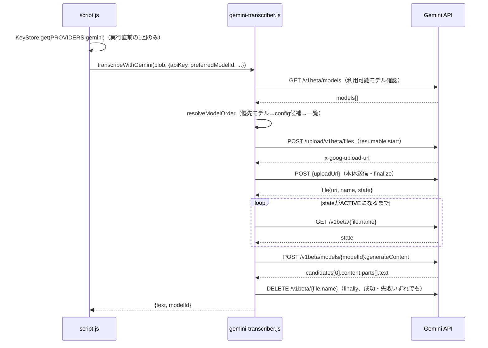
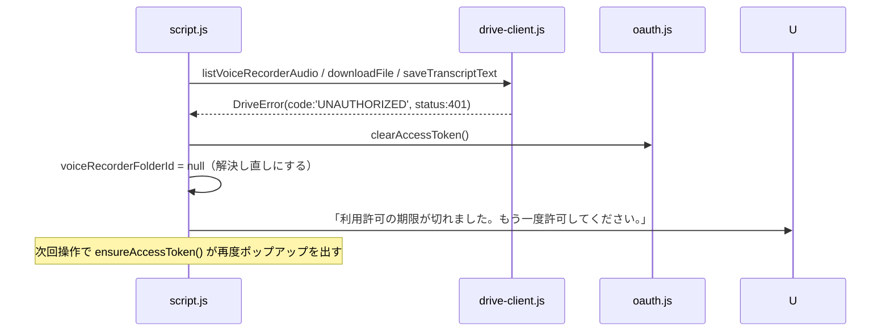

# 音声文字起こしアプリ（audio-transcriber）詳細設計書

対象要件: [01_requirements.md](./01_requirements.md) / 基本設計: [02_basic-design.md](./02_basic-design.md)

## 1. ファイル・モジュール構成

`public/production-app/audio-transcriber/`

| パス | 責務 |
| --- | --- |
| `index.html` | 画面DOM、ページ限定CSP（`<meta>`）、`guardPage()`が通るまで`hidden`の`<main id="at-main">` |
| `config.js` | OAuth設定・`DRIVE_NAMES`・`LIMITS`・`WHISPER`・`GEMINI`・`TRANSCRIPTION_PROMPT`・表示整形関数（`formatBytes`/`formatDuration`/`formatFolderPath`） |
| `state.js` | 状態機械（`State`列挙・`isBusy`/`hasFileIn`・`subscribe`/`update`/`transition`/`reset`） |
| `oauth.js` | `ensureAccessToken`/`clearAccessToken`/`hasValidAccessToken`、`DriveAuthError`/`DriveAuthErrorCode` |
| `drive-client.js` | フォルダ解決（`resolveVoiceRecorderFolder`/`ensureTranscriptFolder`）、一覧（`listVoiceRecorderAudio`）、取得（`downloadFile`）、保存（`saveTranscriptText`）、`DriveError`/`DriveErrorCode` |
| `audio-loader.js` | `looksLikeAudio`/`probeAudio`/`decodeToPcm`/`splitPcm`、`AudioError`/`AudioErrorCode` |
| `whisper-transcriber.js` | `transcribeBlob`/`disposeWorker`、Worker生成・区間ごとのメッセージ送受信、`WhisperError`/`WhisperErrorCode` |
| `whisper-worker.js` | Web Worker本体。`pipeline('automatic-speech-recognition', ...)`の構築・実行、デバイス判定（`resolveDevice`） |
| `gemini-transcriber.js` | `listUsableModels`/`resolveModelOrder`/`uploadAudio`/`waitUntilActive`/`generateTranscript`/`deleteUploadedFile`/`transcribeWithGemini`、`GeminiError`/`GeminiErrorCode` |
| `result-exporter.js` | `buildTextFileName`/`formatChunks`/`replaceSpeakerName`/`countCharacters`/`formatElapsed`/`copyText`/`downloadText` |
| `script.js` | 上記すべてを結線するUI層。文言表（`*_ERROR_MESSAGES`）、`describeError`/`isCancellation`、DOM更新（`render`）、イベント束線（`bindEvents`）、起動（`init`） |
| `style.css` | `data-app-state`/`data-mode`/`data-tone`を用いたスタイル切替、`prefers-reduced-motion`対応 |

対応する自動テスト: `tests/unit/audio-transcriber.mjs`（§8）。

## 2. 主要処理フロー

### 2-1. 起動〜Drive一覧取得（正常系）



### 2-2. 端末内文字起こし（正常系・WebGPU成功）



### 2-3. WebGPU失敗 → WASM再挑戦（異常系）



### 2-4. Geminiモード文字起こし（正常系）



### 2-5. Driveアクセストークン失効（401、異常系）



## 3. データモデル詳細

### 3-1. Google Drive フォルダ構造

| パス | 作成者 | 用途 | 存在しない場合 |
| --- | --- | --- | --- |
| マイドライブ ＞ TSAM AI | `voice-recorder`（先行） | 最上位フォルダ | 見つからなければ本アプリの読み取り経路はエラー（FR-03） |
| マイドライブ ＞ TSAM AI ＞ Voice Recorder | `voice-recorder` | 音声ファイルの保存先（読み取り元） | 作らない。「先にブラウザ録音アプリで保存」と案内 |
| マイドライブ ＞ TSAM AI ＞ Audio Transcriber | 本アプリ | 文字起こし結果TXTの保存先 | `ensureTranscriptFolder()`が初回保存時に作成（TSAM AIフォルダも無ければ作成） |

フォルダ名の定義元は`config.js`の`DRIVE_NAMES`（`root`/`voiceRecorder`/`audioTranscriber`）。
`root`と`voiceRecorder`の値は`voice-recorder/config.js`の`DRIVE_NAMES`（`root`/`app`）と
一致させる（フィールド名は異なるが値は同一。`tests/unit/audio-transcriber.mjs`で突き合わせ）。

Voice Recorderフォルダの解決（`resolveVoiceRecorderFolder`）は、同名フォルダが複数見つかった場合に
作成・更新日時を添えた候補一覧を`error.candidates`として返し、画面が利用者に選ばせる
（`DriveErrorCode.ROOT_FOLDER_AMBIGUOUS`/`APP_FOLDER_AMBIGUOUS`）。

### 3-2. Drive上のファイル

| 種別 | 命名 | MIME | メタデータ利用 |
| --- | --- | --- | --- |
| 音声（読み取り） | 録音アプリ由来（形式自由） | `audio/*`。空・`octet-stream`時は拡張子で補完判定（`isAudioFile`） | `id`/`name`/`mimeType`/`size`/`modifiedTime` |
| 結果TXT（書き込み） | `<元の音声ファイル名（拡張子除く）>.txt`（`buildTextFileName`） | `text/plain; charset=utf-8` | `id`/`name`/`webViewLink` |

### 3-3. `state.js` スナップショット

```text
{
  state: 'idle' | 'file-selected' | 'loading-model' | 'uploading'
       | 'transcribing' | 'completed' | 'cancelled' | 'error',
  file: { name, mimeType, size, durationSec, source: 'local'|'drive', blob } | null,
  mode: 'local' | 'gemini',
  progress: { label: string, ratio: number|null } | null,
  errorMessage: string | null,
  result: string,
  resultMeta: { elapsedMs: number, modeLabel: string } | null,
}
```

`update()`はスナップショットを毎回`Object.freeze`し直すため、購読側が受け取った値を書き換えても
状態は壊れない。`transition()`は遷移先ごとに付随してクリアすべき値（`progress`/`errorMessage`/
`result`/`resultMeta`）を面倒みる（§5）。

### 3-4. KeyStore（`tsam-api-keys`）

```text
localStorage["tsam-api-keys"] = { "gemini": "<APIキー文字列>" }
```

本アプリは`KeyStore.has(PROVIDERS.gemini)`（有無）と`KeyStore.get(PROVIDERS.gemini)`（値、
実行直前の1回のみ）だけを使う。保存・削除はポータル「API設定」の責務で、本アプリは行わない。

## 4. インターフェース仕様

### 4-1. Google Drive API v3（呼び出しているエンドポイント）

| メソッド・パス | 用途 | 主なクエリ／フィールド |
| --- | --- | --- |
| `GET /drive/v3/files` | フォルダ名解決 | `q`（`name=... and mimeType='application/vnd.google-apps.folder' and '<parent>' in parents and trashed=false`）、`fields=files(id,name,createdTime,modifiedTime)` |
| `GET /drive/v3/files` | フォルダ直下の音声一覧 | `q`（`'<folderId>' in parents and trashed=false`）、`orderBy=modifiedTime desc`、`pageSize`/`pageToken`でページング（`DRIVE.listPageSize`/`maxListPages`） |
| `GET /drive/v3/files/{id}` | 単体メタデータ補完 | `fields=id,name,mimeType,size` |
| `GET /drive/v3/files/{id}?alt=media` | 音声本体の取得（Blob） | - |
| `POST /upload/drive/v3/files?uploadType=multipart` | 結果TXTの保存 | multipart（メタデータJSON＋本文）、`fields=id,name,webViewLink` |

### 4-2. Gemini API（呼び出しているエンドポイント）

| メソッド・パス | 用途 |
| --- | --- |
| `GET /v1beta/models` | 利用可能モデルの一覧（`generateContent`対応のみ抽出） |
| `POST /upload/v1beta/files`（resumable: start） | アップロード開始・アップロードURLの発行 |
| `POST {uploadUrl}`（upload, finalize） | 音声本体の送信 |
| `GET /v1beta/{file.name}` | アップロードファイルの状態確認（`PROCESSING`→`ACTIVE`待ち） |
| `POST /v1beta/models/{modelId}:generateContent` | 文字起こしの生成 |
| `DELETE /v1beta/{file.name}` | アップロードファイルの削除（成功・失敗・中断いずれでも実行） |

### 4-3. 主要関数

| 関数 | 入力 | 出力 |
| --- | --- | --- |
| `ensureAccessToken({forceConsent})`（`oauth.js`） | `forceConsent: boolean` | `Promise<string>`（アクセストークン）。既存トークンが有効ならポップアップを出さない |
| `resolveVoiceRecorderFolder({token,signal,fetchImpl})`（`drive-client.js`） | Driveトークン | `Promise<{rootId, folderId}>` |
| `saveTranscriptText({token,text,fileName,signal,fetchImpl})`（`drive-client.js`） | 保存する本文・ファイル名 | `Promise<{id,name,webViewLink}>` |
| `probeAudio(blob)`（`audio-loader.js`） | 選択直後のBlob | `Promise<{durationSec, objectUrl}>`。読み込めなければ`AudioError`をthrow |
| `decodeToPcm(blob,{signal})`（`audio-loader.js`） | Blob | `Promise<{pcm:Float32Array, sampleRate:16000, durationSec}>` |
| `transcribeBlob(blob,{modelId,language,returnTimestamps,signal,onProgress})`（`whisper-transcriber.js`） | 音声Blobとオプション | `Promise<{text,chunks,device,durationSec}>` |
| `transcribeWithGemini(blob,{apiKey,displayName,preferredModelId,language,withTimestamps,signal,onProgress})`（`gemini-transcriber.js`） | 音声BlobとAPIキー | `Promise<{text, modelId}>` |
| `buildTextFileName(sourceName)`（`result-exporter.js`） | 元のファイル名 | サニタイズ済み`.txt`ファイル名 |
| `replaceSpeakerName(text, from, to)`（`result-exporter.js`） | 本文・置換前後の話者名 | 置換後の本文（行頭一致のみ） |

### 4-4. エラーコード一覧（抜粋。全量は各モジュール参照）

| モジュール | コード例 | 意味 |
| --- | --- | --- |
| `AudioErrorCode` | `UNSUPPORTED_TYPE`/`DECODE_FAILED`/`TOO_LARGE`/`TOO_LONG`/`OUT_OF_MEMORY`/`CANCELLED` | 音声の検証・PCM化に関するもの |
| `DriveAuthErrorCode` | `POPUP_CLOSED`/`POPUP_BLOCKED`/`ACCESS_DENIED`/`SCOPE_NOT_GRANTED` | OAuth認可に関するもの |
| `DriveErrorCode` | `UNAUTHORIZED`(401)/`FORBIDDEN`(403)/`ROOT_FOLDER_MISSING`/`APP_FOLDER_MISSING`/`ROOT_FOLDER_AMBIGUOUS`/`APP_FOLDER_AMBIGUOUS`/`RATE_LIMITED`(429) | Drive API呼び出し・フォルダ解決に関するもの |
| `WhisperErrorCode` | `WEBGPU_FAILED`（内部専用）/`MODEL_LOAD_FAILED`/`MODEL_RUN_FAILED`/`OUT_OF_MEMORY` | 端末内推論に関するもの |
| `GeminiErrorCode` | `API_KEY_MISSING`/`API_KEY_INVALID`/`QUOTA_EXCEEDED`(429/403)/`AUDIO_NOT_SUPPORTED`/`FILE_TIMEOUT` | Gemini API呼び出しに関するもの |

全コードと画面文言の対応表は`script.js`の`AUDIO_ERROR_MESSAGES`/`AUTH_ERROR_MESSAGES`/
`DRIVE_ERROR_MESSAGES`/`WHISPER_ERROR_MESSAGES`/`GEMINI_ERROR_MESSAGES`。

## 5. 状態管理・セッション設計

### 5-1. 画面状態（`state.js`）

| 状態 | 処理中扱い（`isBusy`） | ファイル保持（`hasFileIn`） | 遷移時にクリアする値 |
| --- | --- | --- | --- |
| `idle` | いいえ | いいえ | `file`/`progress`/`errorMessage`/`result`/`resultMeta` |
| `file-selected` | いいえ | はい | `progress`/`errorMessage`/`result`/`resultMeta`（新規選択のため前回結果を持ち越さない） |
| `loading-model` | はい | はい | - |
| `uploading` | はい | はい | - |
| `transcribing` | はい | はい | - |
| `completed` | いいえ | はい | `progress` |
| `cancelled` | いいえ | はい | `progress` |
| `error` | いいえ | はい | - |

`isBusy`な間は新しいファイル選択・モード切替を受け付けない（`rejectIfBusy()`）。

### 5-2. 資格情報のライフサイクル

| 資格情報 | 保持場所 | 破棄タイミング |
| --- | --- | --- |
| TSAM AIセッション | サーバー（`sessions`シート）＋ブラウザの`localStorage`（トークン文字列のみ、`public/auth/session.js`管理） | ログアウト、期限切れ |
| Driveアクセストークン | `oauth.js`のモジュール変数 | ページ離脱（`pagehide`は明示クリアしないが再読み込みでメモリ消滅）、401受信時に`clearAccessToken()`で明示破棄 |
| 解決済みVoice RecorderフォルダID | `script.js`のモジュール変数（`voiceRecorderFolderId`） | ページ再読み込み、401受信時、「再読み込み」ボタン押下時にnull化 |
| Gemini APIキー | `localStorage`（KeyStore、本アプリ管理外） | 利用者がポータルで明示削除するまで（ログアウトでは消えない） |

## 6. エラーハンドリング詳細

- `script.js`の`describeError(error)`が唯一の「例外→画面文言」変換点。`instanceof`で
  5種のエラークラスを判別し、対応する文言表から引く。該当コードが無ければ各モジュールの
  `UNKNOWN`文言にフォールバックする。想定外の例外（`instanceof`いずれにも該当しない）は
  種別を出さず「処理に失敗しました。ページを再読み込みしてお試しください。」に一般化する。
- `isCancellation(error)`で4種のエラークラスの`CANCELLED`系コードをまとめて判定し、
  中断操作を失敗として扱わず`State.CANCELLED`へ遷移させる。
- Drive呼び出しで`DriveErrorCode.UNAUTHORIZED`（401）を受けたら、`clearAccessToken()`と
  フォルダID解決キャッシュのクリアをセットで行い、次回操作での再認可を保証する。
- Whisper側の`WEBGPU_FAILED`は利用者へ見せる文言を持たず（`whisper-transcriber.js`が
  Worker再作成でWASMへ自動的に吸収するため）、UIまで到達するのは異常系のみ。
- Gemini側は`MODEL_NOT_FOUND`/`AUDIO_NOT_SUPPORTED`/`SERVER_ERROR`のみモデル候補の
  次点へリトライし、APIキー不正・割り当て超過はどのモデルでも同じ結果になるため即座に中止する
  （`generateTranscript`の`retriable`判定）。
- 実行中の推論を止める手段は`Worker.terminate()`のみ（WASM/WebGPU実行中は`cancel`メッセージが
  読まれないため）。中断のたびにモデルの再読み込みが発生するが、モデルファイル自体はブラウザ
  キャッシュに残るため再ダウンロードは発生しない。

## 7. 設定値・環境変数一覧

すべて`config.js`に集約する（他ファイルへ直接埋め込まない）。値そのものが秘密情報となる項目
（OAuthクライアントID）は本書に転記しない。

| 名前 | 役割 | 置き場所 |
| --- | --- | --- |
| `OAUTH.clientId` | Google OAuthクライアントID。録音アプリ・領収書スキャナと共用（値は非公開情報として本書に記載しない） | `config.js` |
| `OAUTH.scope` | Driveスコープ（`drive.file`固定） | `config.js` |
| `DRIVE_NAMES.root`/`voiceRecorder`/`audioTranscriber` | Driveフォルダ名（`'TSAM AI'`/`'Voice Recorder'`/`'Audio Transcriber'`） | `config.js` |
| `LIMITS.localMaxBytes`/`localMaxDurationSec` | 端末内モードの上限（512MB／4時間） | `config.js` |
| `LIMITS.geminiMaxBytes`/`geminiMaxDurationSec` | Geminiモードの上限（200MB／2時間） | `config.js` |
| `WHISPER.libraryUrl` | Transformers.jsのCDN URL（バージョン固定） | `config.js` |
| `WHISPER.defaultModelId`/`models` | 既定モデルと選択肢（tiny/base/small） | `config.js` |
| `WHISPER.dtype` | 量子化種別（`q8`固定） | `config.js` |
| `WHISPER.wasmSessionOptions` | WASM実行時のONNX Runtime設定（`graphOptimizationLevel:'basic'`） | `config.js` |
| `WHISPER.chunkSeconds`/`chunkOverlapSeconds` | Whisper内部の分割・重なり秒数（30秒／5秒） | `config.js` |
| `WHISPER.segmentSeconds` | Workerへ渡す区間の長さ（5分） | `config.js` |
| `WHISPER.sampleRate` | サンプリングレート（16000固定） | `config.js` |
| `GEMINI.apiBase`/`apiVersion` | Gemini APIのベースURL・バージョン | `config.js` |
| `GEMINI.models` | モデル候補（優先順） | `config.js` |
| `GEMINI.pollIntervalMs`/`pollTimeoutMs` | アップロード完了待ちの間隔・上限 | `config.js` |
| `TRANSCRIPTION_PROMPT` | Geminiへ渡す指示文（要約禁止・聞き取り不能表記など） | `config.js` |
| `DRIVE.listPageSize`/`maxListPages` | Drive一覧のページサイズ・上限ページ数 | `config.js` |
| `KEYSTORE_STORAGE_KEY`（`public/auth/keystore.js`） | Gemini APIキーの`localStorage`保存キー名 | `public/auth/keystore.js`（本アプリの外。参照のみ） |

環境変数（`.env`等）は使用しない。ビルド工程を持たない静的構成のため、すべてソース内定数として
管理する。

## 8. テスト構成

`tests/unit/audio-transcriber.mjs`（`tests/run.mjs`の`SUITES`に`{name:'audio-transcriber', kind:'unit'}`
として登録）。Node上で直接importできる純ロジックのみを対象にする。

| 対象モジュール | 検証内容 |
| --- | --- |
| `config.js` | OAuthスコープ・クライアントIDが`voice-recorder`と一致すること、フォルダ名の一致、上限値、WASM回避策の値、`formatBytes`/`formatDuration`の整形 |
| `state.js` | 初期状態、`isBusy`判定、状態遷移時の値クリア、購読・購読解除の通知 |
| `result-exporter.js` | ファイル名のサニタイズ、タイムスタンプ整形、話者名置換（行頭限定・特殊文字安全性）、文字数・経過時間の整形 |
| `drive-client.js` | クエリ組み立て（`in parents`が必ず含まれること、`'`のエスケープ）、MIME/拡張子判定、HTTPステータス→エラーコードの対応、境界文字列の生成 |

自動テスト対象外（ブラウザ環境が必要）:

| モジュール | 理由 |
| --- | --- |
| `script.js` | `guardPage()`と`document`前提のUI層 |
| `oauth.js`のトークン取得経路 | GISのポップアップが必要 |
| `audio-loader.js`／`whisper-transcriber.js`／`whisper-worker.js` | `AudioContext`・Web Worker・CDNからの実取得が必要 |

これらの実ブラウザでの確認記録は、複製元であるテスト環境版
`public/apps/audio-transcriber/README.md`に引き継がれている（WASM回避策の切り分け、実アカウントでの
Drive確認等）。実行コマンド:

```powershell
node tests/run.mjs audio-transcriber   # このスイートのみ
npm test                               # 全スイート（Chrome必須のスイートを含む）
```
