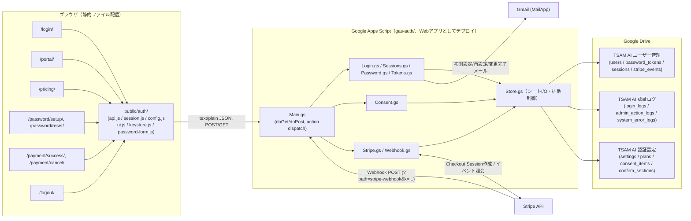
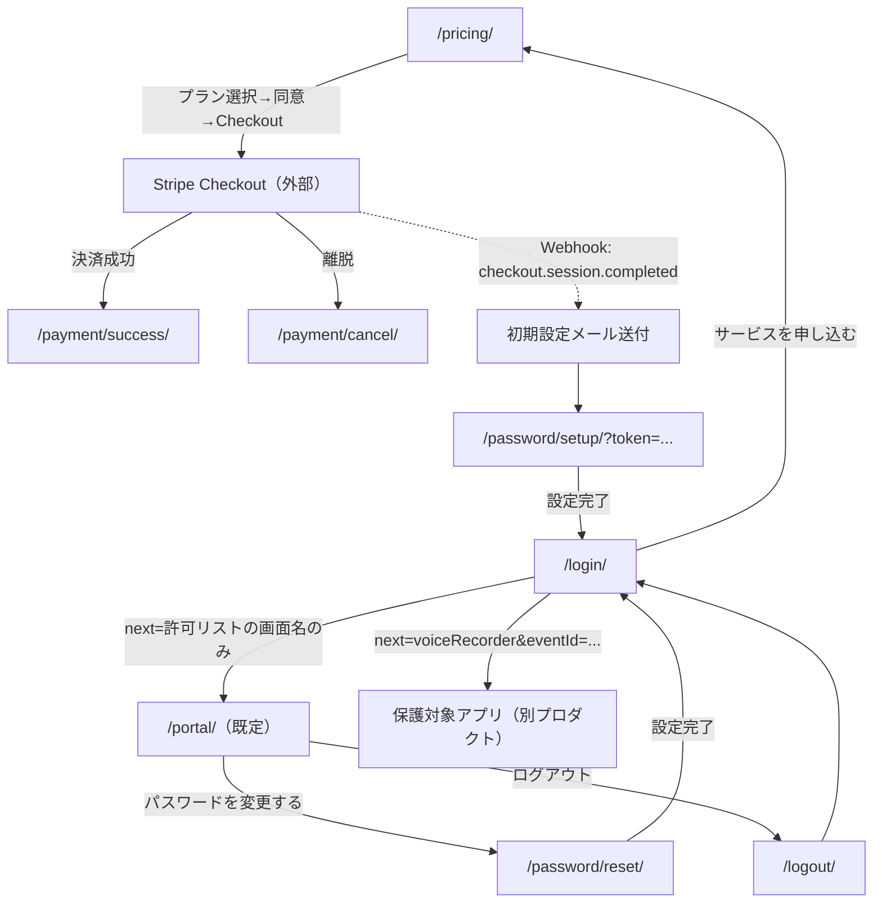

# 本番認証系（TSAM AI ログイン・Portal・決済連携）— 基本設計書

対象アプリID: `auth-portal`。要件は [01_requirements.md](./01_requirements.md)（FR-nn / NFR-nn）を参照。

---

## 1. システム構成

ブラウザ側とGAS側は別オリジンである（GitHub Pages相当の静的配信 + `script.google.com`）。そのため HttpOnly Cookie が使えず、認可はセッショントークン文字列＋サーバー検証の組み合わせで行う（詳細は §6）。

## 2. コンポーネント一覧と責務

| コンポーネント | パス | 責務 |
| --- | --- | --- |
| ログイン画面 | `public/login/` | メール・パスワード入力、`remember` 選択、認証開始 |
| Portal | `public/portal/` | ログイン後の入口。アプリ一覧・アカウント情報・APIキー設定（アプリ一覧の詳細は apps-grid-spec-v1.md） |
| 料金・同意画面 | `public/pricing/` | プラン表示、特商法要件の確認表示、同意取得、Checkout開始 |
| パスワード設定/再設定 | `public/password/setup/`, `public/password/reset/` | 時限トークンによるパスワードの初期設定・再設定 |
| 決済結果画面 | `public/payment/success/`, `public/payment/cancel/` | Checkoutからの戻り先。表示専用（副作用なし） |
| ログアウト画面 | `public/logout/` | 明示的ログアウトの入口 |
| 認証共通層 | `public/auth/` | 通信（`api.js`）、セッション管理と遷移制御（`session.js`）、画面パス解決（`config.js`）、UI部品（`ui.js`）、パスワードフォーム共通処理（`password-form.js`）、外部APIキー保管（`keystore.js`） |
| GAS エントリポイント | `gas-auth/Main.gs` | `doGet`/`doPost`。action ホワイトリスト判定とディスパッチ |
| ログイン・セッション処理 | `gas-auth/Login.gs`, `Sessions.gs`, `Password.gs`, `Tokens.gs`, `Users.gs` | 認証判定、失敗回数管理・ロック、セッション発行/検証/失効、時限トークン発行/検証 |
| 同意設定配信・検証 | `gas-auth/Consent.gs` | 同意項目・確認表の配信、申込み時の同意検証 |
| 決済連携 | `gas-auth/Stripe.gs`, `Webhook.gs` | Checkout Session 作成、プラン一覧配信、Webhook受信・冪等処理・契約状態反映 |
| 暗号・乱数 | `gas-auth/Crypto.gs` | PBKDF2実装、HMAC、タイミングセーフ比較、Stripe署名検証（中継利用時） |
| シート抽象化・排他制御 | `gas-auth/Store.gs` | スプレッドシートI/O、`withLock_`によるスクリプトロック直列化 |
| 設定・定数 | `gas-auth/Config.gs` | Script Properties/設定シート/既定値の3層解決、action許可リスト、シート列定義 |
| ログ・メール | `gas-auth/Logs.gs`, `Mailer.gs`, `MailTemplates.gs` | 認証ログ記録（秘密情報除外）、メール送信 |
| 初期セットアップ | `gas-auth/Setup.gs` | `setupAuthSystem()` によるフォルダ/シート/シークレット/管理者の初期構築（冪等） |
| （参考・対象外）法務CMS | `gas-auth/Legal.gs`, `LegalSeed.gs` | legal-cms-spec-v1.md の対象。本書では扱わない |
| （参考・対象外）カレンダー通知 | `gas-auth/Notifier.gs` | 消費者はブラウザ録音アプリ側。バックエンドのみ共有（01_requirements.md §3） |

## 3. 外部インターフェース一覧

| 連携先 | 通信方式 | 用途 |
| --- | --- | --- |
| GAS Webアプリ（`/exec`） | HTTPS。GET（参照系のみ）／ POST（`text/plain;charset=utf-8` の単純リクエストでJSON文字列を送る） | 全ての認証・決済API呼び出し。フロントは `public/auth/api.js` のみを窓口とする |
| Stripe API | HTTPS REST（form-urlencoded、`Authorization: Bearer <secret key>`） | Checkout Session作成、Checkout Session/Event照会。呼び出しは `gas-auth/Stripe.gs` に限定 |
| Stripe Webhook | HTTPS POST（GAS側は`?path=stripe-webhook&k=<合言葉>` で受信） | 決済完了・契約状態変動の通知。中継（Cloudflare Workers等）を置く場合は署名を`sig`クエリで転送 |
| Gmail (`MailApp`) | GAS組み込みサービス | パスワード初期設定/再設定/変更完了メールの送信 |
| Google AI Studio API (Gemini) | HTTPS REST（ブラウザから直接、`x-goog-api-key`ヘッダー） | 利用者が保存したAPIキーの疎通テスト（参照系 `GET /v1beta/models` のみ）。当社サーバーを経由しない |

## 4. データ設計概要

永続化先は Google スプレッドシート3ファイル（`gas-auth/Store.gs` の `spreadsheetForSheet_` が振り分け）。詳細スキーマは [03_detailed-design.md](./03_detailed-design.md) §3 を参照。

| スプレッドシート | 主なシート | 主要エンティティ |
| --- | --- | --- |
| TSAM AI ユーザー管理 | `users`, `password_tokens`, `sessions`, `stripe_events` | 利用者、時限トークン（ハッシュのみ）、セッション（ハッシュのみ）、受信済みStripeイベント（冪等性記録） |
| TSAM AI 認証ログ | `login_logs`, `admin_action_logs`, `system_error_logs` | ログイン試行、管理操作/Webhook由来の変更、想定外エラー。秘密情報は書かない方針を全シート共通で徹底 |
| TSAM AI 認証設定 | `settings`, `plans`, `consent_items`, `confirm_sections` | 運用設定値、Stripeプラン対応表（Price IDはここのみ）、同意チェック項目、契約条件確認表 |

ブラウザ側の永続化は `localStorage` の2キーのみ。

| キー | 内容 | 管理者 |
| --- | --- | --- |
| `tsam-auth-session` | セッショントークン文字列のみ（期限・ロール・ユーザー情報は保存しない） | `public/auth/session.js` |
| `tsam-api-keys` | `{"gemini": "<利用者本人のAPIキー>"}` 形式のJSON | `public/auth/keystore.js`（keystore-spec-v1.md） |

## 5. 画面一覧と画面遷移

| 画面 | 認証要否 | 到達経路 |
| --- | --- | --- |
| `/login/` | 不要 | 直接アクセス／`guardPage`によるリダイレクト（`?next=`付き）／ログアウト後 |
| `/portal/` | 必須（`guardPage`） | ログイン成功時の既定遷移先 |
| `/pricing/` | 不要 | `/login/`の「サービスを申し込む」／直接アクセス |
| `/password/setup/` | 不要（時限トークン） | 決済完了メールのリンク |
| `/password/reset/` | 不要（時限トークン、または申込みフォーム） | `/login/`の「パスワードをお忘れですか」→メールのリンク |
| `/payment/success/`, `/payment/cancel/` | 不要 | Stripe Checkoutからのリダイレクト |
| `/logout/` | 不要（ログイン中に呼ぶことを想定） | Portalのログアウトボタン／直接アクセス |

未ログインで保護対象画面へ到達した場合は `guardPage()` が `/login/?next=<画面名>` へ遷移させる（元URLのパス・ハッシュは引き継がず、画面ごとに許可したクエリのみ引き継ぐ。FR-06, FR-07）。

## 6. 認証・認可方式

- **セッショントークンは不透明な文字列**（base64url 43文字相当）。ブラウザはこれを `localStorage` に保存するのみで、有効期限・ロール・ユーザーIDのいずれもトークン自体からは読み取れない。
- **サーバーはハッシュのみ保存する。** `sessions` シートに保存するのは `HMAC-SHA256(トークン, SESSION_SECRET)` の16進のみ。平文トークンはシートに存在しない。
- **判断はすべてサーバー側。** `verifySession` は検証のたびにアカウント状態・契約状態を再確認する。契約が切れた・アカウントを止めた場合、次のアクセスで締め出される。有効期限は延長しない。
- **保護対象ページは `guardPage()` を通す。** サーバーが有効と答えるまで内容を描画しない。通信エラー時もログイン画面へ戻す（「オフラインなら通す」という妥協はしない）。
- **管理者判定は `role` 列のみ。** メールアドレスによる判定は行わない（portal-spec-v1.md §3-2）。
- **HttpOnly Cookieを使わない。** ブラウザ側とGAS側が別オリジンであり、Cookie発行・送信が成立しないための選択。XSS耐性は「秘密をJSに書かない・未サニタイズinnerHTML禁止・外部スクリプト不読込」の運用で担保する（SECURITY_NOTES.md §4）。将来同一オリジン構成へ移行する場合は、HttpOnly/Secure/SameSite付きCookie＋CSRF対策の再評価が必要（採らなかった選択肢として§9に記載）。

## 7. エラー処理方針

- **API応答は常に `{ success: true, data }` または `{ success: false, error: { code, message } }` の形。** クライアントは `public/auth/api.js` の `ApiError`（`NOT_CONFIGURED` / `NETWORK` / `SERVER`）に正規化して受け取る。
- **アカウント列挙耐性を最優先する。** ログイン失敗はすべて `AUTH_FAILED`（またはロック中の`LOCKED`）に丸め、未登録・パスワード不一致・契約切れ・アカウント停止を区別しない。本当の理由は`login_logs`の`failure_reason_code`にのみ残す。
- **フロントはサーバーの文言を推測で書き換えない。** `error.userMessage` をそのまま表示する。理由付けを追加するとアカウントの有無が漏れうるため。
- **画面が分岐するのはコード単位で1箇所のみ**（`AUTH_FAILED`時のみパスワード欄へフォーカス）。分岐を増やす際はアカウント列挙耐性の条件を満たすか確認する運用（login-page-detailed-spec-v3.md §5.4）。
- **想定外の例外はスタックトレース等をクライアントへ返さず、`system_error_logs`にのみ記録する。** `LOCK_TIMEOUT`は`RATE_LIMITED`として返す。

## 8. 運用・デプロイ構成

- **フロントは静的ファイルとしてホスティングされる。**（配信先の詳細はリポジトリ全体のCLAUDE.mdに従う。本アプリ固有の追加設定はない）
- **バックエンドはGASのWebアプリとしてデプロイする。** `gas-auth/*.gs`はエディタで保存しただけでは公開中のWebアプリへ反映されない。「デプロイを管理」から既存デプロイを新バージョンへ更新する運用とする（新規デプロイを作ると`/exec`URLが変わり、`public/auth/config.js`とStripe Webhook URLの追従が必要になるため）。
- **初期構築は`setupAuthSystem()`の1回実行で完結し、再実行しても冪等。** フォルダ・スプレッドシート・シート・シークレット（未設定時のみ生成）・管理者レコードを用意する。
- **秘密情報はScript Propertiesにのみ置く。** リポジトリにもスプレッドシートにも置かない（NFR-11）。
- **自動テストは偽Apps Script環境（`tests/helpers/gas-harness.mjs`）で`.gs`をNode上のvmで実行する。** 本番スプレッドシートへは一切書き込まない。

## 9. 主要な設計判断と採らなかった選択肢

| 判断 | 採用理由 | 採らなかった選択肢と理由 |
| --- | --- | --- |
| GASの単一エンドポイント＋action ホワイトリスト | GASの制約上REST的なパス分岐ができない | REST形式のパス設計 — GASの制約で不可能。将来別基盤へ移行する場合の変換点は`api.js`に限定済み |
| POSTを`text/plain`で送る | `application/json`はプリフライト(OPTIONS)を要求するが、GASはOPTIONSに応答できない | `application/json`での送信 — プリフライトに応答できず本体が届かない |
| セッショントークンを`localStorage`に保存 | GitHub Pages相当の静的配信＋GASの別オリジン構成ではHttpOnly Cookieが成立しない | HttpOnly Cookie — 別オリジンでは発行・送信が成立しない。将来同一オリジンのバックエンドへ移行する場合に再評価する |
| Webhookの真正性をURL合言葉＋Stripe API再照会の二重で確認 | GASの`doPost`はHTTPヘッダーを受け取れず、標準的な署名検証がそのままでは成立しない | 署名検証のみに依拠 — ヘッダーを受け取れないため単体では実現不可能。中継を置く場合のみ署名検証を追加する３層目とした |
| パスワードハッシュにpepper（Script Properties）を併用 | GASでは反復回数を大きくできず（1回のログインが遅くなる）、OWASP推奨値に届かない不足を補う | 反復回数だけを増やす — ログイン応答が実用に耐えない秒数になる |
| `?next=`を画面名の許可リスト＋画面ごとの許可クエリで制御 | 任意URLを受け取るとオープンリダイレクトの踏み台になる | 元URLをそのまま持ち回る方式（`/apps/`の`safeNextUrl`相当） — 恒久原則（任意URLを受け取らない）に反するため不採用 |
| APIキー（Gemini）をサーバーへ送らず端末内保管に限定 | 利用者本人の資格情報であり、当社が預かる筋合いがない・預かると管理責任が生じる | サーバー側での一括管理 — 責任の所在と漏洩リスクを不必要に増やす（keystore-spec-v1.md §2） |
| Portalのアカウント情報／API設定パネルを排他制御 | 両方開くとヘッダー下が渋滞し、Portal本来の役割（アプリを選ぶ）を阻害する | 同時に開けるようにする — 一覧が画面外へ押し出される |
