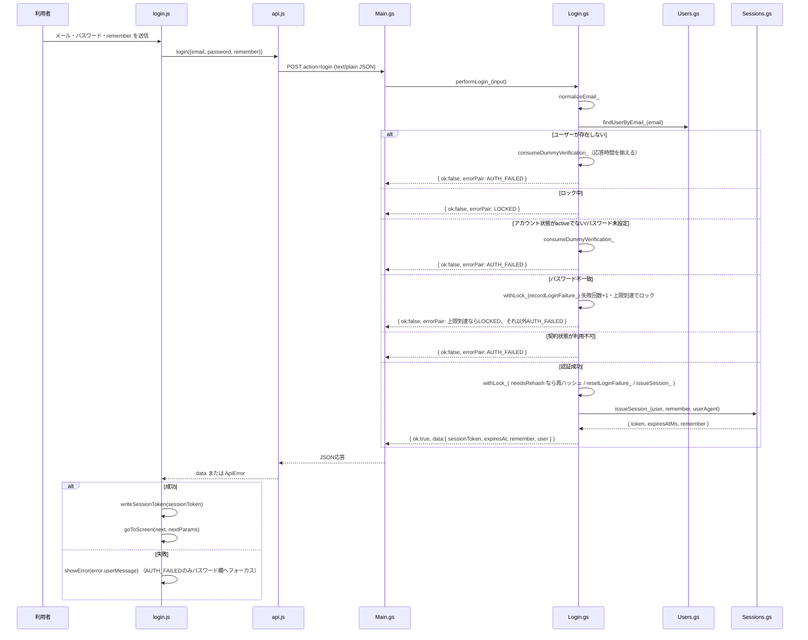
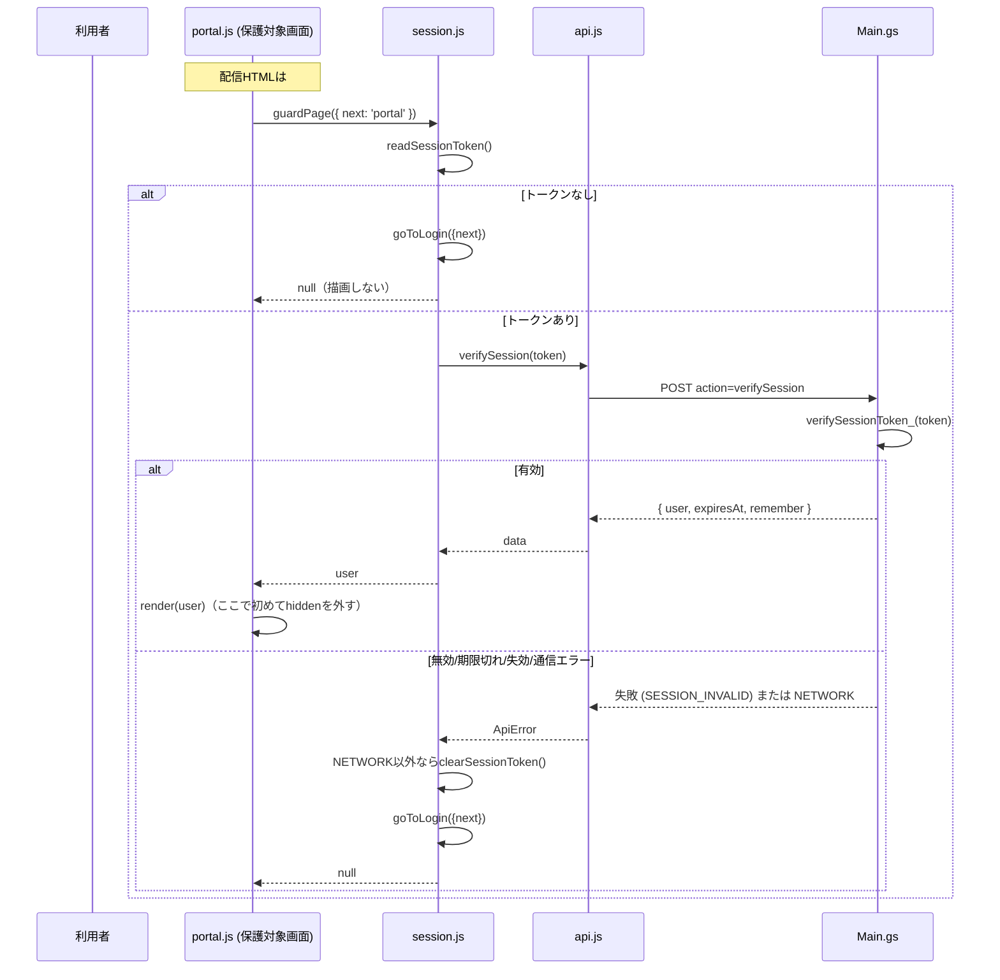
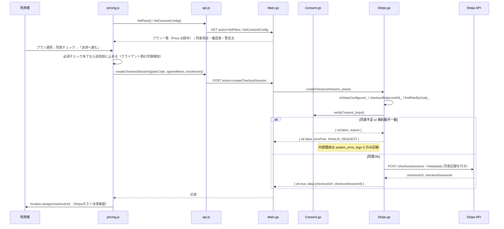
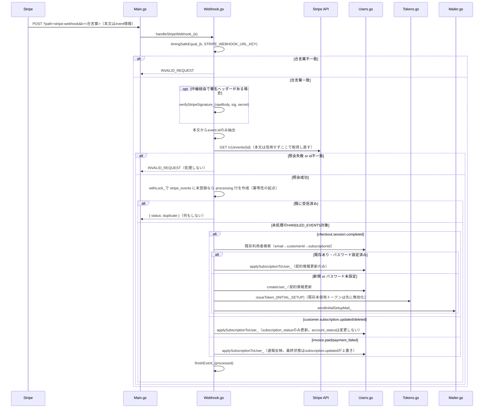
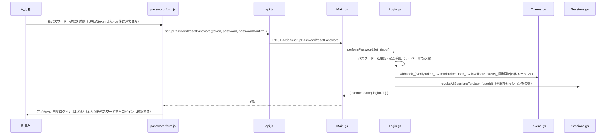

# 本番認証系（TSAM AI ログイン・Portal・決済連携）— 詳細設計書

対象アプリID: `auth-portal`。基本設計は [02_basic-design.md](./02_basic-design.md)。

---

## 1. ファイル・モジュール構成

### フロントエンド（画面）

| パス | 責務 |
| --- | --- |
| `public/login/index.html`, `login.js` | ログインフォーム。入力検証、`login()`呼び出し、成功時のトークン保存と遷移 |
| `public/portal/index.html`, `portal.js` | Portal本体。アカウント情報／API設定パネルの開閉、アプリグリッド描画、APIキー保存・削除・疎通テスト |
| `public/portal/app-registry.js` | Portalに並べる本番アプリの静的定義（`APP_REGISTRY`）。詳細は apps-grid-spec-v1.md |
| `public/portal/app-layout.js` | 利用者ごとの並べ替え結果（`tsam-app-layout`）の読み書き。同上 |
| `public/portal/app-source.js` | アプリ一覧の取得元切り替え（apps-grid-spec-v1.md §1 第3便） |
| `public/pricing/index.html`, `pricing.js` | プラン一覧・同意セクションの描画、Checkout開始 |
| `public/password/setup/index.html`, `setup.js` | パスワード初期設定画面。`password-form.js`を呼ぶ薄いラッパー |
| `public/password/reset/index.html`, `reset.js` | パスワード再設定の申込み（メール送信）／トークンによる再設定の2段構成 |
| `public/payment/success/index.html`, `success.js` | 決済成功後の表示専用画面 |
| `public/payment/cancel/index.html` | 決済キャンセル後の表示専用画面（JSなし） |
| `public/logout/index.html`, `logout.js` | 明示的ログアウトの入口画面 |

### フロントエンド（共通層 `public/auth/`）

| ファイル | 責務 |
| --- | --- |
| `config.js` | `AUTH_CONFIG`（`apiUrl`等）、画面パス定義`SCREENS`、深さに応じた相対パス解決（`screenPath` / `rootPath` / `setScreenDepth`） |
| `api.js` | GASとの通信窓口。`postAction` / `getAction`、`ApiError`、各action別の関数（`login` `verifySession` `logout` `setupPassword` `resetPassword` `requestPasswordReset` `createCheckoutSession` `checkoutStatus` `listPlans` `publicConfig` `listConsentConfig` `issueNotifierLicense`） |
| `session.js` | セッショントークンの保存/読出/削除、`guardPage()`、`redirectIfSignedIn()`、`signOut()`、`?next=`の許可リスト（`ALLOWED_NEXT`）と画面別許可クエリ（`NEXT_PARAM_RULES`） |
| `ui.js` | 共通UI部品。メッセージ領域、送信ボタンの二重送信防止、パスワード表示切替、金額/支払周期の表示整形、URLトークンの読み取り・除去 |
| `password-form.js` | パスワード初期設定/再設定フォームの共通処理（検証・送信・完了表示） |
| `keystore.js` | 利用者のGemini APIキーの`localStorage`保管（`KeyStore`, `PROVIDERS`）。詳細は keystore-spec-v1.md |
| `auth.css` | 認証系画面共通のスタイル |

### バックエンド（`gas-auth/`）

| ファイル | 責務 |
| --- | --- |
| `Main.gs` | `doGet`/`doPost`エントリポイント。action ホワイトリスト判定と`dispatchPost_`によるディスパッチ、`buildPublicConfig_`、想定外例外の共通処理 |
| `Config.gs` | Script Properties/設定シート/既定値の3層解決（`getSetting_`）、`SECRET_KEYS`による秘密情報の設定シート経由読み出し遮断、シート列定義、action許可リスト、URL組み立て |
| `Login.gs` | ログイン判定（`performLogin_`）、失敗回数管理・ロック（`recordLoginFailure_`）、パスワード初期設定/再設定処理（`performPasswordSet_`）、再設定申込み（`performPasswordResetRequest_`） |
| `Users.gs` | `users`シートの行⇔オブジェクト変換、検索（メール/ID/Stripe顧客ID/契約ID）、作成・更新、契約利用可否判定（`isSubscriptionUsable_`）、公開用整形（`toPublicUser_`） |
| `Sessions.gs` | セッション発行・検証・失効（単体/全件）、期限切れセッションの定期清掃（`cleanupExpiredSessions`） |
| `Tokens.gs` | 時限トークン（初期設定/再設定）の発行・検証・使用済み化・無効化・定期清掃（`cleanupExpiredTokens`） |
| `Password.gs` | パスワードのハッシュ化/照合（PBKDF2+pepper）、強度検証、未登録利用者への時間差ダミー計算（`consumeDummyVerification_`） |
| `Crypto.gs` | 乱数生成、HMAC/SHA-256、タイミングセーフ比較、PBKDF2自前実装、Stripe署名検証（中継利用時） |
| `Store.gs` | スプレッドシート開閉・行I/O抽象化、`withLock_`によるスクリプトロック直列化（入れ子対応） |
| `Consent.gs` | 同意項目/確認表の配信（`buildConsentConfig_`）、申込み時の同意検証（`verifyConsent_`）、Checkout metadataへの同意記録組み立て |
| `Stripe.gs` | Stripe APIクライアント（`stripeRequest_`）、プラン一覧配信（Price ID除外）、Checkout Session作成、決済状態照会 |
| `Webhook.gs` | Stripe Webhook受信（合言葉検証・本文からevent.id抽出・Stripe API再照会）、冪等処理、個別イベント（決済完了/契約変更/請求）のハンドラ |
| `Response.gs` | JSON応答生成（`ok_`/`fail_`）、クライアントへ返してよい定型エラー（`ERRORS`）、ログ専用の内部理由コード（`FAILURE_REASON`） |
| `Logs.gs` | ログイン試行/管理操作/システムエラーの記録（秘密情報を書かない） |
| `Mailer.gs`, `MailTemplates.gs` | メール送信（`sendMail_`）とテンプレート（初期設定/再設定/変更完了） |
| `Util.gs` | 文字列trim、メール正規化・検証・マスク、User-Agent要約、日時変換、真偽値パース等の純関数 |
| `Setup.gs` | `setupAuthSystem()`（冪等な初期構築）、`checkAuthSetup()`、`benchmarkPasswordHashing()`、`selfTestAuthFlow()` |
| `Tests.gs` | エディタから実行する簡易セルフテスト補助 |
| （対象外）`Legal.gs`, `LegalSeed.gs` | legal-cms-spec-v1.md の対象 |
| （対象外・バックエンド共有のみ）`Notifier.gs` | カレンダー通知ライセンスの発行/照会。消費者はブラウザ録音アプリ |

## 2. 主要処理フロー

### 2.1 ログイン（正常系・異常系）



判定順序は Login.gs の実装に即して 1.メール正規化 → 2.ユーザー検索 → 3.ロック確認（照合せず終了）→ 4.アカウント状態確認 → 5.パスワード照合（不一致で失敗回数+1）→ 6.`payment_exempt`確認 → 7.`subscription_status`確認 → 8.セッション発行、の順（login-page-detailed-spec-v3.md §8 と一致。実装上の詳細は本書 §6「既知の乖離」参照）。

### 2.2 保護対象ページへの到達（guardPage）



### 2.3 プラン申込みと決済（Consent検証を含む）



### 2.4 Stripe Webhook受信〜利用者作成



### 2.5 パスワード変更に伴う全セッション失効



## 3. データモデル詳細

### 3.1 `users`（TSAM AI ユーザー管理）

| 列 | 項目 | 型/形式 | 備考 |
| --- | --- | --- | --- |
| A | `user_id` | `usr_<uuid>` | 主キー |
| B | `email` | 文字列 | 小文字化・前後空白除去済みで格納 |
| C | `password_hash` | `pbkdf2$sha256$<反復回数>$<16進64文字>` | 未設定は空文字（`pending`状態） |
| D | `password_salt` | 16進32文字（16バイト） | 利用者ごとに異なる |
| E | `role` | `admin` \| `member` | 権限判定はここのみ。メールでは判定しない |
| F | `stripe_customer_id` | 文字列 | Webhook経由で反映 |
| G | `stripe_subscription_id` | 文字列 | 同上 |
| H | `subscription_status` | Stripeの契約状態文字列 | `active` / `trialing` / `past_due` / `canceled` 等。`exempt`は表示用で`payment_exempt`と併用 |
| I | `payment_exempt` | `TRUE`/`FALSE` | `TRUE`なら契約状態の確認自体を省略 |
| J | `account_status` | `pending`/`active`/`suspended`/`disabled`/`locked` | 当社側の運用値。契約解約では変更しない |
| K | `last_login_at` | ISO 8601 | ログイン成功時に更新 |
| L | `login_failure_count` | 数値 | 成功でリセット |
| M | `locked_until` | ISO 8601 | 上限到達時にセット。成功でクリア |
| N | `password_updated_at` | ISO 8601 | |
| O | `created_at` | ISO 8601 | |
| P | `updated_at` | ISO 8601 | セル更新のたびに自動更新 |
| Q | `notifier_license_key` | 平文文字列 | カレンダー通知の対象外機能用（本書スコープ外）。**平文で保持する意図的な例外**（再提示の必要があるため）。`toPublicUser_`には含めない |

**列は必ず末尾へ追加すること。** 列番号（`USER_COL`）で読んでいるため、途中への挿入は既存データを1列ずつずらす（AUTH_SETUP.md）。

### 3.2 `password_tokens`

| 列 | 項目 | 備考 |
| --- | --- | --- |
| `token_id` | `tok_<uuid>` | |
| `user_id` | 対象利用者 | |
| `token_hash` | `HMAC-SHA256(token, TOKEN_SECRET)`の16進 | 平文は保存しない |
| `token_type` | `initial_setup` \| `password_reset` | |
| `expires_at` | ISO 8601 | 初期設定72時間・再設定60分（既定） |
| `used_at` | ISO 8601 または空 | 使用済みなら埋まる。1回限り |
| `created_at` | ISO 8601 | |

### 3.3 `sessions`

| 列 | 項目 | 備考 |
| --- | --- | --- |
| `session_id` | `ses_<uuid>` | |
| `user_id` | 対象利用者 | |
| `token_hash` | `HMAC-SHA256(token, SESSION_SECRET)`の16進 | 平文は保存しない |
| `remember_login` | `TRUE`/`FALSE` | 有効期限の分岐に使用 |
| `issued_at` / `expires_at` | ISO 8601 | 通常12時間／remember時30日（既定） |
| `revoked_at` | ISO 8601 または空 | ログアウト・パスワード変更で埋まる |
| `last_access_at` | ISO 8601 | 検証成功のたびに更新（期限自体は延長しない） |
| `user_agent_summary` | 例: `windows/chrome` | 詐称可能な参考情報。個人特定可能な生UAは保存しない |

### 3.4 `stripe_events`

| 列 | 項目 | 備考 |
| --- | --- | --- |
| `event_id` | `evt_...` | 冪等性のキー |
| `event_type` | Stripeイベント種別 | |
| `received_at` / `processed_at` | ISO 8601 | |
| `processing_status` | `processing`/`processed`/`ignored`/`failed`/`duplicate` | |
| `error_message` | 文字列（最大500文字） | |

### 3.5 `settings`（認証設定スプレッドシート）

`key` / `value` / `description` の3列。既定値一覧は [01_requirements.md](./01_requirements.md) の運用値、および AUTH_SETUP.md「認証設定シートの一覧」を参照。**秘密情報キーはこのシートから読まれない**（`Config.gs`の`SECRET_KEYS`で遮断）。

### 3.6 `plans`

| 列 | 項目 | 備考 |
| --- | --- | --- |
| `plan_code` | 画面が送る識別子 | |
| `plan_name` | 表示名 | |
| `stripe_price_id` | **フロントへは一切返さない** | |
| `amount` / `currency` / `interval` | 表示用金額・通貨・周期 | 実際の課金額はStripeのPriceが正 |
| `features` | 改行区切りの機能一覧 | 画面側で配列化 |
| `enabled` | `TRUE`/`FALSE` | `FALSE`は非表示 |

### 3.7 `consent_items` / `confirm_sections`

pricing-consent-spec-v1.md §5 に列定義・初期データの投入方針（`setupAuthSystem()`が既存行を上書きしない）を含めて詳細がある。本書では割愛する。

### 3.8 ブラウザ側ストレージ

| キー | 内容 | 書き込み/削除タイミング |
| --- | --- | --- |
| `tsam-auth-session` | セッショントークン文字列のみ | ログイン成功時に書き込み。ログアウト・`guardPage`失敗時・パスワード変更検知時に削除 |
| `tsam-api-keys` | `{"gemini": "..."}` | Portal APIキー保存/削除時のみ。ログアウトでは消さない（keystore-spec-v1.md §8-1） |
| `tsam-app-layout` | Portalのアプリ並べ替え結果 | apps-grid-spec-v1.md の対象。本書は参照のみ |
| `tsam-auth-profile`（レガシー） | 過去のバージョンが書いていた表示用の写し | 現在は書き込まない。既存端末に残っている場合のみログアウト時に削除 |

## 4. インターフェース仕様

### 4.1 action 一覧（GAS `/exec`）

| メソッド | action | 認証 | 概要 |
| --- | --- | --- | --- |
| GET | `health` | 不要 | 死活確認 |
| GET | `listPlans` | 不要 | 有効プラン一覧（Price ID除外） |
| GET | `publicConfig` | 不要 | パスワード文字数、ログイン/Portal URL、決済導線の可否 |
| GET | `listConsentConfig` | 不要 | 同意項目・確認表・警告文・現行規約版 |
| POST | `login` | 不要 | ログイン |
| POST | `logout` | セッショントークン | ログアウト（存在しないトークンでも成功を返す） |
| POST | `verifySession` | セッショントークン | セッション有効性確認。`guardPage`が使用 |
| POST | `setupPassword` | 時限トークン(initial_setup) | パスワード初期設定 |
| POST | `resetPassword` | 時限トークン(password_reset) | パスワード再設定 |
| POST | `requestPasswordReset` | 不要 | 再設定メールの送付申込み。登録有無に関わらず同一応答 |
| POST | `createCheckoutSession` | 不要（同意必須） | Checkout Session作成 |
| POST | `checkoutStatus` | 不要 | 決済状態の参照（副作用なし） |
| POST | `issueNotifierLicense` | セッショントークン | 本書スコープ外機能（カレンダー通知）。参考記載 |
| POST | `verifyNotifierLicense` | 共有シークレット | 同上。Workersからのサーバー間呼び出し |
| POST（別経路） | `?path=stripe-webhook&k=<合言葉>` | URL合言葉＋Stripe API再照会 | Webhook受信 |

action はすべて `ALLOWED_GET_ACTIONS` / `ALLOWED_POST_ACTIONS`（`Config.gs`）のホワイトリストに存在するもののみ実行される。

### 4.2 主要リクエスト/レスポンス例

`login` / `verifySession` の詳細な入出力形状（フィールド名・型・失敗コード）は login-page-detailed-spec-v3.md §5 が正であり、本書では重複記載しない。`createCheckoutSession` の同意関連フィールド（`agreedItems` / `tosVersion`）は pricing-consent-spec-v1.md §4 が正。

### 4.3 共通エラーコード（`Response.gs` `ERRORS`）

| code | 意味 |
| --- | --- |
| `INVALID_ACTION` | ホワイトリスト外のaction |
| `INVALID_REQUEST` | リクエスト形式不正（同意不足・Webhook合言葉/署名不一致等を含む。内部理由は返さない） |
| `AUTH_FAILED` | ログイン失敗（理由は区別しない） |
| `LOCKED` | ログイン失敗回数の上限到達 |
| `SESSION_INVALID` | セッション無効（理由は区別しない） |
| `TOKEN_INVALID` | 時限トークンが無効/期限切れ/使用済み |
| `PASSWORD_WEAK` / `PASSWORD_MISMATCH` | パスワード強度不足／確認不一致 |
| `PLAN_NOT_FOUND` | 無効なプランコード |
| `STRIPE_ERROR` | Stripe API呼び出し失敗 |
| `RATE_LIMITED` | Checkout上限到達、またはロック取得タイムアウト |
| `NOT_CONFIGURED` | 必要な設定（Stripe鍵、URL等）が未設定 |
| `SERVER_ERROR` | その他の想定外エラー |

フロント側（`public/auth/api.js`）はこれに加えて `NOT_CONFIGURED`（apiUrl未設定）、`NETWORK`（通信失敗/タイムアウト/JSON解析失敗）を独自に付与する。

## 5. 状態管理・セッション設計

- **セッション有効期限**: 通常 `SESSION_TTL_HOURS`（既定12時間）、`remember=true` 時は `REMEMBER_SESSION_TTL_DAYS`（既定30日）。`remember`はフロント・GASの両層で`=== true`の厳密判定のみを行い、`Boolean("false")`のような暗黙変換を許さない（型不正は短時間セッション側という安全な方向に倒す設計。login-page-detailed-spec-v3.md §5.2）。
- **Session fixation対策**: ログイン成功時は既存トークンを再利用せず必ず新規発行する。ログイン前に保持していたトークンは破棄する。
- **全セッション失効**: パスワード変更（初期設定/再設定どちらも）で対象利用者の全セッションを失効させる（`revokeAllSessionsForUser_`）。
- **セッション検証**: `verifySession`のたびにアカウント状態・契約状態を再確認し、いずれかが利用不可なら`SESSION_INVALID`を返す。有効期限は検証時に延長しない。
- **画面側のトークン管理**: `public/auth/session.js`が唯一の入出力口。保存するのはトークン文字列のみで、期限・ロール・ユーザー情報（`profile`）は保存しない（v3.1で`tsam-auth-profile`書き込みを全廃）。
- **多重タブ/多重端末**: 個別端末・個別セッションの一覧/失効UIは無い（01_requirements.md §9「未確定」）。運用者が`sessions`シートを直接編集することで個別失効は可能。

## 6. エラーハンドリング詳細

- **アカウント列挙耐性**: 未登録メールアドレスに対しても`consumeDummyVerification_`で実在時と同じ計算量（PBKDF2反復）を消費し、応答時間の差から存在有無を推測させない。パスワード再設定申込みも常に同一応答。
- **ロック中は照合しない**: ロック確認はパスワード照合より前に行い、ロック中は総当たりへ計算資源を与えない。
- **想定外例外**: `handleUnexpected_`がスタックトレースを含む詳細をログにのみ記録し、クライアントへは`SERVER_ERROR`（ロック取得タイムアウトの場合は`RATE_LIMITED`）を返す。
- **メール送信失敗**: 呼び出し元の処理は止めない。「メールが届かなかった」を利用者へ明示すると登録有無の手がかりになるため、失敗は`system_error_logs`にのみ残す。
- **Webhook本文は信用しない**: 受信した本文からは`event.id`のみを使い、実際の処理内容はStripe APIへ再照会した結果のみを使う（本文の改ざんは無効化される）。
- **排他制御**: 利用者作成、失敗回数更新、トークンの検証と使用済み化、セッション発行、Webhook受信記録は`withLock_`で直列化する。ロック取得に失敗した場合は例外を投げ、黙って処理を続けない。

## 7. 設定値・環境変数一覧

値そのものは記載しない（[docs/system-design/_authoring-guide.md](../_authoring-guide.md) の方針）。名前・役割・置き場所のみ。

### フロントエンド

| 名前 | 役割 | 置き場所 |
| --- | --- | --- |
| `AUTH_CONFIG.apiUrl` | GAS Webアプリの `/exec` URL。公開エンドポイントであり秘密情報ではない | `public/auth/config.js` |
| `AUTH_CONFIG.requestTimeoutMs` | 通信タイムアウト（既定30000ms） | 同上 |
| `AUTH_CONFIG.sessionStorageKey` | `localStorage`のセッション保存キー名 | 同上 |
| `AUTH_CONFIG.legacyProfileStorageKey` | 旧バージョン互換のためログアウト時削除のみ行うキー名 | 同上 |
| `AUTH_CONFIG.passwordMinLength` | パスワード最低文字数の初期表示値（実判定はサーバー） | 同上 |

### GAS Script Properties（秘密情報。設定シートからは読めない）

| 名前 | 役割 |
| --- | --- |
| `AUTH_ROOT_FOLDER_ID` / `AUTH_FOLDER_ID` | Driveフォルダの参照ID |
| `AUTH_USER_SPREADSHEET_ID` / `AUTH_LOG_SPREADSHEET_ID` / `AUTH_CONFIG_SPREADSHEET_ID` | 各スプレッドシートの参照ID |
| `AUTH_LEGAL_SPREADSHEET_ID` | 法務文書スプレッドシートの参照ID（本書スコープ外機能） |
| `GITHUB_TOKEN` | 法務文書公開用（本書スコープ外機能） |
| `STRIPE_SECRET_KEY` | Stripe秘密鍵 |
| `STRIPE_WEBHOOK_SECRET` | Webhook署名シークレット（中継利用時のみ使用） |
| `STRIPE_WEBHOOK_URL_KEY` | Webhook URLに付ける合言葉 |
| `SESSION_SECRET` | セッショントークンのハッシュ用鍵 |
| `TOKEN_SECRET` | 時限トークンのハッシュ用鍵 |
| `PASSWORD_PEPPER` | パスワードハッシュの追加鍵 |
| `NOTIFIER_SHARED_SECRET` | カレンダー通知機能の共有シークレット（本書スコープ外機能） |
| `APP_BASE_URL` / `LOGIN_URL` / `PORTAL_URL` | 個別URL上書き用（設定シートでも可） |

### GAS 認証設定スプレッドシート（`settings`シート。秘密情報は置かない）

`PASSWORD_MIN_LENGTH` / `PASSWORD_MAX_LENGTH` / `PBKDF2_ITERATIONS` / `LOGIN_FAILURE_LIMIT` / `LOCK_DURATION_MINUTES` / `SESSION_TTL_HOURS` / `REMEMBER_SESSION_TTL_DAYS` / `INITIAL_TOKEN_TTL_HOURS` / `RESET_TOKEN_TTL_MINUTES` / `TRIALING_ALLOWED` / `PAST_DUE_ALLOWED` / `APP_BASE_URL` / `LOGIN_URL`ほか個別URL / `MAIL_SENDER_NAME` / `MAIL_ENABLED` / `CHECKOUT_HOURLY_LIMIT` / `TOS_VERSION` / `CONSENT_WARNING_TEXT` / `GITHUB_REPO` / `GITHUB_BRANCH`（本書スコープ外機能）/ `NOTIFIER_ENTITLEMENT`（本書スコープ外機能）

役割と既定値は AUTH_SETUP.md「認証設定シートの一覧」に一覧がある（重複記載しない）。

## 8. テスト構成

`tests/run.mjs` の `SUITES` のうち、本アプリに対応するもの。

| スイート名 | ファイル | 対応範囲 |
| --- | --- | --- |
| `crypto` | `tests/unit/crypto.mjs` | `Crypto.gs`（PBKDF2実装の正確性、HMAC、タイミングセーフ比較、Stripe署名検証） |
| `password` | `tests/unit/password.mjs` | `Password.gs`（ハッシュ化/照合、pepper、強度検証、ダミー計算） |
| `tokens-sessions` | `tests/unit/tokens-sessions.mjs` | `Tokens.gs` / `Sessions.gs`（発行・検証・失効・全件失効・清掃） |
| `login` | `tests/unit/login.mjs` | `Login.gs`（判定順序、失敗制限・ロック、アカウント列挙耐性） |
| `stripe` | `tests/unit/stripe.mjs` | `Stripe.gs` / `Webhook.gs`（Checkout作成、Webhook冪等性、Price ID非露出） |
| `consent` | `tests/unit/consent.mjs` | `Consent.gs`（配信形状、検証、metadata組み立て） |
| `setup` | `tests/unit/setup.mjs` | `Setup.gs`（冪等な初期構築） |
| `frontend` | `tests/unit/frontend.mjs` | `public/auth/`（KeyStore等の純粋ロジック） |
| `browser:auth-screens` | `tests/browser/auth-screens.mjs` | 実ブラウザでの画面テスト（ログイン、Portal、料金・同意画面、アクセシビリティ、5画面幅） |

（`legal` スイートは本書スコープ外機能、`notifier-*` 系スイートはカレンダー通知機能に対応し、いずれも本書の対象外）

`gas-auth/*.gs`は Node上の偽Apps Script環境（`tests/helpers/gas-harness.mjs`）でvm実行され、本番スプレッドシートには一切書き込まない。実行コマンドは以下（ルートのCLAUDE.mdと重複するため詳細は割愛）。

```
npm run test:auth-system:unit     # Chrome不要のNodeスイートのみ
npm run test:auth-system          # ブラウザスイートを含む全部（Chrome必要）
node tests/run.mjs login          # スイート単体
```

GASエディタ上でのみ実行できる確認（自動テストの対象外）は `checkAuthSetup()` / `benchmarkPasswordHashing()` / `selfTestAuthFlow()`（AUTH_SETUP.md参照。`selfTestAuthFlow()`は本番スプレッドシートへ一時的に書き込む）。
