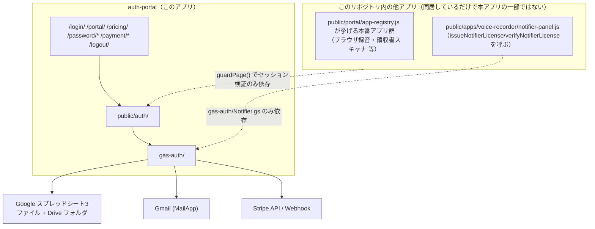

# 本番認証系（TSAM AI ログイン・Portal・決済連携）— 組み込みガイド

対象アプリID: `auth-portal`。要件・設計は [01_requirements.md](./01_requirements.md) / [02_basic-design.md](./02_basic-design.md) / [03_detailed-design.md](./03_detailed-design.md)。

複製方針は [docs/repository-structure.md](../../repository-structure.md) §4 に従う。本書は「このリポジトリを知らない開発者が、このアプリを別プロダクトへ移植する」ことを前提に書く。

---

## 1. 移植の前提条件

- **Google Apps Script が使えること。** バックエンドはGAS。GAS以外の基盤（Node/Cloud Run等）へ最初から置き換える場合は、本書ではなく §3「切り離しポイント」を読んだうえで設計をやり直す必要がある。
- **Google Workspace/個人アカウントでDrive・スプレッドシート・Gmailを利用できること。** 永続化とメール送信をこれらに依存する。
- **Stripeアカウント（決済機能を使う場合）。** 決済機能を使わない移植（認証だけ）も可能（§4）。
- **静的ファイルをホスティングできる環境。** フレームワークのビルドを前提にしない、素のHTML/JS/CSSである。ES Modulesを使うため、`file://`では動作しない（HTTPサーバー経由で配信すること）。
- **移植先のドメイン構成を先に決めること。** ブラウザ側とGAS側は別オリジンである前提でセッションを`localStorage`保存にしている（02_basic-design.md §6, §9）。同一オリジン化する場合はCookie方式への設計変更が必要（本書の対象外）。

## 2. 依存関係マップ

**このアプリが依存しているもの**（移植時に持ち出す必要があるもの）:

- `public/auth/`（`config.js` `api.js` `session.js` `ui.js` `password-form.js` `keystore.js` `auth.css`）
- `gas-auth/` のうち認証・決済・同意に関わるファイル（§3で対象外を明記）
- Google スプレッドシート3ファイルのシート構造（`gas-auth/Config.gs`の`HEADERS`が正）

**このアプリに依存しているもの**（移植時に持ち出す必要はないが、移植元に残す場合は壊さないよう注意するもの）:

- Portalのアプリグリッドに載る各本番アプリ（`guardPage()`を呼ぶだけで、Portal自体のコードには依存しない）
- カレンダー通知機能（`public/apps/voice-recorder/notifier-panel.js`）。`gas-auth/Notifier.gs`とusersシートのQ列（`notifier_license_key`）を共有するが、本書のスコープ外機能である

## 3. 切り離しポイント

移植先プロダクトへ持ち出すときに、必ず値・前提を差し替える箇所。

| 箇所 | 内容 | 差し替え方 |
| --- | --- | --- |
| `public/auth/config.js` の `AUTH_CONFIG.apiUrl` | GAS Webアプリの`/exec` URL | 移植先でデプロイしたGASの`/exec` URLに書き換える（公開値であり秘密情報ではない） |
| `public/auth/config.js` の `SCREENS` | 画面パス定義 | 移植先のディレクトリ構成に合わせて相対パスを見直す |
| `gas-auth/Config.gs` の `DRIVE`（フォルダ名・ファイル名） | Drive上のフォルダ/スプレッドシート名 | 移植先のブランドに合わせて変更可（`setupAuthSystem()`が名前で検索するため、名前を変えるとゼロから作られる） |
| `gas-auth/Config.gs` の `INITIAL_ADMIN_EMAIL` | 初期管理者のメールアドレス | 移植先の管理者アドレスへ変更 |
| `gas-auth/Config.gs` の `LEGAL_CONTACT_EMAIL` / `LEGAL_LINKS`（本書スコープ外機能） | 法務連絡先・リンク | 移植する場合は legal-cms-spec-v1.md を別途参照 |
| `gas-auth/Config.gs` の `DEFAULT_SETTINGS.CONSENT_WARNING_TEXT` | 料金・自動更新の警告文言 | 移植先のプラン内容に合わせて全面的に書き換える（法務確認が必要） |
| Stripe Price ID（`plans`シート） | 課金プラン | 移植先のStripeアカウントで作成したPrice IDに置き換える。フロントへは渡さない設計を維持すること |
| `docs/legal-source/` および `/legal/*` 相当のページ（本書スコープ外機能） | 利用規約・プライバシーポリシー・特商法表記 | 移植先の実際の事業者情報で作成し直す。**他社の文言をそのまま流用しない** |
| `Config.gs` の `GITHUB_REPO` / `GITHUB_BRANCH`（本書スコープ外機能） | 法務文書自動コミット先 | 移植先で使わないなら`Legal.gs`/`LegalSeed.gs`ごと削除してよい |
| `Notifier.gs` とusersシートQ列（本書スコープ外機能） | カレンダー通知連携 | 移植先でカレンダー通知機能を使わないなら、`Notifier.gs`・`issueNotifierLicense`/`verifyNotifierLicense`のaction登録・Q列を削除できる |
| メール文言（`MailTemplates.gs`） | 送信者名・本文 | 移植先のブランド・文面に書き換える |

## 4. 必要な外部サービスと設定作業の概要

詳細手順は [AUTH_SETUP.md](../../../AUTH_SETUP.md) と [STRIPE_SETUP.md](../../../STRIPE_SETUP.md) にある（本書では概要のみ）。

1. **GASプロジェクトの作成**とAppsScript側マニフェスト（`gas-auth/appsscript.json`）の設定。
2. **`setupAuthSystem()`の実行**（冪等）。フォルダ・スプレッドシート3ファイル・シート・シークレット（`SESSION_SECRET`/`TOKEN_SECRET`/`PASSWORD_PEPPER`/`STRIPE_WEBHOOK_URL_KEY`）・初期管理者レコードが自動生成される。
3. **`APP_BASE_URL`の設定**（設定シート）。メール内リンクの組み立てに必要。
4. **Webアプリとしてのデプロイ**（「次のユーザーとして実行: 自分」「アクセスできるユーザー: 全員」）。`/exec` URLを控える。
5. **フロント側`config.js`への`/exec` URL反映**。
6. **決済機能を使う場合のみ**: Stripeアカウント作成、Price登録、`STRIPE_SECRET_KEY`のScript Properties登録、`plans`シートへの反映、Webhookエンドポイント設定（構成A: GAS直結／構成B: 中継を置き署名検証を厳密化）。
7. **管理者パスワードの初期設定**（案内メール、または`printAdminSetupLink()`による緊急手段）。
8. **`PBKDF2_ITERATIONS`の実測調整**（`benchmarkPasswordHashing()`）。
9. **`checkAuthSetup()`による設定点検**。

決済機能を使わない移植（認証のみ）の場合、手順6・`plans`シート・`/pricing/`・`gas-auth/Stripe.gs`/`Webhook.gs`/`Consent.gs`を丸ごと除外できる。ただしその場合、利用者作成の起点（現状はWebhook経由）を別の手段（管理者による手動作成等）で用意する必要がある。

## 5. 複製時の注意

[docs/repository-structure.md](../../repository-structure.md) §4 の複製方針に従い、複製元の既知の不具合・未実装事項を無条件に持ち込まない。移植前に [01_requirements.md](./01_requirements.md) §9「未確定」を確認し、移植先の要件で必要なものだけ実装すること。

特に次の点は、複製元でも意図的な制約として残っているものであり、「バグだから直して持ち出す」対象ではない（が、移植先の非機能要件次第では見直しが必要になる可能性がある）。

- IPベースのレート制限が無い（GASの構成上不可能）。移植先がGAS以外のバックエンドを使うなら再評価してよい。
- セッションの端末別一覧・個別失効UIが無い。運用はスプレッドシート直接編集が前提。
- 管理画面が無い。利用者の停止・再開はスプレッドシート直接編集。
- PBKDF2の反復回数が現代のOWASP推奨値（60万回程度）より少ない（既定1万回）。pepperの併用で補っているが、GAS以外の基盤に移植するなら反復回数を引き上げる余地がある。
- 二段階認証が無い。
- CSPが未導入（技術的には導入可能。着手していないだけ）。

複製元固有で持ち込むべきでないもの:

- `AUTH_CONFIG.apiUrl`に複製元の`/exec` URLが残っていないこと（移植先で新規デプロイしたURLに必ず差し替える）。
- `INITIAL_ADMIN_EMAIL`・`LEGAL_CONTACT_EMAIL`に複製元の実在メールアドレスが残っていないこと。
- `docs/legal-source/`相当の法務文書に複製元の事業者情報（会社名・登録番号等）が残っていないこと。

## 6. 最小組み込み手順

決済機能を含む最小構成（このアプリが提供する主要機能をひととおり動かす場合）。

1. `public/auth/` と `gas-auth/`（`Legal.gs` `LegalSeed.gs` `Notifier.gs` を除く）を移植先リポジトリへコピーする。
2. `gas-auth/Config.gs` の `DRIVE` / `INITIAL_ADMIN_EMAIL` / `DEFAULT_SETTINGS.CONSENT_WARNING_TEXT` を移植先の値へ書き換える。
3. `Notifier.gs` を含めない場合、`Config.gs` の `ALLOWED_POST_ACTIONS` から `issueNotifierLicense` / `verifyNotifierLicense` を除き、`HEADERS[SHEETS.USERS]` からQ列（`notifier_license_key`）を除く（既存互換が不要な新規移植であれば）。
4. `gas-auth/`をGASプロジェクトへ配置し、§4の手順1〜9を実施する。
5. `public/login/` `public/portal/` `public/pricing/` `public/password/setup/` `public/password/reset/` `public/payment/success/` `public/payment/cancel/` `public/logout/` を、移植先の静的ホスティング環境へ配置する。パスの深さ（`setScreenDepth`の引数）を移植先のディレクトリ構成に合わせて確認する。
6. `public/portal/app-registry.js`（`APP_REGISTRY`）を移植先で提供する保護対象アプリの一覧に差し替える（詳細は apps-grid-spec-v1.md）。
7. 移植先の利用規約・プライバシーポリシー・特定商取引法表記を用意し、`pricing.js`のリンク先パス・`consent_items`/`confirm_sections`の文言をそれに合わせる。
8. `tests/unit/{crypto,password,tokens-sessions,login,stripe,consent,setup,frontend}.mjs`と`tests/browser/auth-screens.mjs`を移植先のテストランナーへ持ち込み、`tests/helpers/gas-harness.mjs`（偽Apps Script環境）とあわせて実行できる状態にする。
9. 本番スプレッドシートへ書き込まないことを確認したうえで、テストカードでのCheckout一連（`/pricing/` → Stripeテストカード → `/payment/success/` → 案内メール → `/password/setup/` → `/login/` → `/portal/`）を通し確認する（STRIPE_SETUP.md §5相当）。
