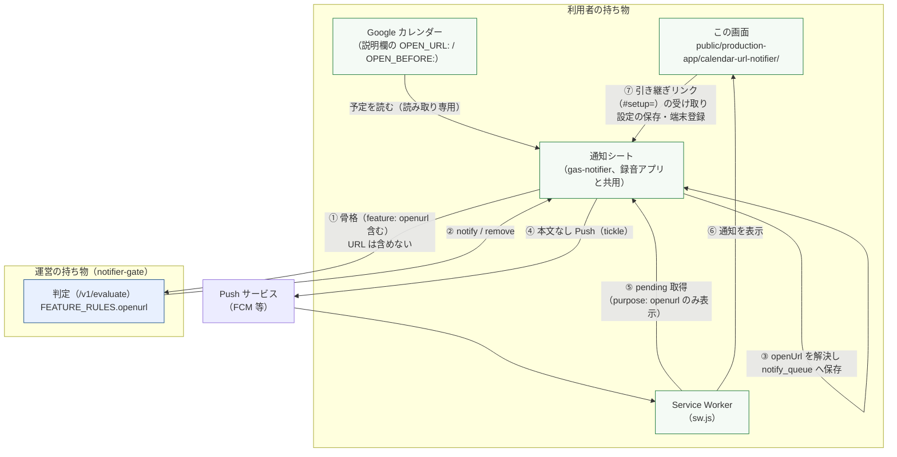
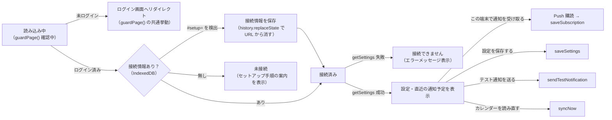

# カレンダーURL通知アプリ｜基本設計書

要件は [01_requirements.md](./01_requirements.md)。通知基盤（判定・ライセンス・VAPID・レート制限）の
設計は本書では扱わず、[notifier-v2 02_basic-design.md](../notifier-v2/02_basic-design.md) を参照する。

---

## 1. システム構成

`notifier-gate` へ渡るのは骨格（`eid` / `feature` / `startAt` / `status` / `allDay` / `cancelled` /
`timingMin`）だけで、`openUrl` は含まれない。開いた URL の解決（③）は通知シート側（Apps Script）で完結し、
`sw.js` が `pending` を取得したときに初めてブラウザへ渡る（要件 NFR-01）。

### 録音アプリとの関係

同じ通知シート・同じ Push 購読・同じ判定基盤を使うが、`feature` フィールドで機能を分ける。
1つの通知シートに両方の予定（`calendar` と `openurl`）が並ぶため、Service Worker と設定画面は
`purpose` / `feature` で自分向けの行だけを取り出す（`sw.js` の `push` イベント、`app.js` の
`renderUpcoming`）。録音アプリの Service Worker・設定画面はこのアプリの実装を参照しない（複製関係。§9）。

---

## 2. コンポーネント一覧と責務

| コンポーネント | ファイル | 責務 |
| --- | --- | --- |
| 画面 | `public/production-app/calendar-url-notifier/app.js` | `guardPage()` 通過後の描画、引き継ぎリンクの受け取り、設定の取得・保存、端末登録、直近の通知予定表示 |
| Service Worker | `public/production-app/calendar-url-notifier/sw.js` | Push 受信 → `pending` 取得 → `purpose: openurl` の通知だけ表示 → クリックで `openUrl` を開く |
| 画面（HTML/CSS） | `index.html` / `style.css` | 構造・CSP・見た目（`auth.css` / `css/style.css` を土台にする） |
| URL 解決 | `gas-notifier/OpenUrl.gs` | 予定から開く URL を決める（§5-1 の優先順位）、`OPEN_BEFORE:` の解釈、HTTPS・許可ホストの検証 |
| キュー反映 | `gas-notifier/CalendarSync.gs` | `feature: openurl` の骨格を作る（`openUrlEnabled` が ON のときのみ）、判定結果を `notify_queue` へ反映する際に `openUrl` 列を確定させる |
| シート I/O | `gas-notifier/Store.gs` | `openUrlEnabled` 設定の読み書き、`notify_queue` / `sent_log` の `openUrl` 列、`feature` を含む行キーの生成（`queueKey_`） |
| Push 送信 | `gas-notifier/Push.gs` | 送信時に `purpose` を `feature` から決定し `sent_log` へ記録（Service Worker の振り分けに使う） |
| Web アプリ入口 | `gas-notifier/Api.gs` | `getSettings` / `saveSettings` / `pending` / `upcoming` が `openUrl` / `feature` / `purpose` を含めて返す |
| 判定ルール | `workers/notifier-gate/src/constants.mjs` | `FEATURE_RULES.openurl`（`attendanceFilter: true`, `allDayFilter: true`）の登録 |

---

## 3. 外部インターフェース一覧

| 相手 | 通信方式 | 用途 |
| --- | --- | --- |
| 通知シート（Web アプリ、Apps Script） | HTTPS GET/POST（`doGet`/`doPost`、接続キー必須） | 設定取得・保存、Push 購読登録、`pending` 取得、直近の通知予定、テスト通知 |
| Push サービス（FCM 等） | Web Push（Service Worker） | 本文なしの Push 受信のみ。本アプリのブラウザ側コードが直接送信することは無い |
| `notifier-gate` | なし（このアプリからは呼ばない） | ゲートと話すのは通知シート（Apps Script）であり、ブラウザの CSP（`index.html`）は `notifier-gate` を `connect-src` に含めない |
| Portal（`public/portal/`） | 画面遷移リンクのみ（「ポータルへ戻る」） | アプリ一覧への登録はスプレッドシート側の運用（要件 §7） |

通知シートの API 仕様（action 一覧・JSON の形）は
[../../../gas-notifier/README.md](../../../gas-notifier/README.md) §5 を正とし、
本書 [03_detailed-design.md](./03_detailed-design.md) §4 で本アプリに関わる部分を再掲する。

---

## 4. データ設計概要

| 置き場所 | 何が入るか | 正本か |
| --- | --- | --- |
| 通知シートの `notify_queue` / `sent_log`（末尾列 `openUrl`） | これから出す通知・送信済み通知に紐づく行き先URL。**URL はここにしか無い** | 正本 |
| 通知シートの `settings`（`openUrlEnabled` 行） | URL通知を出すかどうかの ON/OFF。既定は `false`（配布直後は録音通知のみ有効） | 正本 |
| ブラウザの IndexedDB（`tsam-curl-notifier` / `config` ストア） | 接続先（通知シートの Web アプリ URL・接続キー）。`app.js` と `sw.js` が同じ定義を個別に持つ（複製。§9） | キャッシュ（正本は通知シート側の接続キー） |
| Cloudflare KV（運営） | ライセンス判定キャッシュ・レート制限カウンタ（`openurl` 専用の領域は無く、`calendar` と共有） | キャッシュ（[notifier-v2 02_basic-design.md](../notifier-v2/02_basic-design.md) §4 と同じ） |

エンティティの列単位のスキーマは [03_detailed-design.md](./03_detailed-design.md) §3。

---

## 5. 画面一覧と画面遷移

画面は `public/production-app/calendar-url-notifier/` の1画面のみ（設定・接続・直近の通知予定を1ページで扱う）。

引き継ぎリンク（`#setup=`）の**生成側**（通知シートのセットアップウィザード）は
[04_integration-guide.md](./04_integration-guide.md) §3 で扱う未確定事項を参照。本書は
「このアプリが `#setup=` フラグメントをどう解釈するか」という受け取り側の挙動のみを扱う。

---

## 6. 認証・認可方式

| 経路 | 方式 | 補足 |
| --- | --- | --- |
| 利用者 → この画面 | TSAM AI 認証系のセッション（`guardPage()`） | `public/auth/session.js` を呼ぶ。独自の認証実装は行わない（既存仕様書 §5） |
| この画面 → 通知シート（Web アプリ） | 接続キー（`key` パラメータ／本文） | 通知基盤共通の仕組み（[notifier-v2 02_basic-design.md](../notifier-v2/02_basic-design.md) §6）をそのまま利用。`health` のみ無認証だが、本アプリの画面は呼んでいない |
| Service Worker → 通知シート | 接続キー（IndexedDB から読み出し） | `app.js` と同じ接続情報を個別に読む（複製。片方だけ更新しないこと） |
| この画面 → notifier-gate | 無し | このアプリのブラウザコードから直接ゲートへアクセスする経路は無い（CSP で明示的に許可していない） |

静的配信のため HTML と JS の取得自体は防げない。守っているのは通知シートの中身であり、
それを守るのは接続キーである（既存仕様書 §5 コメント）。

---

## 7. エラー処理方針

- **通知は取り消さない。** URL 解決（1〜3の候補）が検証に落ちても、Meet リンク・カレンダー画面への
  フォールバック（4→5）で必ず行き先を残す（要件 §5-1）。「通知が出ること」と「知らないサイトを
  開かされないこと」を分けて扱う。
- **行き先が無いときは、アプリを開く通知にする。** Push を受けて何も表示しないと購読が打ち切られる
  ことがあるため、「開く」ボタンの無い通知を出さない代わりに、このアプリの画面を開く通知を出す
  （`sw.js` のフォールバック分岐、要件 §5-2）。
- **通信が一度失敗しただけでキューを壊さない。** 通知基盤側の方針（[notifier-v2 02_basic-design.md](../notifier-v2/02_basic-design.md) §7）をそのまま継承し、
  判定を受け取れなかったときは `notify_queue` に触れない。
- **画面側は接続失敗をメッセージで示すだけで、リトライは利用者操作に委ねる。** `app.js` の
  `refreshState` は例外を捕捉し「接続できません」を表示するのみで、自動再試行は行わない。

---

## 8. 運用・デプロイ構成

| 対象 | デプロイ方法 | 備考 |
| --- | --- | --- |
| `public/production-app/calendar-url-notifier/` | サイト全体のデプロイ（`npm run deploy`）に含まれる静的ファイル | Cloudflare Workers（OpenNext）配信。個別デプロイの仕組みは無い |
| `gas-notifier/OpenUrl.gs` を含む配布テンプレート | 運営者がテンプレートシートのエディタへ手で貼り付け。以降は利用者が自分のシートへコピー | リポジトリからは配信されない（[notifier-v2 02_basic-design.md](../notifier-v2/02_basic-design.md) §8 と同じ扱い） |
| `workers/notifier-gate/`（`FEATURE_RULES.openurl` を含む） | `npm run deploy:notifier-gate` | サイト配信用 Worker とは別サービス。デプロイを忘れると `openurl` が `unknown-feature` のまま拒否され続ける（要件 §7-3） |
| Portal への登録 | 運営者によるスプレッドシート（暫定DB）の手動編集 | リポジトリの変更では反映されない（要件 §7・§9） |

---

## 9. 主要な設計判断と採らなかった選択肢

| 判断 | 採った理由 | 採らなかった選択肢とその理由 |
| --- | --- | --- |
| 通知基盤・配布テンプレートを録音アプリと共用する | 利用者のスプレッドシートと接続キーを2組に増やさない | テンプレートを分ける — 配布済みシートを持つ利用者が2つのコピーを管理することになり、運用コストが増える（既存仕様書 §10 Q-01） |
| URL を判定要求（骨格）に含めない | 運営が予定の中身を持たないという通知基盤の前提（NFR-01）を崩さない。「送らないよう気をつける」ではなく `ALLOWED_EVENT_FIELDS` で「送っても受け取らない」側で担保する | URL をゲートへ渡し判定と一緒に返す — 上記前提に反するため不採用 |
| 出欠フィルタを録音アプリと揃える（`attendanceFilter: true`） | 同じカレンダーの同じ予定について、Portal に並ぶ2つの通知アプリで片方は通知し片方はしない状態を利用者に説明できない | 欠席と回答した予定も通知する（先行検討のntfy版の挙動） — 一貫性を優先し不採用 |
| `notify_queue` の行キーは `feature: calendar` のときだけ従来形を保つ | 配布済みシートの既存行と形を変えると、更新直後の同期で同じ予定が「新しい行」として積み直される | 全機能に `feature` サフィックスを付ける — 統一的だが、既存利用者への影響が大きく不採用 |
| 行き先の無い通知は「アプリを開く」通知に倒す | `userVisibleOnly: true` で購読している以上、Push を受けて何も表示しないと購読が打ち切られることがある | 通知を出さない — 購読が失われるリスクを理由に不採用（要件 §5-2） |

より詳細な経緯（通知基盤側の ADR）は [notifier-v2 02_basic-design.md](../notifier-v2/02_basic-design.md) §9 を参照。
