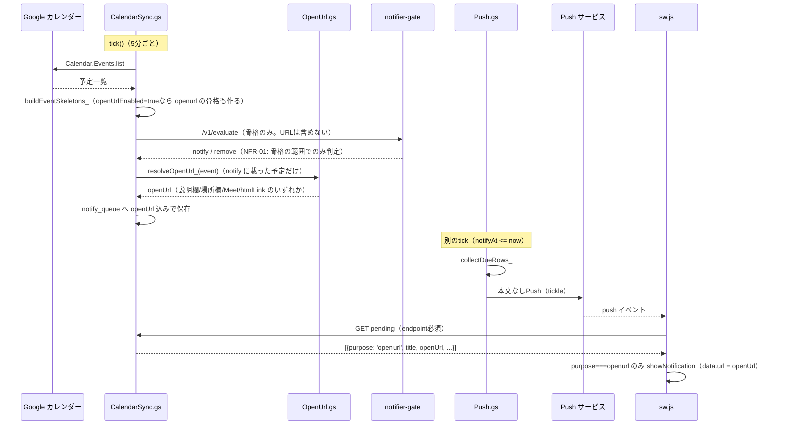
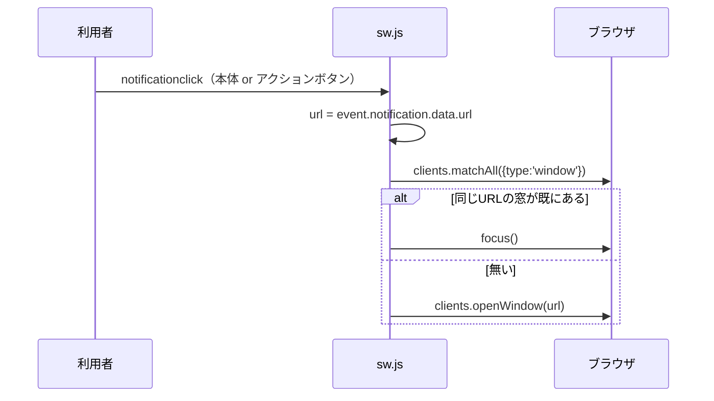
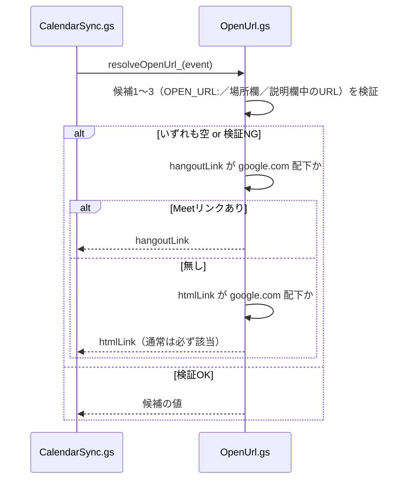
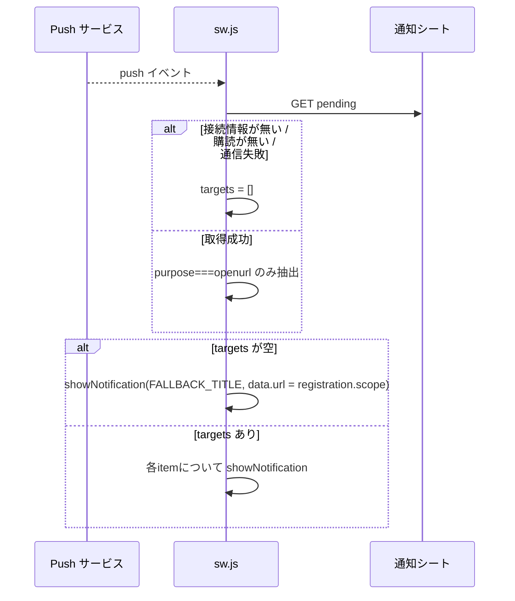

# カレンダーURL通知アプリ｜詳細設計書

基本設計は [02_basic-design.md](./02_basic-design.md)。通知基盤（判定・ライセンス・VAPID・レート制限）の
詳細は [notifier-v2 03_detailed-design.md](../notifier-v2/03_detailed-design.md) を参照し、本書では重複させない。

---

## 1. ファイル・モジュール構成

### 本アプリの画面（新規）

| パス | 責務 |
| --- | --- |
| `public/production-app/calendar-url-notifier/index.html` | 画面構造、CSP、`auth.css` / `css/style.css` の読み込み |
| `public/production-app/calendar-url-notifier/app.js` | `guardPage()` 呼び出し、引き継ぎリンクの受け取り、GAS通信、設定フォーム、Push購読 |
| `public/production-app/calendar-url-notifier/sw.js` | Push受信、`pending`取得、`purpose: openurl` の通知表示、クリック時の遷移 |
| `public/production-app/calendar-url-notifier/style.css` | このアプリ固有のレイアウト差分 |

`app.js` と `sw.js` は接続情報（`DB_NAME` / `STORE_NAME` / `CONNECTION_KEY` / `openDb` /
`readConnection`）を**それぞれ個別に持つ**。`sw.js` は `type: 'module'` 未対応ブラウザでも
Service Worker の登録自体は失敗させたくないため classic script のままにしてあり、
`app.js` から `import` せず手で複製してある（コード冒頭コメントに明記）。**片方だけを直さないこと。**

### 配布テンプレート側の追加・変更分（`gas-notifier/`、録音アプリと共用）

| パス | 本アプリに関わる責務 |
| --- | --- |
| `OpenUrl.gs`（新規ファイル） | `resolveOpenUrl_` / `resolveOpenBefore_` / `isAllowedOpenUrl_` / `isGoogleUrl_` など、URL解決の全ロジック |
| `CalendarSync.gs` | `buildEventSkeletons_` が `openUrlEnabled` 設定を見て `feature: openurl` の骨格を追加。`applyGateDecision_` が判定結果を反映するときに `resolveOpenUrl_` を呼び `openUrl` 列を確定させる |
| `Store.gs` | `DEFAULT_SETTINGS.openUrlEnabled`（既定 `false`）、`HEADERS` の `notify_queue` / `sent_log` 末尾に `openUrl` 列、`queueKey_` の `feature` サフィックス処理 |
| `Push.gs` | `sendDueNotifications_` が `feature` から `purpose` を決めて `sent_log` へ記録。`collectDueRows_` が `openUrl` を読み出す |
| `Api.gs` | `pending`（`takePending_`）と `upcoming`（`listUpcoming_`）の応答に `openUrl` / `feature` / `purpose` を含める |

### 通知基盤側の変更分（`workers/notifier-gate/`）

| パス | 内容 |
| --- | --- |
| `src/constants.mjs` | `FEATURE_RULES` へ `openurl: { attendanceFilter: true, allDayFilter: true }` を追加 |

---

## 2. 主要処理フロー

### 2-1 通知の生成から表示まで（正常系）

### 2-2 通知タップから URL 遷移まで

本体タップとアクションボタンタップは同じ `data.url` を開く（要件 FR-04/05）。
URL が開くのはこの操作をした端末だけであり、他の登録端末は通知が残るのみ（要件 FR-06）。

### 2-3 異常系: URL解決の失敗（フォールバック）

通知そのものは取り消さない設計（要件 §5-1）のため、この経路で `openUrl` が空文字になるのは
「予定の `htmlLink` すら取得できなかった」場合に限られる。

### 2-4 異常系: 行き先の無い pending（Service Worker側）

---

## 3. データモデル詳細

通知シートの列全体は [notifier-v2 03_detailed-design.md](../notifier-v2/03_detailed-design.md) §3 を正とする。
本書では本アプリが追加・使用する列だけを挙げる。

### `notify_queue`（末尾へ追加した列）

| 列 | 型 | 内容 |
| --- | --- | --- |
| `openUrl` | 文字列 | 通知タップ時に開くURL。`feature: calendar` の行では常に空文字 |

### `sent_log`（末尾へ追加した列）

| 列 | 型 | 内容 |
| --- | --- | --- |
| `purpose` | 文字列（既存列） | `feature` から `'openurl'` または `'calendar'` に正規化した値。Service Worker の振り分けに使う |
| `openUrl` | 文字列 | `notify_queue` からそのまま引き継ぐ。`pending` 応答にそのまま載る |

### `settings`（key/value。既存シートに1行追加）

| key | 型 | 既定値 | 内容 |
| --- | --- | --- | --- |
| `openUrlEnabled` | 真偽値 | `false` | URL通知（`feature: openurl`）の骨格を作るかどうか。配布直後は録音通知のみが有効になるよう既定を `false` にしてある |

### ブラウザの IndexedDB（`tsam-curl-notifier` / ストア名 `config`）

| キー | 値の形 | 内容 |
| --- | --- | --- |
| `connection` | `{ url: string, key: string }` | 通知シートの Web アプリ URL と接続キー。`app.js` と `sw.js` が個別に読み書きする |

---

## 4. インターフェース仕様

通知シート（Web アプリ）の API はすべて JSON を返す。成功 `{ ok: true, data }`、
失敗 `{ ok: false, error: { code, message } }`。全体像は
[../../../gas-notifier/README.md](../../../gas-notifier/README.md) §5 を正とし、本アプリが使う action のみ再掲する。

| action | メソッド | 本アプリでの用途 | 本アプリに関わる応答フィールド |
| --- | --- | --- | --- |
| `getSettings` | GET | 設定画面の初期表示 | `settings.openUrlEnabled`（画面上は「URL通知を受け取る」チェックボックス） |
| `saveSettings` | POST | 設定の保存 | 送信する `settings` に `openUrlEnabled` / `timing` / `accepted` / `tentative` / `needsAction` / `declined` を含める |
| `publicKey` | GET | Push購読前のVAPID公開鍵取得 | 本アプリ固有の差分なし |
| `saveSubscription` | POST | この端末をPush購読させる | 本アプリ固有の差分なし |
| `pending` | GET（`endpoint` 必須） | Service Workerが通知の中身を取りに行く | `notifications[].purpose`（`'openurl'` のみ表示）、`notifications[].openUrl`（遷移先） |
| `upcoming` | GET | 「直近の通知予定」欄の表示 | `upcoming[].feature`（`'openurl'` の行だけ画面がフィルタする） |
| `sendTestNotification` | POST | テスト通知ボタン | 本アプリ固有の差分なし（`sent_log` に `feature: 'test'` で記録され、`purpose` は `'test'` のため本アプリの Service Worker はこの通知を表示しない） |
| `syncNow` | POST | 「カレンダーを読み直す」ボタン | 本アプリ固有の差分なし |

### エラーコード

`gas-notifier/Api.gs` の `API_ERRORS` を共通で使う。本アプリの画面が明示的に扱うのは次の3つ。

| code | 画面側の扱い |
| --- | --- |
| `UNAUTHORIZED` | 接続キー不一致。`app.js` は「接続できませんでした」を表示 |
| `NO_LICENSE` | ライセンス未確認。通知基盤の判定は空を返す状態（[notifier-v2 01_requirements.md](../notifier-v2/01_requirements.md) FR-14）。画面は他のエラーと同様にメッセージ表示のみで、専用の案内は無い |
| （上記以外） | `error.message` をそのまま連結してメッセージ表示 |

### `resolveOpenUrl_(event)` / `resolveOpenBefore_(event)`（純関数、`gas-notifier/OpenUrl.gs`）

| 関数 | 入力 | 出力 |
| --- | --- | --- |
| `resolveOpenUrl_` | Calendar Events API の1件（`description` / `location` / `hangoutLink` / `htmlLink`） | 開くURL（文字列）。全候補が該当しなければ空文字 |
| `resolveOpenBefore_` | 同上（`description` のみ使用） | `OPEN_BEFORE:` の分数（数値）。指定なし・不正値は `NaN` |
| `isAllowedOpenUrl_` | URL文字列 | 真偽値。HTTPS・制御文字なし・`user:pass@`なし・（設定されていれば）許可ホスト一致、を満たすか |

---

## 5. 状態管理・セッション設計

- **ログインセッション**: TSAM AI 認証系のセッション（`public/auth/session.js` の `guardPage()`）。
  本アプリ独自の状態は持たない。
- **通知シートとの接続状態**: ブラウザの IndexedDB（`tsam-curl-notifier`）に `{ url, key }` を保持する
  ローカルな状態。サーバー側に「この端末が接続済みか」を示す状態は無く、`getSettings` の成否で
  都度判定する（`app.js` `refreshState`）。
- **Push購読状態**: `subscriptions` シートが正本（端末＝`subId`単位）。ブラウザ側は
  `navigator.serviceWorker.ready` 経由の `PushManager` の購読情報を都度参照し、独自にキャッシュしない。
- **取得済み通知（`fetchedBy`）**: `sent_log` の行が持つ、購読（`subId`）単位の取得済み管理。
  本アプリ固有の実装は無く、通知基盤の仕組み（[notifier-v2 03_detailed-design.md](../notifier-v2/03_detailed-design.md)）をそのまま利用する。

---

## 6. エラーハンドリング詳細

| 発生箇所 | 事象 | 挙動 |
| --- | --- | --- |
| `OpenUrl.gs` `resolveOpenUrl_` | 候補1〜3がいずれも空または検証NG | Meet→htmlLinkへフォールバック。通知は取り消さない（§2-3） |
| `OpenUrl.gs` `resolveOpenBefore_` | `OPEN_BEFORE:` の値が数値でない／`OPEN_URL_MAX_BEFORE_MIN`（24時間）を超える | `NaN` を返し、呼び出し側（`buildEventSkeletons_`）は骨格へ `timingMin` を足さない＝設定画面の既定値が使われる |
| `sw.js` の `push` イベント | 接続情報が無い／購読が取得できない／`pending` 通信が失敗 | 空配列として扱い、フォールバック通知（アプリを開く）を表示（§2-4） |
| `sw.js` の `push` イベント | `pending` は成功したが `purpose: openurl` の行が0件（＝録音アプリ向けの通知のみ） | 同上のフォールバック通知を表示 |
| `app.js` の `refreshState` | `getSettings` が例外（接続キー不一致・通信失敗等） | 「接続できません」を表示し、セットアップ手順の再確認を促す文言を出す。自動リトライは行わない |
| `app.js` の各操作（保存・購読・テスト通知・同期） | 個別の `try/catch` で `error.message` を画面へ表示 | 操作前の状態には影響しない（楽観的更新をしない） |

秘密情報（接続キー・ライセンスキー・VAPID鍵）を応答本文・ログへ返さない方針は
通知基盤側の方針（[notifier-v2 02_basic-design.md](../notifier-v2/02_basic-design.md) §7）をそのまま継承する。

---

## 7. 設定値・環境変数一覧

値そのものは書かない（名前と役割のみ）。

| 名前 | 置き場所 | 役割 |
| --- | --- | --- |
| `OPEN_URL_ALLOWED_HOSTS` | `gas-notifier/OpenUrl.gs`（コード内定数） | 予定に書かれたURLのうち採用してよいホストの一覧。空配列は「制限なし」。**本書執筆時点では設定画面・APIからの変更経路が見つからず、コード編集でのみ変更できる（01_requirements.md §9）** |
| `OPEN_URL_MAX_BEFORE_MIN` | `gas-notifier/OpenUrl.gs`（コード内定数） | `OPEN_BEFORE:` で指定できる上限（分）。既定は24時間 |
| `openUrlEnabled` | 通知シート `settings` シート（利用者ごと） | URL通知（`feature: openurl`）を出すかどうか。設定画面の「URL通知を受け取る」チェックボックスに対応 |
| `CONNECT_KEY` | 通知シートの Script Properties | 通知シート Web アプリへのアクセスに要る接続キー（録音アプリと共通の値。本アプリ用に別の鍵は持たない） |
| `EID_HMAC_KEY` | 同上 | 予定IDの匿名化用の鍵（本アプリ固有の追加は無い） |
| `FEATURE_RULES.openurl` | `workers/notifier-gate/src/constants.mjs`（コード内定数） | `openurl` の判定ルール（出欠フィルタ・終日除外）を通知基盤へ登録する |

---

## 8. テスト構成

| スイート | 実行方法 | 本アプリに関わる確認内容 |
| --- | --- | --- |
| `tests/unit/notifier-gate.mjs` | `node tests/run.mjs notifier-gate` | `feature: openurl` が判定を通ること／未登録の `feature` は `unknown-feature` として通らないこと（`FEATURE_RULES` の検証） |
| `tests/unit/notifier-template.mjs` | `node tests/run.mjs notifier-template` | 「カレンダーURL通知（feature: openurl）」節（該当行の目印は `★`）で、`openUrlEnabled` による骨格の増減、`OPEN_URL:` / `OPEN_BEFORE:` の解決優先順位・HTTPS以外の除外・`user:pass@`偽装の拒否・HTMLエンティティのほどき、`purpose` の正規化、通知シートが説明欄そのものをゲートへ送らないことを検証する |
| `tests/unit/frontend.mjs` | `node tests/run.mjs frontend` | Portal のアプリ一覧（`app-registry.js`）に `localhost` を追加していないことの既存検査（本アプリを直接テストする内容ではない） |

### 本書執筆時点でリポジトリに見つからなかったテスト

既存仕様書 §9 は「`tests/unit/`（新規）URL解決の優先順位／HTTPS以外と許可ホスト外を採らない／
フォールバックで通知が消えない／`OPEN_BEFORE`の解釈」と「`tests/browser/`（新規）未ログインの
リダイレクト／配信HTMLの`hidden`／設定の保存と読み戻し／320〜1440pxで横あふれ無し」を挙げているが、
本書執筆時点で `tests/run.mjs` の `SUITES` に該当する専用スイートは見当たらない
（URL解決・`OPEN_BEFORE` の検証は上記の通り `notifier-template.mjs` に含まれているが、
`public/production-app/calendar-url-notifier/app.js` / `sw.js` を直接対象にした単体テスト・ブラウザテストは
見つからなかった）。実施状況は本書のスコープ外の事実確認であり、**未確定**として扱う。
