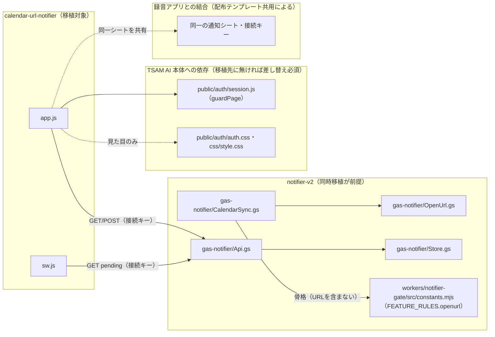

# カレンダーURL通知アプリ｜組み込みガイド

このアプリを別のプロダクト・別のリポジトリへ移植することを想定した文書。実装の正は
[docs/specs/calendar-url-notifier-requirements-v1.md](../../specs/calendar-url-notifier-requirements-v1.md)。
通知基盤（判定・ライセンス・VAPID・レート制限）の移植は
[notifier-v2 04_integration-guide.md](../notifier-v2/04_integration-guide.md) が対象で、本書はその上に乗る
「URLを開く」機能だけを扱う。**通知基盤（`gas-notifier/` + `workers/notifier-gate/`）を先に、または同時に
移植することが前提**であり、本アプリ単体では動かない。

---

## 1. 移植の前提条件

- **通知基盤（notifier-v2）が既に動いている、または同時に移植すること。** 本アプリは `FEATURE_RULES` に
  `openurl` を1行足し、配布テンプレートへ `OpenUrl.gs` を足すだけの構成であり、判定・ライセンス・
  Push送信の仕組みそのものは提供しない。
- **TSAM AI固有のログイン基盤（`public/auth/`）に依存している。** `guardPage()` によるセッション確認を
  前提に画面を描画しており、移植先に同等の認証基盤が無い場合はこの部分を差し替える必要がある（§3）。
- **録音アプリ（`public/production-app/voice-recorder/`）と配布テンプレートを共用する構成を、そのまま
  持ち込むかどうかを先に決める。** 共用しない（本アプリ単体で独立したテンプレートを配る）場合は、
  `notify_queue` の行キー（`feature` サフィックスの有無）を単純化できるが、[02_basic-design.md](./02_basic-design.md) §9
  の「共用したことによる制約」がそもそも要らなくなる分、テンプレートの再設計が要る。
- 本アプリはサーバーコードを持たない（Web アプリ入口は通知基盤側の Apps Script）。移植先も
  静的ホスティング（またはそれに相当する配信）を前提にできる場合に最も労力が少ない。

---

## 2. 依存関係マップ

| 依存先 | 種別 | 移植時の扱い |
| --- | --- | --- |
| `public/auth/session.js`（`guardPage`） | TSAM AI本体の共通JS | 移植先の認証基盤に合わせて差し替える（§3） |
| `public/auth/auth.css`、`../../css/style.css` | 見た目の共通CSS | 必須ではない。移植先の見た目に合わせて自前のCSSに置き換え可能 |
| 通知基盤（`gas-notifier/` + `workers/notifier-gate/`） | 判定・ライセンス・Push送信の基盤 | [notifier-v2 04_integration-guide.md](../notifier-v2/04_integration-guide.md) に従って先に（または同時に）移植する |
| 録音アプリとの配布テンプレート共用 | 運用上の結合（コード上の結合ではない） | 独立させたい場合は、移植先で別のテンプレートとして配布する（§1） |
| Portal（`public/portal/app-registry.js`） | 起動元 | 本アプリはここに登録されていない（要件 §7）。移植先のアプリ起動導線に合わせて差し替える |

---

## 3. 切り離しポイント

| 箇所 | 現状の実装 | 切り離し方 |
| --- | --- | --- |
| 画面ガード（ログイン確認） | `app.js` が `guardPage()`（TSAM AI認証系）を呼ぶ | 移植先の認証チェック関数に差し替える。「利用者情報 or null を返す非同期関数」という契約を保てば呼び出し側はほぼそのまま使える |
| 接続情報の受け取り方（`#setup=`） | `app.js` が URL フラグメントを `parseSetupFragment` で解釈し、`payload.execUrl` / `payload.connectKey` を IndexedDB へ保存する | 移植先でも同じ形（base64url化したJSON、宛先ホストを `script\.google\.com` 等へ固定した正規表現検証）を踏襲すれば流用できる |
| **引き継ぎリンクの生成側（未確定・要確認）** | 本書の調査時点で、配布テンプレート（`gas-notifier/Setup.gs` `getHandoffLink()`）が組み立てるリンクは**録音アプリのURL（`RECORDER_APP_URL`）に固定**されている。`gas-notifier/Code.gs` のメニュー（「録音アプリへの引き継ぎリンクを表示」）・`SidebarSetup.html` の文言（「録音アプリで仕上げます」）も同様に録音アプリのみを前提にした文言になっている。**本アプリ（`calendar-url-notifier`）宛てに引き継ぎリンクを組み立てる経路は、本書の調査だけでは見つからなかった。** 移植前に、①この経路を新設する（`getHandoffLink()` を呼び出し元アプリ別に出し分ける等）か、②`#setup=` の受け取りをこのアプリ以外（既存の受け取り先）に集約し、本アプリは接続情報を別の手段（手動転記等）で受け取る運用にするか、判断が必要 |
| Service Worker のURL解決 | `sw.js` は `pending` が返す `openUrl` をそのまま `data.url` に使う。行き先が無いときはこのアプリ自身（`registration.scope`）を開く | 移植先でも同じ契約（`pending` の各要素に `openUrl` を持たせる）を保てば `sw.js` はほぼそのまま使える |
| URL解決ロジック（`OPEN_URL:` / `OPEN_BEFORE:` の書式） | `gas-notifier/OpenUrl.gs` の正規表現・優先順位 | 純関数（Apps Script API の型に依存しない部分が大半）のため、書式ごと移植先の要件に合わせて変更しやすい。ホスト許可リストが空のときの既定（制限なし）を変えるかどうかは移植先の要件次第 |
| CSP | `index.html` の `<meta http-equiv="Content-Security-Policy">` | 移植先の配信基盤に合わせて再設定する。`connect-src` には通知シートのホスト（`script.google.com` 等）と認証系のホストのみを含め、**`notifier-gate` は含めない**（ブラウザから直接呼ばない設計を維持する場合） |
| 見た目（CSS） | `public/auth/auth.css` と `css/style.css` を前提にした差分CSS（`style.css`） | 移植先のデザインシステムに合わせて書き直す。本アプリの `style.css` は現状、色をカスタムプロパティではなく直接のHEX値で定義している箇所があり、そのまま前提にはしない（詳細はレビュー側の指摘を参照） |
| Portalからの起動 | `index.html` の「ポータルへ戻る」リンクが `../../portal/` を指す | 移植先の遷移導線に合わせて変更する |

---

## 4. 必要な外部サービスと設定作業の概要

通知基盤側の設定作業（VAPID鍵・共有シークレット・Cloudflare KV等）は
[notifier-v2 04_integration-guide.md](../notifier-v2/04_integration-guide.md) を参照。本アプリ固有の追加作業は次の2点のみ。

1. **`workers/notifier-gate/src/constants.mjs` の `FEATURE_RULES` へ `openurl` を追加する。**
   これを忘れると、配布テンプレートを更新しても `openurl` の骨格はすべて `unknown-feature` として
   拒否され、通知が1件も出ない（[01_requirements.md](./01_requirements.md) §7-3）。
2. **配布テンプレートへ `OpenUrl.gs` を足し、`Store.gs` / `CalendarSync.gs` / `Push.gs` / `Api.gs` の
   該当差分（[03_detailed-design.md](./03_detailed-design.md) §1）を反映する。** 既存の配布テンプレートを
   ここへコピーではなく直接改造する場合は、`notify_queue` / `sent_log` の列を**末尾へ追加**する
   （途中へ挿入すると既存データの列がずれる）。

Google Cloud側の追加設定（新しいOAuthスコープ等）は不要。本アプリは通知基盤が既に取得した
カレンダーデータ（説明欄・場所欄・`hangoutLink`・`htmlLink`）を読むだけで、新しいAPI呼び出しを増やさない。

---

## 5. 複製時の注意

[docs/repository-structure.md](../../repository-structure.md) §4 の方針（本番アプリ間で共通層を作らず複製する）に従う。

- **`app.js` と `sw.js` の接続情報コードは意図的な複製である。** `sw.js` は classic script のままにする
  必要があり（`type: 'module'` は未対応ブラウザで登録自体が失敗する）、`import` にできない。移植先でも
  この複製を維持し、接続情報の保存形式を変えるときは両方を直す。
- **録音アプリ側の Service Worker（`public/apps/voice-recorder/sw.js` 等）からは import しない。**
  本アプリの `sw.js` はそれを下敷きにした複製であり、違うのは行き先の決め方だけである
  （固定の画面 vs. 予定ごとのURL）。テスト環境から本番が依存する向きにしないという方針
  （`CLAUDE.md`）を移植先でも踏襲する。
- **複製元の欠陥をそのまま持ち込まない。** 本書執筆時点で確認した設計判断とその理由（[02_basic-design.md](./02_basic-design.md) §9）
  を踏まえ、移植先の要件に合わせて見直す。特に §3 の「引き継ぎリンクの生成側」の未確定事項は、
  移植前に解消してから複製すること（未解消のまま複製すると、同じ欠落を持ち込むことになる）。
- **既知の不具合・未確認事項の申し送り。** [03_detailed-design.md](./03_detailed-design.md) §8 の「本書執筆時点で
  リポジトリに見つからなかったテスト」を、移植先での受け入れ検証の出発点にする。

---

## 6. 最小組み込み手順

1. 通知基盤（`gas-notifier/` + `workers/notifier-gate/`）を先に、または同時に移植する
   （[notifier-v2 04_integration-guide.md](../notifier-v2/04_integration-guide.md)）。
2. `workers/notifier-gate/src/constants.mjs` の `FEATURE_RULES` へ `openurl` を追加する（§4-1）。
3. 配布テンプレートへ `gas-notifier/OpenUrl.gs` を足し、`Store.gs` / `CalendarSync.gs` / `Push.gs` /
   `Api.gs` の該当差分を反映する（§4-2）。既存シートを持つ利用者がいる場合は、列を末尾へ追加する形で
   行う。
4. `public/production-app/calendar-url-notifier/` 配下の全ファイルを移植先へコピーする
   （`import` で参照せず、ファイルごと複製する）。
5. `app.js` のTSAM AI依存部分（`guardPage` の import）を、移植先の認証チェック機構に差し替える。
6. `index.html` のCSPを移植先の配信基盤に合わせて設定し、見た目（CSS参照）を移植先のデザインに合わせる。
7. **引き継ぎリンクの生成側を用意する（§3 の未確定事項を解消する）。** 配布テンプレートのセットアップ
   ウィザードから、本アプリ宛ての `#setup=` リンクを組み立てる経路を新設するか、接続情報を渡す
   別の手段を設計する。ここを済ませないと、利用者は接続キーを本アプリへ渡す手段を持たない。
8. `tests/unit/notifier-template.mjs` の「カレンダーURL通知（feature: openurl）」節相当のテスト
   （URL解決の優先順位・HTTPS以外の除外・`OPEN_BEFORE`の解釈・説明欄をゲートへ送らないこと）を
   移植先のテスト基盤に合わせて用意し、実行する。
9. 実ブラウザでの結線確認（未ログインのリダイレクト、設定の保存と読み戻し、通知クリックでの遷移）を
   行う。既存仕様書 §9 が挙げる確認項目を出発点にする。
10. 起動導線（Portal相当のメニュー、または移植先の同等機構）へ追加する。
