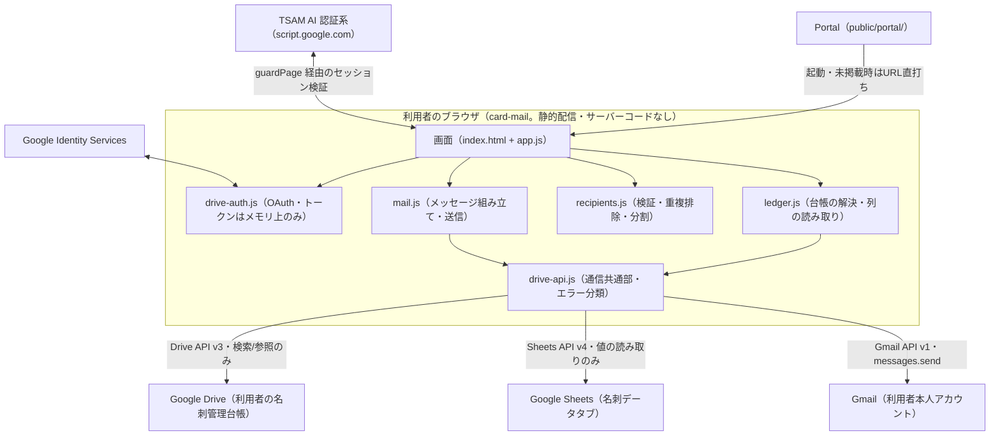
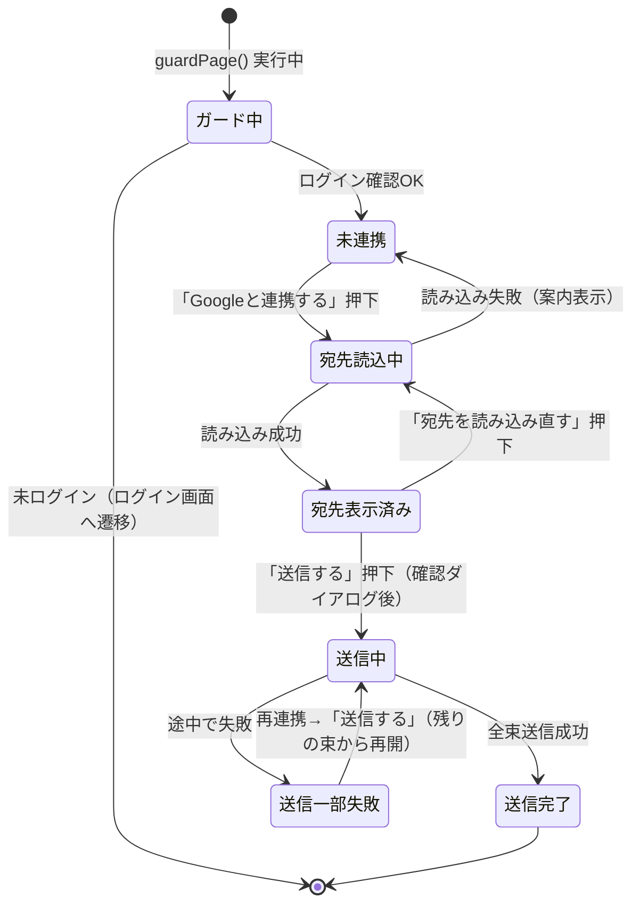

# 名刺メール配信アプリ（card-mail）基本設計書

対象要件は [01_requirements.md](./01_requirements.md)。実装の正は [docs/specs/card-mail-requirements-v1.md](../../specs/card-mail-requirements-v1.md)（以下「既存仕様書」）。

## 1. システム構成

当社サーバーはどの経路にも登場しない。通信先はCSP（`index.html` の `<meta http-equiv="Content-Security-Policy">`）で Google 3系統＋TSAM AI認証系に固定している（既存仕様書 §4.1、§4.3）。

## 2. コンポーネント一覧と責務

| ファイル | 責務 |
| --- | --- |
| `index.html` | 画面構造。CSPの宣言。DOMはすべて既定で `hidden`、`app.js` が `guardPage()` 通過後に表示を切り替える |
| `config.js` | 静的設定（クライアントID、スコープ、エンドポイント、台帳のパス、バッチサイズ、localStorageキー名）。設定値を変えるのはこのファイルだけ |
| `gis-loader.js` | GIS公式スクリプトの遅延読み込み。クライアントID未設定時は読み込まない |
| `drive-auth.js` | OAuthトークンの取得・保持（メモリ上のみ）・スコープ検証・失効判定 |
| `drive-api.js` | Google API（Drive/Sheets/Gmailで共通）への `fetch` 呼び出しと、HTTPステータス・reasonからのエラー分類 |
| `ledger.js` | 台帳（フォルダ→フォルダ→スプレッドシート）の解決（検索のみ・作らない）と、見出しで探したメールアドレス列の読み取り |
| `recipients.js` | 宛先の形式検証・重複排除・100件ずつの分割。通信もDOMも持たない純粋関数のみ |
| `mail.js` | RFC 5322メッセージの組み立て（Bcc・件名エンコード・ヘッダーインジェクション対策）と、Gmail APIへの直列送信 |
| `app.js` | 画面制御のみ。上記モジュールを呼び出し、結果をDOMへ反映する。`innerHTML` を使わず `textContent` と要素生成で組み立てる |
| `style.css` | 見た目。共通の `css/style.css` と `auth/auth.css` を読み込んだ差分のみ |

判定・組み立てのロジックを `recipients.js` / `mail.js` / `ledger.js` に寄せ、`app.js` を画面反映専任にしているのは、DOMを持たない側にロジックを置くことでテスト（`tests/unit/card-mail.mjs`）がブラウザなしで検証できるようにするためである。

## 3. 外部インターフェース一覧

| 連携先 | 通信方式 | 主なエンドポイント／API |
| --- | --- | --- |
| Google Identity Services | `<script>` 読み込み＋`google.accounts.oauth2.initTokenClient` | `https://accounts.google.com/gsi/client` |
| Google Drive API v3 | `fetch` + Bearerトークン | `GET /drive/v3/files`（検索）、`GET /drive/v3/files/{id}`（メタ取得・キャッシュ検証） |
| Google Sheets API v4 | `fetch` + Bearerトークン | `GET /v4/spreadsheets/{id}/values/{range}` |
| Gmail API v1 | `fetch` + Bearerトークン | `POST /gmail/v1/users/me/messages/send` |
| TSAM AI 認証系 | `public/auth/session.js` の `guardPage()` 経由（本アプリ固有の実装は持たない） | `script.google.com` / `script.googleusercontent.com`（本番認証系のAPI。詳細は認証系の設計に委ねる） |

Drive・Sheets・Gmailの3系統は `drive-api.js` の共通関数（`driveRequest` / `driveFetchJson`）を通じて呼ばれる。関数名が `drive` だが、Authorizationヘッダーを付けて `fetch` するだけの下回りであり、3系統すべてで共用している。

## 4. データ設計概要

本アプリは自前のデータストアを持たない。

| 保存先 | 内容 | 備考 |
| --- | --- | --- |
| Google スプレッドシート「名刺管理」（利用者のドライブ） | 名刺OCR由来の宛先データの正本。「名刺データ」タブの「メールアドレス」列だけを読む | 本アプリからは**読むだけ**。書き込み・作成は行わない |
| ブラウザの `localStorage` | 台帳の場所（ルートフォルダ・アプリフォルダ・スプレッドシートの各ファイルID）のみ（`STORAGE_KEYS`） | 宛先・本文・トークンは入れない |
| ブラウザのメモリ（JSモジュール内変数） | OAuthアクセストークン（`drive-auth.js`）、検証済み宛先一覧・送信済み束数（`app.js`） | タブを閉じると消える。ページ再読み込みで送信の再開位置も失われる（§7 状態管理・セッション設計は詳細設計書 §5 参照） |

## 5. 画面一覧と画面遷移

画面は1つ（単一HTML・単一ページ内の状態遷移）。

画面内のセクション構成は `index.html` を参照。読み込み失敗の案内（`cm-guidance`）と進捗・メッセージ（`cm-progress` / `cm-message`）は、成功時のみ表示される要素（`cm-recipients` / `cm-compose`）の外に置いている。失敗時の案内を成功時セクションの内側に置くと、肝心の失敗時に案内ごと消えるため（`index.html` のコメント）。

## 6. 認証・認可方式

2種類の独立した認証を組み合わせる。

1. **TSAM AIログイン**: `public/auth/session.js` の `guardPage({ next: 'portal' })` を通過するまで内容を描画しない。セッション確認はTSAM AI認証系（サーバー）が行い、ローカルの値だけでログイン済みと判断しない（`public/auth/session.js` のコメント）。
2. **Google OAuth（トークンモデル）**: GISの `initTokenClient` を利用者の操作（ボタン押下）を起点に呼び出す。スコープは `drive.file` と `gmail.send` の2つで、`hasGrantedAllScopes`（利用不可なら `scope` 文字列の照合）で**両方の付与**を検証する。片方だけの許可では進めない（読めるのに送れない、という分かりにくい失敗を防ぐため）。

アクセストークンはメモリ上にのみ保持し、`localStorage` / `sessionStorage` / URL / console / 当社サーバーに出さない。401（期限切れ）でのみトークンを破棄し、403（レート制限を含む）では破棄しない（`drive-auth.js` の `clearAccessToken` のコメント）。

## 7. エラー処理方針

エラーは3系統の専用クラスに分類し、いずれも例外メッセージにトークン・応答本体を含めない。

| 系統 | 対象 | 主な分類 |
| --- | --- | --- |
| `DriveAuthError`（`drive-auth.js`） | OAuth連携そのものの失敗 | クライアントID未設定、GIS読み込み失敗、ポップアップブロック／クローズ、拒否、スコープ不足、多重要求 |
| `DriveError`（`drive-api.js`） | Google API（Drive/Sheets/Gmail共通）のHTTPエラー | 401（認可切れ）、403を`FORBIDDEN`/`STORAGE_FULL`/`RATE_LIMITED`へさらに細分、404、429、5xx、400、ネットワーク |
| `LedgerError`（`ledger.js`） | 台帳固有の解決失敗 | 台帳（フォルダ／スプレッドシート）が見つからない、メールアドレス列が見つからない |

403を一括りにしないのは、DriveがAPIレート制限も403で返すためで、認可の問題として扱って再連携を促すと、待てば直る問題を直らない状態に変えてしまう（`drive-api.js` のコメント、既存の知見の反映）。

送信（`mail.js` の `sendAllBatches`）は1通ずつ直列に行い、途中で失敗した束の直前までの「送信済み件数・通数」を例外に載せて呼び出し元へ返す。送ったメールは取り消せないため、この情報を常に利用者へ提示することを最優先とする（§7 詳細は詳細設計書 §6）。

## 8. 運用・デプロイ構成

- 配信は `public/production-app/card-mail/` 配下の静的ファイルとして行う。ビルド工程を持たない。
- 本番反映は手動の `npm run deploy`（`opennextjs-cloudflare build && opennextjs-cloudflare deploy`）で行い、`main` へのマージだけでは公開されない（ルートの `CLAUDE.md` の配信構成の記述と同じ運用）。
- CSPは `next.config.ts` の `headers()` ではなく `index.html` の `<meta>` で宣言する。`next.config.ts` は `public/` 全体の配信に効くため、このアプリのために触ると本体サイトを巻き込むため（`index.html` のコメント）。
- 本書執筆時点で Portal のアプリ一覧（`public/portal/app-registry.js`）に `card-mail` のエントリは無く、URLを直接把握している利用者のみが到達できる状態にある（`guardPage()` によるログイン確認は行われる）。既存仕様書は掲載をGoogle審査完了後の対応として位置づけている（既存仕様書 §7.2、§6-3）。

## 9. 主要な設計判断と採らなかった選択肢

- **`card-ocr` と同一のOAuthクライアントIDを共用する。** `drive.file` はクライアントIDごとに見える範囲が分かれるため、新規IDでは `card-ocr` が作った台帳が見えない。Pickerで毎回ファイルを選ばせる案は操作が増え取り違えの余地を作るため見送った（既存仕様書 §12）。
- **台帳を「読むだけ」にし、無ければ作らない。** 無い場合に作成すると、空の台帳が `card-ocr` の正本と競合しうる（同名検索は先に作られた方を正本とみなすため）。案内で「先に名刺OCRで登録」と促すに留める（`ledger.js` のコメント）。
- **メール列を位置ではなく見出しで探す。** `card-ocr` の列構成は版によって右端に増えるため、決め打ちの列番号は古い版・新しい版のどちらかで誤読する。
- **To・From ヘッダーを付けない。** Toを付けないのは他人のアドレスを晒さないためであり、加えて無償Gmailの「1通100宛先」上限にBCC100件がちょうど収まる効果もある。Fromは書かず、Gmail APIが送信アカウント本人のアドレスを自動で入れる（エイリアス設定との食い違いによる差し戻しを避けるため）。
- **1通ずつ直列送信とする（並列化しない）。** 失敗位置を確定させるためと、Gmailのレート制限へ配慮するため。
- **サーバー経由の送信ログを持たない。** 「当社サーバーへの送信ゼロ」の原則を優先し、Gmailの「送信済み」で代替する。
- **`gmail.readonly` 等の追加スコープを要求しない。** 宛先の取得はSheets経由で足りる。権限が広いほど審査と利用者の不安が重くなる。
- **本番アプリ間の共通層（`shared/`）を作らない。** `card-ocr` と重なるロジック（Drive APIのエラー分類・GIS読み込み等）は複製する。共有層は別々に進む開発を互いに止める同期点になるため（[docs/repository-structure.md](../../repository-structure.md) §4-1）。

これらの判断とその他の採用しなかった案は既存仕様書 §12 に詳しい。
