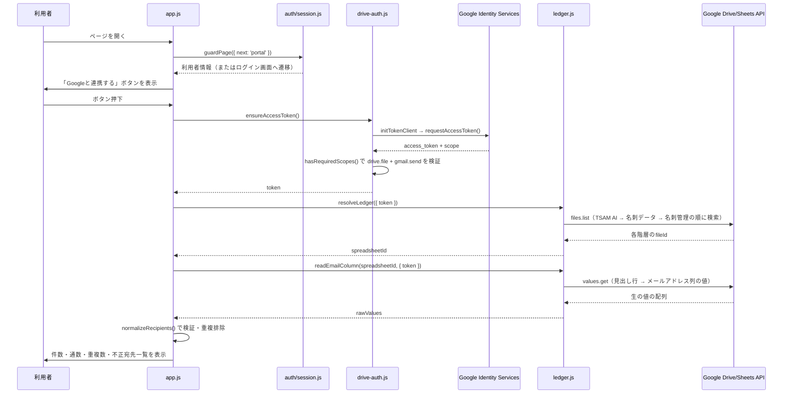
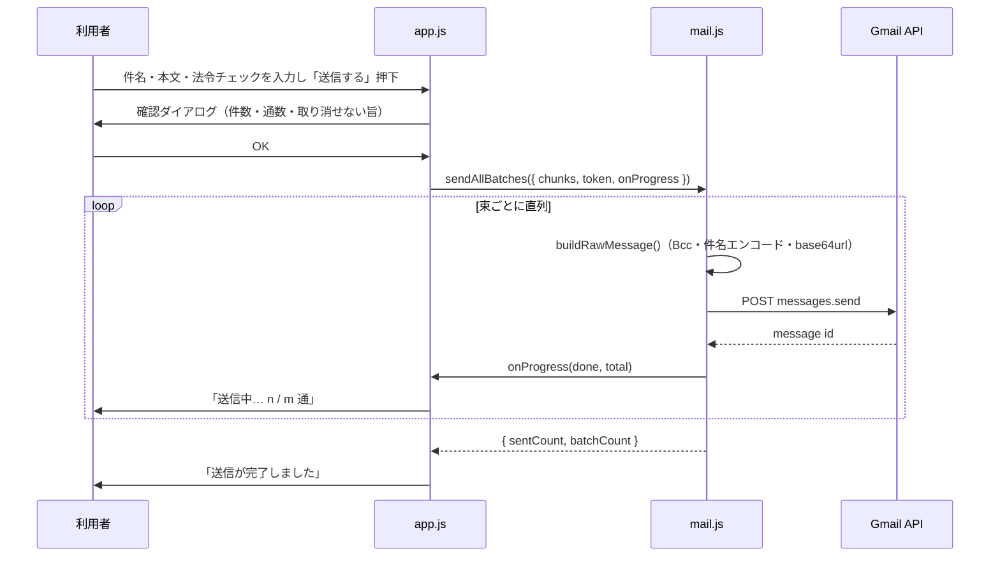
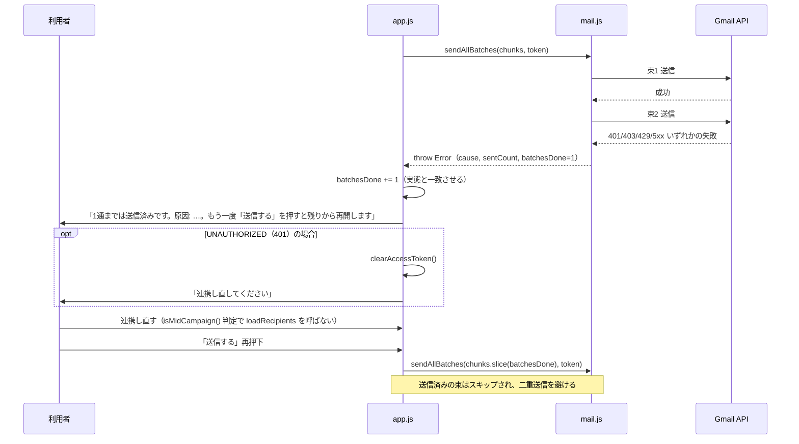

# 名刺メール配信アプリ（card-mail）詳細設計書

対象は [02_basic-design.md](./02_basic-design.md) のコンポーネント構成。実装の正は [docs/specs/card-mail-requirements-v1.md](../../specs/card-mail-requirements-v1.md)（以下「既存仕様書」）。

## 1. ファイル・モジュール構成

| パス | 責務 |
| --- | --- |
| `public/production-app/card-mail/index.html` | 画面構造・CSP宣言 |
| `public/production-app/card-mail/config.js` | 静的設定一覧（§7） |
| `public/production-app/card-mail/gis-loader.js` | GISスクリプトの遅延読み込み。`../card-ocr/gis-loader.js` を複製（2026-08-10、変更点なし） |
| `public/production-app/card-mail/drive-auth.js` | OAuthトークン取得・保持・スコープ検証。`../card-ocr/drive-auth.js` を複製（2026-08-10、スコープを2つに拡張し両方の付与検証を追加） |
| `public/production-app/card-mail/drive-api.js` | Google API共通の通信・エラー分類。`../card-ocr/drive-api.js` を複製（2026-08-10、書き込み系（アップロード・作成・削除）を持たない） |
| `public/production-app/card-mail/ledger.js` | 台帳の解決（検索のみ）とメールアドレス列の読み取り |
| `public/production-app/card-mail/recipients.js` | 宛先の検証・重複排除・分割（純粋関数のみ） |
| `public/production-app/card-mail/mail.js` | RFC 5322メッセージ組み立てとGmail送信 |
| `public/production-app/card-mail/app.js` | 画面制御。`public/auth/config.js`（`setScreenDepth`）と `public/auth/session.js`（`guardPage`）を参照 |
| `public/production-app/card-mail/style.css` | 見た目の差分 |
| `tests/unit/card-mail.mjs` | Node実行のユニットテスト（ブラウザ不要） |
| `tests/browser/card-mail.mjs` | 実ブラウザでの結線確認（`tests/run.mjs` の `browser:card-mail`） |

`drive-auth.js` / `drive-api.js` / `gis-loader.js` は `card-ocr` からの複製であり、`import` はしていない（[docs/repository-structure.md](../../repository-structure.md) §4-1、各ファイル冒頭コメント）。

## 2. 主要処理フロー

### 2.1 起動〜宛先読み込み（正常系）

### 2.2 送信（正常系・100件単位の直列送信）

### 2.3 送信の途中失敗と再開（異常系）

送信途中の再連携では `loadRecipients()` を呼ばない。呼ぶと再開位置（`batchesDone`）がリセットされ、案内どおりに操作しただけで送信済みの相手へ同じメールが再送される（`app.js` の `connectPressed` コメント）。

## 3. データモデル詳細

### 3.1 台帳（Googleスプレッドシート「名刺管理」）

このアプリが依存する範囲のみ。スキーマ全体の正は `card-ocr` 側にある。

| 項目 | 内容 |
| --- | --- |
| 保存場所 | マイドライブ／`TSAM AI`（フォルダ）／`名刺データ`（フォルダ）／`名刺管理`（スプレッドシート） |
| 読み取り対象タブ | `名刺データ`（`DATA_TAB_NAME`） |
| 読み取り対象列 | 見出し行の値が `メールアドレス`（`EMAIL_COLUMN_HEADER`）と一致する列。位置は固定しない（見出しで検索） |
| 読み取り範囲 | 見出し行（1行目）＋ 対象列の2行目以降。他の列（氏名・住所・電話等）は取得しない |
| 書き込み | 行わない（読み取り専用） |

### 3.2 localStorage

| キー（`STORAGE_KEYS` の値） | 内容 | 備考 |
| --- | --- | --- |
| `rootFolder` | `TSAM AI` フォルダのファイルID | 台帳解決のキャッシュ。次回訪問時の検索省略に使う |
| `appFolder` | `名刺データ` フォルダのファイルID | 同上 |
| `spreadsheet` | `名刺管理` スプレッドシートのファイルID | 同上 |

いずれも `isFileId()`（`/^[A-Za-z0-9_-]{10,120}$/`）で形式検査したうえで読み書きする。キャッシュされたIDは `getFileMeta()` で名前・種別・親・削除状態を検証し、不一致なら破棄して検索し直す（`ledger.js` の `verifyCachedId`）。401・通信不良ではキャッシュを破棄しない（一時的な問題で無駄な再検索をしないため）。

### 3.3 メモリ上の状態（ページを離れると消える）

| 保持場所 | 変数 | 内容 |
| --- | --- | --- |
| `drive-auth.js`（モジュールスコープ） | `accessToken` / `tokenExpiresAt` | OAuthアクセストークンと有効期限（`TOKEN_EXPIRY_MARGIN_MS` だけ手前で切り上げ） |
| `drive-auth.js` | `pendingRequest` | GISのポップアップ応答待ちの二重発行防止用 |
| `app.js`（モジュールスコープ） | `recipients` | 検証・重複排除済みの宛先配列 |
| `app.js` | `batchesDone` | 送信済みの束数（再開位置） |
| `app.js` | `sending` | 送信処理中フラグ（二重送信防止） |
| `app.js` | `needsConsent` | 次回連携で同意画面を強制するか（スコープ不足を一度検出した後の再取得用） |

## 4. インターフェース仕様

### 4.1 外部API呼び出し

| API | メソッド／パス | 用途 | 主要パラメータ |
| --- | --- | --- | --- |
| Drive v3 | `GET /drive/v3/files` | 台帳フォルダ・スプレッドシートの検索 | `q`（`buildChildQuery`: name/mimeType/trashed=false/parents）、`orderBy=createdTime`（同名複数時は最も古いものを正本とする） |
| Drive v3 | `GET /drive/v3/files/{id}` | キャッシュ済みIDの検証 | `fields=id,name,mimeType,parents,trashed` |
| Sheets v4 | `GET /v4/spreadsheets/{id}/values/{range}` | 見出し行の取得、メールアドレス列の値の取得 | `range` はA1記法（例: `'名刺データ'!1:1`、`'名刺データ'!C2:C`） |
| Gmail v1 | `POST /gmail/v1/users/me/messages/send` | 1束（最大100件のBCC）の送信 | body `{ raw }`（base64url化したRFC 5322メッセージ） |

### 4.2 主要関数（入出力）

| 関数 | 所在 | 入力 | 出力／例外 |
| --- | --- | --- | --- |
| `ensureAccessToken({ forceConsent, clientId, signal })` | `drive-auth.js` | オプション | `Promise<string>`（トークン）。失敗時は `DriveAuthError` |
| `hasRequiredScopes(response)` | `drive-auth.js` | GISのトークン応答 | `boolean`（`drive.file` と `gmail.send` の両方が付与されているか） |
| `resolveLedger({ token, fetchImpl, signal })` | `ledger.js` | アクセストークン等 | `Promise<string>`（スプレッドシートID）。見つからなければ `LedgerError(LEDGER_NOT_FOUND)` |
| `readEmailColumn(spreadsheetId, { token, fetchImpl, signal })` | `ledger.js` | スプレッドシートID等 | `Promise<string[]>`（生の値、空セル除く）。列が無ければ `LedgerError(COLUMN_NOT_FOUND)` |
| `normalizeRecipients(rawValues)` | `recipients.js` | 生の値の配列 | `{ recipients: string[], invalid: string[], duplicateCount: number }` |
| `chunkRecipients(recipients, size = 100)` | `recipients.js` | 宛先配列 | `string[][]`（100件ずつの束） |
| `buildRawMessage({ subject, text, bcc })` | `mail.js` | 件名・本文・宛先配列 | `string`（RFC 5322メッセージ）。不正値は `TypeError` |
| `sendAllBatches({ subject, text, chunks, token, onProgress })` | `mail.js` | 束の配列等 | `Promise<{ sentCount, batchCount }>`。途中失敗時は `Error`（`cause`・`sentCount`・`batchesDone` を付与） |

### 4.3 エラーコード一覧（画面表示用）

| コード | 発生源 | 意味 |
| --- | --- | --- |
| `OAUTH-001` | `drive-auth.js` | OAuth連携そのものの失敗（クライアントID未設定・GIS読み込み失敗・ポップアップ・拒否・スコープ不足等） |
| `OAUTH-002` | `drive-api.js` / `mail.js` | アクセストークンの期限切れ（HTTP 401） |
| `DRV-001` | `drive-api.js` | Drive/Sheets APIのエラー（403系の細分・404・429・5xx・400・ネットワーク） |
| `MAIL-001` | `mail.js` | Gmail送信のエラー（403・429・5xx・400・ネットワーク） |
| `SETUP-002` | `ledger.js` | 台帳またはメールアドレス列が見つからない |

## 5. 状態管理・セッション設計

- **TSAM AIセッション**: `public/auth/session.js` の仕組みに従う（本アプリ固有の実装は持たない）。根拠はサーバー側のセッションであり、`localStorage` のトークン文字列自体は判定に使わない。`guardPage()` が利用者情報を返すまで `#cm-content` を描画しない。
- **Google OAuthトークン**: `drive-auth.js` のモジュール変数にのみ存在し、ページ再読み込みで消える。再読み込み後は連携からやり直しになる（宛先の再読込・`batchesDone` のリセットを伴う）。
- **送信の進行状態**: `app.js` の `recipients` / `batchesDone` / `sending` の3変数で管理する。`isMidCampaign()`（`recipients.length > 0 && 0 < batchesDone < 総束数`）で「送信途中か」を判定し、途中であれば「宛先を読み込み直す」に確認ダイアログを挟み、「Googleと連携する」はトークン取得のみを行って再開位置を維持する。
- **タブを複数開いた場合の整合性**: 各タブが独立したメモリ状態を持つため、複数タブでの並行操作時の整合性は保証されない（未確定事項として §9 に後述）。

## 6. エラーハンドリング詳細

- **エラークラスの使い分け**は §1、§4.3 の対応表のとおり。`app.js` の `describeAnyError()` が `LedgerError → DriveError → DriveAuthError` の順に判定し、画面文言（`describeLedgerError` / `describeDriveError` / `describeDriveAuthError`）へ変換する。
- **401と403の扱いを分ける。** 401（`UNAUTHORIZED`）でのみ `clearAccessToken()` を呼ぶ。403は `FORBIDDEN` / `STORAGE_FULL`（`storageQuotaExceeded` 等） / `RATE_LIMITED`（`rateLimitExceeded` 等）へ細分し、レート制限や容量超過を認可エラーと混同しない（`drive-api.js` の `mapHttpErrorToCode`）。403で `clearAccessToken()` を呼ぶと、待てば直る問題（レート制限）を再連携でも直らない状態に変えてしまうため（コード中コメント、既知の知見の反映）。
- **送信中の異常終了時の位置管理。** `sendAllBatches()` は失敗した束の**直前まで**の `sentCount` / `batchesDone` を例外に載せる。呼び出し側（`app.js`）はこれを `batchesDone` に加算してから画面へ表示する。進捗コールバック（`onProgress`）内の例外は握りつぶし、表示側の不具合が送信計画（位置情報）を壊さないようにしている（`mail.js` の `notifyProgress`）。
- **ヘッダーインジェクション対策は二重に持つ。** 宛先の形式検証（`recipients.js` の `isValidEmail`）に加え、メッセージ組み立て（`mail.js` の `assertHeaderValue`）でも改行・制御文字・カンマ・セミコロンを検査する。将来、検証を経ない呼び出しが足されても、組み立て側が最後の関門として機能する設計（`mail.js` のコメント）。
- **例外にトークン・応答本体を含めない。** すべてのエラークラス（`DriveAuthError` / `DriveError` / `LedgerError`）はコンストラクタでコードと簡潔な `detail` のみを保持する。

## 7. 設定値・環境変数一覧

いずれも `public/production-app/card-mail/config.js` に定義。値そのものは秘密情報またはリポジトリの実運用値であるため本書には書かない（役割のみ）。

| 名前 | 役割 |
| --- | --- |
| `CLIENT_ID_PLACEHOLDER` | クライアントID未設定を示す目印の値 |
| `GOOGLE_CLIENT_ID` | Google OAuthクライアントID（`card-ocr` と共用。§9 制約条件を参照） |
| `DRIVE_SCOPE` / `GMAIL_SEND_SCOPE` / `REQUIRED_SCOPES` | 要求するOAuthスコープ（`drive.file` と `gmail.send` の2つ） |
| `GIS_SCRIPT_URL` | GIS公式スクリプトの読み込み先URL |
| `GIS_LOAD_TIMEOUT_MS` | GIS読み込みの打ち切り時間 |
| `TOKEN_EXPIRY_MARGIN_MS` | トークン期限の手前での切り上げ幅 |
| `DRIVE_FILES_ENDPOINT` / `SHEETS_ENDPOINT` / `GMAIL_SEND_ENDPOINT` | 各Google APIのベースURL |
| `ROOT_FOLDER_NAME` / `APP_FOLDER_NAME` / `SPREADSHEET_NAME` | 台帳の場所（フォルダ名・スプレッドシート名） |
| `DATA_TAB_NAME` / `EMAIL_COLUMN_HEADER` | 読み取り対象のタブ名と列見出し |
| `BCC_BATCH_SIZE` | 1通あたりのBCC宛先数（100） |
| `MAX_SUBJECT_LENGTH` / `MAX_BODY_LENGTH` | 件名・本文の文字数上限 |
| `STORAGE_KEYS` | localStorageのキー名（台帳の場所のIDのみを保持） |
| `DRIVE_FOLDER_MIME` / `GOOGLE_SHEET_MIME` | Drive上のMIMEタイプ定数 |

環境変数（`.env` 等）は使用しない。設定値を変えるのは `config.js` のみで、他のファイルへ値を分散させない方針（同ファイル冒頭コメント）。

## 8. テスト構成

| スイート | 実行方法 | 検証範囲 |
| --- | --- | --- |
| `tests/unit/card-mail.mjs` | `node tests/run.mjs card-mail`（または `npm test` に含まれる） | メールアドレス検証、重複排除、100件境界の分割、RFC 5322メッセージ組み立て（Bcc折り返し・件名エンコード・998文字制限）、ヘッダーインジェクション対策、スコープ検証（両方必須）、台帳の解決（検索のみ・作成しない）、列の見出し検索、401/403の分類、途中失敗時の位置情報、localStorageに入るのがファイルIDのみであること、進捗コールバックの例外が送信を止めないこと |
| `tests/browser/card-mail.mjs`（`browser:card-mail`） | `node tests/run.mjs browser:card-mail`（Chrome必須） | ページ読み込みとESモジュール解決、`guardPage()` 通過後の表示切替、DOM ID一式の存在、連携→宛先読み込みの表示、送信ボタンの活性化条件、送信完了表示とTo無しの確認、途中失敗からの再送で1通目を送り直さないこと。実際のGoogle・TSAM AI認証系へは通信せず、`window.fetch` と `window.google.accounts.oauth2` をスタブ化する |

いずれのスイートも本物のGoogle API・TSAM AI認証系へは通信しない（本番の名刺台帳・Gmail送信への影響を避けるため）。CI（`.github/workflows/test.yml`）が実行するのは `npm test`（`node public/apps/tests/run.mjs && node tests/run.mjs`）のみで、ユニット・ブラウザの両スイートがここに含まれる。各スイートは別プロセスで直列に実行される（偽Apps Script環境やグローバルの差し替えが漏れるため、およびChromeのポート競合を避けるため）。ブラウザスイートの実行にはChromeが必要（環境変数 `CHROME_PATH` で指定可能）。
