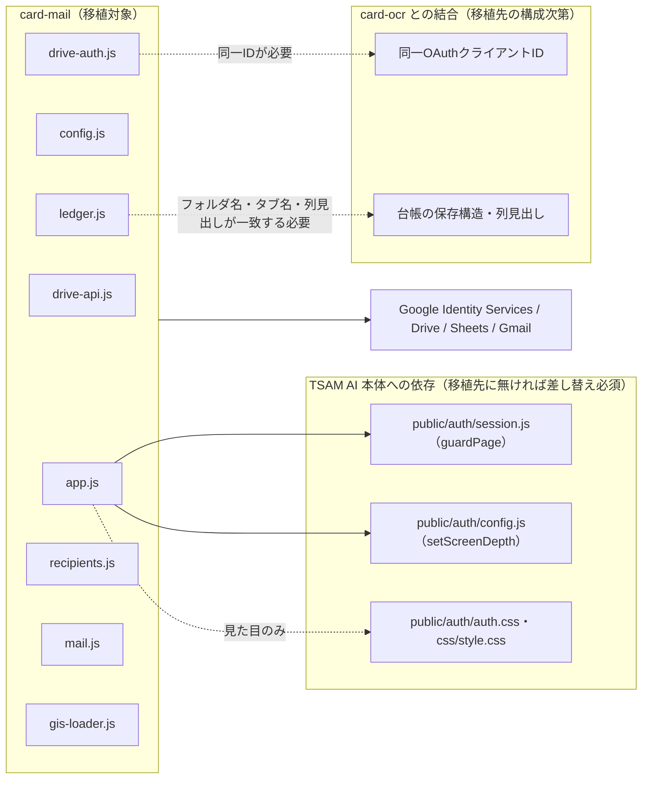

# 名刺メール配信アプリ（card-mail）組み込みガイド

このアプリを別のプロダクト・別のリポジトリへ移植することを想定した文書。実装の正は [docs/specs/card-mail-requirements-v1.md](../../specs/card-mail-requirements-v1.md)（以下「既存仕様書」）。

## 1. 移植の前提条件

- **`card-ocr` アプリと台帳（名刺データの保存構造）を共有していることが前提。** card-mailは自分では何も作らず、`card-ocr` が作った「マイドライブ／TSAM AI／名刺データ／名刺管理」のスプレッドシートを読むだけである。移植先に `card-ocr` 相当の資産（同じ保存構造を作るアプリ、または同等のシート）が無い場合、台帳の作り方から別途用意する必要がある。
- **TSAM AI固有のログイン基盤（`public/auth/`）に依存している。** `guardPage()` によるセッション確認を前提に画面を描画しており、移植先に同等の認証基盤が無い場合はこの部分を丸ごと差し替える必要がある（§3）。
- **Google Cloud側でOAuthクライアントの用意と審査が必要。** `gmail.send` は制限付きスコープであり、一般公開には審査が要る（既存仕様書 §6-2）。移植先でも同じ制約を受ける。
- 本アプリはサーバーコードを持たない。移植先も静的ホスティング（またはそれに相当する配信）を前提にできる場合に最も労力が少ない。

## 2. 依存関係マップ

| 依存先 | 種別 | 移植時の扱い |
| --- | --- | --- |
| `public/auth/session.js`（`guardPage`）、`public/auth/config.js`（`setScreenDepth`） | TSAM AI本体の共通JS | 移植先の認証基盤に合わせて差し替える（§3） |
| `public/auth/auth.css`、`../../css/style.css` | 見た目の共通CSS | 必須ではない。移植先の見た目に合わせて自前のCSSに置き換え可能 |
| `card-ocr` と同一のGoogle OAuthクライアントID | 実行時の設定値（`config.js`） | 移植先で `card-ocr` 相当のアプリを新設する場合は、そのクライアントIDと合わせる必要がある（§4） |
| 台帳のフォルダ名・スプレッドシート名・タブ名・列見出し（`ROOT_FOLDER_NAME` 等） | 保存構造の取り決め | 移植先の宛先データの保存構造に合わせて `config.js` の値を変更する |
| Portal（`public/portal/app-registry.js`） | 起動元 | 移植先のアプリ起動導線（メニュー等）に合わせて差し替える。本アプリ自体はPortalへの依存を持たない（URLを直接開けば動く） |

## 3. 切り離しポイント

| 箇所 | 現状の実装 | 切り離し方 |
| --- | --- | --- |
| 画面ガード（ログイン確認） | `app.js` が `guardPage()`（TSAM AI認証系）を呼ぶ | 移植先の認証チェック関数に差し替える。戻り値として「利用者情報オブジェクト or null」を返す契約を保てば、`app.js` の呼び出し側コードはほぼそのまま使える |
| OAuthクライアントID | `config.js` の `GOOGLE_CLIENT_ID`（`card-ocr` と共用） | 移植先で名刺台帳を作るアプリが別に無い、あるいは単独で完結させるなら、新規クライアントIDを発行し、`drive.file` の対象を自アプリ限定にできる（この場合「card-ocr の台帳を読む」という前提自体が外れるため、台帳の作成・書き込み機能を別途用意する必要がある） |
| 台帳の保存構造 | `config.js` の `ROOT_FOLDER_NAME` / `APP_FOLDER_NAME` / `SPREADSHEET_NAME` / `DATA_TAB_NAME` / `EMAIL_COLUMN_HEADER` | 値を移植先の構造に合わせて変更するだけで、`ledger.js` のロジック（検索のみ・見出しで列を探す）はそのまま使える |
| CSP | `index.html` の `<meta http-equiv="Content-Security-Policy">` | 移植先の配信基盤のCSPに合わせて再設定する。`connect-src` にはGoogle 3系統（Drive/Sheets/Gmail）とGIS、必要なら認証系のホストを含める |
| 見た目（CSS） | `public/auth/auth.css` と `css/style.css` を前提にした差分CSS | 移植先のデザインシステムに合わせて `style.css` を書き直す。`index.html` の外部CSS参照を外し、必要なスタイルを移す |
| Portalからの起動 | `index.html` の「ポータルへ戻る」リンクが `../../portal/` を指す | 移植先の遷移導線に合わせてリンク先を変更する |

## 4. 必要な外部サービスと設定作業の概要

1. **Google Cloud プロジェクトとOAuthクライアント。**
   - 「承認済みのJavaScript生成元」に移植先のドメインを登録する。
   - OAuth同意画面のスコープに `drive.file` と `gmail.send` を追加する。
   - `gmail.send` は制限付きスコープのため、一般公開前にGoogleの審査（セキュリティ評価を含みうる）を受ける。審査完了まではテストユーザー登録での運用に限られる（既存仕様書 §6-2）。
2. **有効化するAPI**: Google Drive API、Google Sheets API、Gmail API。
3. **Google Identity Services**: 追加登録は不要（公式配信スクリプトを読み込むだけ）。読み込み元URLをCSP・許可リストに含める。
4. **宛先データの保存構造**: `card-ocr` 相当のアプリ（または同等のシート運用）で、フォルダ階層とスプレッドシートのタブ名・列見出しを用意する。card-mail自身はこれらを作成しない。

移植先が独自ドメインの場合、TSAM AIのGoogle Cloudプロジェクトをそのまま使うか、独自プロジェクトを新設するかは、台帳との連携要否（§3のクライアントIDの項）で判断する。

## 5. 複製時の注意

[docs/repository-structure.md](../../repository-structure.md) §4 の方針（本番アプリ間で共通層を作らず複製する）に従う。

- **複製元パスと複製日をファイル冒頭コメントに書く。** `card-mail` 自体が `card-ocr` から `drive-auth.js` / `drive-api.js` / `gis-loader.js` を複製した際の書き方（各ファイル冒頭の「複製元」節）をそのまま踏襲する。
- **複製元の欠陥をそのまま持ち込まない。** `card-mail` が `card-ocr` から複製した際に行った変更点（`drive-auth.js` でのスコープ両方検証の追加、`drive-api.js` からの書き込み系エンドポイント削除）のように、複製先での用途に合わせて見直す（[docs/repository-structure.md](../../repository-structure.md) §4-3）。
- **純粋関数でも「複製してよい」と即断しない。** 一見同じに見える関数（宛先検証、メッセージ組み立て等）にも、エラーコード体系やヘッダーインジェクション対策の粒度など、そのアプリ固有の方針が乗っている場合がある。移植先の要件を先に固めてから複製内容を決める。
- **既知の不具合の申し送り。** 本書執筆時点で `card-mail` 固有の既知の不具合は見当たらない（テスト `tests/unit/card-mail.mjs` ・`tests/browser/card-mail.mjs` がいずれも通過する前提。§10「未確定事項」に検証状況を記載）。

## 6. 最小組み込み手順

1. `public/production-app/card-mail/` 配下の全ファイルを移植先へコピーする（`import` で参照せず、ファイルごと複製する）。
2. `config.js` を移植先の値に書き換える。
   - `GOOGLE_CLIENT_ID`（新規発行、または既存の名刺台帳アプリと共用するID）
   - `ROOT_FOLDER_NAME` / `APP_FOLDER_NAME` / `SPREADSHEET_NAME` / `DATA_TAB_NAME` / `EMAIL_COLUMN_HEADER`（台帳の保存構造）
   - 必要なら `BCC_BATCH_SIZE`・文字数上限などの運用値
3. `app.js` のTSAM AI依存部分（`guardPage` / `setScreenDepth` の import）を、移植先の認証チェック・レイアウト機構に差し替える。契約（「利用者情報 or null を返す非同期関数」）を保てば、以降のロジックはそのまま使える。
4. `index.html` のCSPを移植先の配信基盤に合わせて設定し、見た目（CSS参照）を移植先のデザインに合わせる。
5. Google Cloud側の設定（§4）を行う。`gmail.send` の審査が完了するまでは一般公開せず、テストユーザーで検証する。
6. `tests/unit/card-mail.mjs` 相当のテスト（`recipients.js` / `mail.js` / `ledger.js` / `drive-api.js` / `drive-auth.js` の純粋ロジック検証）を移植先のテスト基盤に合わせて用意し、実行する。通信はスタブ（`fetchImpl` の差し替え）で行い、本物のGoogle APIを叩かない。
7. 実ブラウザでの結線確認（`tests/browser/card-mail.mjs` 相当）を用意し、`window.fetch` と `window.google.accounts.oauth2` のスタブ化で、実際の名刺台帳・Gmail送信に影響を与えずに検証する。
8. 起動導線（Portal相当のメニュー）へ追加する。
