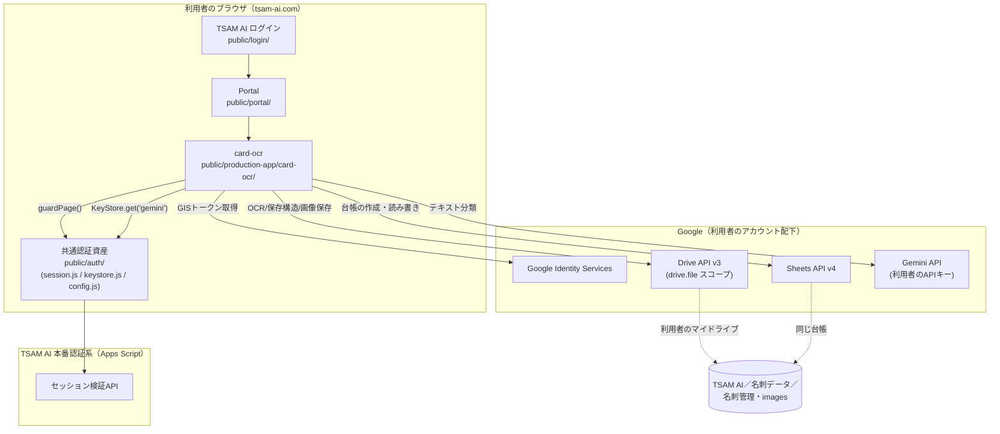
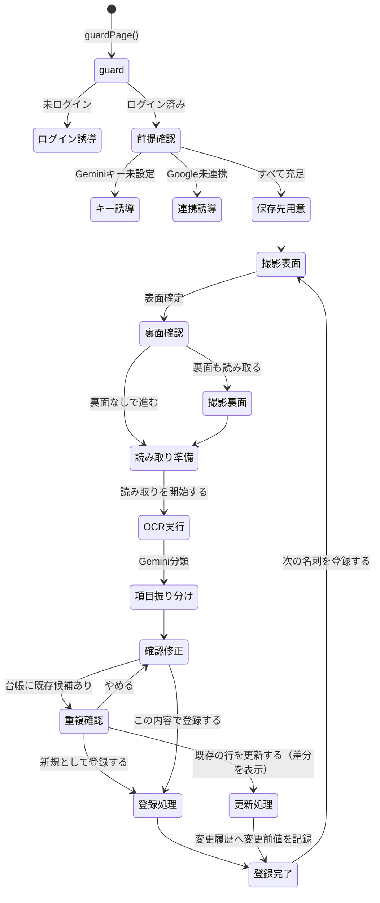

# 名刺OCR・データ登録アプリ（card-ocr）基本設計書

対応する要件定義書: [01_requirements.md](./01_requirements.md)。既存仕様書 [meishi-ocr-requirements-v3.md](../../specs/meishi-ocr-requirements-v3.md) を正とする。

## 1. システム構成

サーバーコードを持たない。ブラウザが利用者自身のGoogleアカウントへ直接通信する構成。



当社側に存在するのは静的ファイル（HTML/CSS/JS）、Portalのアイコン枠、KeyStore、TSAM AI認証系、GoogleのOAuthクライアント設定のみである。名刺画像・抽出テキスト・名刺データ・APIキー・OAuthトークンはいずれも当社サーバーへ送信されない。

## 2. コンポーネント一覧と責務

| コンポーネント | ファイル | 責務 |
| --- | --- | --- |
| 画面制御 | `app.js` | DOM操作、状態遷移の集約、他モジュールの呼び出し |
| 静的設定 | `config.js` | OAuthクライアントID・スコープ・APIエンドポイント・モデル名・保存構造名・localStorageキー等を一元管理 |
| Google認可 | `drive-auth.js` | GISトークンモデルによるアクセストークン取得・メモリ保持・スコープ検証 |
| GIS読み込み | `gis-loader.js` | Google公式スクリプトの遅延読み込み |
| Drive下回り | `drive-api.js` | Drive APIへのHTTP呼び出し・エラー分類・multipart組み立て |
| Drive OCR | `drive-ocr.js` | 画像→Googleドキュメント変換→本文取得→削除の一連処理。面ごとの並列実行、孤児回収 |
| 保存構造解決 | `drive-storage.js` | フォルダ・台帳の3段階解決（キャッシュ検証→検索→作成）、既存台帳の健全性検査 |
| Sheets呼び出し | `sheets.js` | 台帳の作成・見出し管理・列の追加・行の追記・読み取り |
| 台帳スキーマ | `schema.js` | 列定義、見出し検証、重複判定キーの組み立て、1行データの生成 |
| サニタイズ | `sanitize.js` | 数式インジェクション対策、画像リンク(`HYPERLINK`)の組み立て、ファイル名の無害化 |
| 画像取得・前処理 | `capture.js` | ファイル種別判定、Canvasによる縮小・段階的圧縮、ファイル名生成 |
| 撮影フロー状態 | `capture-flow.js` | 表面・裏面の入力順序を管理する純粋な状態遷移 |
| ハッシュ | `hash.js` | 画像のSHA-256計算（面ごと） |
| テキスト正規化・抽出 | `extract.js` | NFKC正規化、正規表現による事前抽出、Gemini入力上限への切り詰め |
| プロンプト定義 | `prompt.js` | システム指示文、JSON Schema、リクエスト組み立て |
| Gemini呼び出し | `gemini.js` | REST直接呼び出し、エラー分類、モデルフォールバック |
| 突き合わせ | `merge.js` | Gemini結果と正規表現候補の統合、電話番号種別の整形 |
| 確定保存 | `register.js` | 重複判定、画像アップロード、台帳への行追記のオーケストレーション |
| 前提判別 | `prerequisites.js` | ログイン・キー・Google連携の3状態判別（DOM非依存の純粋関数） |
| ヘルプ画面 | `help/index.html` / `help/help.js` | データの扱い・削除方法・連携解除の静的な案内 |
| 測定モード | `measure/` | フェーズ2の精度・所要時間測定用の開発者向け画面（本番モジュールを直接import） |

## 3. 外部インターフェース一覧

| 接続先 | 通信方式 | 用途 |
| --- | --- | --- |
| Google Identity Services | `<script>` 読み込み＋`google.accounts.oauth2` | OAuthトークンモデルによる認可 |
| Drive API v3 | `fetch` によるREST直接呼び出し（`www.googleapis.com`） | 保存構造の作成・検索、OCR変換・取得・削除、画像アップロード、孤児回収 |
| Sheets API v4 | `fetch` によるREST直接呼び出し（`sheets.googleapis.com`） | 台帳の作成・見出し管理・行追記・行更新・列/行読み取り・変更履歴の記録 |
| Gemini API | `fetch` によるREST直接呼び出し（`generativelanguage.googleapis.com`） | 名刺テキストの構造化分類（JSON Schema出力） |
| TSAM AI 認証系 | `public/auth/session.js` 経由（内部でApps Scriptを呼ぶ） | ログインセッションの検証 |
| Portal KeyStore | `public/auth/keystore.js` 経由（同一オリジンの`localStorage`） | Gemini APIキーの読み取り |

外部SDKは使用せず、すべて `fetch` によるREST直接呼び出しである。当社サーバーへの通信は静的資産の取得とTSAM AI認証系の通信のみで、名刺データ・画像・キー・トークンを含む通信は存在しない。

## 4. データ設計概要

保存先はすべて利用者本人のGoogleドライブ（マイドライブ）である。

```text
マイドライブ
└─ TSAM AI
   └─ 名刺データ
      ├─ 名刺管理（Googleスプレッドシート）
      │    ├─ 名刺データ（タブ。確定した名刺情報。1件1行）
      │    └─ 変更履歴（タブ。既存行を更新したときの変更前値。1項目1行）
      └─ images
         └─ YYYY
            └─ MM（保存画像。表面・裏面それぞれ1ファイル）
```

台帳のIDはブラウザの `localStorage`（`STORAGE_KEYS`）にキャッシュするが、これは正本ではなく手がかりに過ぎない。キャッシュが無効・不一致の場合は名前・親・種別で検索し直し、それでも見つからなければ新規作成する。台帳の列構成・重複判定キーの詳細は [03_detailed-design.md](./03_detailed-design.md) §3 を参照。

## 5. 画面一覧と画面遷移

| 画面 | ファイル | 用途 |
| --- | --- | --- |
| 前提確認・撮影・確認・保存の一体画面 | `index.html` / `app.js` | ログイン確認、Google連携、キー確認、保存先用意、撮影、OCR、項目確認・修正、重複確認、登録完了までを1画面内のセクション切り替えで行う |
| ヘルプ | `help/index.html` | データの扱い・削除方法・連携解除の案内（常時リンクあり） |
| 測定（開発者向け） | `measure/index.html` | エンドユーザー導線には出ない、精度測定用の画面 |

既存仕様書はSC-00〜SC-07の8画面として整理しているが、実装は単一HTML内のセクション（`<section>`/`<details>`）表示切り替えで実現しており、URL遷移を伴う別画面ではない。



## 6. 認証・認可方式

3層構成（`prerequisites.js` の判別順は キー → Google連携 の順だが、要件上の位置づけは以下）。

1. **TSAM AI 認証**: `guardPage()` によるセッション検証。未ログインなら `/login/` へ誘導する。Portal未掲載でもアプリ自身がこのガードを必ず通す。
2. **Google OAuth**: GISトークンモデル、スコープは `drive.file` のみ。トークンはメモリ上のみで保持し、`pagehide` イベントで破棄する。付与スコープを毎回検証し、`drive.file` が欠けていれば `SCOPE_NOT_GRANTED` として弾く。
3. **Gemini APIキー**: KeyStoreの `has()`/`get()` のみを入口とする。未設定ならPortalのキー設定画面へ誘導し、抽出処理を開始しない。

利用者データの実質的な保護は、利用者自身のGoogle OAuth認証によって担保される。本アプリは他利用者のデータへ到達する経路を構造上持たない（`drive.file` の可視範囲がクライアントIDごとに限定されるため）。

## 7. エラー処理方針

各モジュールが独自のエラークラス（`DriveError` / `DriveAuthError` / `OcrError` / `GeminiError` / `CaptureError`）を持ち、内部コード（例: `RATE_LIMITED` / `STORAGE_FULL` / `SERVER_ERROR`）で細かく分類したうえで、画面に出す表示コードは既存仕様書 §15 の一覧（`DRV-001` 等）に収める。表示コードだけでは切り分けが弱いため、各 `describe*Error()` 関数はHTTPステータスやサーバー応答本文の要約（`detail`）を必ず添えて返す。

技術的な詳細をそのまま画面に出さない一方、問い合わせ時に利用者が伝えられる程度の情報（エラーコード＋要約）は画面に残す。ログの中央保管は行わず、詳細はブラウザの実行時エラーとしてのみ扱う（`console.*` への出力もソース検査テストで禁止している）。

## 8. 運用・デプロイ構成

- 配信は `public/production-app/card-ocr/` 配下の静的ファイルとして行う。ビルド工程を持たず、ESモジュールをそのままブラウザへ配信する。
- デプロイは手動（`npm run deploy`）。`main` へのマージだけでは公開されない（リポジトリ全体の配信方針、ルート `CLAUDE.md`）。
- CSPは `index.html` の `<meta http-equiv="Content-Security-Policy">` で宣言する。`next.config.ts` の `headers()` は使わない（`public/` 全体に効いてしまうため）。
- テストは `tests/unit/card-ocr.mjs`（Node実行、`tests/run.mjs` の `SUITES` に `card-ocr` として登録）に集約する。`fetch` をスタブし、実際のGoogle/Gemini APIへは通信しない。ソース検査（`localStorage`直接操作の禁止、テスト環境・PoC・他本番アプリからのimport禁止、許可ホスト以外の出現禁止等）もこのスイート内で行う。
- 精度・所要時間の測定は `measure/` 画面で行い、台帳への保存は行わない（測定結果はCSV書き出しのみ）。フェーズ2の測定終了後に撤去予定。

## 9. 主要な設計判断と採らなかった選択肢

| 判断 | 採った理由 | 採らなかった選択肢 |
| --- | --- | --- |
| 本番アプリ間で共通層を作らず複製する | `receipt-ocr` と `card-ocr` の全ファイルを比較した結果、本質的に同一化できたのは全体の3%程度で、残りは方針が食い違っていた（エラーコード体系、`valueInputOption`、モデル名等13点）。共有層は2アプリの開発ラインを同期点で縛る（詳細: [docs/repository-structure.md](../../repository-structure.md) §4） | `public/production-app/shared/` のような共通ライブラリ化 |
| `card-mail` とOAuthクライアントIDを共用する | `drive.file` はクライアントIDごとに可視範囲が分かれるため、`card-mail` が本アプリの台帳を読むには同じIDが必要（ルート `CLAUDE.md`） | アプリごとに完全に独立したクライアントIDを発行する（本来の分離方針だが、この2アプリ間では例外） |
| 表裏OCRを並列実行する | 直列だと所要時間がほぼ倍になり、§13.1 の目標（両面60秒）を単独で壊す。Driveのクォータには十分な余裕がある | `card-scanner`（テスト環境）と同じ直列実行 |
| Gemini呼び出しを1名刺1回（表裏結合）にする | 無料枠キーのクォータ消費を抑え、表裏の別表記（日英併記等）をモデル側で1回の文脈判断に委ねられる。代償として値の由来は `fromBackFields` というモデルの自己申告に頼る | 面ごとに2回呼ぶ（`card-scanner` の `mergeParsed()` と同じ構造）。フェーズ2の検証で自己申告が当てにならないと分かれば切り替える予定だった |
| Sheets書き込みを `USER_ENTERED` にする | 画像リンクを `=HYPERLINK()` としてクリック可能にする要求（§11.2）と両立させるため。代償として数式インジェクション対策（サニタイズ）が唯一の防御になる | `receipt-ocr` と同じ `RAW`（数式が評価されないぶん安全だが、リンクが文字列のまま残る） |
| 台帳の列を右端にのみ追加する | 既存シートは列の並びで正しさを判定しており、途中へ挿入すると「改変された」と判定され書き込みが停止する。右端追加なら`upgrade`として自動対応できる | 中身の列の隣（意味的に自然な位置）へ挿入する |
| 更新時に行を丸ごと書き換える（部分更新にしない） | 「いま読み取った1枚で、その1件を置き換える」という操作にそろえた。空欄になる項目（裏面を撮らなかった場合の `back_*` 等）も含めて差分を出し、利用者の確認を経てから書く | 新しい値が空の列は既存値を残す「マージ更新」。黙って値が残るぶん、画面に出した差分と実際の結果が食い違う |
| 更新の直前に `record_id` 列を読み直して行番号を求める | 差分を見ている間に利用者が別タブで行を消す・並べ替えることがある。行番号を握ったまま書くと**別人の行を上書きする**。見つからなければ書かずに知らせる | 重複検出のときに得た行番号をそのまま使う（読み取り1回ぶん安いが、取り違えを検出できない） |
| 台帳を書いてから変更履歴を書く | 逆順だと、台帳の書き換えに失敗したときに「こう変えた」という**嘘の履歴だけ**が残る。この順なら、履歴に失敗しても「更新はできた／記録は残せなかった」と利用者に伝えられる | 変更履歴を先に書く。あるいは失敗時に台帳を巻き戻す（サーバー無しでの原子性は担保できない） |
| 変更履歴は全列、画面の差分は中身の列だけ | 画面に管理ID・ハッシュ・ファイルIDを並べても更新可否の判断材料にならず、肝心の「会社名が変わった」が埋もれる。一方、記録の側を絞ると画像の差し替えが追えなくなる | 画面と記録で同じ範囲にそろえる（どちらかが必ず不便になる） |
| 「変更履歴」タブの見出しは検査しない | 名刺データタブと違い、列がずれても**第三者の個人情報が別の列へ入る事故にはならない**。起動時のSheets読み取りを1回増やす価値が無いと判断した | 台帳と同じく `verifyHeader` で検査し、改変されていたら更新自体を止める（[01_requirements.md](./01_requirements.md) §9 に未確定事項として記録） |

## 10. 変更履歴

| 版 | 日付 | 内容 |
| --- | --- | --- |
| 1.0 | 2026-08-18 | 初版 |
| 1.1 | 2026-08-18 | 既存行の更新・変更履歴記録の実装に追随。§3・§4・§5・§9 を更新（「確定保存を追記のみで実装する」判断は撤回し、更新に関する5件の判断へ置き換えた） |
