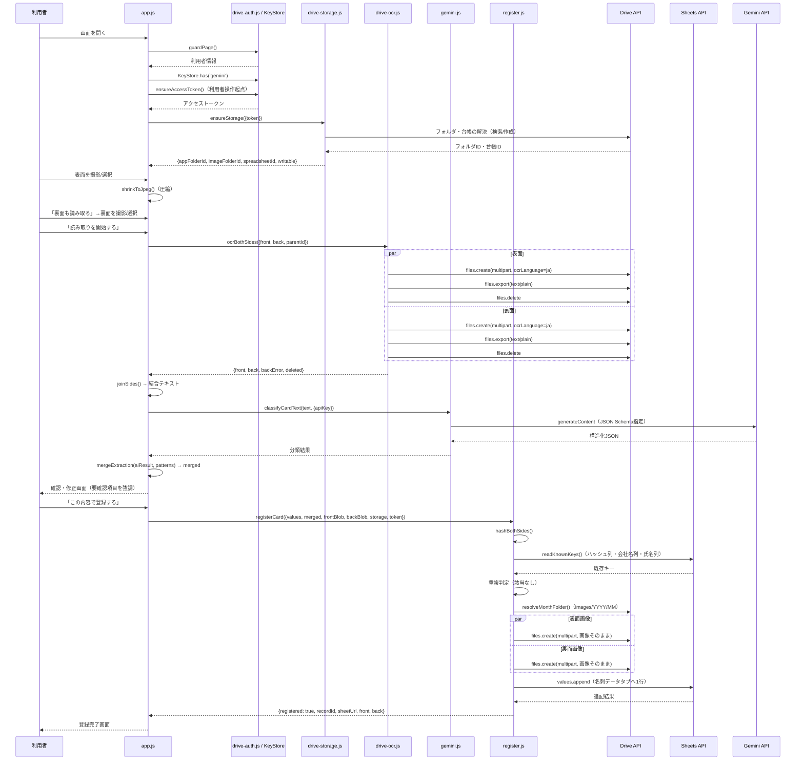
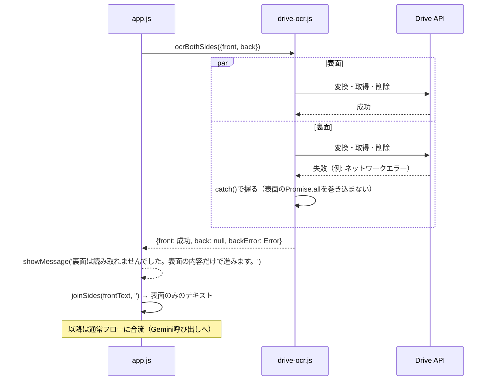
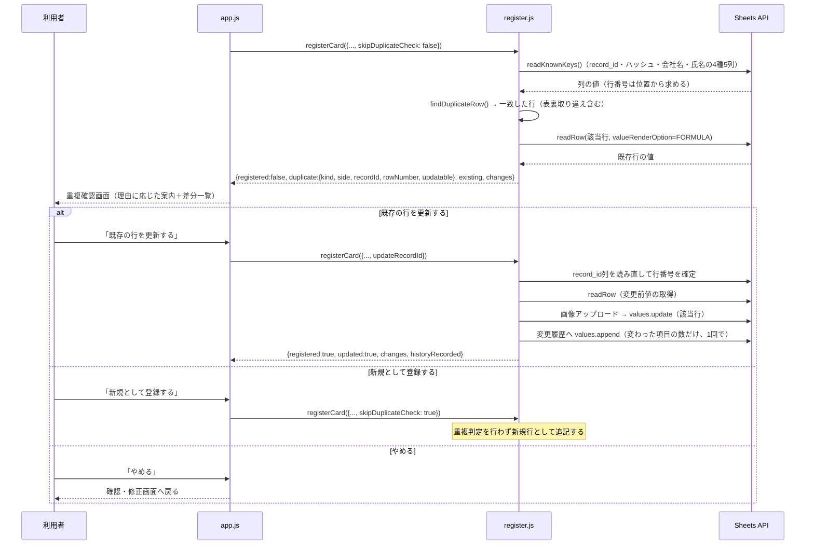

# 名刺OCR・データ登録アプリ（card-ocr）詳細設計書

対応する基本設計書: [02_basic-design.md](./02_basic-design.md)。既存仕様書 [meishi-ocr-requirements-v3.md](../../specs/meishi-ocr-requirements-v3.md) を正とする。

## 1. ファイル・モジュール構成

`public/production-app/card-ocr/` 配下。すべてESモジュール（ビルドなし）。

| パス | 責務 | 主な複製元（コード冒頭コメントより） |
| --- | --- | --- |
| `index.html` | 画面のDOM骨格、CSP宣言 | — |
| `app.js` | 画面制御・状態遷移の集約 | — |
| `config.js` | 設定値の一元管理（OAuth、エンドポイント、モデル、保存構造名、localStorageキー） | `../receipt-ocr/config.js` と同じ方針で1本化 |
| `drive-auth.js` | GISトークン取得・保持・スコープ検証 | `poc/drive-auth.js`（元は `public/apps/drive-auth.js`） |
| `gis-loader.js` | GIS公式スクリプトの読み込み | `poc/gis-loader.js`（元は `public/apps/gis-loader.js`） |
| `drive-api.js` | Drive APIのHTTP呼び出し・エラー分類・multipart組み立て | `poc/drive-api.js`（元は `card-scanner/drive-ocr.js` の下回り） |
| `drive-ocr.js` | OCR（変換・取得・削除）、面ごとの並列実行、孤児回収 | `poc/drive-ocr.js`（元は `card-scanner/drive-ocr.js`） |
| `drive-storage.js` | 保存構造の3段階解決、既存台帳の健全性検査 | `poc/drive-storage.js`（元は `card-scanner/drive-folders.js`）＋ `../receipt-ocr/provisioning.js` から健全性検査を取り込み |
| `sheets.js` | Sheets APIの呼び出し（作成・見出し・列拡張・追記・読み取り） | `../receipt-ocr/sheets.js` と `card-scanner/sheets-client.js` を突き合わせて作成 |
| `schema.js` | 台帳の列定義、見出し検証、重複キー組み立て、行データ生成 | — |
| `sanitize.js` | 数式インジェクション対策、`HYPERLINK` 組み立て、ファイル名無害化 | `poc/sanitize.js` ＋ `../receipt-ocr/sheets.js` の `escapeFormula` |
| `capture.js` | 画像種別判定、縮小・段階的圧縮、ファイル名生成 | `card-scanner/capture.js` |
| `capture-flow.js` | 表裏の撮影順序を管理する状態遷移（DOM非依存） | — |
| `hash.js` | 画像SHA-256（面ごと） | `../receipt-ocr/hash.js`（元は `card-scanner/metadata.js`） |
| `extract.js` | テキスト正規化、正規表現による事前抽出、Gemini入力の切り詰め | — |
| `prompt.js` | システム指示文、JSON Schema、リクエスト組み立て | `poc/prompt.js` |
| `gemini.js` | Gemini REST呼び出し、エラー分類、モデルフォールバック | `poc/gemini.js` |
| `merge.js` | Gemini結果と正規表現候補の突き合わせ、電話番号種別整形 | — |
| `register.js` | 重複判定、画像アップロード、台帳への行追記のオーケストレーション | `../receipt-ocr/` の `record.js`/`app.js` の保存手順を手本に作成 |
| `prerequisites.js` | ログイン・キー・Google連携の3状態判別（DOM非依存） | — |
| `style.css` | このアプリ固有のスタイル（`public/css/style.css`・`public/auth/auth.css` を継承） | — |
| `help/index.html` / `help/help.js` | ヘルプ画面（静的本文＋`guardPage()`のみ） | — |
| `measure/index.html` / `measure/measure.js` / `measure/measurement.js` | 精度・所要時間の測定用画面（本番モジュールを直接import。台帳へは保存しない） | 旧 `poc/` 検証ページの後継（PR7で置き換え） |

すべてのモジュールについて、テスト環境（`public/apps/`）・他の本番アプリ（`receipt-ocr`）・検証用PoC（`poc/`。既に撤去済み）からの `import` が無いことをソース検査テストで機械的に確認している（§8）。

## 2. 主要処理フロー

### 2.1 正常系（両面あり・重複なし）

### 2.2 異常系（裏面OCR失敗・表面のみで継続）

既存仕様書 FR-08 の7・8に対応する。裏面のOCRが例外を投げても `Promise.all` を巻き込ませず、表面の結果のみで先へ進む。

401（トークン期限切れ）を受けた場合のみ例外で、再認可のうえ**両面をやり直す**（片面だけ新しいトークンで通すと、どちらが失敗したのか分からなくなるため。既存仕様書 FR-08 の8）。

### 2.3 異常系（重複候補の提示）

**行が消えていた場合**: 更新の直前に `record_id` 列を読み直して行番号を求める（`locateRowByRecordId`）。見つからなければ `{missingRow: true}` を返し、**何も書かない**。差分を見ている間に利用者が別タブで行を削除・並べ替えた場合に、別人の行を上書きしないため。

**`record_id` が空の行は更新できない**。利用者が管理IDを消した行は位置でしか特定できず、位置で当てにいくのは上記と同じ危険がある。この場合は `updatable: false` を返し、画面から「既存の行を更新する」を消す。

**既知の副作用（実機未確認）**: `values.update` は `USER_ENTERED` で行を丸ごと書き直すため、Sheets が型を解釈し直す値では、読み戻した表現と入力した表現がずれることがある。

| 値 | 起きること | 影響 |
| --- | --- | --- |
| 登録日時（`2026-01-05 09:00:00`） | 日時として取り込まれ、`FORMULA` 読み取りでシリアル値（数値）が返る場合がある。その値をそのまま書き戻す | セルの表示形式は日時のまま残るため見え方は変わらない。**文字列へ組み立て直さない**（変換を挟むほうが別の日時を書く危険が大きい） |
| 先頭が0の郵便番号（`0123456`） | 数値として取り込まれ先頭の0が落ちる（追記時から同じ） | 更新のたびに「変更あり」と判定され、変更履歴に無意味な1行が積まれる。**値が壊れるわけではない**が、履歴のノイズになる |

いずれも `RAW` で書けば起きないが、`=HYPERLINK()` を評価させる要求（§11.2）と両立しないため採らない。

## 3. データモデル詳細

### 3.1 名刺データタブ（`DATA_COLUMNS`、`schema.js`）

列は必ずこの順で書き込む。既存シートとの照合は**見出し文字列の完全一致**（前後空白のみ許容）で行い、途中への挿入は検知して書き込みを停止する（`verifyHeader`）。

| # | key | 見出し | 備考 |
| --- | --- | --- | --- |
| 1 | `record_id` | `record_id` | ブラウザで生成するUUID |
| 2 | `registeredAt` | 登録日時 | `YYYY-MM-DD HH:MM:SS`（日本時間表記） |
| 3 | `companyName` | 会社名 | |
| 4 | `departmentName` | 部署名 | |
| 5 | `jobTitle` | 役職 | |
| 6 | `fullName` | 氏名 | |
| 7 | `fullNameKana` | 氏名カナ | |
| 8 | `postalCode` | 郵便番号 | |
| 9 | `address` | 住所 | |
| 10 | `phone` | 電話番号 | |
| 11 | `mobile` | 携帯番号 | |
| 12 | `fax` | FAX | |
| 13 | `email` | メールアドレス | |
| 14 | `url` | URL | |
| 15 | `uncertainFields` | 要確認項目 | 空白区切り |
| 16 | `duplicateKey` | `duplicate_key` | メール→携帯→会社名+氏名の優先順位で生成 |
| 17 | `hasBack` | `has_back` | `TRUE` または空 |
| 18 | `backFilledFields` | `back_filled_fields` | 空白区切り |
| 19 | `frontImageHash` | `front_image_hash` | SHA-256 |
| 20 | `backImageHash` | `back_image_hash` | SHA-256。裏面なしは空 |
| 21 | `frontFileId` | `front_file_id` | |
| 22 | `backFileId` | `back_file_id` | 裏面なしは空 |
| 23 | `frontFileUrl` | `front_file_url` | `=HYPERLINK()`（サニタイズ対象外、URL検証のみ） |
| 24 | `backFileUrl` | `back_file_url` | 同上 |
| 25 | `appVersion` | `app_version` | `config.js` の `APP_VERSION` |
| 26 | `promptVersion` | `prompt_version` | `prompt.js` の `PROMPT_VERSION` |
| 27 | `otherInformation` | その他 | v3.5で追加。改行区切り。**列を追加する際は必ず右端に置く**（既存シートを`upgrade`判定に保つため） |

`SCHEMA_VERSION`（`schema.js`）は列構成のバージョン識別用の定数で、台帳側には出力されない（コード内の管理値）。

### 3.2 変更履歴タブ（`HISTORY_COLUMNS`）

| key | 見出し |
| --- | --- |
| `historyId` | `history_id` |
| `changedAt` | `changed_at` |
| `recordId` | `record_id` |
| `fieldName` | `field_name` |
| `oldValue` | `old_value` |
| `newValue` | `new_value` |

タブの作成（`addTabs`）と見出し書き込み（`writeHeader`）は保存構造の初期化時に行う。行の追記は**既存行を更新したときだけ**発生する（`buildHistoryRows` → `appendRows`）。1回の更新で「変わった項目の数」だけ行ができ、**1回の `values.append` にまとめて送る**（1行ずつ送ると、1件の更新でSheetsの書き込み上限（利用者あたり60/分）を使い切りかねないため）。

記録する範囲は**台帳の全列**（`record_id` を除く）である。画面に出す差分は名刺の中身の列だけに絞るが（`CONTENT_COLUMNS`）、記録の側を絞ると画像の差し替えや裏面が外れたことを追えなくなる。`field_name` には列の見出し（`役職`・`front_file_id` 等）を入れる。

`old_value` / `new_value` も `escapeCellText` を通す（履歴の側から数式を持ち込ませない）。比較は `unescapeCellText` を通した形で行う。これをしないと、`+81…` のように先頭にアポストロフィが付いた値が**何も変えていないのに毎回「変更あり」**になる。

**このタブの見出しは検査していない**（名刺データタブは `verifyHeader` で検査する）。列がずれても第三者の個人情報が別の列へ入る事故にはならないため、起動時の読み取りを1回増やしていない（[02_basic-design.md](./02_basic-design.md) §9）。

### 3.3 localStorage キー（`STORAGE_KEYS`、正本ではなくキャッシュ）

| キー | 保持する値 |
| --- | --- |
| `tsam-card-ocr-root-folder-id` | `TSAM AI` フォルダのID |
| `tsam-card-ocr-app-folder-id` | `名刺データ` フォルダのID |
| `tsam-card-ocr-image-folder-id` | `images` フォルダのID |
| `tsam-card-ocr-spreadsheet-id` | `名刺管理` スプレッドシートのID |

いずれも「前回そこにあった」という手がかりに過ぎず、`resolveFolder`/`resolveSpreadsheet` は毎回3段階（キャッシュ検証→検索→作成）で解決する。401・通信不良ではキャッシュを破棄しない（一時的な障害でファイルを重複作成しないため）。

## 4. インターフェース仕様

### 4.1 Drive API（`drive-api.js` / `drive-ocr.js` / `drive-storage.js`）

| 操作 | エンドポイント | 用途 |
| --- | --- | --- |
| 検索 | `GET /drive/v3/files?q=...` | フォルダ・台帳・孤児一時ドキュメントの検索（`name`/`mimeType`/`parents`/`trashed=false` で絞り、`orderBy=createdTime` で最古を採用） |
| メタデータ取得 | `GET /drive/v3/files/{id}` | キャッシュしたIDの検証（`trashed`/`mimeType`/`name`/`parents`を照合） |
| フォルダ作成 | `POST /drive/v3/files` | `mimeType: application/vnd.google-apps.folder` |
| OCR変換 | `POST /upload/drive/v3/files?uploadType=multipart&ocrLanguage=ja` | `mimeType: application/vnd.google-apps.document` を指定し、画像をGoogleドキュメントへ変換する過程でOCRを実行 |
| 本文取得 | `GET /drive/v3/files/{id}/export?mimeType=text/plain` | プレーンテキストで取得（JSONではない） |
| 削除 | `DELETE /drive/v3/files/{id}` | 一時ドキュメント・（該当時）孤児ファイルの完全削除 |
| 画像アップロード | `POST /upload/drive/v3/files?uploadType=multipart` | 変換せずそのままアップロード（`fields=id,webViewLink`） |

### 4.2 Sheets API（`sheets.js`）

| 操作 | エンドポイント | 用途 |
| --- | --- | --- |
| 作成 | `POST /v4/spreadsheets` | `locale: ja_JP`、`timeZone: Asia/Tokyo`、各タブの `gridProperties.columnCount` を明示（既定26列を超える列構成のため） |
| 構造取得 | `GET /v4/spreadsheets/{id}?fields=sheets(...)` | タブ一覧・列数・行数の取得（健全性検査に使用） |
| 見出し取得 | `GET /v4/spreadsheets/{id}/values/{tab}!1:1` | 1行目の読み取り |
| 列取得 | `GET /v4/spreadsheets/{id}/values/{tab}!{col}2:{col}` | `record_id`・重複判定キー列など、1列のみの取得 |
| 行取得 | `GET /v4/spreadsheets/{id}/values/{tab}!A{n}:{last}{n}?valueRenderOption=FORMULA` | 更新前の1行の取得。**FORMULA で読む**（既定の表示結果だと画像リンク列が `表面画像を見る` として返り、書く値 `=HYPERLINK(…)` と毎回食い違う） |
| 見出し書き込み | `PUT .../values/{range}?valueInputOption=RAW` | タブ作成時・列追加時の見出し |
| グリッド拡張 | `POST /v4/spreadsheets/{id}:batchUpdate`（`appendDimension`） | 既定26列を超える書き込み前に必須（超えると400） |
| タブ追加 | `POST /v4/spreadsheets/{id}:batchUpdate`（`addSheet`） | 欠けているタブの補修 |
| 行追記 | `POST .../values/{range}:append?valueInputOption=USER_ENTERED&insertDataOption=INSERT_ROWS` | 台帳への1行追記と、変更履歴への複数行追記（`appendRows` は何行でも1回で送る。`HYPERLINK`を評価させるため`USER_ENTERED`） |
| 行更新 | `PUT .../values/{tab}!A{n}:{last}{n}?valueInputOption=USER_ENTERED` | 既存行の書き換え。**範囲は列定義の幅ちょうど**にする（`A:Z` のように広く取ると、利用者が右側へ足した独自の列まで消す） |

### 4.3 Gemini API（`gemini.js` / `prompt.js`）

| 項目 | 内容 |
| --- | --- |
| エンドポイント | `POST https://generativelanguage.googleapis.com/v1beta/models/{model}:generateContent` |
| 認証 | `x-goog-api-key` ヘッダー（URLへは載せない） |
| リクエスト | `systemInstruction`＋`contents[0].parts[0].text`（結合済み正規化テキスト）＋`generationConfig`（`responseMimeType: application/json`、`responseSchema`、`maxOutputTokens`、`temperature: 0`） |
| 応答 | `candidates[0].content.parts[0].text` に文字列として入るJSONをパースする |
| 必須フィールド | `companyName`/`fullName`/`email`/`phone`/`otherInformation`（配列）/`uncertainFields`（配列）/`fromBackFields`（配列）/`conflicts`（配列） |
| モデル切替 | 主モデルが404（`MODEL_NOT_FOUND`）のときのみフォールバックモデルへ1回だけ切り替える。503等では切り替えない |

### 4.4 主要な内部関数（呼び出し側から見た入出力）

| 関数 | 引数（抜粋） | 戻り値 |
| --- | --- | --- |
| `ensureAccessToken({forceConsent, clientId, signal})` | 利用者操作から呼ぶ | `Promise<string>`（アクセストークン）。失敗時は `DriveAuthError` |
| `ensureStorage({token, fetchImpl, signal})` | — | `{appFolderId, imageFolderId, spreadsheetId, writable, firstRun, notices, steps}` |
| `ocrBothSides({token, front, back, parentId, fetchImpl, signal})` | 画像Blob（表裏） | `{front, back, backError, deleted}` |
| `joinSides(frontText, backText)` | OCR本文 | 面ラベル付き結合テキスト（純粋関数） |
| `classifyCardText(text, {apiKey, model, fallbackModel})` | 正規化済みテキスト | 構造化JSON（`GeminiError`を投げうる） |
| `mergeExtraction(aiResult, patterns)` | Gemini結果・正規表現候補 | `{values, patternFilled, reclassified, uncertainFields, fromBackFields, conflicts}` |
| `registerCard({values, merged, frontBlob, backBlob, storage, token, skipDuplicateCheck, updateRecordId})` | 確認済みの値一式。`updateRecordId` を渡すと追記ではなく**その行の更新**になる | 追記時 `{registered:true, updated:false, recordId, sheetUrl, front, back}` / 重複時 `{registered:false, duplicate:{kind, side, recordId, rowNumber, updatable}, existing, changes}` / 更新時 `{registered:true, updated:true, recordId, rowNumber, changes, historyRecorded, …}` / 対象行が消えていたとき `{registered:false, missingRow:true}` |
| `findDuplicateRow(hashes, values, rows)` | 新しい画像のハッシュ・確認済みの値・台帳の行（純粋関数） | `{found, kind, side, row}`。画像の一致を会社名＋氏名より優先する |
| `locateRowByRecordId(spreadsheetId, recordId, options)` | — | 行番号（1起点）または `null` |
| `diffValues(oldValues, newValues, columns)` | 鍵付きの値2組（純粋関数） | `[{key, header, oldValue, newValue}]`。配列は空白区切り、真偽は `TRUE`/空へ寄せて比較する |

## 5. 状態管理・セッション設計

- **モジュールスコープ変数**（`app.js`）: `signedIn`・`connecting`・`storage`・`provisioning`・`capture`（`capture-flow.js` が返す不変オブジェクト）・`processing`・`reading`・`ocrText`・`merged`・`registering`・`duplicateTarget`。いずれもページのリロードで消える揮発的な状態であり、`localStorage`/`sessionStorage` へは書かない。
- **`duplicateTarget`** は更新先の `record_id` だけを持つ（行番号は持たない。書く直前に引き直すため）。読み取り結果を捨てるとき（`discardOcr`）・次の名刺へ進むとき（`startNext`）・「やめる」を押されたときに必ず `null` へ戻す。**前の名刺の更新先を持ち越すと、別の行を上書きする。**
- **OAuthトークン**（`drive-auth.js`）: モジュール内のクロージャ変数 `accessToken`/`tokenExpiresAt` にのみ保持。`pagehide` で `clearAccessToken()` を呼ぶ。
- **KeyStoreのAPIキー**: `KeyStore.get()` を呼んだ都度取得し、変数として長時間保持しない（`classifyCard()` 内でのみ使用）。
- **永続化されるのは保存先IDのみ**（`localStorage`、§3.3）。名刺データ・画像・抽出テキスト・キー・トークンはいずれも永続化しない。
- **セッション既定値**（名刺交換日・場所・担当者・タグの持ち回り）は既存仕様書FR-16が定めるが、対応するフィールド・状態変数はコード内に存在しない（**未実装**。[01_requirements.md](./01_requirements.md) §3.2・§9）。実装する場合は台帳へ4列を右端に足し、`SCHEMA_VERSION` を上げ、既存シートが `upgrade` 判定で自動追従することを確認する必要がある。

## 6. エラーハンドリング詳細

### 6.1 Drive APIエラー分類（`drive-api.js` の `mapHttpErrorToCode`）

| HTTPステータス／reason | 内部コード | 表示コード | 挙動 |
| --- | --- | --- | --- |
| 400 | `BAD_REQUEST` | `DRV-001` | 再試行では直らない（実装側の不具合） |
| 401 | `UNAUTHORIZED` | `OAUTH-002` | 再連携を案内。**トークンを破棄してよいのは401のみ** |
| 403（`storageQuotaExceeded`等） | `STORAGE_FULL` | `DRV-001` | ドライブ容量の整理を案内 |
| 403（`rateLimitExceeded`等） | `RATE_LIMITED` | `DRV-001` | 待機を案内。**トークンは破棄しない**（403でのレート制限を認可エラーと誤認しない） |
| 403（その他） | `FORBIDDEN` | `DRV-001` | 権限不足 |
| 404 | `NOT_FOUND` | `SETUP-002` | 保存先の再検出・再作成へ |
| 429 | `RATE_LIMITED` | `DRV-001` | 同上 |
| 500番台 | `SERVER_ERROR` | `DRV-001` | 一時的障害、再試行を案内 |
| ネットワーク不達／中断 | `NETWORK` | `DRV-001` | 通信状況を確認するよう案内 |

表示コードは既存仕様書§15の範囲に収め、`detail`（HTTPステータス＋サーバー応答の理由）を必ず併記する（`formatDriveError()`、`summarizeErrorBody()`）。

### 6.2 OCR固有（`drive-ocr.js`）

- 空テキストは最大3回（`MAX_OCR_ATTEMPTS`）再試行し、それでも空なら `OcrError(OCR_EMPTY)` → 表示コード `OCR-002`。
- 面ごとに `try/finally` で一時ドキュメントを削除し、削除に失敗しても処理は継続する（`deleted: false` として呼び出し元へ伝播し、次回起動時の孤児回収に委ねる）。
- 裏面の失敗（`OcrError`／`DriveError`いずれも）は `Promise.all` の外側で `.catch()` により捕捉し、表面の成功を道連れにしない。

### 6.3 Gemini固有（`gemini.js`）

| HTTPステータス | 内部コード | 表示コード |
| --- | --- | --- |
| 400 | `BAD_REQUEST` | `AI-003`（キー問題と混同しない） |
| 401／403 | `KEY_REJECTED` | `KEY-002` |
| 404 | `MODEL_NOT_FOUND` | `AI-005`（フォールバックへ） |
| 429 | `RATE_LIMITED` | `AI-002` |
| 500番台 | `SERVER_ERROR` | `AI-001`（503は「混雑」の案内文言に分岐） |
| JSON解析失敗／空文字 | `BAD_JSON` | `AI-003` |
| 必須フィールド欠落 | `MISSING_FIELDS` | `AI-004` |

### 6.4 重複検出と更新（`register.js`）

1. 画像ハッシュの一致（`findHashDuplicate`）を先に判定する。表裏の取り違えも拾う（新しい2つのハッシュを既存の`front_image_hash`列・`back_image_hash`列の両方と突き合わせる）。
2. ハッシュが一致しなければ、会社名＋氏名の完全一致（表記ゆれの小文字化・空白除去のみ吸収）を判定する（`findAttributeDuplicate`）。片方が空なら判定しない。
3. いずれかが真なら `registered: false` を返し、呼び出し元（`app.js`）が理由に応じた案内と差分を出す。`skipDuplicateCheck: true` で呼び直すと判定自体をスキップし、常に新規行として追記する。`updateRecordId` を渡すと、その行の更新になる。
4. 更新中の失敗の切り分け:
   - 行が見つからない（削除・`record_id` の書き換え）→ `{missingRow: true}`。**何も書かない。**
   - `values.update` が失敗 → 例外をそのまま投げる（画面は「更新できませんでした」＋`detail`）。台帳は変わっていない。
   - 変更履歴の追記だけが失敗 → **更新は成功として返し**、`historyRecorded: false` を添える。画面には「更新しましたが、変更履歴を記録できませんでした。変更前の値は残っていません。」と出す。**黙って進めない。**

## 7. 設定値・環境変数一覧

すべて `config.js` に集約する。値そのものが秘密情報にあたるものは名前と役割のみを記す。

| 名前 | 役割 | 備考 |
| --- | --- | --- |
| `GOOGLE_CLIENT_ID` | Google OAuthクライアントID | `card-mail` と共用。値は本書に記載しない |
| `CLIENT_ID_PLACEHOLDER` | 未設定判定用の目印文字列 | |
| `DRIVE_SCOPE` | 要求するOAuthスコープ | `drive.file` の1つのみ |
| `GIS_SCRIPT_URL` | GIS公式配信URL | `https://accounts.google.com/gsi/client` 固定 |
| `GIS_LOAD_TIMEOUT_MS` | GIS読み込みのタイムアウト | 10,000ms |
| `TOKEN_EXPIRY_MARGIN_MS` | トークン期限の手前マージン | 60,000ms |
| `DRIVE_FILES_ENDPOINT` / `DRIVE_UPLOAD_ENDPOINT` | Drive APIエンドポイント | |
| `SHEETS_ENDPOINT` | Sheets APIエンドポイント | |
| `GEMINI_HOST` / `GEMINI_ENDPOINT_BASE` | Gemini APIエンドポイント | |
| `DEFAULT_MODEL` / `FALLBACK_MODEL` | Geminiモデル名 | `gemini-2.5-flash-lite` / `gemini-3.5-flash-lite` |
| `MAX_OUTPUT_TOKENS` | Gemini出力上限 | 700（v3.5で400から引き上げ） |
| `ROOT_FOLDER_NAME` / `APP_FOLDER_NAME` / `IMAGE_FOLDER_NAME` / `SPREADSHEET_NAME` | 保存構造のフォルダ・台帳名 | `TSAM AI` / `名刺データ` / `images` / `名刺管理` |
| `TABS` | タブ名 | `名刺データ` / `変更履歴` |
| `APP_VERSION` | 台帳に記録するアプリ版 | `card-ocr-1.1` |
| `STORAGE_KEYS` | localStorageキー名 | §3.3参照 |
| `DRIVE_FOLDER_MIME` / `GOOGLE_DOC_MIME` / `GOOGLE_SHEET_MIME` / `JPEG_MIME` | MIMEタイプ定数 | |

`capture.js`・`extract.js`・`prompt.js` にも数値設定が分散している（`MAX_BYTES`=1.5MB、`MAX_EDGE`=2000px、`MIN_EDGE`=1600px、品質0.75〜0.85、`MAX_GEMINI_INPUT_LENGTH`=2000文字、`MAX_OCR_ATTEMPTS`=3、`PROMPT_VERSION`=`card-ocr-3`）。いずれも秘密情報ではなく、ソースに直接記載されている。

## 8. テスト構成

`tests/unit/card-ocr.mjs`（Node実行）に集約し、`tests/run.mjs` の `SUITES` に `{ name: 'card-ocr', file: 'unit/card-ocr.mjs', kind: 'unit' }` として登録されている。単体実行は `node tests/run.mjs card-ocr`。

| セクション | 対応モジュール |
| --- | --- |
| 設定（config.js） | `config.js` |
| GISの読み込み | `gis-loader.js` |
| 認可 | `drive-auth.js` |
| Drive APIの下回り | `drive-api.js` |
| SC-00 前提の判別 | `prerequisites.js` |
| SC-00 の画面 | `index.html` / `app.js` |
| 台帳へ書く値の無害化 | `sanitize.js`（FR-18） |
| 画像のハッシュ | `hash.js` |
| 台帳の列構成 | `schema.js`（§11.2・§11.3） |
| Sheets API | `sheets.js` |
| 保存構造の解決 | `drive-storage.js`（FR-07） |
| 画像の前処理 | `capture.js`（§8.2・FR-05） |
| 両面の撮影フロー | `capture-flow.js`（FR-03・FR-04） |
| Drive OCR | `drive-ocr.js`（FR-08） |
| 正規化と事前抽出 | `extract.js`（FR-09・FR-10） |
| プロンプトと構造化出力 | `prompt.js`（FR-12・FR-13） |
| Gemini呼び出し | `gemini.js`（FR-11） |
| 突き合わせ | `merge.js`（FR-10・FR-14） |
| 確定保存 | `register.js`（FR-07・FR-19・§11.2） |
| 既存行の更新 | `register.js`（FR-17・FR-18・§11.3） |
| 測定モード | `measure/` |
| ヘルプ | `help/`（§14.5 対応事項1・2） |
| ソース検査（守るべき制約） | 全ファイル横断（下記） |

「ソース検査」セクションでは、以下を機械的に検証する。

- `localStorage`／`sessionStorage` を直接触っていないこと
- テスト環境（`/apps/`）・検証用PoC（`/poc/`）・他の本番アプリ（`receipt-ocr/`）から `import` していないこと
- `console.*` へ出力していないこと
- `innerHTML`／`outerHTML`／`insertAdjacentHTML`／`document.write` を使っていないこと
- `GOOGLE_CLIENT_ID`／`DRIVE_SCOPE`／`DRIVE_FILES_ENDPOINT` の定義箇所が `config.js` の1箇所だけであること
- ソース中に許可外の外部ホストが出現しないこと（許可: `www.googleapis.com`／`sheets.googleapis.com`／`accounts.google.com`／`docs.google.com`／`drive.google.com`／`tsam-ai.com`）
- `drive-auth.js` に「403を認可エラーとして扱う」記述が無いこと
- 検査対象ファイル一覧（`FILES`定数）が実際のディレクトリ内容と一致していること（モジュール追加時の検査漏れ防止）

テストはすべて `fetch` をスタブして実行し、実際のGoogle/Gemini APIへは通信しない（KeyStore仕様書§7と同じ方針）。

## 9. 変更履歴

| 版 | 日付 | 内容 |
| --- | --- | --- |
| 1.0 | 2026-08-18 | 初版 |
| 1.1 | 2026-08-18 | 既存行の更新・変更履歴記録（FR-17・FR-18・§11.3）の実装に追随。§2.3・§3.2・§4.2・§4.4・§5・§6.4・§8 を更新 |
