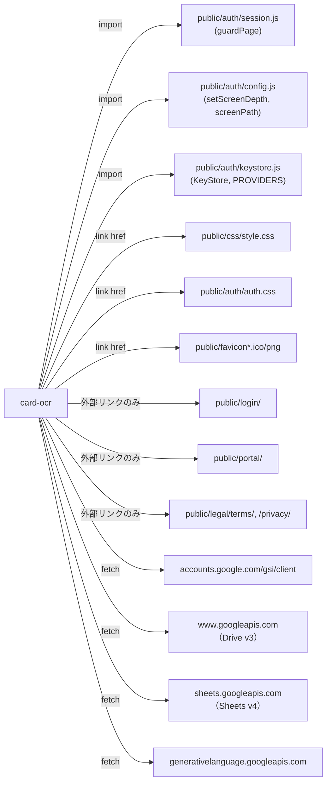

# 名刺OCR・データ登録アプリ（card-ocr）組み込みガイド

対応する詳細設計書: [03_detailed-design.md](./03_detailed-design.md)。既存仕様書 [meishi-ocr-requirements-v3.md](../../specs/meishi-ocr-requirements-v3.md) を正とする。本書は「このリポジトリを知らないが、アプリを自分のプロダクトへ移植したい開発者」を想定して書く。

## 1. 移植の前提条件

- 受け入れ側も**静的ホスティング＋ブラウザ完結**の構成を取れること。本アプリはサーバーコードを一切持たず、Google API（Drive/Sheets/Gemini）とすべてブラウザから直接通信する。サーバーサイドの仲介を追加したい場合は、この設計そのものを見直す必要がある。
- 受け入れ側に、次の2つの仕組みが（同等のものとして）用意できること。無ければ §3 の切り離しポイントとして自前実装に差し替える。
  1. ログインセッションを検証してから描画する「画面ガード」（本リポジトリでは `guardPage()`）
  2. 利用者のAPIキーをブラウザの `localStorage` に保存・取得する「キーストア」（本リポジトリでは `KeyStore`）
- Google Cloud プロジェクトを独自に用意でき、OAuthクライアントID発行・Drive/Sheets API有効化・OAuth同意画面の設定ができる管理者権限があること。
- Gemini APIキー（利用者ごと、無料枠でも可）を利用者自身が用意する運用を受け入れられること。当社サーバーを経由しないため、キー管理・課金は利用者の責任になる。

## 2. 依存関係マップ

このアプリが実際に結合している先。



Portalのアプリ一覧（`public/portal/app-registry.js`）への登録は、本書執筆時点で未実施（[01_requirements.md](./01_requirements.md) §5 FR-25）。したがって現状は**Portalからの依存は無く**、直接URLとリンクのみで到達する構成になっている。

## 3. 切り離しポイント

自分のプロダクトへ持ち出すときに差し替える必要がある箇所。

| 箇所 | 現在の実装 | 差し替え方針 |
| --- | --- | --- |
| ログイン確認 | `guardPage()`（`public/auth/session.js`。TSAM AI独自のApps Scriptセッション検証） | 自プロダクトの認証システムに合わせて、同じ関数シグネチャ（利用者オブジェクト or `null` を返す非同期関数）で差し替える。`app.js`・`help/help.js` の呼び出し口は1箇所ずつ |
| APIキー保存 | `KeyStore`（`localStorage` ベース、Portalと同一オリジン前提） | 自プロダクトの設定保存機構に差し替える。`app.js` は `KeyStore.has()`／`KeyStore.get()` の2メソッドしか使っていない |
| OAuthクライアントID | `config.js` の `GOOGLE_CLIENT_ID`（`card-mail` と共用） | **独自に新規発行すること。** 他アプリとクライアントIDを共用する必要は通常無く、本リポジトリでの共用は「同じ台帳を別アプリが読む」という特殊事情による例外である（§5） |
| CSPの許可ホスト | `index.html`・`help/index.html`・`measure/index.html` の `<meta http-equiv="Content-Security-Policy">` に個別記載 | 自分のオリジンとGoogle 3系統・GIS配信元に置き換える。`next.config.ts` 相当の一括設定を使わずmeta方式にしている理由は既存コメントを参照（他の静的ページを巻き込まないため） |
| 保存構造名 | `config.js` の `ROOT_FOLDER_NAME`/`APP_FOLDER_NAME`/`SPREADSHEET_NAME` | 自プロダクトのブランド名に合わせて変更可能。**変更すると既存利用者の旧フォルダとは別物になる**（再作成扱い）ため、公開後の変更は非推奨 |
| リンク先パス | `href="../../login/"`／`href="../../portal/"`／`href="../../legal/terms/"` 等の相対パス | 自プロダクトのディレクトリ階層に合わせて `setScreenDepth()` の値とリンク先を調整する |
| Portal掲載 | 未実装（§2） | 自プロダクトのアプリ一覧UIがあれば、そこへの登録処理を新設する |

## 4. 必要な外部サービスと設定作業の概要

1. **Google Cloud プロジェクト**を用意し、Drive API・Sheets APIを有効化する。
2. **OAuthクライアントID**（ウェブアプリケーション種別）を新規発行する。
   - 承認済みJavaScript生成元に配信オリジンを登録する。
   - リダイレクトURIは空のままでよい（GISのトークンモデルはリダイレクトを使わない）。
   - クライアントシークレットは使わない・発行不要（静的サイトに置けないため）。
3. **OAuth同意画面**をユーザータイプ「外部」で設定し、要求スコープを `https://www.googleapis.com/auth/drive.file` のみにする。公開ステータスを「本番」にする際は審査手続きの要否を確認する（本リポジトリでもこの切り替え自体は未確定のまま運用を開始している。[01_requirements.md](./01_requirements.md) §9）。
4. **Gemini APIキー**は当社側で用意せず、利用者自身に発行させる運用とする（無料枠可）。自プロダクトのキー保存機構（§3のKeyStore相当）へ保存させる導線を用意する。
5. Cloud プロジェクト単位のDrive/Sheets APIクォータは全利用者で共有される。想定利用者数に対して足りるかを事前に確認する（本リポジトリでの実測値は既存仕様書 §13.1、[card-ocr-phase0-plan.md](../../specs/card-ocr-phase0-plan.md) §4-3を参照。値そのものは移植先の利用者数次第で変わるため、移植先で必ず測り直すこと）。

## 5. 複製時の注意

本リポジトリの `docs/repository-structure.md` §4 は「本番アプリ間で共通層を作らず複製する」という方針を採っている。他プロダクトへ持ち出す場合も同じ考え方が適用できる。

- **丸ごと複製してよい。** `public/production-app/card-ocr/` の中身（`app.js`を除く純粋関数群: `capture.js`／`extract.js`／`hash.js`／`schema.js`／`sanitize.js`／`merge.js`／`capture-flow.js`／`prerequisites.js`）はDOM・fetchに依存しないか、依存箇所が明確に分離されている。DOM操作は `app.js` に集約されているため、UIフレームワークを変える場合はここだけ書き直せばよい。
- **複製元の欠陥を持ち込まない。** 本アプリ自体が、姉妹アプリ `receipt-ocr` に見つかった7件の不具合（[docs/receipt-ocr-findings-20260804.md](../../receipt-ocr-findings-20260804.md)）を踏まえて実装されている。移植先で同種の実装を新規に書く場合は、少なくとも次を確認すること。
  - GISスクリプトの読み込みに失敗したとき、失敗したPromiseをキャッシュに残さない（再試行できなくなる）
  - Drive の403はレート制限と権限不足を区別し、レート制限ではアクセストークンを破棄しない（401でのみ破棄する）
  - Gemini の400（リクエスト不正）とキー拒否（401/403）を混同しない
  - OAuth同意画面でスコープのチェックを外されたときに検出する（`hasGrantedAllScopes`／付与スコープ文字列の検査）
  - HTTPステータスとサーバー応答本文の要約を必ず画面に添える（内部コードを潰さない）
  - 一時ドキュメントの孤児回収を実装する（削除失敗を握りつぶすだけで終わらせない）
  - multipartのboundaryは内容から決めず、乱数で生成する
- **未実装の機能を「移植済み」と誤認しない。** 本アプリには次が無い（§1・[01_requirements.md](./01_requirements.md) §3.2参照）。移植先で必要なら新規実装が要る。
  - 名刺交換日・場所・担当者・タグの入力とセッション既定値
  - Portalアプリ一覧への掲載
- **既存行の更新を持ち出す場合は、順序と行の特定方法をそのまま守ること**（2026-08-18 実装）。
  - 行は必ず `record_id` で引き直してから書く。画面に出した時点の行番号を握ったまま書くと、利用者が別タブで行を消したときに**別人の行を上書きする**
  - 台帳を書いてから変更履歴を書く。逆順だと、書き換えに失敗したときに嘘の履歴だけが残る
  - 既存値の読み取りは `valueRenderOption=FORMULA` で行う。表示結果で読むと画像リンク列が毎回「変更あり」になる
  - 更新の範囲は列定義の幅ちょうどにする。`A:Z` のように広く取ると利用者が右へ足した列を消す
- **測定用の `measure/` は持ち出さない。** 本番モジュールを直接importする開発者向けツールであり、エンドユーザー向け機能ではない。
- **OAuthクライアントIDの共用は原則しない。** 本リポジトリでは `card-mail` と意図的に共用しているが、これは「同じ台帳を別アプリが読む」ための例外であり、通常は移植先ごとに独自のクライアントIDを発行する（§3）。

## 6. 最小組み込み手順

```text
1. Google Cloud プロジェクトを用意し、Drive API・Sheets API を有効化する
2. OAuthクライアントID（ウェブアプリケーション種別）を発行し、
   配信オリジンを承認済みJavaScript生成元へ登録する
3. public/production-app/card-ocr/ 配下を丸ごと複製する
4. config.js を編集する
   - GOOGLE_CLIENT_ID を新規発行したIDへ差し替える
   - 保存構造名（ROOT_FOLDER_NAME 等）を自プロダクトのブランドに合わせる
   - Geminiモデル名・出力上限は必要に応じて見直す（値そのものは秘密ではない）
5. 自プロダクトの認証・キー保存機構に合わせて、app.js / help.js の
   guardPage() / KeyStore 呼び出し箇所を差し替える
6. index.html・help/index.html の CSP（<meta>）を、自分のオリジンと
   Google 3系統・GIS配信元に合わせて書き換える
7. auth.css・style.css 等の共通スタイルへの参照を、自プロダクトの
   アセットパスへ差し替える（相対パスの階層に注意）
8. OAuth同意画面を設定し、要求スコープを drive.file のみにする
9. テスト（tests/unit/card-ocr.mjs 相当）を移植し、fetch をスタブして
   実APIへ通信しない状態で一通り実行する
10. 検証用オリジン（ローカル／プレビュー環境）を承認済みJavaScript生成元へ
    追加し、OAuth同意フロー・保存構造の作成・Drive OCR・Gemini分類・
    台帳への保存までを実機で確認する
11. 本番公開前に、OAuth同意画面の公開ステータスを「本番」へ切り替え、
    審査の要否を確認する
```

## 7. 変更履歴

| 版 | 日付 | 内容 |
| --- | --- | --- |
| 1.0 | 2026-08-18 | 初版 |
| 1.1 | 2026-08-18 | 既存行の更新・変更履歴記録の実装に追随。§5 の「未実装の機能」から当該項目を外し、移植時に守るべき順序・行の特定方法を追記 |
