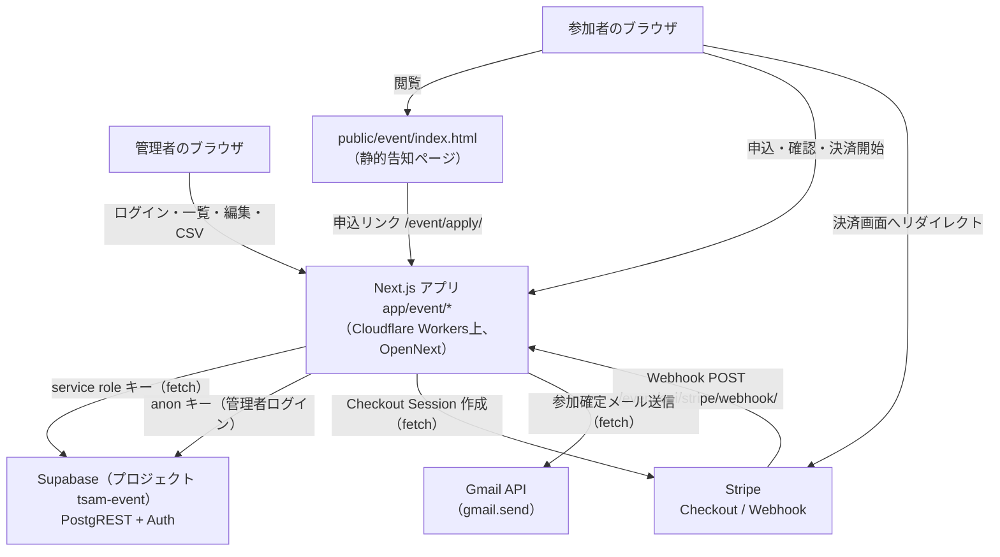
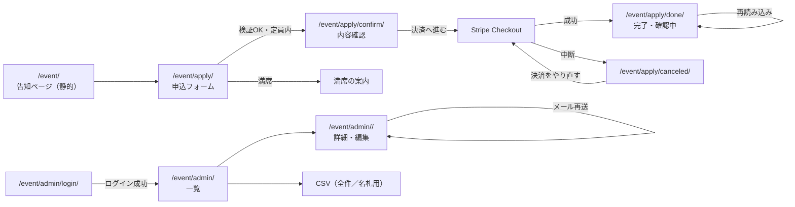

# 交流会申込アプリ 基本設計書

前提: [01_requirements.md](./01_requirements.md) の FR-nn / NFR-nn を参照する。

## 1. システム構成

静的告知ページ（`public/event/index.html`）とNext.jsアプリは別々の配信経路。開催日時の具体的な
表示は申込フォーム（`/event/apply/`）に一本化しており、告知ページには載せない
（[01_requirements.md](./01_requirements.md) §7）。告知ページが `/event/api/schedule/` を叩くのは
受付状態バッジ・申込ボタンの有効/無効を決めるためだけ。

## 2. コンポーネント一覧と責務

| コンポーネント | パス | 責務 |
| --- | --- | --- |
| 告知ページ | `public/event/index.html` + `public/event/script.js` | 開催概要の表示（開催日時は掲載しない）、`/event/api/schedule/` の取得結果（取得不可時は `data-event-status`）による受付中/満席/準備中/終了の切替、申込ページへの導線 |
| 申込フロー | `app/event/apply/*` | フォーム表示・確認画面・Checkout Session作成・決済結果表示 |
| Webhook受け口 | `app/event/api/stripe/webhook/route.ts` | 署名検証、`handleStripeEvent()` の呼び出し |
| 管理画面 | `app/event/admin/*` | ログイン、一覧・詳細表示、申込者情報編集（譲渡）、メール再送、CSV出力 |
| 参加費計算 | `lib/event/pricing.mjs` | 割引定数と参加費計算（副作用なし） |
| 入力検証 | `lib/event/application-input.mjs` | フォーム入力のサーバー側検証・正規化 |
| DBアクセス | `lib/event/db.mjs` | Supabase PostgREST への全アクセス（service role専用） |
| 定員判定 | `lib/event/capacity.mjs` | 満席判定、管理画面向け定員状態の算出 |
| Stripe連携 | `lib/event/stripe.mjs` | Checkout Sessionパラメータの組み立てと作成 |
| Webhook処理 | `lib/event/webhook-handler.mjs` | 検証済みイベントの状態遷移・受付番号発行・メール送信の指示 |
| Webhook署名検証 | `lib/event/webhook-signature.mjs` | HMAC-SHA256 署名検証、イベントのパース |
| 管理者認証 | `lib/event/admin-auth.mjs` + `lib/event/admin-session.ts` | Supabase Auth 呼び出しと httpOnly Cookie セッション |
| メール文面 | `lib/event/mail/confirmation.mjs` | 参加確定メールの件名・本文組み立て |
| メール送信 | `lib/event/mail/gmail.mjs` | Gmail API 呼び出し（OAuthトークン取得＋送信） |
| 管理画面表示整形 | `lib/event/admin-view.mjs` | 一覧・詳細・CSVで共通の行整形 |
| CSV組み立て | `lib/event/csv.mjs` | BOM付きCRLF・数式インジェクション対策 |
| 決済結果判定 | `lib/event/payment-result.mjs` | 完了/確認中/失敗/期限切れ/返金済み/不明の判定 |
| 環境変数 | `lib/event/config.mjs` | 環境変数の一元読み取り（BOM・空白除去、未設定時は使用時に例外） |
| DBスキーマ | `supabase/migrations/*.sql` | テーブル・型・制約・トリガー・RLS・受付番号発行関数 |

## 3. 外部インターフェース一覧

| 連携先 | 通信方式 | 用途 | 実装 |
| --- | --- | --- | --- |
| Stripe REST API | `fetch`（`application/x-www-form-urlencoded`） | Checkout Session 作成 | `lib/event/stripe.mjs` |
| Stripe Webhook | HTTP POST受信、`Stripe-Signature` ヘッダー検証 | 決済結果通知 | `app/event/api/stripe/webhook/route.ts` |
| Supabase PostgREST | `fetch`（`/rest/v1/...`） | 申込・支払・Webhookイベント・メールログのCRUD、件数取得（HEAD + `Content-Range`） | `lib/event/db.mjs` |
| Supabase Auth REST | `fetch`（`/auth/v1/...`） | 管理者ログイン・トークン更新・有効性確認・ログアウト | `lib/event/admin-auth.mjs` |
| Gmail API | `fetch`（OAuth token endpoint + `messages.send`） | 参加確定メール送信 | `lib/event/mail/gmail.mjs` |

いずれも外部SDKを追加せず `fetch` で直接呼び出す（[01_requirements.md](./01_requirements.md) NFR-13）。

## 4. データ設計概要

保存先は Supabase（PostgreSQL、プロジェクト `tsam-event`）。主要エンティティは次のとおり
（詳細は [03_detailed-design.md](./03_detailed-design.md) §3、および [docs/event-app-database.md](../../event-app-database.md)）。

| テーブル | 役割 |
| --- | --- |
| `events` | 開催情報（日時・会場・定員・受付期間・公開状態・ポリシー版） |
| `applications` | 申込1件（属性・同意記録・ステータス・受付番号・譲渡履歴） |
| `payments` | 支払1件（割引内訳のスナップショット・Stripe ID・支払状態） |
| `webhook_events` | 受信済みStripeイベントの記録（冪等性の担保） |
| `email_logs` | 送信したメールの結果記録 |

割引ルールはDBに持たず、`lib/event/pricing.mjs` のコード内定数として管理する
（[docs/event-app-database.md](../../event-app-database.md) §3「割引ルールはDBに持たない」）。

## 5. 画面一覧と画面遷移

| 画面 | URL | 認証 |
| --- | --- | --- |
| 告知ページ | `/event/` | 不要（静的HTML） |
| 申込フォーム | `/event/apply/` | 不要 |
| 申込内容確認 | `/event/apply/confirm/?id=<申込ID>` | 不要 |
| 決済完了・状況確認 | `/event/apply/done/?session_id=...` または `?id=...` | 不要 |
| 決済キャンセル・中断 | `/event/apply/canceled/?id=<申込ID>` | 不要 |
| 管理: ログイン | `/event/admin/login/` | 不要（ログイン前提） |
| 管理: 申込者一覧 | `/event/admin/` | 必要 |
| 管理: 申込者詳細 | `/event/admin/<申込ID>/` | 必要 |
| 管理: 申込者CSV | `/event/admin/csv/applications/` | 必要（401） |
| 管理: 名札印刷用CSV | `/event/admin/csv/nametags/` | 必要（401） |

満席時（FR-14）は申込フォームの表示自体をサーバーコンポーネントが差し替える。フォーム送信時
（`submitApplication`）と決済開始直前（`startCheckout`）でも同じ判定を行い、いずれかを
すり抜けた経路（開いたままのタブ、URL直打ち、フォーム再送）を最終防波堤として塞ぐ。

## 6. 認証・認可方式

- **参加者側は認証を行わない。** 申込の作成・更新は Next.js のサーバーアクション／サーバーコンポーネントが
  service role キーでSupabaseへ書き込む。ブラウザからSupabaseへ直接アクセスする経路は無い。
- **管理者側は Supabase Auth（メール + パスワード）。** このSupabaseプロジェクトに登録された利用者を
  そのまま「管理者」とみなす設計であり、一般申込者用の認証機構は別に持たない
  （[docs/event-admin.md](../../event-admin.md) §1）。新規登録はSupabase側の設定で無効化して運用する。
- アクセストークン・リフレッシュトークンは httpOnly Cookie（`tsam-event-admin`、path `/event/admin`）に
  保持し、ブラウザのJavaScriptからは読めない。
- 認可判定はページ表示のたびに `getUser()` でSupabaseへ問い合わせて行う。有効期限の見た目だけで
  通すと、管理者アカウント削除直後にも入れてしまうため（FR-18）。
- CSVエンドポイント（Route Handler）は `currentAdmin()` の結果が `null` なら401を返す。ページ遷移を
  伴わないため `redirect()` は使わない。

## 7. エラー処理方針

| 場面 | 方針 |
| --- | --- |
| 申込フォームの入力エラー | サーバーアクションが `errors` オブジェクトを返し、同じ画面にフィールドごとのメッセージを再表示する（`role="alert"`） |
| 受付期間外・定員到達 | `errors.form` に文言を入れて申込フォームへ留める。Stripeへは到達させない |
| Stripe Checkout Session 作成失敗 | 例外をそのまま投げる（Next.jsのエラーバウンダリに委ねる）。金額・キーを含む詳細はログのみ |
| Webhook 署名検証失敗 | 400を返し、Stripeに再送させない（送信元が正しくないため） |
| Webhook 処理失敗（DB等の一時的エラー） | 500を返し、Stripeの自動再送に委ねる。`webhook_events` には処理済みの印を付けない |
| Webhook 二重受信 | `stripe_event_id` の一意制約違反を検知し、何もせず処理済み扱いで終える |
| 参加確定メール送信失敗 | 例外を握りつぶし、`email_logs` に失敗理由を記録する。支払・受付番号の確定処理は巻き戻さない。管理画面から再送できる |
| 決済結果ページの不確定状態 | 「支払済みと言い切れない」場合は常に「確認中」を出し、確定表示は `status='paid'` かつ受付番号発行済みのときのみ行う |
| 管理者ログイン失敗 | 資格情報エラーと設定不備エラーを区別し、資格情報エラーのみ「メールアドレスまたはパスワードが正しくありません」を返す。設定不備は詳細をログにのみ残す |

## 8. 運用・デプロイ構成

- 配信は Cloudflare Workers（OpenNext）。`npm run deploy`（`opennextjs-cloudflare build && opennextjs-cloudflare deploy`）による**手動デプロイ**で、`main` への push では自動デプロイされない。
- 同一 Next.js アプリ内で、`/`・`/apps/`・`/legal/` 等は `public/` 配下の静的HTMLとして配信され、`/event/` も静的HTML（`public/event/index.html`）のまま。`/event/apply/` 以降・`/event/admin/`・`/event/api/` のみがこのアプリ（`app/event/`）のルートとして動く。
- `next.config.ts` は `basePath` を使わず、`rewrites().fallback` で `public/` 配下への書き換えを行う。`afterFiles` にすると Route Handler より先に評価され `/event/api/...` が404になるため、意図的に `fallback` にしてある。
- `trailingSlash: true` のため、Stripe の Webhook エンドポイントは末尾スラッシュ付きで登録する必要がある。
- DBスキーマは Supabase CLI（`supabase db push`）で管理し、ダッシュボードのSQL Editorは使わない（適用履歴を残すため）。適用済みマイグレーションは編集せず、変更は新規マイグレーションで行う。

## 9. 主要な設計判断と採らなかった選択肢

- **外部SDK（`stripe` / `@supabase/supabase-js` / `googleapis` 等）を使わず `fetch` で直接REST APIを呼ぶ。**
  `package.json` の dependencies を `next` / `react` / `react-dom` のみに保ち、依存追加の審査コストと
  バンドルサイズを避けるため（[CLAUDE.md](../../../CLAUDE.md) 「交流会申込アプリ」節）。
- **割引ルールをDBのルールエンジンにせず、コード内定数（`pricing.mjs`）に持つ。**
  フェーズ1では変更頻度が低く、DBにルールエンジンを作る複雑さに見合わないと判断した。
  申込ごとの内訳は `payments` の列にスナップショットとして保存し、後から定数を変えても
  過去の記録が変わらないようにしている（[docs/event-app-database.md](../../event-app-database.md) §3）。
- **告知ページ（`public/event/index.html`）をNext.js化せず静的HTMLのまま残す。**
  開催日時の具体的な表示は申込フォームに一本化し、告知ページ側には持たせないことで
  二重管理を避けている（[01_requirements.md](./01_requirements.md) §7）。受付状態（バッジ・
  申込ボタンの有効/無効）は `/event/api/schedule/` の取得結果から自動で決め、`data-event-status`
  は取得できなかったときだけ使うフォールバックにとどめている
  （[docs/event-admin.md](../../event-admin.md) §3）。
- **受付番号の発行をDB関数（`assign_receipt_number`）に閉じ込め、イベント行のロックで直列化する。**
  アプリ側で「現在の最大値+1」を計算してから書き込む方式だと、Webhookが同時に複数届いた場合に
  同じ番号を2件へ振ってしまうため。
- **定員判定は「支払済み（`status='paid'`）」だけを数え、決済待ち（`awaiting`）を席に含めない。**
  非同期決済（PayPay等）の確定を待つ間に定員をわずかに超える可能性を許容し、超過は管理画面の
  警告と手動返金で解消する運用にした（[docs/event-app-database.md](../../event-app-database.md) §5）。
  厳密な即時ロックにしないことで、決済フローを待たせない選択をしている。
- **`capacity` に 0 や負数を許容せず「定員なし」に倒す。**
  `capacity = 0` で受付を閉じられるようにすると、設定ミス（未入力のつもりが0になる等）で
  受付が丸ごと止まり、しかも原因に気づきにくい。受付を閉じたい場合は `apply_end_at` を使う設計にした。
- **申込フォームの選択肢の並び順を、割引額の大小順にしない。**
  業種・職種のまとまりで並べ、割引の意図が透けて見えないようにしている（`app/event/apply/ApplyForm.tsx`）。
- **管理画面からの返金機能を持たない。**
  返金はStripeダッシュボードでの手動操作とし、アプリは `charge.refunded` Webhookを受けて状態を
  追随させるだけにとどめた（フェーズ2で検討、[docs/event-admin.md](../../event-admin.md) §3）。
