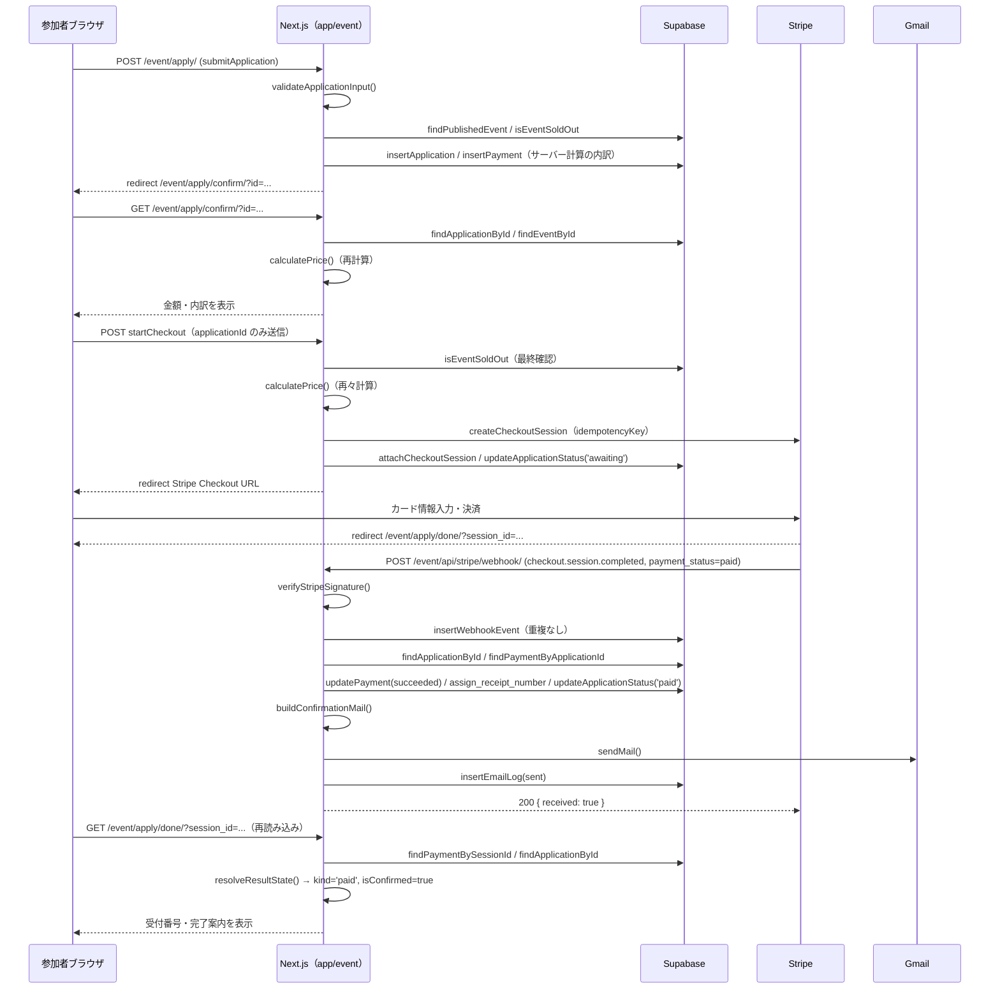
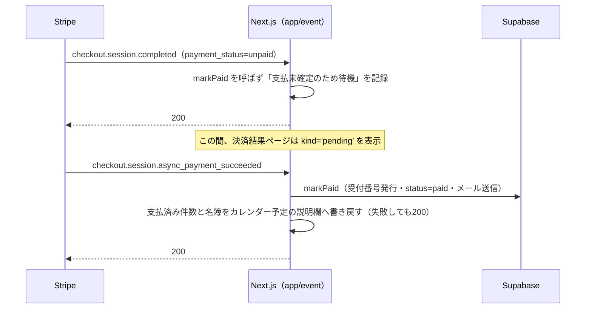
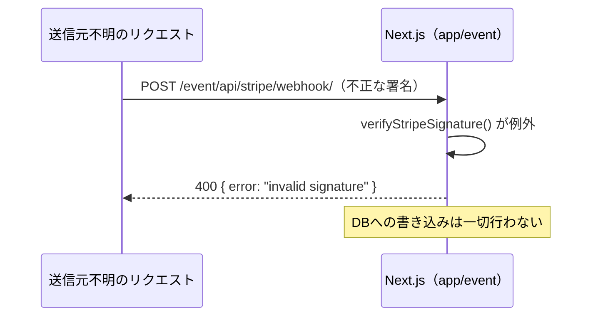
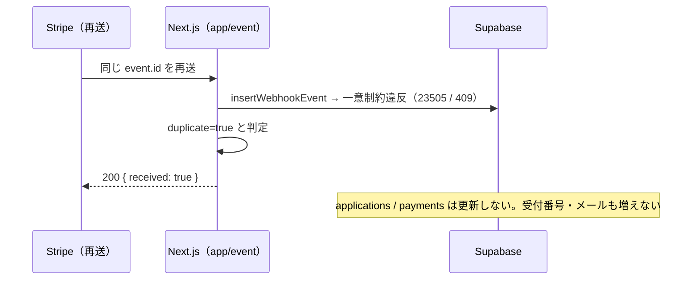
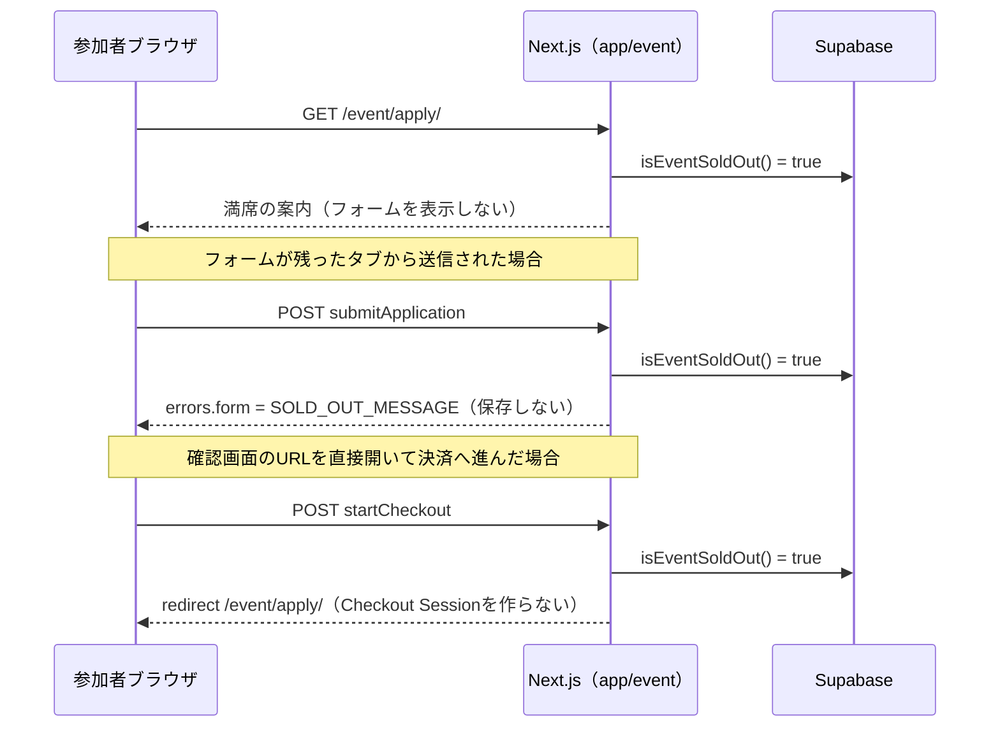
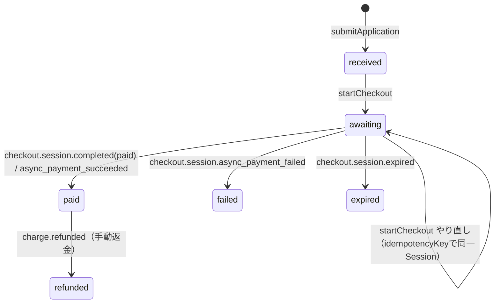

# 交流会申込アプリ 詳細設計書

前提: [01_requirements.md](./01_requirements.md)・[02_basic-design.md](./02_basic-design.md) を参照する。

## 1. ファイル・モジュール構成

### `app/event/`（画面・ルート）

| パス | 責務 |
| --- | --- |
| `layout.tsx` | `/event/` 配下共通の枠（ヘッダー・フッター・共通CSS読込） |
| `apply/layout.tsx` | 申込フロー（`apply/` 以降）限定のテーマCSS適用 |
| `apply/page.tsx` | 申込フォームページ（満席時は案内へ差し替え） |
| `apply/ApplyForm.tsx` | 申込フォームのクライアントコンポーネント |
| `apply/actions.ts` | `submitApplication()`（申込保存）、`startCheckout()`（Checkout Session作成） |
| `apply/confirm/page.tsx` | 申込内容確認ページ（金額はDBから再計算） |
| `apply/done/page.tsx` | 決済完了・状況確認ページ |
| `apply/canceled/page.tsx` | 決済キャンセル・中断ページ |
| `api/stripe/webhook/route.ts` | Stripe Webhook 受け口（署名検証 → `handleStripeEvent()`） |
| `admin/layout.tsx` | 管理画面共通の枠（`robots: noindex`） |
| `admin/page.tsx` | 申込者一覧 |
| `admin/[id]/page.tsx` | 申込者詳細 |
| `admin/[id]/ApplicationEditor.tsx` | 申込者情報編集フォーム（クライアントコンポーネント） |
| `admin/actions.ts` | `login()` / `logout()` / `updateApplication()` / `resendConfirmationMail()` |
| `admin/login/page.tsx` / `LoginForm.tsx` | 管理者ログイン画面 |
| `admin/csv/applications/route.ts` | 申込者CSV（全件）のRoute Handler |
| `admin/csv/nametags/route.ts` | 名札印刷用CSV（支払済みのみ）のRoute Handler |

### `lib/event/`（ビジネスロジック、`.mjs` + 手書き `.d.mts`）

| パス | 責務 |
| --- | --- |
| `config.mjs` / `config.d.mts` | 環境変数の一元読み取り |
| `pricing.mjs` / `.d.mts` | 参加費計算、内訳表示行の組み立て |
| `application-input.mjs` / `.d.mts` | 申込フォーム入力の検証・正規化 |
| `capacity.mjs` / `.d.mts` | 定員判定 |
| `db.mjs` / `.d.mts` | Supabase PostgREST アクセス全般 |
| `stripe.mjs` / `.d.mts` | Checkout Session パラメータ組み立て・作成 |
| `webhook-signature.mjs` / `.d.mts` | Webhook署名検証・イベントパース |
| `webhook-handler.mjs` / `.d.mts` | 検証済みイベントの処理（状態遷移・受付番号・メール・カレンダーへの人数の書き戻し指示） |
| `calendar-sync.mjs` / `.d.mts` | Googleカレンダーからの開催回の取り込み（読み取り専用） |
| `calendar-note.mjs` / `.d.mts` | 支払済み人数と名簿をカレンダー予定の説明欄へ書き戻す（FR-27／説明文の組み立ては純粋関数、件数・名簿の取得と失敗の握りつぶしは `updateAttendeeNote()`） |
| `payment-result.mjs` / `.d.mts` | 決済結果ページの表示状態判定 |
| `admin-auth.mjs` / `.d.mts` | Supabase Auth 呼び出し（ログイン・更新・検証・ログアウト） |
| `admin-session.ts` | 管理者セッションの Cookie 読み書き（TypeScript。Next.jsの `cookies()`/`redirect()` に依存するため `.mjs` ではなくここのみ `.ts`） |
| `admin-view.mjs` / `.d.mts` | 一覧・詳細・CSV共通の行整形、ステータスラベル |
| `csv.mjs` / `.d.mts` | CSV組み立て（BOM・CRLF・数式インジェクション対策） |
| `mail/confirmation.mjs` / `.d.mts` | 参加確定メールの件名・本文組み立て |
| `mail/gmail.mjs` / `.d.mts` | Gmail API 呼び出し（トークン取得・RFC5322組み立て・送信） |

### `supabase/migrations/`

| ファイル | 内容 |
| --- | --- |
| `20260731000000_event_app_init.sql` | テーブル・型・制約・トリガー・RLS作成 |
| `20260731000100_seed_first_event.sql` | 初回イベントの登録 |
| `20260731000200_grant_service_role.sql` | `service_role` への権限付与、`anon`/`authenticated` からの剥奪 |
| `20260731000300_receipt_number.sql` | 受付番号発行関数 `assign_receipt_number` |
| `20260731000400_event_end_at.sql` | `events.event_end_at` 列の追加 |
| `20260806000000_event_capacity.sql` | 初回イベントの `capacity` を30に設定 |

## 2. 主要処理フロー

### 2.1 正常系（カード決済、その場で確定）

### 2.2 非同期決済（PayPay想定）

### 2.3 異常系: Webhook署名検証失敗

### 2.4 異常系: Webhookの二重受信

### 2.5 異常系: 定員到達時の申込

## 3. データモデル詳細

スキーマの正は `supabase/migrations/*.sql`。ここでは各表の要点のみ記す（全列は
[docs/event-app-database.md](../../event-app-database.md) およびマイグレーションファイルを参照）。

### `events`

| 列 | 型 | 備考 |
| --- | --- | --- |
| `id` | uuid PK | |
| `name` / `description` / `venue` | text | |
| `event_date` / `event_end_at` | timestamptz | 開始・終了（終了は任意、開始より後である制約あり） |
| `capacity` | integer, null可 | null=定員なし。0・負数・小数はアプリ側判定で定員なし扱い |
| `base_price` / `min_price` | integer | 表示・検証用（実際の計算は `pricing.mjs`） |
| `apply_start_at` / `apply_end_at` | timestamptz | 受付期間（`apply_end_at > apply_start_at` 制約） |
| `is_published` | boolean | 申込フォームに出す対象イベントの判定に使用 |
| `policy_version` | text | 申込時点で同意した版として `applications` にコピーされる |

### `applications`

| 列 | 型 | 備考 |
| --- | --- | --- |
| `id` | uuid PK | |
| `event_id` | uuid FK → events | `on delete restrict` |
| `receipt_number` | text, null可 | `unique (event_id, receipt_number)`。支払済みで発行 |
| `name` / `name_kana` / `email` / `phone` / `company` / `department` / `job_title` | text | 部署・役職は任意 |
| `industry` / `occupation` / `position` | text | 選択肢の妥当性はアプリ側で検証（列挙型にしない） |
| `age_group` | enum `age_group`（`'18-23'` \| `'24+'`） | |
| `is_banned_declared` | boolean | true で55,000円固定 |
| `status` | enum `application_status`（`received`/`awaiting`/`paid`/`failed`/`expired`/`refunded`） | |
| `agreed_at` / `policy_version` | timestamptz / text | 同意時刻とポリシー版 |
| `is_transferred` / `transferred_at` / `original_name` / `original_email` | | 譲渡履歴。制約 `applications_transfer_record` で整合を担保 |
| `admin_memo` | text | |

制約: `applications_industry_other` / `applications_occupation_other`（「その他」選択時のみ自由記述必須）。

### `payments`

| 列 | 型 | 備考 |
| --- | --- | --- |
| `id` | uuid PK | |
| `application_id` | uuid FK → applications | |
| `base_price` / `discount_industry` / `discount_occupation` / `discount_position` / `discount_age` / `discount_total` / `final_price` | integer | 申込時点のスナップショット |
| `currency` | text | `'jpy'` 固定（制約） |
| `stripe_checkout_session_id` | text, unique | 申込ごとに1Session |
| `stripe_payment_intent_id` | text | Webhookから設定 |
| `payment_status` | enum `payment_status`（`pending`/`succeeded`/`failed`/`expired`/`refunded`） | |
| `paid_at` / `refunded_amount` / `refunded_at` | | |

制約: `payments_discount_total`（内訳の合計＝割引合計）、`payments_amounts_non_negative`。

### `webhook_events`

| 列 | 型 | 備考 |
| --- | --- | --- |
| `stripe_event_id` | text, unique | 冪等性の担保 |
| `event_type` | text | |
| `processed` | boolean | |
| `result` | text | 処理結果の要約（500文字に切り詰め） |

### `email_logs`

| 列 | 型 | 備考 |
| --- | --- | --- |
| `application_id` | uuid FK | |
| `mail_type` | text | `confirmation` / `confirmation_resend` |
| `status` | text | `sent` / `skipped:...` / `failed:...` |

### DB関数

| 関数 | 役割 |
| --- | --- |
| `assign_receipt_number(p_application_id uuid) returns text` | イベント行を `for update` でロックし、既存の最大番号+1を `TSAM-0001` 形式で発行。発行済みなら既存値を返す。`security definer`、`service_role` にのみ実行権限 |
| `set_updated_at()` | `events` / `applications` / `payments` の更新時トリガーで `updated_at` を更新 |

### RLS / 権限

全表で RLS を有効化し、ポリシーは作らない。`service_role` にのみ `select/insert/update/delete` を付与し、
`anon` / `authenticated` からは権限を明示的に剥奪する（[02_basic-design.md](./02_basic-design.md) §6）。

## 4. インターフェース仕様

### サーバーアクション（`app/event/apply/actions.ts`）

| 関数 | 入力 | 出力・遷移 |
| --- | --- | --- |
| `submitApplication(state, formData)` | フォーム全項目（文字列） | 成功時 `redirect('/event/apply/confirm/?id=...')`。失敗時 `{ errors, values }` を返しフォーム再表示 |
| `startCheckout(formData)` | `applicationId` のみ | 成功時 Stripe Checkout URL へ `redirect`。申込・イベント不在や満席時は `/event/apply/` へ `redirect` |

### サーバーアクション（`app/event/admin/actions.ts`）

| 関数 | 入力 | 出力 |
| --- | --- | --- |
| `login(state, formData)` | `email` / `password` | 成功時 `/event/admin/` へ `redirect`。失敗時 `{ error }` |
| `logout()` | なし | Supabaseセッション失効＋Cookie削除、`/event/admin/login/` へ `redirect` |
| `updateApplication(state, formData)` | `applicationId` / 編集項目 / `isTransfer` | `{ error, message }` |
| `resendConfirmationMail(state, formData)` | `applicationId` | `{ error, message }`。受付番号未発行時はエラー |

### Route Handler

| エンドポイント | メソッド | 認証 | 応答 |
| --- | --- | --- | --- |
| `/event/api/stripe/webhook/` | POST | Stripe署名（`STRIPE_WEBHOOK_SECRET`） | 200 `{ received: true }` / 400（署名不正）/ 500（処理失敗）/ 500（`STRIPE_WEBHOOK_SECRET`未設定） |
| `/event/admin/csv/applications/` | GET | 管理者Cookie | 200 `text/csv`（BOM付きCRLF）/ 401 |
| `/event/admin/csv/nametags/` | GET | 管理者Cookie | 200 `text/csv`（BOM付きCRLF、支払済みのみ）/ 401 |

### 主要関数の入出力（`lib/event/`）

| 関数 | シグネチャ概要 | 備考 |
| --- | --- | --- |
| `calculatePrice({ industry, occupation, position, ageGroup, isBannedDeclared })` | → `{ basePrice, discountIndustry, discountOccupation, discountPosition, discountAge, discountTotal, finalPrice, isBannedDeclared, isMinPriceApplied }` | 未知の選択肢キーは例外（`TypeError`） |
| `validateApplicationInput(raw)` | → `{ ok, errors, value }` | 検証失敗時 `value` は `null` |
| `isSoldOut({ capacity, paidCount })` | → `boolean` | `capacity` が0/負数/小数/null/undefinedなら `false` |
| `createCheckoutSession({ secretKey, eventName, amount, email, applicationId, eventId, successUrl, cancelUrl, idempotencyKey })` | → `{ id, url }` | `amount` が正の整数でないと例外 |
| `verifyStripeSignature({ payload, header, secret, toleranceSeconds?, nowSeconds? })` | → `true`（不一致・期限超過は例外） | |
| `handleStripeEvent({ event, config, db, mailer })` | → `{ handled, duplicate, result }` | `db` / `mailer` は差し替え可能な依存として注入 |
| `resolveResultState({ application, payment })` | → `{ kind, receiptNumber, isConfirmed, canRetry }` | `kind` は `payment-result.mjs` の `RESULT_KINDS` |

## 5. 状態管理・セッション設計

### `applications.status` の遷移

`received` から直接 `paid` にはならない（`startCheckout` を経由して必ず `awaiting` を通る）。
`failed` / `expired` からは `startCheckout` の再実行で `awaiting` に戻れる（`canRetry: true`）。

### 管理者セッション

- 保存形態: httpOnly Cookie `tsam-event-admin`（JSON文字列。`accessToken` / `refreshToken` / `expiresAt` / `email`）。
- Cookie属性: `httpOnly: true`、`sameSite: "lax"`、`path: "/event/admin"`、`secure`は本番のみ、`maxAge` 14日。
- 有効性確認: `currentAdmin()` が呼ばれるたびに、期限が60秒以内に迫っていれば `refreshSession()` で取り直し、
  そのうえで `getUser()` により Supabase 側の現在の有効性を確認する。無効なら Cookie を削除し `null` を返す。
- `requireAdmin()` は `currentAdmin()` が `null` の場合に `/event/admin/login/` へ `redirect` する。

### 申込フローの「状態」の持ち方

サーバー側はセッションを持たず、申込の識別は URL クエリの `id`（申込UUID）または
Stripe の `session_id` で行う。改ざん耐性は「金額を含まない」ことと、金額を常にDBから
再計算する設計で担保している（値そのものの署名やトークン化は行っていない）。

## 6. エラーハンドリング詳細

| 箇所 | 例外・異常系 | 挙動 |
| --- | --- | --- |
| `pricing.mjs` `discountOf()` | 未知の選択肢キー | `TypeError` を送出（0円に丸めない） |
| `application-input.mjs` | 制御文字・不正な形式・同意未チェック | `errors` オブジェクトにフィールド別メッセージ |
| `db.mjs` `request()` | PostgRESTがエラー応答 | `Error`（メッセージにHTTPステータスとPostgRESTのメッセージのみ。キーは含めない） |
| `db.mjs` `insertWebhookEvent()` | 一意制約違反（409 または `code: '23505'`） | `{ row: null, duplicate: true }` を返し例外にしない |
| `webhook-signature.mjs` | 署名不一致・時刻許容範囲超過・ヘッダー欠落 | `Error` 送出 → Route Handlerが400を返す |
| `webhook-handler.mjs` `handleStripeEvent()` | 処理中の例外（DB更新失敗等） | `markWebhookProcessed` に失敗理由を記録 → 例外を再送出 → Route Handlerが500を返す |
| `webhook-handler.mjs` `sendConfirmationMail()` | メール送信失敗 | 例外を握りつぶし `email_logs` に `failed:<理由>` を記録。呼び出し元の支払確定処理は継続 |
| `calendar-note.mjs` `updateAttendeeNote()` | カレンダー書き戻しの失敗・未設定・手動登録の回 | 例外を握りつぶし、理由を戻り値の文字列で返す。Webhook 経由は `webhook_events.result` へ、管理画面の編集経由はサーバーログへ記録。支払・受付番号・メール・編集内容は巻き戻さない（NFR-18） |
| `stripe.mjs` `createCheckoutSession()` | Stripe APIエラー応答 | `Error`（Stripeのエラーメッセージのみ。キーは含めない） |
| `mail/gmail.mjs` `getAccessToken()` / `sendMail()` | OAuth・送信の失敗 | `Error`（HTTPステータスのみ。応答本文は資格情報を含みうるため出さない） |
| `admin-auth.mjs` `signInWithPassword()` | 資格情報不一致 | 「メールアドレスまたはパスワードが正しくありません」に統一（存在有無を教えない） |
| `admin-auth.mjs` `signInWithPassword()` | 通信不能・設定不備 | `isConfigurationError: true` を付けて区別し、呼び出し側で利用者向け文言を分ける |
| `config.mjs` `required()` | 環境変数未設定 | 使用時点で `Error(環境変数 <名前> が設定されていません)`。値は出さない |

## 7. 設定値・環境変数一覧

すべて `lib/event/config.mjs` を経由して読む方針だが、**`STRIPE_WEBHOOK_SECRET` のみ
`app/event/api/stripe/webhook/route.ts` が `process.env` を直接参照しており、`config.mjs` の
BOM・空白除去処理を通らない**（詳細は本タスクの乖離報告を参照）。

| 変数名 | 役割 | 経由 |
| --- | --- | --- |
| `SUPABASE_URL` | Supabase プロジェクトURL | `config.mjs`（`supabaseConfig()` / `supabaseAuthConfig()`） |
| `SUPABASE_SERVICE_ROLE_KEY` | 申込・支払等の読み書き用キー（`NEXT_PUBLIC_` を付けない） | `config.mjs`（`supabaseConfig()`） |
| `SUPABASE_ANON_KEY` | 管理者ログイン（Supabase Auth）用キー | `config.mjs`（`supabaseAuthConfig()`） |
| `STRIPE_SECRET_KEY` | Checkout Session作成用シークレットキー | `config.mjs`（`stripeSecretKey()`） |
| `STRIPE_WEBHOOK_SECRET` | Webhook署名検証用シークレット（`whsec_...`） | `route.ts` が `process.env` を直接参照 |
| `NEXT_PUBLIC_BASE_URL` | 決済後のリダイレクトURL組み立ての土台 | `config.mjs`（`baseUrl()`） |
| `GOOGLE_CLIENT_ID` | OAuthクライアントID（Gmail送信とカレンダー連携で共用） | `config.mjs`（`gmailConfig()` / `calendarConfig()` / `calendarWriteConfig()`） |
| `GOOGLE_CLIENT_SECRET` | 同クライアントシークレット | 同上 |
| `GMAIL_REFRESH_TOKEN` | 送信元アカウントのリフレッシュトークン（`gmail.send`） | `config.mjs`（`gmailConfig()`） |
| `MAIL_FROM` | 送信元表示（`表示名 <アドレス>` 形式） | `config.mjs`（`gmailConfig()`） |
| `GOOGLE_CALENDAR_ID` | 開催日の取り込み元カレンダー（主催者の `primary`） | `config.mjs`（`calendarConfig()` / `calendarWriteConfig()`） |
| `GOOGLE_CALENDAR_REFRESH_TOKEN` | 開催日の取り込み用リフレッシュトークン（`calendar.readonly`） | `config.mjs`（`calendarConfig()`） |
| `GOOGLE_CALENDAR_WRITE_REFRESH_TOKEN` | 支払人数の書き戻し用リフレッシュトークン（`calendar.events`、FR-27）。**未設定なら書き戻しだけを見送る**（決済・メールは動く） | `config.mjs`（`calendarWriteConfig()`） |
| `NODE_ENV` | 管理者Cookieの `secure` 属性切替 | `admin-session.ts` が直接参照 |

値そのものはローカル `.env.local` と本番の環境変数（配信基盤の環境変数設定）に置く。
リポジトリにはコミットしない。

## 8. テスト構成

すべて `node tests/run.mjs <name>` で単体実行できる（Chrome不要）。

| スイート名 | ファイル | 対応する主な機能 |
| --- | --- | --- |
| `event-pricing` | `tests/unit/event-pricing.mjs` | 参加費計算の全組み合わせ、出禁固定額、下限、割引の合算方式、未知キーの拒否（FR-03/FR-04） |
| `event-application` | `tests/unit/event-application.mjs` | フォーム検証、Checkout Sessionパラメータ組み立て、金額をブラウザから受け取らないこと（FR-02/FR-06/FR-07、NFR-01） |
| `event-capacity` | `tests/unit/event-capacity.mjs` | 定員判定の境界値、`awaiting`を数えないこと、定員なし時に問い合わせないこと（FR-14、NFR-11/NFR-12） |
| `event-webhook` | `tests/unit/event-webhook.mjs` | 署名検証、冪等性、PayPay経由の確定、返金反映、メール失敗時の非巻き戻し、カレンダー書き戻しの失敗・未設定時の非巻き戻し（FR-08〜FR-11/FR-26/FR-27、NFR-02/NFR-08/NFR-09/NFR-18） |
| `event-calendar-sync` | `tests/unit/event-calendar-sync.mjs` | 開催回の取り込み、受付停止の判定と安全弁、例外へのトークン非混入 |
| `event-calendar-note` | `tests/unit/event-calendar-note.mjs` | 説明欄の自動更新ブロックの生成・置換（手書きメモの保全）、名簿の項目と並び、氏名によるマーカー偽装の無害化、長すぎる名簿の省略、説明欄以外を送らないこと、書き戻し失敗を例外にしないこと、例外へのトークン非混入（FR-27〜FR-29、NFR-19〜NFR-21） |
| `event-result` | `tests/unit/event-result.mjs` | 決済結果ページの状態判定（FR-13） |
| `event-mail` | `tests/unit/event-mail.mjs` | 参加確定メールの記載項目、ヘッダーインジェクション対策、RFC2047エンコード（FR-12） |
| `event-admin` | `tests/unit/event-admin.mjs` | ログイン失敗文言の統一、セッション有効性確認、CSVの数式無害化・列構成（FR-16〜FR-25、NFR-05/NFR-06） |
| `event-config` | `tests/unit/event-config.mjs` | 環境変数のBOM・空白除去（NFR-07関連の前提） |

`npm run test:auth-system:unit` で上記を含む本番認証系・交流会アプリのNode向けスイートを一括実行する。
`npm test` はChromeを要するブラウザスイートも含めた全体実行（CIが実行するのはこちら）。
