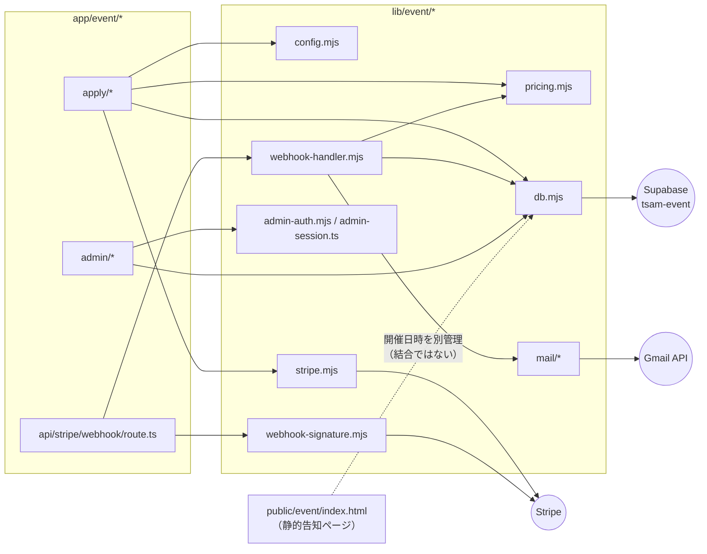

# 交流会申込アプリ 組み込みガイド

このアプリ（`app/event/` + `lib/event/` + `supabase/migrations/`）を、別のプロダクト・別のリポジトリへ
移植する開発者向けの手順。読了前に [01_requirements.md](./01_requirements.md)〜
[03_detailed-design.md](./03_detailed-design.md) に目を通すこと。

## 1. 移植の前提条件

- **Next.js（App Router）で、サーバー実行環境を持つホスティング先。** `output: "export"` の
  静的エクスポートでは Webhook 受信・Checkout Session 作成が成立しない。このリポジトリでは
  Cloudflare Workers（OpenNext）だが、Node実行環境があるホスティング先であれば移植可能
  （Vercel、Cloudflare Workers、自前のNodeサーバー等）。
- **Supabase プロジェクトを新規に用意できること。** 既存の `tsam-event` プロジェクトを共有しない
  （申込者の個人情報を含むため、プロダクトごとに分離する）。
- **Stripe アカウントと、Webhookを受けられる公開URL。** テストモードでの動作確認には
  `stripe listen` 等でローカルへ転送する手段が要る。
- **Gmail送信用のGoogle Cloudプロジェクトと、送信元にしたいGoogleアカウント。**
  `gmail.send` スコープのみのOAuthクライアントを作成できること（[docs/gmail-setup.md](../../gmail-setup.md)）。
- Node.js 22.4以上（`package.json` の `engines`）。

## 2. 依存関係マップ

`public/event/index.html` はアプリと**データを共有していない**（開催日時等を静的HTMLに直書き）。
移植時にこのページも持ち出す場合、開催日時の二重管理をそのまま持ち込むか、Next化して
`events` テーブルの値を読ませるかを判断すること（§5参照）。

## 3. 切り離しポイント

移植先のブランド・運用に合わせて差し替える必要がある箇所。

| 箇所 | 内容 |
| --- | --- |
| `lib/event/pricing.mjs` | 参加費・割引額の定数、選択肢のキーとラベル。イベント内容に合わせて全面的に書き換える前提の箇所 |
| `lib/event/mail/confirmation.mjs` | メール文面・`CONTACT_EMAIL` 定数 |
| `lib/event/admin-session.ts` | Cookie名（`tsam-event-admin`）・パス（`/event/admin`） |
| `app/event/*` のURL構造 | `/event/` 配下という前提（`next.config.ts` の `trailingSlash` とWebhook登録URLに影響） |
| `supabase/migrations/20260731000100_seed_first_event.sql` | 初回イベントの固有値（名称・会場・日時・ポリシー文面）。複製せず、移植先の内容で新規に書き直す |
| `lib/event/stripe.mjs` の `STATEMENT_DESCRIPTOR_SUFFIX*` | カード明細に出す表記。移植先の事業者名に合わせる |
| `app/event/layout.tsx` / 各ページのCSS読込 | `public/css/style.css` 等、既存コーポレートサイトのデザインシステムに依存している。移植先で同名の資産が無ければ差し替える |
| 環境変数名一式 | [03_detailed-design.md](./03_detailed-design.md) §7 の一覧。値だけでなく、移植先のシークレット管理の作法（例: Vercel環境変数、Cloudflare Secrets）に合わせて登録経路が変わる |

## 4. 必要な外部サービスと設定作業の概要

### Supabase

1. 新規プロジェクトを作成する（リージョンは利用者に近い場所）。
2. `supabase/migrations/` を移植先へコピーし、`supabase link` → `supabase db push` で適用する
   （§5の「複製時の注意」を先に読むこと。`seed_first_event.sql` は書き直す）。
3. Auth の Email プロバイダで「Allow new users to sign up」をオフにし、管理者アカウントを
   individually 作成する（[docs/event-admin.md](../../event-admin.md) §1）。
4. `service_role` キーと `anon` キーを控え、移植先の環境変数に登録する。

### Stripe

1. アカウントを用意し、テストモードで動作確認してからライブモードへ切り替える。
2. Webhook エンドポイントを `https://<ドメイン>/event/api/stripe/webhook/`（末尾スラッシュ必須。
   `trailingSlash: true` を維持する場合）で登録し、対象イベントに
   `checkout.session.completed` / `checkout.session.async_payment_succeeded` /
   `checkout.session.async_payment_failed` / `checkout.session.expired` / `charge.refunded` を選ぶ。
3. 署名シークレット（`whsec_...`）を `STRIPE_WEBHOOK_SECRET` として登録する。
4. **本リポジトリの `STRIPE_SETUP.md` は別系統（Apps Script + サブスクリプション課金）の手順書であり、
   このアプリ（`app/event/`）の設定手順ではない。** 移植先で参照しないこと（乖離の詳細は
   本タスクの実施報告を参照）。

### Gmail（参加確定メール送信）

1. [docs/gmail-setup.md](../../gmail-setup.md) の手順に沿って、Google Cloud プロジェクトの作成・
   Gmail API有効化・OAuth同意画面設定（`gmail.send` スコープのみ）・OAuthクライアント作成・
   リフレッシュトークン取得を行う。
2. 取得した `GOOGLE_CLIENT_ID` / `GOOGLE_CLIENT_SECRET` / `GMAIL_REFRESH_TOKEN` / `MAIL_FROM` を
   移植先の環境変数へ登録する。
3. OAuth同意画面の公開ステータスを「本番環境」にする（テストのままだとリフレッシュトークンが
   7日で失効する）。

## 5. 複製時の注意（[docs/repository-structure.md](../../repository-structure.md) §4 準拠）

このリポジトリの方針は「アプリ間で共通層を作らず、必要なロジックは複製する」
（§4-1）。移植先が既存の別アプリと共存する場合も、`lib/event/` を共有ライブラリ化せず、
移植先専用のコピーとして持ち込むこと。

**複製元の既知の課題を、直さずに持ち込まないこと（§4-3）。** 本アプリで確認できている
既知の課題は次のとおり（詳細・裏付けは本タスクの実施報告の「乖離」節を参照）。

1. **開催日時が静的HTML（`public/event/index.html`）とDB（`events.event_date`）の2箇所にある。**
   移植先で告知ページも持ち込む場合、Next化してDBを正にする、または二重管理を許容したうえで
   更新手順をドキュメント化する、のいずれかを最初に決めること。
2. **`STRIPE_WEBHOOK_SECRET` だけが `lib/event/config.mjs` を経由せず、Route Handlerが
   `process.env` を直接参照している。** 他の環境変数はBOM・前後空白を除去して読むが、この変数だけ
   除去されない。移植時に環境変数登録経路でBOMが混入する基盤（例: 一部のCI/CD経由の登録）を
   使う場合、ここだけ症状が出うる。移植を機に `config.mjs` 経由に統一するかを判断すること。
3. **定員到達時の告知ページの表示切替が自動化されていない。** `data-event-status` の手動書き換えが
   前提の設計になっている。移植先で告知ページを動的化するなら、この手動運用をそのまま持ち込まず
   自動反映を検討する。

逆方向（このアプリ側には無いが、移植先の既存アプリにある配慮）があれば、移植時に取り込むこと。

## 6. 最小組み込み手順

1. `app/event/`・`lib/event/`・`supabase/migrations/` を移植先リポジトリへコピーする。
2. `supabase/migrations/20260731000100_seed_first_event.sql` を移植先イベントの内容で書き直す
   （名称・説明・日時・会場・定員・受付期間・ポリシー文面・版）。
3. `lib/event/pricing.mjs` の割引定数・選択肢・ラベルを移植先の要件に合わせて書き換える。
4. `lib/event/mail/confirmation.mjs` の文面と `CONTACT_EMAIL` を書き換える。
5. Supabaseプロジェクトを作成し、マイグレーションを適用する（§4「Supabase」）。
6. Stripeアカウントを設定し、Webhookエンドポイントを登録する（§4「Stripe」）。
7. Gmail送信用のOAuth設定を行い、リフレッシュトークンを取得する（§4「Gmail」）。
8. 環境変数を移植先のホスティング基盤に登録する（[03_detailed-design.md](./03_detailed-design.md) §7の一覧）。
9. `next.config.ts` の `rewrites().fallback` とURL構造（`/event/` プレフィックス、`trailingSlash`）を、
   移植先のドメイン構成に合わせて確認・調整する。
10. `tests/unit/event-*.mjs` を移植先へ持ち込み、書き換えた定数・文面に合わせてテストの期待値を更新する。
11. Stripeのテストモードで、申込〜決済〜Webhook確定〜メール受信までを一度通しで確認する
    （[docs/event-acceptance.md](../../event-acceptance.md) の受入条件表が確認項目の参考になる）。
