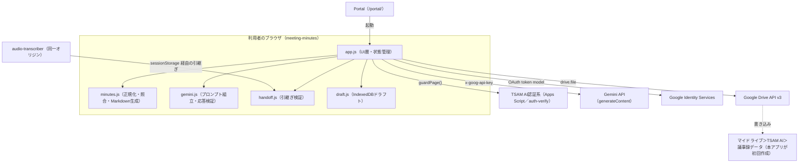
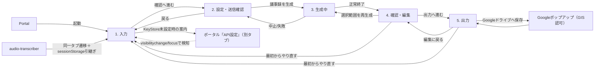

# AI議事録アプリ（meeting-minutes）基本設計書

対象要件: [01_requirements.md](./01_requirements.md) / 既存仕様書
[docs/specs/meeting-minutes-requirements-v1.md](../../specs/meeting-minutes-requirements-v1.md)

## 1. システム構成

サーバーコードを持たない静的フロントエンドである。`public/production-app/meeting-minutes/`配下の
HTML／CSS／ES ModulesのみをTSAM AIのホスティング（`public/`配下の静的ルート）から配信する。

当社サーバーはどこにも登場しない。文字起こし・会議情報・生成結果はすべて利用者端末に留まり、
利用者が明示的に実行した場合にのみGemini API・Google Drive APIへ直接送信される
（01_requirements.md NFR-09）。通信先はCSP（`index.html`の`<meta>`）で固定する。

## 2. コンポーネント一覧と責務

| ファイル | 責務 |
| --- | --- |
| `index.html` | 画面構造（ステップ1〜5）、CSP（ページ限定meta）、`guardPage()`が通るまで`hidden`にする`#mm-content` |
| `config.js` | 定数（モデル・エンドポイント・入力上限・引継ぎキー/TTL・ドラフトDB名・テンプレート定義・再生成対象・OAuth・Driveフォルダ名）を一元管理する唯一の場所 |
| `handoff.js` | `audio-transcriber`からの引継ぎデータの読取り・検証（純ロジック。DOM非依存、`storage`注入可） |
| `draft.js` | 端末内ドラフト（IndexedDB）の保存・読込み・消去（純ロジック。`idbFactory`注入可） |
| `gemini.js` | Gemini API呼び出し。プロンプト組立（システム指示とデータpartの分離）、JSON Schema定義、応答のJSON抽出、モデルフォールバック、エラー分類 |
| `minutes.js` | 議事録の純粋ロジック一式。入力検証、構造化応答の正規化、evidenceのクライアント側照合、Markdown生成、ファイル名生成、再生成マージ |
| `oauth.js` | GISによるDriveアクセストークンの取得。トークンはモジュールクロージャのメモリ上のみに保持 |
| `drive-client.js` | Drive API v3呼び出し（保存専用）。保存先フォルダの解決（無ければ作成）、議事録Markdownのmultipartアップロード、エラー分類 |
| `app.js` | UI層。DOM結線、5ステップの画面遷移、各モジュールの呼び出し、エラー文言の一元的な変換・表示。ロジック本体は持たない |
| `style.css` | 画面スタイル。ライト固定配色（`--c-*`カスタムプロパティ）、`prefers-reduced-motion`対応 |

外部（TSAM AI共通資産）から参照するモジュール:

| モジュール | 用途 |
| --- | --- |
| `public/auth/session.js`の`guardPage` | ログインセッションの検証 |
| `public/auth/config.js`の`setScreenDepth` | 相対リンクの深さ指定 |
| `public/auth/keystore.js`の`KeyStore`/`PROVIDERS`/`isKeyStoreAvailable` | Gemini APIキーの保管庫 |
| `public/auth/auth.css` | 共通ボタン・フォームのスタイル |

## 3. 外部インターフェース一覧

| 連携先 | 通信方式 | 用途 |
| --- | --- | --- |
| Gemini API | REST（`fetch`、`x-goog-api-key`ヘッダー） | 議事録生成（`generateContent`、構造化JSON出力） |
| Google Identity Services | `<script>`読み込み＋`google.accounts.oauth2`のポップアップトークンフロー | Driveアクセストークンの取得（`drive.file`） |
| Google Drive API v3 | REST（`fetch`、`Authorization: Bearer`ヘッダー） | 保存先フォルダの解決・作成、議事録Markdownのアップロード |
| `audio-transcriber`（同一オリジン） | `sessionStorage`（`tsam-meeting-minutes-handoff-v1`） | 文字起こしデータの引継ぎ。直接のAPI呼び出しは無い |
| TSAM AI認証系 | `public/auth/session.js`経由の内部通信 | セッション検証（`guardPage()`が内部で呼ぶ。本アプリはAPIを直接叩かない） |

## 4. データ設計概要

本アプリ自身のデータベース・スプレッドシートは持たない。永続化はGoogle Drive、`localStorage`
（KeyStore）、`sessionStorage`（引継ぎ）、IndexedDB（ドラフト）に分散する。

| 保存先 | エンティティ | 所有・作成 |
| --- | --- | --- |
| Google Drive「マイドライブ＞TSAM AI＞議事録データ」 | 完成した議事録（.md、UTF-8） | 本アプリが初回保存時に作成。毎回新規ファイルとして追加（上書きしない） |
| `sessionStorage`（`tsam-meeting-minutes-handoff-v1`） | `audio-transcriber`からの引継ぎデータ（version/sourceApp/createdAt/transcript/metadata） | `audio-transcriber`が書き込み、本アプリが読取り後に消去 |
| IndexedDB（`tsam-meeting-minutes-draft`、ストア`draft`） | 端末内ドラフト（transcript/meetingInfo/templateId/minutes/updatedAt）。常に1件（キー`current`） | 本アプリ。自動保存（入力停止から2秒デバウンス） |
| `localStorage`（`tsam-api-keys`） | Gemini APIキー（プロバイダー名をキーにしたJSON） | `public/auth/keystore.js`（KeyStore）が所有。本アプリは`has`/`get`のみ使用 |
| ブラウザメモリ（モジュールクロージャ） | OAuthアクセストークン（`oauth.js`）、生成中の`AbortController`・画面状態（`app.js`の`state`） | 本アプリ。再読み込みで消える |

Drive上のフォルダはIDで固定登録せず、「名前＋親フォルダ」からその都度解決する（フォルダIDは
利用者ごとに異なるため）。詳細スキーマは[03_detailed-design.md](./03_detailed-design.md) §3。

## 5. 画面一覧と画面遷移

単一ページ（`index.html`）を5ステップで構成する。別画面への遷移はPortal・ポータル「API設定」への
外部リンクと、Drive認可のGoogleポップアップのみ。

画面遷移（URL変化）は発生しない。現在位置は`<ol class="mm-steps">`の`aria-current="step"`と、
各セクションの`<h2>`（ステップ切替時にフォーカス移動）の両方で伝える
（01_requirements.md NFR-08）。

## 6. 認証・認可方式

3種類の資格情報を独立して扱う。

| 資格情報 | 方式 | 保持場所 | 有効期間 |
| --- | --- | --- | --- |
| TSAM AIログインセッション | `guardPage()`によるサーバー確認（トークン） | `public/auth/session.js`が管理（本アプリのスコープ外） | サーバー側のセッション有効期限 |
| Google Driveアクセストークン | GISトークンモデル（暗黙フロー、リフレッシュトークン無し） | `oauth.js`のモジュールクロージャ変数のみ | ページ滞在中のみ。再読み込みで消え、再認可が必要 |
| Gemini APIキー | 利用者が事前にポータル「API設定」で登録（KeyStore） | `localStorage`（`tsam-api-keys`） | 利用者が明示的に削除するまで。ログアウトでは消えない |

起動時は`guardPage()`を通過するまで`#mm-content`を`hidden`のままにし、通過後にのみ描画する。
Google連携（Drive保存）は「Googleドライブへ保存」を押した時だけ求め、ページを開いただけでは
認可を要求しない。Gemini APIキーは画面が「有無」だけを確認し（`KeyStore.has()`）、値を読むのは
実行直前の`KeyStore.get()`1回のみに限定する（`app.js`の`refreshKeyState`/`runGeneration`）。

## 7. エラー処理方針

層ごとに専用のエラークラスとエラーコード定数を持ち、`app.js`が一元的に日本語文言（既存仕様書
§9-2の表現）へ変換してから画面へ出す。例外の`message`やAPI応答本文をそのまま表示しない。

| エラークラス | 発生源 | 例 |
| --- | --- | --- |
| `GeminiError` | `gemini.js` | APIキー未設定・不正、レート制限、モデル未検出、不正JSON、ネットワーク障害、中止 |
| `DriveAuthError` | `oauth.js` | ポップアップが閉じられた、スコープ未付与、クライアントID未設定 |
| `DriveError` | `drive-client.js` | 401/403/429、API無効化、容量不足、フォルダ・ファイル取得失敗 |
| （エラークラスを持たない） | `minutes.js`のファイル検証 | 対応外拡張子、読込み失敗、バイナリ疑い、文字コード不正（文字列メッセージを直接`throw`） |

`GeminiError`は`gemini.js`の`describeGeminiError()`が、Drive系は`app.js`の
`describeDriveSaveError()`がそれぞれ文言変換の一元窓口を担う。生成のAPI呼び出し中の中止
（`AbortController`経由）は`GeminiErrorCode.ABORTED`として判別し、エラー表示をせず中立に
ステップを戻す。詳細は[03_detailed-design.md](./03_detailed-design.md) §6。

## 8. 運用・デプロイ構成

- `public/production-app/meeting-minutes/`にビルド不要の静的ファイルとして配置する。
- デプロイは手動実行（`npm run deploy`）。`main`へのマージのみでは公開されない。
- Portal（`public/portal/app-registry.js`）に`id: 'meeting-minutes'`として登録済みで、
  `href: 'production-app/meeting-minutes/'`から起動する。
- テストは`tests/unit/meeting-minutes.mjs`（Node実行、Chrome不要）。DOM・実際のGemini/Google
  Drive通信を要する`app.js`は自動テストの対象外（§8. テスト構成）。

## 9. 主要な設計判断と採らなかった選択肢

既存仕様書 §14-1（採用しなかった提案とその理由）を土台に、実装レベルの判断を補足する。

- **evidence（根拠）をクライアント側で原文照合する**: プロンプトで「原文からの引用のみ」と指示
  するだけでは、モデルが要約・言い換えを「引用」として返す可能性が残る。`minutes.js`の
  `verifyEvidence()`が実際に原文（`transcript`）へ対して`indexOf`で検索し、見つからなければ
  「根拠を確認できません」へ落とす。これが本アプリの信頼性の核であり、要件書 §4-10を仕組みとして
  保証する（03_detailed-design.md §3-3参照）。
- **システム指示と文字起こし本文を別partで送る**: v1.0の区切り線方式（文字列マーカーで前後を
  挟む）は、文字起こし本文が偶然同じ区切り文字列を含んだ場合にモデルが境界を誤認する余地が
  残る。v1.1でGemini APIのpart構造そのもの（`contents[0].parts`の別要素）へ切り替え、文字列一致に
  依存しない境界にした（プロンプトインジェクション対策、既存仕様書 §8-3）。
- **ダークテーマ廃止（v1.3）**: 事業者の決定により背景は常に純白固定とする。本番アプリ群の他アプリに
  ダークテーマの前例が無く、本アプリだけ配色が切り替わる状態を解消した。再導入する場合はトークン
  上書き方式に戻せる設計を維持している（既存仕様書 §14-1）。
- **Gemini APIキーの別建て疎通確認を行わない**: 本番アプリ群に前例がなく、保守コストに見合う効果が
  薄い。キーが無効なら初回の生成リクエスト自体が401/403で失敗し、同等の案内ができる
  （既存仕様書 §14-1）。
- **Drive保存はOAuthクライアントIDを`voice-recorder`/`audio-transcriber`と共用する**: 承認済み
  オリジンの追加設定が不要になり、将来「文字起こしTXT（Audio Transcriberフォルダ）を本アプリから
  直接読む」拡張が`drive.file`のままで成立する（既存仕様書 §4-15）。
- **Drive保存は毎回新規ファイルを作成し、上書きしない**: 誤って前の版を消さないことを優先した
  判断。同じ議事録を保存し直すと同名ファイルが複数並ぶ副作用は許容する（既存仕様書 §15）。
- **REST直叩き（SDK不使用）**: npmビルドを持たない構成のため、SDK導入はバンドラの追加を要し既存
  構成を崩す。Gemini・Driveいずれも追加依存なしのRESTで足りる。
