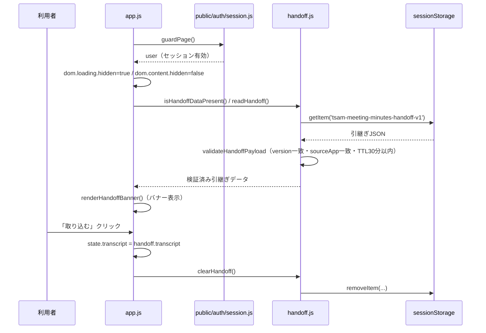
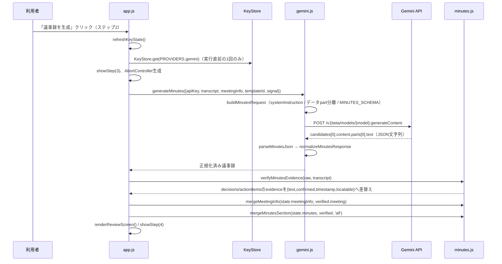
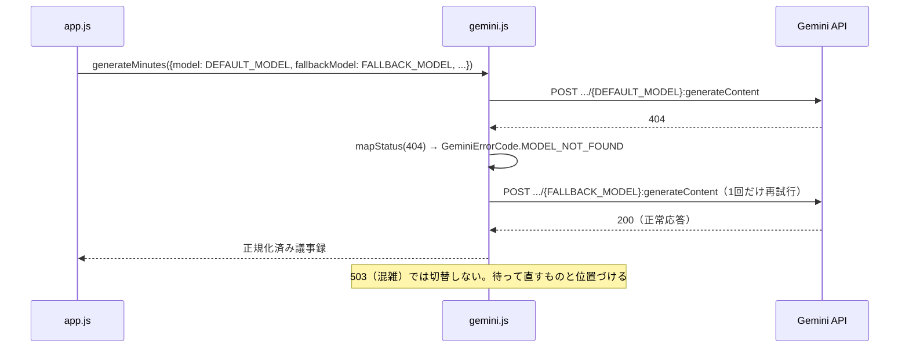
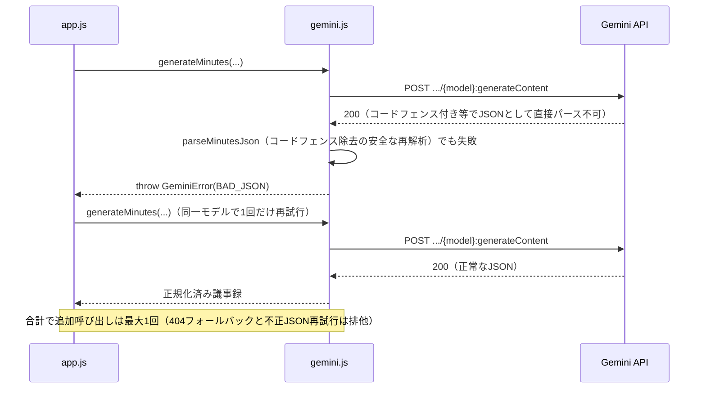
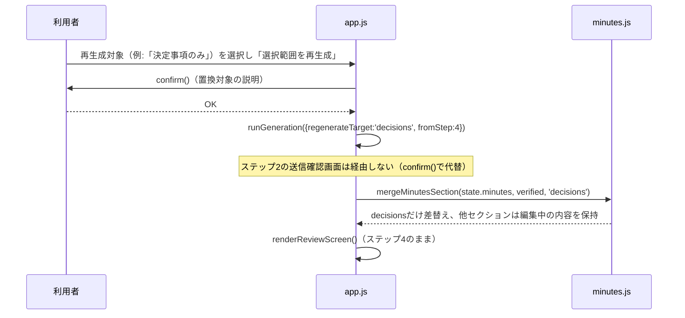
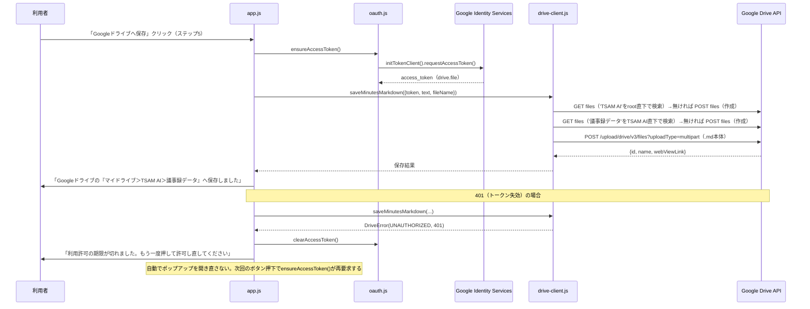

# AI議事録アプリ（meeting-minutes）詳細設計書

対象要件: [01_requirements.md](./01_requirements.md) / 基本設計: [02_basic-design.md](./02_basic-design.md)

## 1. ファイル・モジュール構成

`public/production-app/meeting-minutes/`

| パス | 責務 |
| --- | --- |
| `index.html` | 画面DOM（ステップ1〜5）、ページ限定CSP（`<meta>`）、`guardPage()`が通るまで`hidden`の`#mm-content` |
| `config.js` | `DEFAULT_MODEL`/`FALLBACK_MODEL`/`GEMINI_ENDPOINT_BASE`/`MAX_OUTPUT_TOKENS`、`LIMITS`（入力上限）、`HANDOFF_*`（引継ぎキー/TTL/バージョン/送信元）、`DRAFT_*`（IndexedDB名）、`DRAFT_AUTOSAVE`、`TEMPLATES`/`DEFAULT_TEMPLATE_ID`/`isValidTemplateId`、`REGENERATE_TARGETS`、`EVIDENCE_NOT_CONFIRMED`、`OAUTH`/`isOauthConfigured`、`DRIVE_NAMES` |
| `handoff.js` | `readHandoff`/`clearHandoff`/`isHandoffDataPresent`/`validateHandoffPayload`/`isHandoffStorageAvailable`、`HANDOFF_ERROR` |
| `draft.js` | `saveDraft`/`loadDraft`/`clearDraft`/`createEmptyDraftRecord`/`hasMeaningfulContent`/`isDraftStorageAvailable`、`DRAFT_SAVE_ERROR`/`DRAFT_RESTORE_ERROR` |
| `gemini.js` | `MINUTES_SCHEMA`、`buildMinutesRequest`/`generateMinutes`/`parseMinutesJson`/`mapStatus`/`describeGeminiError`/`summarizeErrorBody`、`GeminiError`/`GeminiErrorCode` |
| `minutes.js` | 入力検証（`countChars`/`isBlank`/`validateTranscriptForGeneration`/`isNearTranscriptLimit`/`exceedsTranscriptByteLimit`/`isAllowedTranscriptFileName`/`looksBinary`/`looksMisdecoded`）、正規化（`normalizeMinutesResponse`/`normalizeStoredMinutes`/`createEmptyMinutes`）、evidence照合（`verifyEvidence`/`verifyMinutesEvidence`/`findEvidenceInTranscript`/`findPrecedingTimestamp`）、Markdown生成（`buildMarkdown`）、ファイル名生成（`buildMinutesFileName`）、再生成マージ（`mergeMinutesSection`） |
| `oauth.js` | `ensureAccessToken`/`clearAccessToken`/`hasValidAccessToken`、`DriveAuthError`/`DriveAuthErrorCode` |
| `drive-client.js` | `ensureMinutesFolder`/`saveMinutesMarkdown`/`buildFolderQuery`/`buildMultipartBody`/`createBoundary`/`mapHttpErrorToCode`、`DriveError`/`DriveErrorCode` |
| `app.js` | 上記すべてを結線するUI層。DOM参照束（`dom`）、画面状態（`state`）、5ステップの表示切替（`showStep`）、各ハンドラ、文言表（`DRIVE_AUTH_ERROR_MESSAGES`/`DRIVE_ERROR_MESSAGES`）、起動（`init`） |
| `style.css` | ライト固定配色（`--c-*`カスタムプロパティ）、`prefers-reduced-motion`対応 |

対応する自動テスト: `tests/unit/meeting-minutes.mjs`（§8）。

## 2. 主要処理フロー

### 2-1. 起動〜引継ぎ取込み（正常系）



### 2-2. 議事録生成（正常系）



### 2-3. モデル404 → フォールバック切替（異常系）



### 2-4. 不正JSON → 同一モデルで1回だけ再生成（異常系）



### 2-5. セクション別再生成（正常系）



### 2-6. Googleドライブへの保存（正常系＋401異常系）



## 3. データモデル詳細

### 3-1. 引継ぎデータ（`handoff.js`）

```text
{
  version: number,          // HANDOFF_MAJOR_VERSION(1)と厳密一致でなければ拒否
  sourceApp: string,        // HANDOFF_SOURCE_APP('audio-transcriber')と一致必須
  createdAt: string,        // ISO8601。now-createdAt が HANDOFF_TTL_MS(30分) を超えたら無効
  transcript: string,       // 必須。文字列でなければ拒否
  metadata: {                // 任意。型が合わない値は既定値へ丸める（作り直さない）
    title: string,
    recordedAt: string,
    durationSeconds: number | null,
    speakers: string[],
  },
}
```

sessionStorageの中身は「同一オリジンで動く他のスクリプト」「開発者ツールでの書換え」を含め信頼
できない入力として扱う（handoff.js冒頭コメント）。`sourceApp`不一致・`version`不一致・`transcript`
非文字列・`createdAt`パース不能・TTL超過・未来時刻はいずれも取込みを拒否し`null`を返す。

### 3-2. ドラフトレコード（`draft.js`。IndexedDB `tsam-meeting-minutes-draft` / ストア`draft` / キー`current`）

```text
{
  transcript: string,
  meetingInfo: { title, date, startTime, endTime, participants, purpose, notes },  // フォーム生値
  templateId: string | null,
  minutes: <正規化済み議事録 or null>,   // evidenceは検証済みオブジェクト形
  updatedAt: string,                     // ISO8601。saveDraft時に付与
}
```

読み戻す際は`normalizeStoredMinutes()`（`minutes.js`）で受け直す。IndexedDBの中身も信頼できない
入力として扱い、トップレベルがオブジェクトでなければ`null`を返して呼び出し側にドラフトを破棄させる
（`app.js`の`restoreDraft`が`DRAFT_RESTORE_ERROR`を表示）。

### 3-3. 議事録の構造化データ（`gemini.js`の`MINUTES_SCHEMA` / `minutes.js`の正規化後の形）

```text
{
  meeting: { title, date, time, participants: string[], purpose },
  summary: string,
  topics: [{ title, summary, keyPoints: string[] }],
  decisions: [{ decision, evidence }],
  actionItems: [{ task, assignee, dueDate, evidence }],
  openIssues: string[],
  notes: string[],
}
```

`normalizeMinutesResponse()`（Gemini応答を受けた直後）の時点では`evidence`は文字列。
`verifyMinutesEvidence()`を通した後は、`decisions[].evidence`/`actionItems[].evidence`が次の
検証済みオブジェクトへ差し替わる。

```text
evidence: {
  text: string,                // モデルが返した根拠文字列（見つからなくても保持）
  confirmed: boolean,          // 原文中に実在を確認できたか
  timestamp: string|undefined, // 直前の [HH:MM:SS] 形式タイムスタンプ。複数一致時は undefined
  locatable: boolean,          // 原文中の正確な位置（index）を特定できたか
}
```

evidence照合のアルゴリズム（`findEvidenceInTranscript`/`verifyEvidence`）:

1. 10文字未満（`MIN_EVIDENCE_CHARS`）の根拠は照合を試みるまでもなく`confirmed:false`とする
   （「はい」等の短い相槌が偶然一致することを避けるため）。
2. 原文への完全一致（部分文字列）を`indexOf`で検索する。複数箇所に一致した場合は`multiple:true`
   とし、どの出現が根拠かクライアント側では特定できないため`timestamp`を付与しない。
3. 完全一致が無い場合、空白（改行・全角/半角スペース）だけを正規化した二次照合を行う。この場合は
   原文中の正確な位置が分からないため`locatable:false`（「原文で確認」ボタンを出さない）。
4. どちらにも一致しなければ`confirmed:false`。

### 3-4. Google Driveフォルダ・ファイル

| パス | 作成者 | 用途 | 存在しない場合 |
| --- | --- | --- | --- |
| マイドライブ ＞ TSAM AI | `voice-recorder`（先行。本アプリも作成できる） | 最上位フォルダ | `ensureMinutesFolder()`が無ければ作成する |
| マイドライブ ＞ TSAM AI ＞ 議事録データ | 本アプリ | 完成した議事録（.md）の保存先 | `ensureMinutesFolder()`が初回保存時に作成する |

フォルダ名の定義元は`config.js`の`DRIVE_NAMES`（`root`/`minutes`）。`root`の値は
`voice-recorder/config.js`・`audio-transcriber/config.js`の`DRIVE_NAMES.root`と一致させる
（一致は`tests/unit/meeting-minutes.mjs`で突き合わせ）。`audio-transcriber`と異なり、本アプリは
「保存先」としてのみDriveを使うため、同名フォルダが複数見つかった場合の重複解決
（候補一覧の提示）は実装していない。見つかった最初の1件をそのまま使う（`findFolder`/`ensureFolder`。
保存先の用意は`audio-transcriber`の保存経路と同じ「読み取りと違い、書き込み先の重複は実害が
小さい」という方針）。

ファイル（書き込み）: `<buildMinutesFileName()の結果>`（`YYYY-MM-DD_会議名_議事録.md`または
`YYYY-MM-DD_議事録.md`）、MIME `text/markdown; charset=utf-8`。既存ファイルの上書きはしない
（毎回新規作成）。

### 3-5. KeyStore（`tsam-api-keys`）

```text
localStorage["tsam-api-keys"] = { "gemini": "<APIキー文字列>" }
```

本アプリは`KeyStore.has(PROVIDERS.gemini)`（有無）と`KeyStore.get(PROVIDERS.gemini)`（値、実行
直前の1回のみ）だけを使う。保存・削除はポータル「API設定」の責務で、本アプリは行わない。

## 4. インターフェース仕様

### 4-1. Gemini API（呼び出しているエンドポイント）

| メソッド・パス | 用途 |
| --- | --- |
| `POST /v1beta/models/{model}:generateContent` | 議事録生成。`x-goog-api-key`ヘッダー、`generationConfig.responseMimeType:'application/json'`＋`responseSchema:MINUTES_SCHEMA`（`type`は大文字固定） |

### 4-2. Google Drive API v3（呼び出しているエンドポイント）

| メソッド・パス | 用途 | 主なクエリ／フィールド |
| --- | --- | --- |
| `GET /drive/v3/files` | フォルダ名解決（root直下→議事録データ） | `q`（`name=... and mimeType='application/vnd.google-apps.folder' and '<parent>' in parents and trashed=false`）、`fields=files(id,name)`、`pageSize=1` |
| `POST /drive/v3/files` | フォルダ作成（見つからなかった場合） | JSON本体（`name`/`mimeType`/`parents`）、`fields=id` |
| `POST /upload/drive/v3/files?uploadType=multipart` | 議事録Markdownの保存 | multipart（メタデータJSON＋本文）、`fields=id,name,webViewLink` |

### 4-3. 主要関数

| 関数 | 入力 | 出力 |
| --- | --- | --- |
| `generateMinutes({apiKey, transcript, meetingInfo, templateId, regenerateTarget, model, fallbackModel, signal})`（`gemini.js`） | 文字起こしと会議情報 | `Promise<正規化済み議事録>`。失敗時は`GeminiError`をthrow |
| `validateTranscriptForGeneration(text, {maxChars})`（`minutes.js`） | 文字起こし文字列 | 問題文言（string）または`null` |
| `verifyMinutesEvidence(minutes, transcript)`（`minutes.js`） | 正規化済み議事録・原文 | evidenceが検証済みオブジェクトへ差し替わった議事録 |
| `buildMarkdown(minutes, {templateId, includeEvidence})`（`minutes.js`） | 議事録データ | Markdown文字列（`includeEvidence`既定`false`） |
| `buildMinutesFileName({date, title, now})`（`minutes.js`） | 会議日・会議名 | サニタイズ済み`.md`ファイル名 |
| `mergeMinutesSection(current, incoming, target)`（`minutes.js`） | 現在の議事録・新規応答・再生成対象 | 対象セクションだけ差し替えた議事録 |
| `readHandoff({storage, now})`（`handoff.js`） | （テスト時のみ指定） | 検証済み引継ぎデータまたは`null` |
| `ensureAccessToken({forceConsent})`（`oauth.js`） | `forceConsent: boolean` | `Promise<string>`（アクセストークン）。既存トークンが有効ならポップアップを出さない |
| `saveMinutesMarkdown({token, text, fileName, signal, fetchImpl})`（`drive-client.js`） | トークン・保存本文・ファイル名 | `Promise<{id,name,webViewLink}>` |

### 4-4. エラーコード一覧

| モジュール | コード | 意味 |
| --- | --- | --- |
| `GeminiErrorCode` | `KEY_MISSING`/`KEY_REJECTED`/`BAD_REQUEST`/`RATE_LIMITED`/`MODEL_NOT_FOUND`/`BAD_JSON`/`NETWORK`/`SERVER_ERROR`/`ABORTED`/`UNKNOWN` | Gemini API呼び出し・応答検証に関するもの。400は`BAD_REQUEST`、401/403は`KEY_REJECTED`（**400をキーの問題にしない**） |
| `DriveAuthErrorCode` | `CLIENT_ID_MISSING`/`GIS_LOAD_FAILED`/`POPUP_CLOSED`/`POPUP_BLOCKED`/`ACCESS_DENIED`/`SCOPE_NOT_GRANTED`/`UNKNOWN` | OAuth認可に関するもの |
| `DriveErrorCode` | `UNAUTHORIZED`(401)/`FORBIDDEN`(403)/`API_DISABLED`/`QUOTA_EXCEEDED`/`RATE_LIMITED`(429)/`NOT_FOUND`(404)/`NETWORK`/`SERVER_ERROR`(5xx)/`CANCELLED`/`UNKNOWN` | Drive API呼び出し・フォルダ解決に関するもの |

全コードと画面文言の対応表は`gemini.js`の`describeGeminiError()`、`app.js`の
`DRIVE_AUTH_ERROR_MESSAGES`/`DRIVE_ERROR_MESSAGES`。

## 5. 状態管理・セッション設計

### 5-1. 画面状態（`app.js`の`state`。専用の状態機械クラスは持たず、素のオブジェクト＋`showStep()`で管理）

| フィールド | 用途 |
| --- | --- |
| `transcript` / `meetingInfo` / `templateId` | ステップ1の入力値。フォームと双方向に同期する |
| `minutes` | 正規化・evidence照合済みの議事録。未生成は`null` |
| `dirty` | 未保存の編集があるか。`true`の間は`beforeunload`で警告し、Drive保存・ダウンロード成功で`false`に戻す |
| `controller` | 生成中の`AbortController`。存在する間は二重送信を`runGeneration()`冒頭で防ぐ |
| `handoffPending` | 検証済みだが未取込みの引継ぎデータ |
| `draftAutosaveTimer` / `draftSaveErrorShown` | 自動保存のデバウンスと、保存失敗メッセージの多重表示防止 |

ステップは1〜5の数値で管理し、`showStep(n)`が該当`<section>`だけを表示し、他を`hidden`にする。
遷移のたびに見出し（`<h2>`）へフォーカスを移す（NFR-08）。

### 5-2. 資格情報のライフサイクル

| 資格情報 | 保持場所 | 破棄タイミング |
| --- | --- | --- |
| TSAM AIセッション | サーバー＋ブラウザの`localStorage`（トークン文字列のみ、`public/auth/session.js`管理） | ログアウト、期限切れ |
| Driveアクセストークン | `oauth.js`のモジュール変数 | ページ離脱（再読み込みでメモリ消滅）、401受信時に`clearAccessToken()`で明示破棄 |
| Gemini APIキー | `localStorage`（KeyStore、本アプリ管理外） | 利用者がポータルで明示削除するまで（ログアウトでは消えない）。無効応答（401/403）でも自動削除しない |

## 6. エラーハンドリング詳細

- `gemini.js`の`describeGeminiError(error)`と`app.js`の`describeDriveSaveError(error)`が、それぞれ
  「例外→画面文言」変換の唯一の窓口。`instanceof`でエラークラスを判別し、対応する文言表から引く。
  想定外の例外は各モジュールの`UNKNOWN`文言へフォールバックする。
- 生成の`try`ブロックはAPI呼び出し（`generateMinutes`）だけに絞る。成功後の状態更新・描画で
  起きた例外まで一緒に捕えると、通信の失敗ではないのに「不明なエラー（SYS-999）」として誤報告
  されるため（`app.js`の`runGeneration`のコメント）。
- 中止（`AbortController`経由）は`GeminiErrorCode.ABORTED`として判別し、エラー表示をせず
  「処理を中止しました」相当の中立な扱いで元のステップへ戻す。入力原文・編集内容は保持する。
- Gemini呼び出しの追加リトライは合計最大1回に限定する。404（モデル廃止）はフォールバック
  モデルへ、不正JSONは同一モデルで1回だけ再試行する。401/403・429・5xx・ネットワーク障害・中止
  では再試行せず、利用者の操作に委ねる（既存仕様書 §8-2「無制限に行わない」）。
- Drive呼び出しで`DriveErrorCode.UNAUTHORIZED`（401）を受けたら`clearAccessToken()`を呼び、次回の
  保存操作で`ensureAccessToken()`が再度ポップアップを出すようにする（自動では開き直さない）。
- Gemini APIエラー応答の`error.message`は保持しない（自由記述であり、送信したプロンプトの断片や
  入力サイズが引用されうるため）。`error.status`（`INVALID_ARGUMENT`等の固定列挙値）のみを
  `summarizeErrorBody()`で要約し、画面の補助情報として表示する（既存仕様書 §7-4）。

## 7. 設定値・環境変数一覧

すべて`config.js`に集約する（他ファイルへ直接埋め込まない）。値そのものが秘密情報となる項目
（OAuthクライアントID）は本書に転記しない。

| 名前 | 役割 | 置き場所 |
| --- | --- | --- |
| `DEFAULT_MODEL` / `FALLBACK_MODEL` | Gemini生成に使うモデル。主モデルが404のときのみ切替（503では切替しない） | `config.js` |
| `GEMINI_HOST` / `GEMINI_ENDPOINT_BASE` | Gemini APIのベースURL | `config.js` |
| `MAX_OUTPUT_TOKENS` | 応答の出力上限トークン数（8192） | `config.js` |
| `LIMITS.TRANSCRIPT_MAX_CHARS` / `TRANSCRIPT_WARN_CHARS` | 入力上限（60,000字）・早期警告閾値（45,000字） | `config.js` |
| `HANDOFF_KEY` | 引継ぎ`sessionStorage`のキー名（`audio-transcriber`側と一致させる） | `config.js` |
| `HANDOFF_TTL_MS` | 引継ぎデータの有効期限（30分） | `config.js` |
| `HANDOFF_MAJOR_VERSION` / `HANDOFF_SOURCE_APP` | 受け付ける引継ぎのバージョン・送信元 | `config.js` |
| `DRAFT_DB_NAME` / `DRAFT_DB_VERSION` / `DRAFT_STORE_NAME` / `DRAFT_RECORD_KEY` | ドラフト用IndexedDBの識別子 | `config.js` |
| `DRAFT_AUTOSAVE.enabled` / `debounceMs` | 自動保存の有無・デバウンス間隔（既定有効・2000ms） | `config.js` |
| `TEMPLATES` / `DEFAULT_TEMPLATE_ID` | テンプレート定義（4種）とその既定値 | `config.js` |
| `REGENERATE_TARGETS` | 再生成対象の列挙（all/summary/decisions/actionItems） | `config.js` |
| `EVIDENCE_NOT_CONFIRMED` | 根拠未確認時の表示文言 | `config.js` |
| `OAUTH.clientId` | Google OAuthクライアントID。録音アプリ・文字起こしアプリと共用（値は非公開情報として本書に記載しない） | `config.js` |
| `OAUTH.scope` | Driveスコープ（`drive.file`固定） | `config.js` |
| `DRIVE_NAMES.root` / `minutes` | Driveフォルダ名（`'TSAM AI'`/`'議事録データ'`） | `config.js` |
| `KEYSTORE_STORAGE_KEY`（`public/auth/keystore.js`） | Gemini APIキーの`localStorage`保存キー名 | `public/auth/keystore.js`（本アプリの外。参照のみ） |

環境変数（`.env`等）は使用しない。ビルド工程を持たない静的構成のため、すべてソース内定数として
管理する。

## 8. テスト構成

`tests/unit/meeting-minutes.mjs`（`tests/run.mjs`の`SUITES`に`{name:'meeting-minutes', kind:'unit'}`
として登録）。Node上で直接importできる純ロジックのみを対象にする。

| 対象モジュール | 検証内容 |
| --- | --- |
| `config.js`・`minutes.js` | 入力検証（空・上限・上限バイト数）、ファイル名/拡張子判定、バイナリ・文字コード不正の検出 |
| `handoff.js` | 正常な引継ぎの取込み、バージョン不一致・送信元不一致・TTL超過・未来時刻の拒否、`storage`注入によるNode環境での検証 |
| `gemini.js` | プロンプト組立（システム指示とデータpartの分離）、`fetch`モックによる404フォールバック・不正JSON再試行・401/403/429/5xxの分類、応答の正規化 |
| `minutes.js`（evidence照合） | 完全一致・空白揺れ・複数一致・短すぎる根拠・タイムスタンプ抽出の判定 |
| `minutes.js`（Markdown/ファイル名） | テンプレート別の見出し出し分け、`includeEvidence`の有無、ファイル名のサニタイズ・日付補完 |
| `minutes.js`（再生成マージ） | 対象外セクションが保持されること |
| `minutes.js`（ドラフト正規化） | IndexedDBから読み戻した壊れた形（改変・破損）を`null`へ落とすこと |
| `draft.js`（`fake-indexeddb`使用） | 保存・読込み・消去、`hasMeaningfulContent`の判定 |
| `drive-client.js`・`config.js` | フォルダ検索クエリの組み立て（`in parents`を含むこと）、HTTPステータス→エラーコードの対応、`OAUTH.clientId`が`voice-recorder`/`audio-transcriber`と一致すること |

自動テスト対象外（ブラウザ環境が必要）:

| モジュール | 理由 |
| --- | --- |
| `app.js` | `guardPage()`と`document`前提のUI層。§4-1の認証ガード、§11-2/§11-7（レスポンシブ・アクセシビリティ）は自動テストの対象外 |
| `oauth.js`のトークン取得経路 | GISのポップアップが必要 |

実行コマンド:

```powershell
node tests/run.mjs meeting-minutes    # このスイートのみ
npm run test:auth-system:unit         # 本番認証系・本番アプリ群のNode スイート
npm test                              # 全スイート（Chrome必須のスイートを含む）
```
