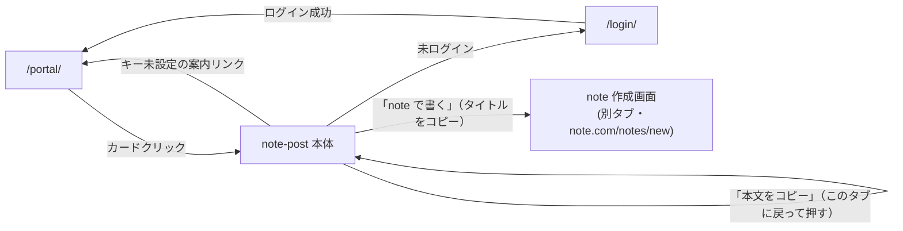

# note 下書きアプリ（note-post）基本設計書

作成: 2026年8月18日

> 要件は [01_requirements.md](./01_requirements.md)（FR-nn/NFR-nn）を参照。実装の正は
> [docs/specs/note-post-requirements-v1.md](../../specs/note-post-requirements-v1.md)（差分仕様書）と
> [docs/specs/threads-mvp-requirements-v1.md](../../specs/threads-mvp-requirements-v1.md)（基底仕様書）。

## 1. システム構成

サーバー処理を持たない静的アプリ（HTML＋CSS＋ES モジュール）。ブラウザから外部先（Gemini・
認証確認）へ直接 `fetch` し、note へは fetch せず別タブを開くだけである（差分仕様書 §2.2、
基底仕様書 §7）。

```mermaid
graph TB
  subgraph Browser["利用者のブラウザ（Portalと同一オリジン）"]
    Portal["Portal (/portal/)"]
    App["note-post 本体 (index.html + app.js)"]
    KeyStore["KeyStore (auth/keystore.js, localStorage)"]
    Session["session.js (auth/session.js, localStorage)"]
    LocalState["下書き・履歴・調整プロンプト\n(localStorage: tsam-note-post-v1)"]
  end

  subgraph External["外部サービス"]
    Gemini["Gemini API\ngenerativelanguage.googleapis.com"]
    Auth["Apps Script 認証API\nscript.google.com"]
    Verify["auth-verify Worker\n(セッション検証の代理)"]
  end

  subgraph Note["note（別プロダクト）"]
    NoteEditor["作成画面\nnote.com/notes/new"]
  end

  Portal -->|カード起動| App
  App -->|案内リンク| Portal
  App -->|APIキー有無/取得| KeyStore
  App -->|guardPage| Session
  App -->|下書き/履歴/調整プロンプトの読み書き| LocalState
  Session -->|セッション検証/ログアウト| Auth
  Session -->|検証(代理)| Verify
  Verify -->|検証結果のキャッシュ元| Auth
  App -->|記事生成 fetch| Gemini
  App -->|タイトル/本文をコピーし別タブで開く（fetchしない）| NoteEditor
```

## 2. コンポーネント一覧と責務

| コンポーネント | パス | 責務 |
| --- | --- | --- |
| 画面 | `index.html` | DOM 構造、CSP宣言（meta）。`guardPage()` が返すまで `#np-content` を `hidden` にする。 |
| エントリ | `app.js` | 認証ガード、DOM参照の集約（`dom` オブジェクト）、文字数カウント、下書き/履歴の描画、保存・生成・コピー系のハンドラ接続。 |
| 静的設定 | `config.js` | モデル名・エンドポイント・上限値・note の作成画面URL・保存キー・履歴上限。秘密情報は置かない。 |
| 検証・保存・URL組み立て | `post.js` | 本文検証、作成画面URLの組み立て、端末内保存（下書き・履歴・調整プロンプト）。DOM非依存。 |
| Gemini 呼び出し | `gemini.js` | fetch による REST 呼び出し、エラー分類（`GeminiErrorCode`）、モデルフォールバック、記事（title/body）の抽出。DOM非依存。 |
| 見た目 | `style.css` | `css/style.css`・`auth/auth.css` を土台に不足分のみ追加。 |

共通層への依存は `public/auth/`（`session.js`／`config.js`／`keystore.js`／内部で使う `api.js`）のみ。
他の本番アプリ（`threads-post` 等）へは import せず、同型のロジックは複製している（§9）。

## 3. 外部インターフェース一覧

| 連携先 | 通信方式 | 用途 | 認証 |
| --- | --- | --- | --- |
| Gemini API | HTTPS `POST /v1beta/models/{model}:generateContent`（`fetch`） | AI モードの記事生成 | `x-goog-api-key` ヘッダー（利用者のキー） |
| Apps Script 認証API / auth-verify Worker | HTTPS（`public/auth/api.js`・`session.js` 経由） | セッション検証（`verifySession`）・ログアウト（`logout`） | セッショントークン（`tsam-auth-session`） |
| note（`note.com`） | `window.open()` による別タブ表示のみ。**fetch はしない** | 作成画面（`/notes/new`）を開き、コピー済みのタイトル・本文を利用者が貼り付ける | なし（note 側の認証はnote自身が行う。未ログインならnoteがログインへ誘導） |

いずれも `fetch`（またはタブオープン）の直接呼び出しであり、外部SDKは使わない。

## 4. データ設計概要

サーバー側の永続化は存在しない。保存先はすべてブラウザ内、またはその場限りの生成物。

| 保存先 | 内容 | 主なエンティティ |
| --- | --- | --- |
| localStorage（`tsam-api-keys`） | Gemini APIキー | `{ gemini: string }`（KeyStore が管理） |
| localStorage（`tsam-auth-session`） | セッショントークン | 文字列。判定の根拠はサーバー側（sessions シート）にあり、トークン自体は推測困難な文字列に過ぎない。 |
| localStorage（`tsam-note-post-v1`） | 下書き・履歴・調整プロンプト | `{ drafts: [{id, title, text, createdAt}], history: [{id, at, kind, title, text}], stylePrompt: string }`（post.js） |
| DOM（モジュール外の状態を持たない） | 生成結果の一時表示 | Gemini の応答はそのままタイトル欄・本文欄へ書き込み、専用の変数には保持しない（app.js `handleGenerate`）。 |

データモデルの詳細は [03_detailed-design.md](./03_detailed-design.md) §3。

## 5. 画面一覧と画面遷移

| 画面 | パス | 保護 |
| --- | --- | --- |
| 本体（1ページ） | `production-app/note-post/` | `guardPage()` + Gemini キー（生成のみ必須） |



画面内の状態遷移（下書き一覧・履歴一覧の再描画、保存領域が使えない旨の表示切替）はページ遷移を
伴わない。詳細は [03_detailed-design.md](./03_detailed-design.md) §2。

## 6. 認証・認可方式

- ログインは `guardPage()`（`public/auth/session.js`）が担う。判定根拠はサーバー（sessions シート）
  側の行の存在のみであり、ローカルのトークンの有無だけでは「ログイン済み」と扱わない
  （session.js 冒頭コメント）。
- 本体は `setScreenDepth(2)`（サイトルートからの階層深さ。相対パス組み立てに使う）。
- Gemini APIキーの有無は `KeyStore.has(PROVIDERS.gemini)` で判定するだけで、値そのものは読まない。
  値を読むのは実際に生成リクエストを送る直前の1行だけ（`app.js` `handleGenerate`）。
- キーの状態は画面が再表示されたとき（`visibilitychange`／`focus`）に読み直す。Portal の別タブで
  キーを設定して戻る利用導線を想定している。
- 認可（ロールによる機能差）はこのアプリには存在しない。ログイン済みかどうかの二値のみ。
- note 自体へのログイン・認証はこのアプリの管理範囲外。note 側が未ログイン利用者を
  ログイン画面へ誘導することを実機確認済み（差分仕様書 §2.2）。

## 7. エラー処理方針

| 領域 | 方針 |
| --- | --- |
| Gemini 呼び出し | `GeminiError`（`code`/`status`/`detail`）を投げ、`describeGeminiError()` が画面文言・エラーコード・detail を必ずセットで返す。 |
| HTTPステータス分類 | 400=リクエスト不正、401/403=キー拒否、404=モデル不在（フォールバック対象）、429=利用上限、5xx=サーバーエラー。400 をキーの問題にしない（gemini.js `mapStatus`）。 |
| モデルフォールバック | 404 のときのみ1回だけ `FALLBACK_MODEL` で再試行。401/403/429 では再試行しない（クォータ温存）。 |
| 応答の整形失敗 | JSON でない・`body` が空のいずれも `GeminiErrorCode.EMPTY_TEXT` として扱い、テーマ・指示を変えて再試行するよう促す（gemini.js `extractArticle`）。 |
| クリップボード不可 | `navigator.clipboard.writeText` の `catch`。コピーだけ諦めて作成画面のオープンは続行し、手動コピーを案内する（差分仕様書 §2.2）。 |
| ポップアップブロック | `window.open()` が `null` を返した場合、ポップアップ許可の確認を促すメッセージを表示する（app.js `handlePost`）。 |
| 保存領域が使えない環境 | `isStorageAvailable()` の判定結果で、保存系ボタンの案内文言を出し分ける。書く・生成する・作成画面を開く操作自体は継続できる。 |
| 壊れた保存データ | JSON パース失敗時は空の状態として読み捨て、次回の保存で作り直す（例外を投げてアプリを止めない。post.js `readState`）。 |

## 8. 運用・デプロイ構成

- 配置は `public/production-app/note-post/`。配信構成は本リポジトリ共通のもの
  （[CLAUDE.md](../../../CLAUDE.md) 配信構成節）に従い、note-post 固有の配信設定は持たない
  （静的ファイルとしてそのまま配信される）。
- 配信は `main` へのコミット＋手動デプロイ（`npm run deploy`）。`main` への push だけでは
  自動デプロイされない。
- Portal 掲載は `public/portal/app-registry.js` の `APP_REGISTRY` 配列（`id: 'note-post'`）で行う。
  登録済み（本書作成時点）。
- CSP はページ単体で `<meta>` 宣言（`index.html`）。`next.config.ts` の `headers()` は `public/` 全体に
  効くため、このアプリのために触ると本体サイトを巻き込む（index.html 冒頭コメント、
  short-script の同種方針を踏襲）。
- Meta・Google Cloud 側の作業は不要（Google OAuth（GIS）を使わないため）。

## 9. 主要な設計判断と採らなかった選択肢

差分仕様書 §3・基底仕様書 §9「採用しなかった提案とその理由」から、基本設計に関わるものを抜粋する。

| 採った設計 | 採らなかった案 | 理由 |
| --- | --- | --- |
| クリップボード経由の2段階コピー＆作成画面オープン | 本文を URL パラメータで渡す | note にその受け口が存在しない（2026-08-12 実機確認）。クリップボード経由が唯一の現実解（差分仕様書 §3）。 |
| note API を使わない（GAS等のバックエンドも持たない） | note API での下書き作成 | note は投稿作成の公開APIを提供していない。非公式APIへの依存は互換性が保証されず、認証情報の扱いも増える（差分仕様書 §3）。 |
| タイトルと本文を別枠で入力・保存・生成する | Threads 版と同じ単一テキストエリアのまま流用する | note のエディタはタイトルと本文が別枠であるため（差分仕様書 §2.1）。 |
| Threads 版との共有モジュール化をしない（複製で運ぶ） | `post.js`/`gemini.js` 等を共通モジュール化する | 本番アプリ間で共通層を作らない方針（[repository-structure.md](../../repository-structure.md) §4-1、差分仕様書 §3）。 |
| APIキーは KeyStore 一本化・当社サーバーを経由しない | アプリ独自の入力UIでキーを受ける | 設定箇所が増えると「どこかで送っていないか」の確認コストが増える。設定は Portal「API設定」に一本化（基底仕様書 §9 と同じ判断）。 |
| 自動再試行しない（401/403/429） | エラー時に自動でリトライする | 結果は変わらず無料枠のクォータを削るだけ（同型実装 short-script/threads-post と同じ判断）。 |
| 下書き・履歴を端末内（localStorage）のみに保存する | Drive/Sheets へ保存する | OAuth（GIS）とスコープ管理が付いてくる。端末内保存なら当社サーバー送信ゼロのまま審査不要。端末をまたぐ必要が出た時点で再検討（基底仕様書 §9 の判断を踏襲）。 |

このほか、記事生成の目安文字数（1500〜2000字）・見出し付き構成・創作の禁止は、既存の
note 記事生成ツール「note-auto-fill-gas」の方針を踏襲した設計判断である（差分仕様書 §2.3）。
