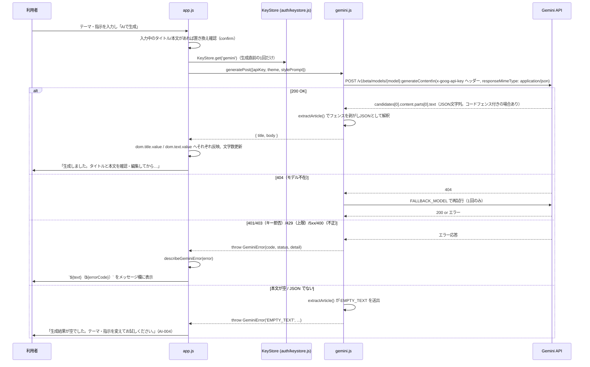
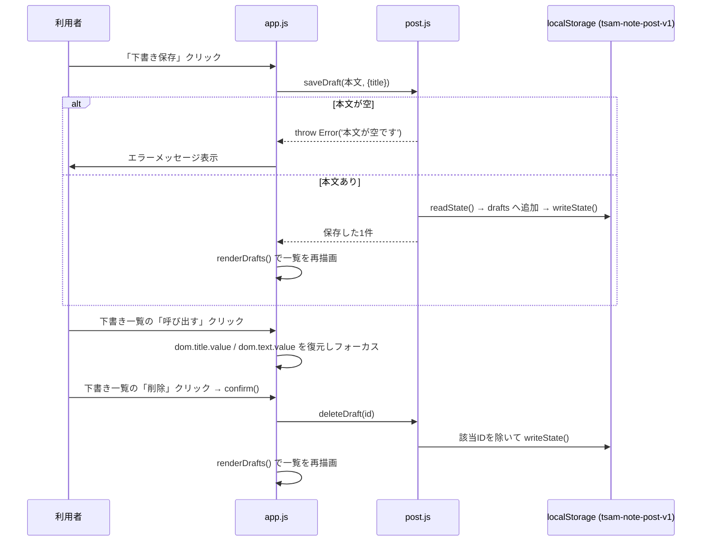

# note 下書きアプリ（note-post）詳細設計書

作成: 2026年8月18日

> 実装の正は [docs/specs/note-post-requirements-v1.md](../../specs/note-post-requirements-v1.md)（差分仕様書）と
> [docs/specs/threads-mvp-requirements-v1.md](../../specs/threads-mvp-requirements-v1.md)（基底仕様書）。
> 本書は実装ファイルを直接確認して書いており、行番号ではなく関数名・§番号で参照する。

## 1. ファイル・モジュール構成

| パス | 行数目安 | 責務 |
| --- | --- | --- |
| `index.html` | 137行 | DOM構造、CSP（meta）、生成フォーム・記事フォーム・下書き/履歴一覧の器。 |
| `app.js` | 328行 | エントリ。認証ガード、DOM参照の集約（`dom` オブジェクト）、文字数カウント、下書き/履歴の描画、保存・生成・「note で書く」・「本文をコピー」の各ハンドラ。 |
| `config.js` | 53行 | 定数の単一集約先。モデル名・エンドポイント・上限値・note の作成画面URL・保存キー・履歴上限。 |
| `post.js` | 166行 | 本文検証、作成画面URLの組み立て、端末内保存（下書き・履歴・調整プロンプト）。DOM非依存の純関数群。 |
| `gemini.js` | 304行 | Gemini 呼び出し本体（`callOnce`/`generatePost`）、エラー分類、記事の抽出・整形（`extractArticle`）。台本メーカー（short-script）から複製。 |
| `style.css` | 165行 | 見た目。`css/style.css`／`auth/auth.css` を土台に不足分のみ。 |

## 2. 主要処理フロー

### 2.1 AI モードでの記事生成（正常系＋主要な異常系）



### 2.2 「note で書く（タイトルをコピー）」→「本文をコピー」の2段階流し込み

```mermaid
sequenceDiagram
  participant U as 利用者
  participant App as app.js
  participant Clip as クリップボード
  participant Note as note（別タブ）

  U->>App: 「note で書く（タイトルをコピー）」クリック
  App->>App: validatePostText(本文) で空/上限超過を検証
  alt 検証NG
    App->>U: エラーメッセージを表示し中断
  else 検証OK
    App->>Clip: writeText(タイトル || 本文)（タイトル空なら本文を代用）
    alt コピー許可なし
      App->>App: copied = false（諦めて続行）
    end
    App->>Note: window.open(buildEditorUrl(), '_blank', 'noopener,noreferrer')
    alt window.open が失敗（ポップアップブロック等）
      App->>U: 「作成画面を開けませんでした。ポップアップの許可をご確認ください。」
    else 成功
      App->>App: 保存可能なら recordHistory('作成画面を開いた', 本文, {title})
      App->>U: コピー成否に応じた案内文言を表示
    end
  end
  Note->>U: エディタのタイトル欄にカーソル。貼り付けを促す
  U->>Note: 貼り付け（1段階目=タイトル）
  U->>App: このタブへ戻り「本文をコピー」クリック
  App->>App: validatePostText(本文) を再検証
  App->>Clip: writeText(本文)
  App->>U: 「本文をコピーしました。note の本文欄に貼り付けてください。」
  U->>Note: 貼り付け（2段階目=本文）
```

### 2.3 下書きの保存・呼び出し・削除



## 3. データモデル詳細

### 3.1 localStorage スキーマ（`tsam-note-post-v1`。post.js が読み書きする）

```
{
  drafts: [
    { id: string, title: string, text: string, createdAt: number(ms) }
  ],
  history: [
    { id: string, at: number(ms), kind: string, title: string, text: string }
  ],
  stylePrompt: string
}
```

- `id` は `crypto.randomUUID()`。取得できない環境向けのフォールバックあり（post.js `makeId`）。
- 一覧表示（`listDrafts`/`listHistory`）は新しい順に反転して返す。
- `history` は `HISTORY_LIMIT`（100件）を超えたら古い順に切り詰める（`recordHistory`）。
- 壊れた JSON・想定外の型（`drafts`/`history` が配列でない等）は空状態として読み捨てる
  （`readState` の `catch` と型ガード）。

### 3.2 localStorage スキーマ（`public/auth/` 側。参照のみで note-post は書式を定義しない）

| キー | 形式 | 管理元 |
| --- | --- | --- |
| `tsam-api-keys` | `{ "gemini": "<key>" }` | `public/auth/keystore.js` |
| `tsam-auth-session` | 文字列（セッショントークン） | `public/auth/session.js` |

### 3.3 Gemini リクエスト／レスポンス形（構造化出力スキーマは未使用）

`buildPostRequest(theme, {maxOutputTokens, stylePrompt})`（gemini.js）が組み立てるリクエスト本体:

```
{
  contents: [{ role: 'user', parts: [{ text: <プロンプト文字列> }] }],
  generationConfig: {
    temperature: 0.4,
    maxOutputTokens: 4096,
    responseMimeType: 'application/json'
  }
}
```

台本メーカー（short-script）が使う `responseSchema`（`SCRIPT_SCHEMA`）とは異なり、
**note-post は `responseSchema` を指定しない**。JSON での出力はプロンプト文中の指示
（「次のJSONだけを出力してください」）と `responseMimeType` のみで担保しており、
応答側でコードフェンスが付く場合に備えて `extractArticle()` が剥がしてから `JSON.parse` する。

応答から取り出す形（`extractArticle` の戻り値）:

```
{ title: string, body: string }   // body が空文字なら GeminiError(EMPTY_TEXT)
```

### 3.4 プロンプトの構成要素（`buildPostRequest`）

| 要素 | 内容 |
| --- | --- |
| 役割指定 | 「note に投稿する記事を書く日本語のライター」 |
| 記事の方針 | 本文 1500〜2000字程度（`BODY_TARGET_MIN`/`BODY_TARGET_MAX`）、見出し（`## 見出し`）を適度に、タイトルは誇張しない、過度に煽らない、創作の禁止、未確認情報を断定しない |
| 書き方の調整（任意） | `stylePrompt` が空でなければ「# 書き方の調整（利用者設定）」として先頭2000字までテーマより前に挿入 |
| テーマ・指示 | 利用者の入力（先頭100字＝`THEME_MAX_LENGTH` で切り詰め） |
| 出力形式 | `{ "title": "記事タイトル", "body": "記事本文" }` のJSONのみを出力するよう指示 |

## 4. インターフェース仕様

### 4.1 Gemini API

| 項目 | 内容 |
| --- | --- |
| エンドポイント | `POST https://generativelanguage.googleapis.com/v1beta/models/{model}:generateContent` |
| 認証 | `x-goog-api-key` ヘッダー |
| 主モデル/フォールバック | `DEFAULT_MODEL`（`gemini-2.5-flash-lite`）／`FALLBACK_MODEL`（`gemini-3.5-flash-lite`）。404のときのみ切替（config.js） |
| リクエスト本体 | `buildPostRequest(theme, {maxOutputTokens, stylePrompt})`（gemini.js） |

### 4.2 主要関数の入出力

| 関数 | ファイル | 入力 | 出力／例外 |
| --- | --- | --- | --- |
| `countText(text)` | post.js | 文字列 | コードポイント数（`Array.from` 基準） |
| `validatePostText(text)` | post.js | 本文文字列 | エラーメッセージ文字列、問題なければ `null` |
| `buildEditorUrl()` | post.js | なし | note 作成画面の固定URL（`https://note.com/notes/new`） |
| `isStorageAvailable(storage?)` | post.js | 任意の `Storage` 実装 | `boolean`（probe書き込みの成否） |
| `saveDraft(text, {title, storage, now})` | post.js | 本文・任意タイトル・保存先・時刻 | 保存した下書き1件 / `Error('本文が空です')` |
| `listDrafts({storage})` | post.js | 保存先 | 下書き配列（新しい順） |
| `deleteDraft(id, {storage})` | post.js | 下書きID・保存先 | なし（副作用のみ） |
| `recordHistory(kind, text, {title, storage, now})` | post.js | 種別・本文・任意タイトル | なし（100件で切り詰め） |
| `listHistory({storage})` | post.js | 保存先 | 履歴配列（新しい順） |
| `saveStylePrompt(text, {storage})` / `loadStylePrompt({storage})` | post.js | 文字列 / 保存先 | なし / 保存済み文字列（未保存なら空文字） |
| `generatePost({apiKey, theme, stylePrompt, fetchImpl, signal})` | gemini.js | テーマ・調整プロンプト・オプション | `{ title, body }` / `GeminiError` |
| `extractArticle(payload)` | gemini.js | Gemini生応答のJSON | `{ title, body }` / `GeminiError(EMPTY_TEXT)` |
| `describeGeminiError(error)` | gemini.js | `Error` または `GeminiError` | `{ text, errorCode, detail }` |
| `mapStatus(status)` | gemini.js | HTTPステータス | `GeminiErrorCode` の値 |

### 4.3 エラーコード（画面表示用）

| コード | 意味 | 表示文言の要旨 |
| --- | --- | --- |
| `KEY-001` | Gemini APIキー未設定 | Portal で設定するよう案内 |
| `KEY-002` | キーが拒否された（401/403） | このAPIキーでは接続できない |
| `AI-001` | 通信失敗／サーバーエラー（5xx） | 通信に失敗した／混雑している旨（503は専用文言） |
| `AI-002` | 利用上限（429） | 無料枠なら時間をおいて再試行 |
| `AI-003` | リクエスト不正（400） | キーの問題ではない旨を明示 |
| `AI-004` | 生成結果が空／JSONでない | テーマ・指示を変えて再試行 |
| `AI-005` | モデル不在（404、フォールバック失敗時） | モデルが利用できなかった |
| `SYS-999` | 分類不能な例外 | 不明なエラー（detail に元エラーの名前・メッセージを付与） |

## 5. 状態管理・セッション設計

### 5.1 モジュール変数・DOM参照（`app.js`。すべてメモリ上のみ、永続化しない）

| 変数 | 意味 |
| --- | --- |
| `dom` | 画面内の要素参照をまとめたオブジェクト（`getElementById` を起動時に1回だけ実行）。 |
| `storageOk` | `isStorageAvailable()` の結果をモジュール読み込み時に1回評価した値。下書き/履歴の描画可否に使う。 |

`app.js` は生成結果や下書き一覧を独自の状態変数として保持せず、DOM（`dom.title.value`/
`dom.text.value`）と localStorage（`post.js` 経由）を都度読み書きする設計になっている
（short-script の `currentScript` のようなモジュール内キャッシュは持たない）。

### 5.2 セッション

- 認証状態はサーバー（sessions シート）にのみ根拠を持つ。ローカルの `tsam-auth-session` は
  ただの不透明なトークンであり、`guardPage()` は毎回サーバー検証を行う。
- 本アプリ自身はセッションを発行・管理しない。読むのは `guardPage()` の戻り値（`user`）の
  有無のみで、ロール等は参照しない。

## 6. エラーハンドリング詳細

| 発生源 | 検知方法 | 復旧導線 |
| --- | --- | --- |
| Gemini fetch 失敗（通信断） | `try/catch` → `GeminiErrorCode.NETWORK` | 再試行はユーザー操作（生成ボタン再押下）。 |
| Gemini 非2xx応答 | `mapStatus(status)` | コード別文言。401/403/429は再試行しない設計（クォータ温存）。 |
| Gemini応答がJSONでない／`body`が空 | `extractArticle` が `EMPTY_TEXT` を送出 | 再試行を促す文言（AI-004）。 |
| クリップボード不可 | `navigator.clipboard.writeText` の `catch` | 「note で書く」はコピーを諦めて作成画面だけ開く／「本文をコピー」は手動コピーを案内。 |
| ポップアップブロック | `window.open()` の戻り値が falsy | 「ポップアップの許可をご確認ください」表示、履歴は記録しない。 |
| 下書き保存失敗（本文空） | `saveDraft` が `Error` を送出 | メッセージ欄へ表示（例外メッセージをそのまま使う）。 |
| 保存領域が使えない環境 | `isStorageAvailable()` が `false` | 保存操作時に「この環境では保存できません」を表示。下書き/履歴一覧は空表示のまま、生成・コピー・作成画面オープンは継続。 |
| 壊れた保存データ | `readState` の `JSON.parse` 失敗 | 空状態として読み捨て、次回の保存で作り直す（例外を外へ伝播させない）。 |

## 7. 設定値・環境変数一覧

このアプリはサーバー環境変数を持たない（静的アプリのため）。すべて `config.js` に定数として
集約されている。**値は秘密情報ではない**ため、参考として現在値を併記する。

| 名前 | 役割 | 置き場所 | 現在値 |
| --- | --- | --- | --- |
| `DEFAULT_MODEL` | Gemini 主モデル | config.js | `gemini-2.5-flash-lite` |
| `FALLBACK_MODEL` | 404時のフォールバックモデル | config.js | `gemini-3.5-flash-lite` |
| `GEMINI_HOST` / `GEMINI_ENDPOINT_BASE` | Gemini APIのホスト/ベースURL | config.js | `generativelanguage.googleapis.com` 他 |
| `MAX_OUTPUT_TOKENS` | Gemini応答の最大トークン数 | config.js | `4096`（記事向けにThreads版より広く確保） |
| `NOTE_NEW_URL` | note の作成画面URL | config.js | `https://note.com/notes/new` |
| `TEXT_LIMIT` | 本文の文字数上限 | config.js | `30000` |
| `BODY_TARGET_MIN` / `BODY_TARGET_MAX` | 記事生成の目安文字数 | config.js | `1500` / `2000` |
| `THEME_MAX_LENGTH` | テーマ入力の最大文字数 | config.js | `100` |
| `STORAGE_KEY` | 端末内保存の localStorage キー | config.js | `tsam-note-post-v1` |
| `HISTORY_LIMIT` | 履歴の最大保持件数 | config.js | `100` |

一方、`public/auth/config.js` の `AUTH_CONFIG.apiUrl`／`verifyApiUrl`（Apps Script の `/exec` URL、
auth-verify Worker のURL）は仕様書のルールにより値を伏せる対象であり、本書でも名前と役割のみ
記す（Apps Script Webアプリのエンドポイント／セッション検証の代理、`guardPage()` の検証先）。

## 8. テスト構成

| スイート名 | ファイル | kind | 対象 |
| --- | --- | --- | --- |
| `note-post` | `tests/unit/note-post.mjs` | unit | `post.js`（本文検証・作成画面URL・下書き/履歴の保存/一覧/削除・壊れた保存データの読み捨て・調整プロンプトの保存/復元）、`gemini.js`（記事向けプロンプトの差分・JSON応答の抽出・コードフェンス除去・キー未設定/応答不正時のエラー分類） |

実行方法: `node tests/run.mjs note-post`（単体。Node のみ・Chrome 不要）、または
`npm test` で全スイートの一部として実行される。実 Gemini API へは通信せず、`fetch` を
スタブして判定ロジックのみを検証する（同ファイル冒頭コメント）。

Threads 版（`tests/unit/threads-post.mjs`）との重複を避け、**note 固有の差分（作成画面URLを
開くだけであること、記事向け生成であること）を重点的に固定し、保存の骨格（下書き/履歴の
CRUDや壊れたデータの扱い）は要点のみ通す**設計になっている（同ファイル冒頭コメント）。

**確認できた事実として記す**: `app.js`（DOM 描画・イベント接続そのもの）を対象とする
自動テストは、本書作成時点の `tests/run.mjs` SUITES 一覧には存在しない（`post.js`/`gemini.js`
というロジック層のみを直接固定する設計。基底仕様書 §6 と同じ考え方）。
