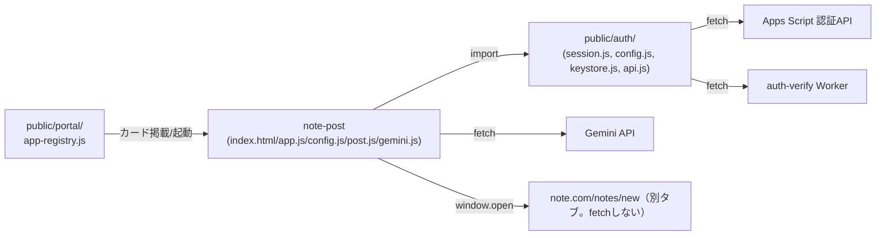

# note 下書きアプリ（note-post）組み込みガイド

作成: 2026年8月18日

> このアプリを、このリポジトリ以外のプロダクトへ移植する開発者を読者として想定する。
> 実装の正は [docs/specs/note-post-requirements-v1.md](../../specs/note-post-requirements-v1.md)（差分仕様書）と
> [docs/specs/threads-mvp-requirements-v1.md](../../specs/threads-mvp-requirements-v1.md)（基底仕様書）。
> 複製方針は [repository-structure.md](../../repository-structure.md) §4 に従う。

## 1. 移植の前提条件

- **サーバーコードを持たない静的アプリである。** 移植先も「サーバーを介さずブラウザから直接
  Gemini へ通信する」構成を許容できること（BYOK原則）。
- **KeyStore と同等の「APIキー保管庫」を用意できること。** 本アプリ自体はキー設定UIを持たず、
  Portal 側の設定画面に依存している。移植先で同じ分離を維持するか、独自のキー入力UIを
  足すかは移植側の判断になる。
- **ログイン基盤（`guardPage()` 相当）を用意できること、またはガードを外す判断をすること。**
  本アプリは「ログイン済み利用者」を前提に作られている。認証不要な文脈へ移植する場合は、
  `guardPage()` 呼び出しと未ログイン時の分岐を丸ごと外す設計変更が要る。
- **note の作成画面（`https://note.com/notes/new`）が引き続き本文プリフィルの URL を
  提供していないことを前提にしている。** この前提は 2026-08-12 時点の実機確認結果であり
  （差分仕様書 §2.2）、移植時点で note 側の仕様が変わっていないか確認すること
  （01_requirements.md §9 の未確定事項）。

## 2. 依存関係マップ

このアプリが**このリポジトリの中で**結合しているのは `public/auth/` の4ファイルのみである
（[repository-structure.md](../../repository-structure.md) の「本番アプリ間で共通層を作らない」方針により、
他の本番アプリ（threads-post／short-script 等）への import は存在しない。同型のロジックは
**複製**している）。`public/apps/note-helper/` とは実装・データ経路とも独立しており、依存関係は無い
（01_requirements.md §3.3）。

## 3. 切り離しポイント

移植時に必ず差し替え・見直しが必要な箇所。

| 箇所 | 現状 | 移植時の対応 |
| --- | --- | --- |
| `import { guardPage } from '../../auth/session.js'` ほか（app.js） | Portal共通の認証基盤に依存 | 移植先の認証機構に置き換えるか、認証を撤去する。 |
| `import { KeyStore, PROVIDERS, isKeyStoreAvailable } from '../../auth/keystore.js'`（app.js） | `tsam-api-keys` という固定の localStorage キーで Gemini キーを管理 | 移植先で同じ責務のモジュールを自前で用意する（キー入力UIを足す、または別の秘密管理に差し替える）。 |
| `NOTE_NEW_URL`（config.js） | `https://note.com/notes/new` 固定 | note 側のURLが変わった場合はここを更新する。note 以外のプラットフォームへ移植する場合は、そのプラットフォームの作成画面URLと、本文プリフィルの可否（可能ならFR-03/FR-04を単純化できる）を再調査する。 |
| CSP の `<meta>` 宣言（index.html） | `connect-src` に `generativelanguage.googleapis.com`／`script.google.com`／`script.googleusercontent.com`／auth-verify Worker のホストを列挙。`note.com` は含めない（fetchしないため） | 移植先のドメイン・認証先に合わせて書き換える。Apps Script 認証を使わないなら該当行を削除できる。 |
| `setScreenDepth(2)`（`public/auth/config.js` の相対パス機構） | サイトルートからの階層深さに依存した相対パス組み立て | 認証基盤ごと外す場合はこの呼び出しも不要になる。 |
| Portal 掲載（`APP_REGISTRY`。`id: 'note-post'`） | TSAM AI Portal 固有の掲載機構 | 移植先の起動口（メニュー、リンク等）に置き換える。`id` は配置データの識別子であり、移植先でも一度決めたら変えない運用にすることを推奨する。 |
| `STORAGE_KEY`（`tsam-note-post-v1`） | 端末内保存のキー名 | 移植先で他アプリと衝突しない名前に変更する。値を変えると既存端末の下書き・履歴が読めなくなる点は移行前に周知する。 |

## 4. 必要な外部サービスと設定作業の概要

| サービス | 用途 | 設定作業の概要 |
| --- | --- | --- |
| Gemini API | AIモードの記事生成 | 利用者ごとに Google AI Studio 等で APIキーを取得（本アプリは配布・課金を代行しない。BYOK）。移植先のキー保管庫にキーを登録できる導線を用意する。 |
| 認証基盤（移植先で用意する場合） | ログイン判定 | 本アプリの `guardPage()` 相当インターフェース（Promise を返し、未ログインなら遷移して `null` を返す）を実装する。 |
| note（またはその他の記事プラットフォーム） | 記事作成画面を開く先 | API連携やOAuthは不要（本文プリフィルURLが無いため）。プラットフォーム側の設定作業は無い。移植先で別プラットフォームへ差し替える場合は、そのプラットフォームが本文プリフィルURLを提供しているかを先に調べ、提供していればより単純な単発コピー方式に簡略化できる。 |

## 5. 複製時の注意

[repository-structure.md](../../repository-structure.md) §4-1「アプリ間で共通層を作らない」方針に従い、
このアプリのロジックを別プロダクトへ複製する場合は、**複製元パスと複製日を複製先ファイルの
冒頭コメントに書く**こと。`gemini.js` 自体が台本メーカー（short-script）からの複製である旨を
明記しているのと同じ形式にする。

複製元に既知の不具合があれば、写す前に直すこと。本書作成時に確認した範囲では、note-post
自体の実装と差分仕様書・基底仕様書のあいだに矛盾は見つからなかった（数値・保存キー・
モデル名・上限値はいずれも一致）。ただし次の2点は、複製・移植の判断材料として明記しておく。

- **「本文プリフィルURLが存在しない」という前提は実機確認ベースであり、恒久的な仕様保証では
  ない。** note 側の仕様変更で成立しなくなる可能性がある（01_requirements.md §9）。移植・複製の
  タイミングで再確認すること。
- **`public/apps/note-helper/` は名称が似ているが無関係な別実装である。** 認証なし・公開GAS API
  依存・別URL（`editor.note.com/new`）という異なる設計であり、本アプリのロジックと混同して
  複製しないこと（01_requirements.md §3.3）。

## 6. 最小組み込み手順

1. `public/production-app/note-post/` から `index.html`／`app.js`／`config.js`／`post.js`／
   `gemini.js`／`style.css` をコピーする。
2. `app.js` から `guardPage`／`setScreenDepth`／`KeyStore` 系 import を、移植先の認証・
   キー管理へ差し替える。認証不要にする場合はガード呼び出し自体を削除し、`init()` の先頭で
   直接 `dom.loading.hidden = true; dom.content.hidden = false;` するよう変更する。
3. `index.html` の CSP `<meta>` から、Apps Script 関連ドメイン（`script.google.com`／
   `script.googleusercontent.com`）と auth-verify Worker のホストを、実際に使わないなら削除する。
   Gemini 用の `generativelanguage.googleapis.com` は AIモードを使う限り必須。
4. `config.js` の `STORAGE_KEY` を移植先の他アプリと衝突しない値に変更する。`NOTE_NEW_URL` は
   投稿先プラットフォームに応じて変更する。
5. 利用者へ Gemini APIキーを入力させるUI（KeyStore相当）を用意し、`app.js` の
   `refreshKeyState()`／`handleGenerate()` が参照するキー取得処理をそこへ差し替える。
6. 投稿先プラットフォームが本文プリフィルURLを提供している場合は、`post.js` の
   `buildEditorUrl()` をパラメータ付きURLの組み立てに変更し、`app.js` の2段階コピー処理
   （`handlePost`／`handleCopyBody`）を単発コピーへ簡略化できる。
7. 移植後は、`tests/unit/note-post.mjs` を参考に、移植先の環境でも `fetch` をスタブした
   単体テストを用意することを推奨する（[03_detailed-design.md](./03_detailed-design.md) §8）。
