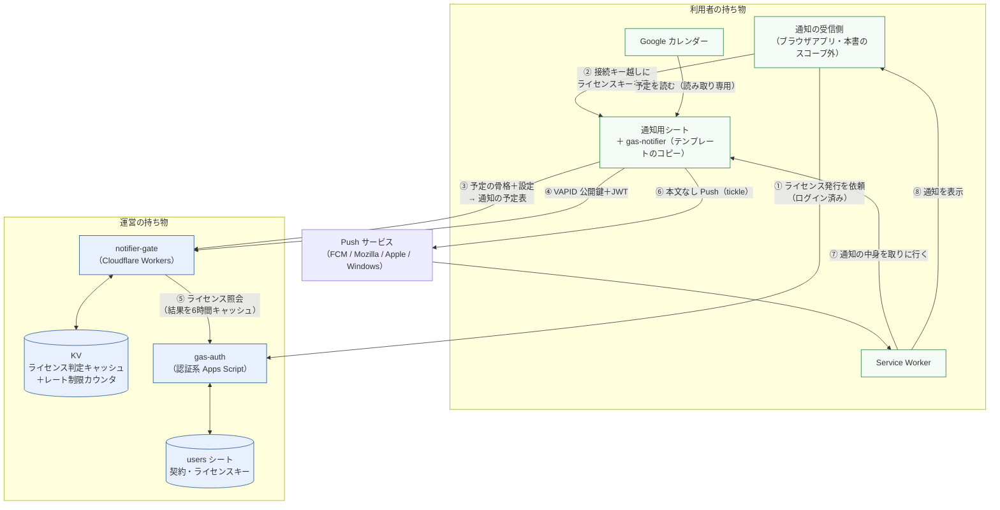
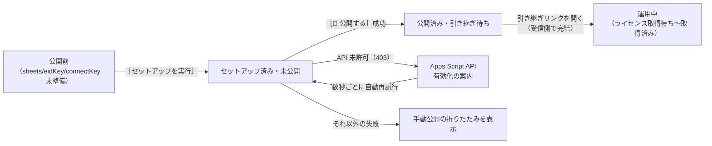

# notifier-v2｜基本設計書

要件は [01_requirements.md](./01_requirements.md)。より詳しい設計判断の理由は
[../../notifier-v2-design.md](../../notifier-v2-design.md) と
[../../notifier-design-notes.md](../../notifier-design-notes.md) を正とし、
本書は重複させず§番号で参照する。

---

## 1. システム構成

`notifier-gate` はリポジトリ直下のサイト配信用 Worker とは別サービスであり、
デプロイも別（`npm run deploy:notifier-gate`）。詳細は
[../../notifier-v2-design.md](../../notifier-v2-design.md) §1。

### 運営を通るもの／通らないもの

予定名・説明・参加者・カレンダー ID・予定 ID そのものは運営（ゲート）へ
一切渡らない。渡ってよいのは `eid`（HMAC 済みの符号）・開始時刻・出欠・
終日か・削除済みか・設定・ライセンスキーのみ。強制の方法（「送らない」では
なく「受け取らない」）は要件 NFR-01 に対応し、詳細は
[../../notifier-v2-design.md](../../notifier-v2-design.md) §1 の図を参照。

---

## 2. コンポーネント一覧と責務

| コンポーネント | ファイル | 責務 |
| --- | --- | --- |
| カレンダー同期 | `gas-notifier/CalendarSync.gs` | `tick()` の入口。予定取得・骨格化・ゲートへの判定依頼・`notify_queue` の反映 |
| ゲートクライアント | `gas-notifier/Gate.gs` | `notifier-gate` の3エンドポイントを呼ぶ窓口。JWT キャッシュ・失敗後のバックオフ |
| Push 送信 | `gas-notifier/Push.gs` | 本文なし Push の送信、期限切れ購読の掃除、テスト通知 |
| Web アプリ入口 | `gas-notifier/Api.gs` | `doGet` / `doPost`。action ホワイトリスト、接続キー検証 |
| シート I/O | `gas-notifier/Store.gs` | シートと Script Properties への唯一のアクセス経路、設定の正規化 |
| セットアップ・公開 | `gas-notifier/Setup.gs` | 冪等なセットアップ、匿名化鍵・接続キーの生成、Apps Script API 経由のワンボタン公開 |
| メニュー | `gas-notifier/Code.gs` | スプレッドシートのメニュー（セットアップ導線・引き継ぎリンク表示） |
| セットアップ UI | `gas-notifier/SidebarSetup.html` | サイドバーのウィザード |
| ルータ | `workers/notifier-gate/src/index.mjs` | 全エンドポイント共通の「形の検査 → レート制限 → ライセンス検証」を通す |
| 判定 | `workers/notifier-gate/src/evaluate.mjs` | 通知するかどうかの純粋な判定ロジック（fetch/KV に触れない） |
| ライセンス検証 | `workers/notifier-gate/src/license.mjs` | 認証系への照会、KV キャッシュ、猶予の判定 |
| VAPID 署名 | `workers/notifier-gate/src/vapid.mjs` | 秘密鍵の読み込みと ES256 署名（WebCrypto） |
| レート制限 | `workers/notifier-gate/src/ratelimit.mjs` | KV の固定窓カウンタ |
| 診断ログ | `workers/notifier-gate/src/diagnostics.mjs` | 失敗の記録。書き出す直前に秘密を伏せる |
| 定数 | `workers/notifier-gate/src/constants.mjs` | 判定・キャッシュ期間・レート制限値の集約 |
| 応答形式 | `workers/notifier-gate/src/http.mjs` | 成功/失敗レスポンスの形、CORS |
| ライセンス発行/照会（外部） | `gas-auth/Notifier.gs` | 本サブシステムの外にある認証系の実装。§3 参照 |

---

## 3. 外部インターフェース一覧

| 相手 | 通信方式 | 用途 |
| --- | --- | --- |
| Google Calendar API | Advanced Service（`Calendar.Events.list`） | 予定の取得（読み取り専用） |
| Google Apps Script API | REST（`UrlFetchApp` + `ScriptApp.getOAuthToken()`） | 自分自身のバージョン作成・デプロイ更新（ワンボタン公開） |
| `notifier-gate` | HTTPS POST（JSON, `text/plain` で送信しプリフライトを回避） | `/v1/evaluate` `/v1/vapid` `/v1/test-notify` |
| Push サービス（FCM 等） | HTTPS POST（本文なし、VAPID ヘッダのみ） | tickle の送信 |
| `gas-auth` | HTTPS POST（server-to-server、共有シークレット） | ゲートからのライセンス照会のみ。テンプレートは直接呼ばない |
| 通知の受信側（ブラウザアプリ） | HTTPS GET/POST（`doGet`/`doPost`、接続キー必須） | 設定取得・保存、購読登録、通知取得、テスト通知 等 |

`notifier-gate` の入出力の詳細（JSON スキーマ）は
[../../../workers/notifier-gate/README.md](../../../workers/notifier-gate/README.md) §2、
テンプレートの API は [../../../gas-notifier/README.md](../../../gas-notifier/README.md) §5 を正とする。
本書 [03_detailed-design.md](./03_detailed-design.md) §4 で要点を再掲する。

---

## 4. データ設計概要

| 置き場所 | 何が入るか | 正本か |
| --- | --- | --- |
| 利用者のシート（`settings` / `subscriptions` / `notify_queue` / `sent_log`） | 出欠フィルタ・通知タイミング、Push 購読、これから出す通知、送信記録。**予定名はここにしか無い** | 正本 |
| 利用者の Script Properties | 接続キー、ライセンスキー、匿名化鍵（`EID_HMAC_KEY`）、公開 URL、VAPID キャッシュ、直近のゲート失敗 | 正本（秘密の置き場所はシートと分離） |
| Cloudflare KV（運営） | `license:<sha256>`（ライセンス判定結果）、`rl:<scope>:<hash>:<窓>`（レート制限カウンタ） | キャッシュ（正本は `users` シート側の契約情報） |
| `users` シート（認証系、運営） | 契約情報とライセンスキー（本サブシステムの外） | 正本（本書のスコープ外） |
| ブラウザの IndexedDB / localStorage（受信側） | 接続情報・引き渡し前のライセンスキー／設定の表示キャッシュ | キャッシュ（正本はシート側） |

エンティティの列単位のスキーマは [03_detailed-design.md](./03_detailed-design.md) §3。

---

## 5. 画面一覧と画面遷移

本サブシステムが持つ画面は、通知用シートに紐づくサイドバー1つのみ
（設定画面・受信側の UI は録音アプリ側の責務で、本書のスコープ外）。

サイドバーの状態は `getSetupStatus()` が返す `{ sheets, eidKey, connectKey,
trigger, deployed, license }` の組み合わせで決まる（`Setup.gs`）。

---

## 6. 認証・認可方式

| 経路 | 方式 | 補足 |
| --- | --- | --- |
| 受信側 → 通知用シート（Web アプリ） | 接続キー（`key` パラメータ／本文） | `health` のみ無認証。比較はタイミングセーフ（XOR 畳み込み） |
| 通知用シート → `notifier-gate` | ライセンスキー（本文） | 形式検査（22〜128文字の base64url）→ レート制限 → 認証系への照会、の順 |
| `notifier-gate` → `gas-auth` | 共有シークレット（`AUTH_GAS_SHARED_SECRET`、server-to-server） | Workers のシークレットと認証系の Script Property に同じ値を置く。**片方だけ更新すると全利用者のライセンス検証が壊れる** |
| 受信側 → `gas-auth` | ログインセッション（本書のスコープ外） | `issueNotifierLicense` はセッション検証必須 |
| 通知用シート → Apps Script API | `ScriptApp.getOAuthToken()` | サーバー側関数の中だけで使い、クライアント（サイドバー）へは渡さない |

認可の設計判断（なぜ運営側へ判定と署名を寄せたか）は §9 参照。

---

## 7. エラー処理方針

- **応答には内部情報を返さない。実行ログには残す。** 読む相手が違うという
  前提で、`notifier-gate` は例外の種類・段階（`phase`）・伏せ字済み
  メッセージのみをログへ出し、応答は定型のエラーコード・メッセージに限る
  （`workers/notifier-gate/src/diagnostics.mjs`）。
- **秘密は書き出す直前に伏せる。** 「気をつけて書かない」ではなく、
  既知の秘密（VAPID 鍵・共有シークレット・ライセンスキー）をログ出力の
  通り道で機械的に置換する。
- **失敗は「無効」と「判定できなかった」を区別する。** 認証系に届かない場合を
  無効と混同すると、契約者の通知が認証系の不調だけで止まる。届かなかった
  場合は猶予（grace）へ倒す（NFR-08）。
- **失敗したときこそ呼び出しを減らす。** レート制限に当たったら、
  ゲートが返す `retryAfterSec` の間はテンプレート側が呼び出しを止める。
  ライセンス引き渡し（`saveLicense`）は、署名の先取りに失敗しても
  action としては成功を返す（呼び出しが増える経路を作らない）。
  背景は [../../notifier-design-notes.md](../../notifier-design-notes.md) §10。
- **通信が一度失敗しただけでキューを壊さない。** 判定を受け取れなかった
  ときは `notify_queue` に触れず、次の同期に委ねる。

---

## 8. 運用・デプロイ構成

| 対象 | デプロイ方法 | 備考 |
| --- | --- | --- |
| `workers/notifier-gate/` | `npm run deploy:notifier-gate`（`wrangler deploy --config workers/notifier-gate/wrangler.jsonc`） | 公開先は Cloudflare の既定ドメイン（workers.dev）。独自ドメインは未採用（要件 §9） |
| `gas-notifier/`（テンプレート） | 運営者がエディタへ手で貼り付けてテンプレートシートを作成。以降は利用者がコピーし、サイドバーからワンボタンで自分自身を公開 | リポジトリからは配信されない（`gas-auth` と同じ扱い） |
| 認証系 `gas-auth/Notifier.gs` | 既存デプロイの更新（本書のスコープ外） | ゲートとの共有シークレットの一致が前提 |

秘密の管理（VAPID 鍵・共有シークレット）とローテーション手順は
[../../../workers/notifier-gate/README.md](../../../workers/notifier-gate/README.md) §4〜§5 を正とする。
デプロイ済み URL・KV namespace の ID などの値そのものは本書に記載しない。

---

## 9. 主要な設計判断と採らなかった選択肢

| 判断 | 採った理由 | 採らなかった選択肢とその理由 |
| --- | --- | --- |
| 判定と VAPID 署名を運営側（Workers）へ移す | 判定だけ止めても、テンプレートを改造すれば自前判定で送れてしまう。署名側でも止めることで、コピー・改変で迂回できない位置に置ける | 判定だけ運営へ移し署名は利用者側に残す案 — 迂回の余地が残るため不採用 |
| VAPID の鍵はサービス全体で1ペア | ブラウザの購読は `applicationServerKey` に紐づくため、鍵を利用者ごとに持つと鍵の数だけ「壊せる範囲」が増える | 利用者ごとの鍵ペア — 事故時の影響範囲が広がり、ローテーション運用も複雑になるため不採用 |
| Push は本文なし（tickle）＋ Service Worker が取得しに行く方式 | Apps Script に ECDH / HKDF が無く、Web Push 標準の本文暗号化を実装できない | 本文を送る（暗号化を諦めて平文で送る等） — 予定名が Push サービスを経由してしまい NFR-01 に反するため不採用 |
| ライセンス判定を運営の Workers で6時間キャッシュ＋猶予72時間 | KV は結果整合であり、猶予の起点を「照会に失敗した時刻」にすると打ち切り時刻が非決定的になる。「最後に有効を確認できた時刻」を起点にすることで、どの colo が読んでも同じ値になる | 猶予なし（即時停止） — 認証系の一時的な不調だけで契約者の通知が止まるため不採用。起点を「失敗時刻」のまま — 結果整合の下で非決定的になるため不採用 |
| レート制限超過時に `retryAfterSec` を返し、呼び出し側がそれに従って待つ | 上限だけを決めると「失敗が呼び出しを増幅する」経路が残り、成功しないと呼べず呼べないと成功しない状態に陥る（実機で発生） | 上限を上げるだけの対応 — 呼び出し側の増幅経路を塞がない限り同じ罠が残るため、対策として不十分 |
| Web アプリ公開を Apps Script API 経由でワンボタン化し、既存デプロイを `update` する | 利用者にエディタを開かせず、公開のたびに URL が変わる事故を防ぐ | 毎回 `create` — `/exec` URL が変わり、受信側の接続設定が黙って無効になるため不採用 |

より詳細な経緯・実機で踏んだ不具合と対策は
[../../notifier-v2-design.md](../../notifier-v2-design.md) §4（ADR-1〜ADR-8）と
[../../notifier-design-notes.md](../../notifier-design-notes.md) を参照。
