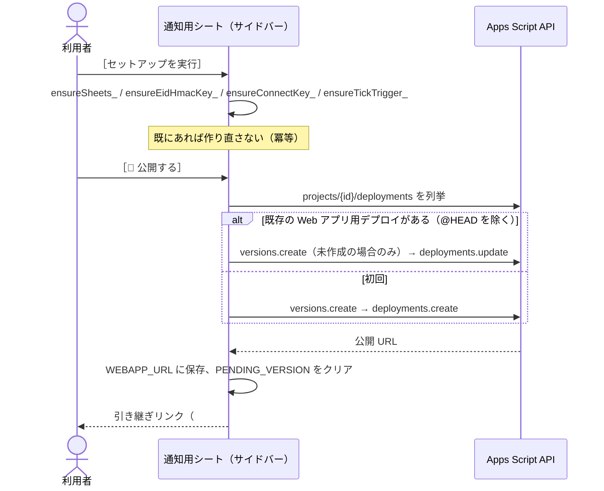
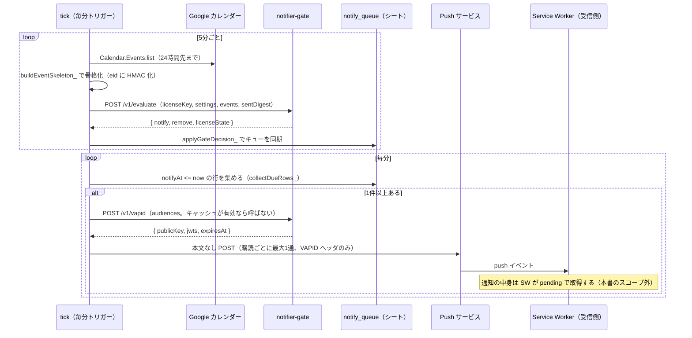
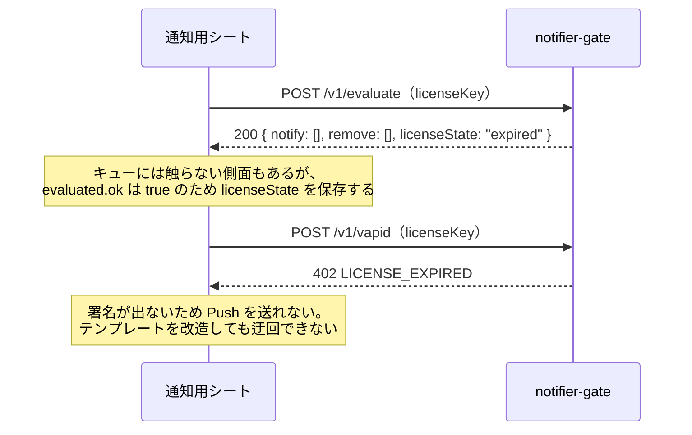
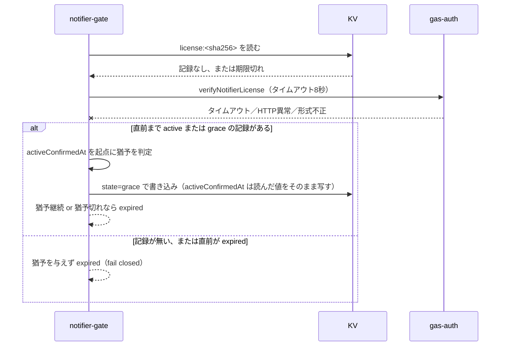
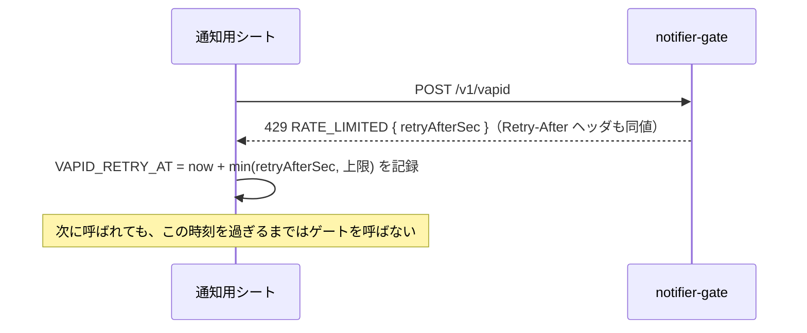

# notifier-v2｜詳細設計書

基本設計は [02_basic-design.md](./02_basic-design.md)。

---

## 1. ファイル・モジュール構成

### `gas-notifier/`（利用者に配布するテンプレート）

| ファイル | 責務 |
| --- | --- |
| `Code.gs` | スプレッドシートのメニュー（`onOpen`）。セットアップサイドバーの表示、引き継ぎリンクの再表示 |
| `Setup.gs` | 冪等なセットアップ（`setupNotifier`）、匿名化鍵・接続キーの生成、tick トリガー管理、Apps Script API 経由のワンボタン公開（`deployWebApp`）、公開 URL の正規化・指紋計算 |
| `Gate.gs` | `notifier-gate` のクライアント。`/v1/evaluate` `/v1/vapid` `/v1/test-notify` の呼び出し、VAPID キャッシュ、失敗後のバックオフ |
| `Api.gs` | `doGet` / `doPost` の入口。action ホワイトリスト、接続キー検証、各 action のハンドラ |
| `CalendarSync.gs` | `tick()`。カレンダー取得、骨格化、ゲートへの判定依頼、`notify_queue` への反映 |
| `Push.gs` | 本文なし Push の送信、期限切れ購読の掃除、テスト通知 |
| `Store.gs` | シート I/O（読み書き・行削除）、Script Properties アクセス、設定の正規化、定数（`SHEET` / `HEADERS` / `PROP`） |
| `SidebarSetup.html` | セットアップウィザードの HTML/JS |
| `appsscript.json` | マニフェスト。`oauthScopes` 7つと Calendar Advanced Service |

### `workers/notifier-gate/`（運営が持つ Cloudflare Workers）

| ファイル | 責務 |
| --- | --- |
| `src/index.mjs` | ルータ。`fetch` ハンドラ、共通ゲート処理（形の検査→レート制限→ライセンス検証） |
| `src/evaluate.mjs` | 通知判定の純関数群（`decideEvent` / `evaluateEvents` / `validateEvents` など）。fetch/KV に触れない |
| `src/license.mjs` | 認証系への照会（`verifyWithAuthGas`）、KV キャッシュの読み書き、猶予判定（`resolveLicense`） |
| `src/vapid.mjs` | 秘密鍵の読み込み（`importVapidPrivateKey`）、JWT 発行（`issueJwts` / `signJwt`）、aud の検証 |
| `src/ratelimit.mjs` | KV の固定窓カウンタ（`consumeRateLimit`） |
| `src/diagnostics.mjs` | 段階付き例外（`PhaseError`）、秘密の伏せ字化、失敗ログの一元出力 |
| `src/constants.mjs` | 判定ルール・キャッシュ期間・レート制限値・許可フィールドの集約 |
| `src/http.mjs` | 応答の形（`ok` / `fail`）、CORS ヘッダ |
| `origin.mjs` | 公開オリジンの正本。参照4か所の一致をテストで検査 |
| `wrangler.jsonc` | Workers 設定（KV バインディング、平文 vars、observability） |
| `scripts/generate-vapid-keys.mjs` / `scripts/check-vapid-keys.mjs` | 鍵生成・登録前検証（運用者が手元で実行） |

### 関連する外部モジュール（本サブシステムの外、参照のみ）

| ファイル | 関係 |
| --- | --- |
| `gas-auth/Notifier.gs` | ライセンスの発行・照会。`license.mjs` の照会先 |

---

## 2. 主要処理フロー

### 2-1. セットアップから公開まで



`deployWebApp()` は失敗しても例外にせず `{ ok:false, status, message,
helpUrl }` を返し、ウィザードが次の手（Apps Script API の有効化・手動公開）を
案内できるようにする（`Setup.gs` `deployFailure_`）。

### 2-2. 通知の定常フロー（正常系）



### 2-3. 異常系: ライセンス期限切れ



### 2-4. 異常系: 認証系（gas-auth）へ到達できない



### 2-5. 異常系: レート制限超過



---

## 3. データモデル詳細

### 3-1. 利用者のシート

シートはすべて1行目をヘッダとし、`HEADERS`（`gas-notifier/Store.gs`）の順序が
そのまま列順である。**列は末尾へのみ追加する。** 時刻列はすべてエポックミリ秒
の数値。

| シート | 列（順） | 備考 |
| --- | --- | --- |
| `settings` | `key`, `value` | key/value 形式。既定値は要件 FR-03〜05 |
| `subscriptions` | `subId`, `endpoint`, `p256dh`, `auth`, `createdAt`, `lastSuccessAt`, `lastErrorAt`, `lastError` | `subId` は購読（端末）ごとの短い識別子。404/410 応答で行を削除 |
| `notify_queue` | `key`, `eid`, `eventId`, `feature`, `timing`, `title`, `startTime`, `notifyAt`, `updatedAt` | `key` = `eid + '|' + timing`。**予定名（`title`）はここと `sent_log` にしかない** |
| `sent_log` | `key`, `eid`, `eventId`, `feature`, `timing`, `title`, `startTime`, `sentAt`, `purpose`, `fetchedBy` | `fetchedBy` はカンマ区切りの `subId` 一覧（取得済みを購読単位で管理） |

保持期間: `notify_queue` は開始時刻基準で7日、`sent_log` は送信時刻基準で30日
（`CalendarSync.gs` の `QUEUE_RETENTION_MS` / `SENT_LOG_RETENTION_MS`）。

### 3-2. 利用者の Script Properties（`PROP`）

| キー | 内容 |
| --- | --- |
| `CONNECT_KEY` | Web アプリ保護用の接続キー |
| `LICENSE_KEY` | 受信側から引き渡されたライセンスキー |
| `EID_HMAC_KEY` | 予定 ID を `eid` へ変換する秘密鍵。一度作ったら作り直さない（送信済み記録との突き合わせが壊れるため） |
| `LAST_TICK_AT` / `LAST_SYNC_AT` | 直近の tick・同期時刻 |
| `WEBAPP_URL` | `deployWebApp()` が保存した公開 URL（正）。`getUrl()` は信用しない |
| `PENDING_VERSION` | 公開処理が部分失敗したときに使い回すバージョン番号の控え |
| `DEPLOYED_VERSION` | 実際に公開されているバージョン番号 |
| `LICENSE_STATE` / `LICENSE_CHECKED_AT` | ゲートが最後に返したライセンス状態と確認時刻（画面表示用） |
| `LAST_GATE_ERROR` | ゲートとの最後の失敗（`path -> code` の形のみ。応答本文・鍵は入れない） |
| `VAPID_PUBLIC_B64URL` / `VAPID_JWTS_JSON` / `VAPID_EXPIRES_AT` | VAPID 公開鍵・JWT・有効期限のキャッシュ |
| `VAPID_RETRY_AT` / `VAPID_RETRY_CODE` | `/v1/vapid` が失敗したあと、次に呼んでよい時刻とその理由 |

### 3-3. Cloudflare KV（`LICENSE_CACHE` バインディング）

| キーの形 | 値 | TTL |
| --- | --- | --- |
| `license:<sha256(licenseKey)>` | `{ v, state, plan, checkedAt, activeConfirmedAt }` | active/expired 系は `LICENSE_CACHE_TTL_MS`（6時間）相当、grace 系は残猶予に応じて可変 |
| `rl:<scope>:<sha256(licenseKey)>:<窓番号>` | 呼び出し回数（数値文字列） | 窓幅の2倍 |

`scope` は `evaluate` / `vapid` / `testNotify` の3種。ライセンスキーは
ハッシュ化してからキー名に使う（生のキーを KV のキー名やログに出さない）。

### 3-4. ゲートへ渡してよいイベント骨格の形（`ALLOWED_EVENT_FIELDS`）

```
eid / feature / startAt / status / allDay / cancelled / timingMin
```

これ以外のキーが1つでもあれば、`validateEvents` が要求ごと拒否する
（`sentDigest` は `eid` / `feature` / `timing` / `startAt` のみ許可）。

---

## 4. インターフェース仕様

### 4-1. `notifier-gate`（運営、Cloudflare Workers）

| path | method | 認証 | 用途 |
| --- | --- | --- | --- |
| `/v1/health` | GET | 不要 | 疎通確認。版のみ返す |
| `/v1/evaluate` | POST | `licenseKey`（本文） | 通知判定 |
| `/v1/vapid` | POST | 同上 | VAPID 公開鍵・JWT 発行 |
| `/v1/test-notify` | POST | 同上 | テスト通知の許可判定 |

エラーコード（`http.mjs` `ERRORS`）:

| code | HTTP status | 意味 |
| --- | --- | --- |
| `INVALID_ACTION` | 404 / 405 | 未定義の path、または GET 以外の許可されない method |
| `INVALID_REQUEST` | 400 | 本文が読めない／形が不正（`events` / `sentDigest` / `audiences` の許可外フィールドを含む） |
| `UNAUTHORIZED` | 401 | ライセンスキーの形が不正 |
| `LICENSE_EXPIRED` | 402 | ライセンス状態が `expired`（`/v1/vapid` `/v1/test-notify` のみ。`/v1/evaluate` はエラーにせず空の判定を返す） |
| `NOT_CONFIGURED` | 500 | VAPID の環境変数が未設定 |
| `RATE_LIMITED` | 429 | レート制限超過。本文とヘッダの両方に `retryAfterSec` |
| `SERVER_ERROR` | 500 | 想定外の例外 |

入出力の詳細な JSON スキーマは
[../../../workers/notifier-gate/README.md](../../../workers/notifier-gate/README.md) §2 を正とする。

### 4-2. `gas-notifier`（テンプレート、Web アプリ）

すべて `{ ok: true, data }` / `{ ok: false, error: { code, message } }` の形
（`Api.gs` `apiOk_` / `apiFail_`）。POST 本文は `text/plain` の JSON 文字列
（プリフライト回避）。

| action | method | 接続キー | 内容 |
| --- | --- | --- | --- |
| `health` | GET | 不要 | 版・最終 tick・トリガー稼働・設定済みか・ライセンス有無・直近のゲート失敗 |
| `publicKey` | GET | 必要 | VAPID 公開鍵（未取得なら `primeVapid_` で取りに行く） |
| `getSettings` | GET | 必要 | 設定とライセンス概要 |
| `pending` | GET | 必要 | `endpoint` 必須。その購読の未取得通知を返し、取得済みにする |
| `event` | GET | 必要 | `id` 指定で1件の予定名・開始時刻 |
| `upcoming` | GET | 必要 | 直近5件の通知予定 |
| `ping` | POST | 必要 | 副作用なしの疎通確認（新しいデプロイかどうかの判定にも使う） |
| `saveSettings` | POST | 必要 | 設定の保存（サーバー側で正規化） |
| `saveSubscription` | POST | 必要 | Push 購読の upsert |
| `saveLicense` | POST | 必要 | ライセンスキーの受け取り（鍵の先取りに失敗しても action としては成功） |
| `syncNow` | POST | 必要 | 手動同期 |
| `sendTestNotification` | POST | 必要 | テスト通知（ゲートが1日1回に制限） |
| `regenerateConnectKey` | POST | 必要 | 接続キーの失効・再生成 |

エラーコード（`Api.gs` `API_ERRORS`）: `INVALID_ACTION` / `INVALID_REQUEST` /
`UNAUTHORIZED` / `NOT_CONFIGURED` / `NOT_FOUND` / `NO_LICENSE` /
`GATE_ERROR` / `SERVER_ERROR`。

詳細は [../../../gas-notifier/README.md](../../../gas-notifier/README.md) §5 を正とする。

---

## 5. 状態管理・セッション設計

本サブシステムに「ログインセッション」は無い（受信側のログインは本書の
スコープ外）。状態はすべて次の3か所に分散して持ち、いずれも読み直せば
最新化される（サーバー側にセッションストアを持たない）。

| 状態 | 保持場所 | 更新タイミング |
| --- | --- | --- |
| ライセンス状態（active/grace/expired） | ゲートの KV（正）／利用者シートの `LICENSE_STATE`（表示用の写し） | KV は照会成功時・猶予判定時。シート側は5分ごとの同期（`syncCalendar_`）でのみ更新される |
| VAPID JWT | 利用者シートの Script Properties（`VAPID_JWTS_JSON` 等） | 期限切れ、または未取得の audience がある場合にのみ取り直す（`gateVapid_`） |
| レート制限のバックオフ | 利用者シートの `VAPID_RETRY_AT` / `VAPID_RETRY_CODE` | `/v1/vapid` が失敗するたびに更新。成功、またはライセンスの入れ替えでクリア |
| 通知キュー | 利用者シートの `notify_queue` | 5分ごとの同期でゲートの判定結果と同期。tick 実行のたびに期限到来分を消化 |

**接続テスト（受信側の操作）はライセンス状態を取り直さない。** 表示される
`LICENSE_STATE` は直近の同期結果であり、最大5分の遅延がありうる
（既知の制約。§7・要件 §9 の「未確定事項」には含めず、実装上の既知挙動として
ここに明記する）。

---

## 6. エラーハンドリング詳細

| 層 | 方針 |
| --- | --- |
| `notifier-gate` の応答 | 内部情報を含めない定型コード・メッセージのみ（§4-1 のエラーコード表） |
| `notifier-gate` の実行ログ | `logFailure`（`diagnostics.mjs`）が `path` / `phase` / 例外名 / 伏せ字済みメッセージの1行を出す。秘密（VAPID 鍵・共有シークレット・ライセンスキー）は書き出す直前に `redactSecrets` で伏せる |
| `notifier-gate` の段階分け | `inPhase(phase, fn)` で例外に `phase` を付与。`hash-license` / `rate-limit` / `license-verify` / `import-key` / `sign` の5段階＋`unknown` |
| テンプレートの `doGet`/`doPost` | 未捕捉の例外は `handleUnexpected_` が `Logger.log` へ出し、応答は `SERVER_ERROR` のみ返す（スタックトレース・シート内容を含めない） |
| ゲート呼び出しの失敗（テンプレート側） | `gateFetch_` が例外を投げず `{ ok:false, error }` を返す。ライセンス未設定時はゲートを呼ばずに `NO_LICENSE` を返す（呼んでもいないものを待たせない） |
| Push 送信の失敗 | 404/410 は購読の失効とみなしその場で削除。それ以外は次回 tick へ再試行を委ねる（`sent_log` への記録は届いた場合のみ） |
| キューへの反映 | 判定を受け取れなかった同期では `notify_queue` に触れない（通信の一時的な失敗で予定表を消さない） |

---

## 7. 設定値・環境変数一覧

値は書かない。名前と役割、置き場所のみ。

### `workers/notifier-gate/wrangler.jsonc`（平文 vars・KV バインディング）

| 名前 | 役割 |
| --- | --- |
| `VAPID_SUBJECT` | VAPID JWT の `sub`（RFC 8292 の連絡先 URI） |
| `ALLOWED_ORIGINS` | CORS を許可するオリジン（カンマ区切り） |
| `AUTH_GAS_URL` | 認証系 GAS の `/exec` URL |
| `LICENSE_CACHE`（KV バインディング名） | ライセンス判定キャッシュ＋レート制限カウンタの保存先 |

### `workers/notifier-gate` のシークレット（`wrangler secret put`）

| 名前 | 役割 |
| --- | --- |
| `VAPID_PRIVATE_KEY` | VAPID 署名用の秘密鍵（PKCS#8 / JWK のいずれか） |
| `VAPID_PUBLIC_KEY` | VAPID 公開鍵（base64url） |
| `AUTH_GAS_SHARED_SECRET` | `gas-auth` との server-to-server 認証共有シークレット（`gas-auth` 側の Script Property と同値） |

### `gas-notifier` の Script Properties（利用者ごと。§3-2 の再掲）

`CONNECT_KEY` / `LICENSE_KEY` / `EID_HMAC_KEY` / `WEBAPP_URL` /
`PENDING_VERSION` / `DEPLOYED_VERSION` / `LICENSE_STATE` /
`LICENSE_CHECKED_AT` / `LAST_GATE_ERROR` / `VAPID_PUBLIC_B64URL` /
`VAPID_JWTS_JSON` / `VAPID_EXPIRES_AT` / `VAPID_RETRY_AT` /
`VAPID_RETRY_CODE` / `LAST_TICK_AT` / `LAST_SYNC_AT`。

いずれも `PropertiesService.getScriptProperties()`（そのシートの持ち主のみ
読み書き可能）。

### コード内の定数（環境変数ではないが、値を変えると全利用者に影響するもの）

`workers/notifier-gate/src/constants.mjs` の `RATE_LIMITS` /
`LICENSE_CACHE_TTL_MS` / `LICENSE_GRACE_MAX_MS` / `RENOTIFY_THRESHOLD_MS` /
`DEFAULT_PUSH_HOSTS` など。1ファイルへ集約する理由は要件 NFR-12。

---

## 8. テスト構成

| スイート名（`node tests/run.mjs <name>`） | ファイル | 対象 |
| --- | --- | --- |
| `notifier-gate` | `tests/unit/notifier-gate.mjs` | 判定ロジック・ライセンス状態遷移・VAPID 署名・匿名化・レート制限・公開オリジンの一致検査 |
| `notifier-license` | `tests/unit/notifier-license.mjs` | ライセンス発行・照会（`gas-auth/Notifier.gs` 側を含む） |
| `notifier-template` | `tests/unit/notifier-template.mjs` | `gas-notifier/*.gs` のロジック（偽 Apps Script 環境上） |
| `notifier-connection` | `tests/unit/notifier-connection.mjs` | 接続情報の保管・引き継ぎフラグメントの解釈 |
| `voice-recorder-notifier` | `tests/unit/voice-recorder-notifier.mjs` | 受信側との結合（本書のスコープ外の実装を含む） |

いずれも Node 上で実行でき、Workers ランタイム・Chrome・実際の Apps Script
環境を必要としない。`workers/notifier-gate/src/*.mjs` は Workers 固有 API に
依存しない純関数が中心のため、Node から直接 `import` してテストする
（`workers/notifier-gate/README.md` §7）。

応答の形の食い違い（例: `{success:true}` と `{ok:true}` の取り違え）を
検出するため、**実際に動かした Worker から得た応答をフィクスチャにし、
それをテンプレート側のテストへそのまま流す**方針を取っている
（`tests/helpers/gate-fixtures.mjs`。詳細は
[../../notifier-v2-design.md](../../notifier-v2-design.md) ADR-8）。

実機（本物の Apps Script・本物の Cloudflare デプロイ）での受け入れ検証は
自動テストの範囲外であり、[../../notifier-v2-acceptance-checklist.md](../../notifier-v2-acceptance-checklist.md)
に手順がある。完了範囲は要件 §9 のとおり文書からは断定できない。
