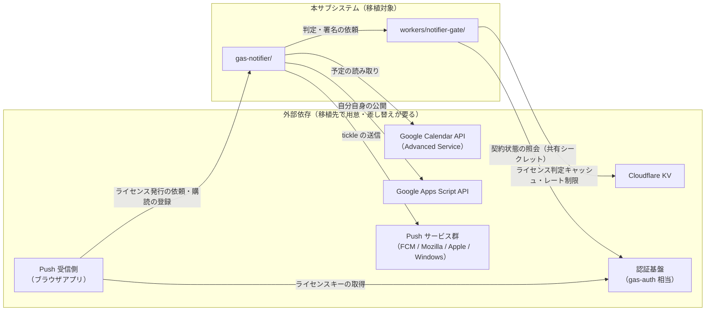

# notifier-v2｜組み込みガイド

このサブシステム（`gas-notifier/` ＋ `workers/notifier-gate/`）を、
別のプロダクトへ移植することを想定した文書。要件・設計は
[01_requirements.md](./01_requirements.md) 〜
[03_detailed-design.md](./03_detailed-design.md)。

---

## 1. 移植の前提条件

- **カレンダー予定のリマインドという1機能に閉じている。** `feature` の
  仕組み（`FEATURE_RULES`）は他の通知種別を同じ Push 基盤へ載せる余地を
  残しているが、現状は `calendar` のみ登録済みで、それ以外は未実装。
  カレンダー以外の通知に使いたい場合は、まず `evaluateEvents` の判定条件
  （出欠・終日・再通知閾値）が目的に合うかを検討すること。
- **移植先にも「利用者の Google アカウント内で完結させたい」という要件が
  あることを前提にしている。** 予定の中身（名前・説明・参加者）を運営側の
  サーバーに一切渡さない設計（NFR-01）は、この前提があって初めて価値を持つ。
  中身をサーバーで扱ってよいプロダクトであれば、匿名化・骨格化の層は
  過剰設計になりうる。
- **「利用者ごとの契約状態を検証する認証基盤」が移植先に別途必要。** 本
  サブシステムは判定と署名を運営側へ寄せているが、契約の正本管理
  （課金・会員データベース）そのものは持たない。移植先で `gas-auth` 相当の
  何かを用意するか、認証基盤を差し替える必要がある（§3）。
- Web Push の受信側（ブラウザアプリ）を持つこと。本サブシステムは送信側
  （Push を投げる側）とその判定基盤のみで、Service Worker・購読管理・
  通知の表示は移植先で用意する。

---

## 2. 依存関係マップ

**`tmpl` と `gate` は互いに、公開オリジンという1つの文字列だけで結合している。**
（`workers/notifier-gate/origin.mjs` の `NOTIFIER_GATE_ORIGIN`、
`gas-notifier/Gate.gs` の `NOTIFIER_GATE_ORIGIN` 定数）。それ以外の結合は
HTTP 越しの JSON だけで、コードレベルの import 関係はない
（Apps Script は ES モジュールを読めないため、そもそも import で結合できない）。

---

## 3. 切り離しポイント

移植先のプロダクトに合わせて必ず差し替える・検討する箇所。

| 箇所 | 現状の実装 | 差し替えの要点 |
| --- | --- | --- |
| ライセンス照会先 | `workers/notifier-gate/src/license.mjs` の `verifyWithAuthGas` が `gas-auth` の `verifyNotifierLicense` を呼ぶ | 移植先の認証基盤の照会 API に合わせて `verifyWithAuthGas` を書き換える。**「無効」と「判定できなかった（届かない）」を区別する契約**（§9 の ADR）は維持すること。混同すると認証基盤の不調が契約者の通知を止めてしまう |
| 公開オリジンの正本 | `workers/notifier-gate/origin.mjs` | 移植先のドメイン・デプロイ形態に合わせて値を変更し、参照する全箇所（`GATE_ORIGIN_FILES` に列挙）を揃える |
| テンプレートのコピー元 URL | `gas-notifier/Store.gs` の `RECORDER_APP_URL`、受信側 `notifier-config.js` の `TEMPLATE_COPY_URL` | 移植先の受信アプリの URL・テンプレートシートの URL に差し替える |
| Push サービスのホスト許可リスト | `workers/notifier-gate/src/constants.mjs` の `DEFAULT_PUSH_HOSTS` | 対象ブラウザ・OS に応じて見直す（署名を配ってよい相手を絞るための制限であり、広げるほど誤発行のリスクが増える） |
| VAPID の `sub` | `workers/notifier-gate/wrangler.jsonc` の `VAPID_SUBJECT` | 移植先運営の連絡先 URI（mailto: または https:）に差し替える |
| CORS 許可オリジン | `wrangler.jsonc` の `ALLOWED_ORIGINS` | 移植先の受信アプリの配信元に限定する |
| entitlement（利用権）の判定条件 | 本サブシステムの外（`gas-auth/Notifier.gs` の `NOTIFIER_ENTITLEMENT`） | 移植先の課金モデルに合わせて全面的に作り直す想定。ゲート側が要求する契約は「`valid` / `plan` / `status` を返す照会窓口があること」だけ |
| 通知タイミングの選択肢・既定値 | `gas-notifier/Store.gs` の `ALLOWED_TIMINGS` / `DEFAULT_SETTINGS`、`constants.mjs` の同名定数 | 両側（テンプレートとゲート）で一致させること。片方だけ変えると「シートは通すがゲートが拒否する」不整合が起きる |

---

## 4. 必要な外部サービスと設定作業の概要

値は書かない。作業の種類のみ。

| サービス | 必要な設定 |
| --- | --- |
| Google Cloud / Apps Script | テンプレート用の Google アカウント・プロジェクトで Calendar Advanced Service と Apps Script API を有効化する（利用者側は初回承認時に自動で促される） |
| Cloudflare Workers | アカウントの用意、`wrangler` によるデプロイ、KV namespace の作成とバインディング、VAPID 秘密鍵・公開鍵・共有シークレットの `wrangler secret put` 登録 |
| VAPID 鍵ペア | 生成（`scripts/generate-vapid-keys.mjs` 相当）、登録前検証（`scripts/check-vapid-keys.mjs` 相当）を必ず経由してから登録する。**登録後は読み返せない** |
| 認証基盤（移植先で用意） | 「ライセンスキーの発行」「共有シークレットでの照会窓口」の2 action を持つこと。契約状態の正本管理は移植先の責務 |
| Push 受信側 | Service Worker の登録、`PushManager.subscribe` の実装、通知の表示ロジック。本サブシステムのスコープ外 |

---

## 5. 複製時の注意

本リポジトリの複製方針（[../../repository-structure.md](../../repository-structure.md) §4）に従い、
**「動いているコードをそのまま写す」のではなく、既知の不具合を直してから写す。**

移植（＝複製）時に持ち込まないほうがよい、実装時に踏んだ既知の事象:

- **判定だけを移して署名を移し忘れると、迂回可能な状態に戻る。** V1 の
  欠陥（判定を利用者側に残し、署名まで利用者側で完結させてしまう）を
  そのまま再現しないこと。判定と署名は必ず対で運営側に置く（要件 §1 の背景）。
- **レート制限の上限だけを移し、失敗時の振る舞い（`retryAfterSec` の伝播、
  呼び出し側のバックオフ、`saveLicense` が鍵の先取り失敗でも成功を返す設計）を
  移し忘れると、実機で「成功しないと呼び出しが減らないのに呼べない」という
  詰み状態を再現する。** 詳細は
  [../../notifier-design-notes.md](../../notifier-design-notes.md) §10。
- **猶予（grace）の起点を「照会に失敗した時刻」にしないこと。** KV
  （または類似の結果整合ストア）を使う場合、起点は「最後に成功を確認できた
  時刻」に寄せないと、打ち切り時刻が非決定的になる（§9 の ADR、
  [02_basic-design.md](./02_basic-design.md) §9）。
- **公開 URL の冪等性（`update` であって `create` ではない）を落とさないこと。**
  再デプロイのたびに URL が変わると、受信側の接続設定が黙って無効になる。
- **匿名化の鍵（`EID_HMAC_KEY` 相当）を作り直す条件を緩めないこと。** 送信済み
  記録と突き合わせて再通知の判定を行っているため、鍵を作り直すと過去の
  送信記録が読めなくなり、通知が重複する。

移植先で新たに見つけた不具合・不足があれば、複製元（本サブシステム）へも
還元することを検討する（[../../repository-structure.md](../../repository-structure.md) §4-3 と同じ考え方）。

---

## 6. 最小組み込み手順

1. **`workers/notifier-gate/` を移植先のリポジトリ／プロジェクトへコピーする。**
   `origin.mjs` の値と `wrangler.jsonc` のサービス名・アカウント ID を
   移植先のものへ差し替える。
2. **認証基盤の照会窓口を実装する。** `src/license.mjs` の
   `verifyWithAuthGas` を、移植先の認証基盤と通信する実装へ置き換える。
   「無効」と「届かなかった」を区別する契約（§3）を崩さないこと。
3. **VAPID 鍵を生成し、登録前検証を経てからシークレットとして登録する。**
   共有シークレットも同様に、ゲート側と認証基盤側の両方へ同じ値を入れる。
4. **KV namespace を作成し、`wrangler.jsonc` にバインドしてデプロイする。**
   `/v1/health` が疎通することを確認する。
5. **`gas-notifier/` をテンプレートとして用意する。** `Gate.gs` の
   `NOTIFIER_GATE_ORIGIN` を移植先のゲート URL に、`Store.gs` の
   `RECORDER_APP_URL` を移植先の受信アプリ URL に差し替える。
   `appsscript.json` のスコープはそのまま（データへの経路を増やしていない
   構成を維持する）。
6. **テンプレートシートを1つ作り、`.gs` / `.html` を貼り付けて配布用の
   コピー元とする。** `setupNotifier()` は運営者側では実行しない
   （利用者がコピーした後に実行する運用を守る。要件 §1 の背景を参照）。
7. **受信側（Push 受信アプリ）を実装する。** ライセンスキーの取得と
   `saveLicense` への引き渡し、`saveSubscription` での購読登録、
   Service Worker からの `pending` 取得、通知表示までを実装する
   （本サブシステムのスコープ外）。
8. **単体テスト（`workers/notifier-gate/` の `src/*.mjs` に対応するテスト）を
   移植し、Node 上で判定ロジック・レート制限・VAPID 署名を検証してから、
   実機（本物の Apps Script・本物のデプロイ）での受け入れ検証に進む。**
