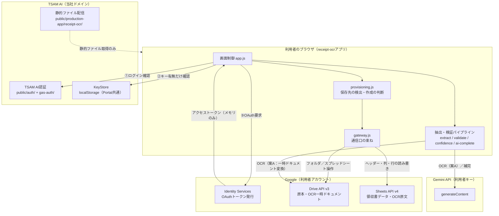
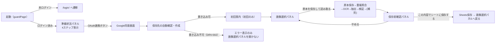

# receipt-ocr 基本設計書

前提：[01_requirements.md](./01_requirements.md)。要件のFR/NFR番号を本書から参照する。

---

## 1. システム構成

サーバーコードを持たないブラウザ完結アプリである。利用者のブラウザが、TSAM AI認証・Google API・Gemini APIへ直接通信する。当社が提供するのは静的ファイルとPortalのKeyStore（APIキーの保管庫。ブラウザのlocalStorageに閉じており、当社サーバーは中身を扱わない）のみである。



当社ドメインへの通信は「静的ファイルの取得」と「TSAM AI認証の確認」だけであり、領収書画像・OCR文字列・抽出データ・Geminiキー・OAuthトークンはいずれも当社ドメインへ送信されない（NFR-04）。

---

## 2. コンポーネント一覧と責務

| ファイル | 責務 |
| --- | --- |
| `index.html` | 画面構造。CSPをmeta要素で宣言し、`app.js`を`type="module"`で読み込む |
| `app.js` | 画面制御の中枢。3層ガードの実行、画面遷移、各モジュールの呼び出し順序（FR-01〜FR-24の統括） |
| `config.js` | 静的設定の単一の置き場（OAuthクライアントID・スコープ、OCRエンジン選択、Geminiモデル名、保存先の名前、画像サイズ上限、Google APIエンドポイント） |
| `errors.js` | 表示用エラーコード体系（`AppError`）、進捗（`PROGRESS`）、誘導区分（`GUIDE`）、Google APIステータス→表示コードの変換 |
| `oauth.js` | GISの読み込み（失敗時は再試行可能・10秒のタイムアウト）とOAuthトークン取得・保持（メモリのみ）。付与スコープの検証。`currentToken()` / `forgetToken()` / `hasValidToken()` |
| `google-api.js` | Google APIへの低レベルfetchラッパー（`callGoogle` / `callGoogleJson` / `callGoogleText`）。宛先をここへ集約 |
| `drive.js` | Drive API v3の操作（検索・作成・アップロード・移動・削除）。permissions系のAPIは呼ばない（NFR-09） |
| `sheets.js` | Sheets API v4の操作（構造取得・ヘッダー読み書き・行追加・数式インジェクション対策・フィルタビュー/保護範囲作成） |
| `gateway.js` | `provisioning.js`から見た通信口。Drive/Sheetsの実装を1枚の関数群に束ね、テスト時に偽物へ差し替えられる形にする |
| `provisioning.js` | 保存先の検出→作成の判断ロジック（FR-02・FR-03）。通信はgateway経由のみで、判断ロジック自体は純関数に近い |
| `schema.js` | スプレッドシートの構造定義（タブ名・列定義・スキーマ版）とヘッダー検証・列文字変換などの純関数 |
| `store.js` | 保存先ID（フォルダ・スプレッドシートID）のlocalStorageキャッシュ。localStorageを直接触るのはこのファイルとKeyStoreのみ |
| `hash.js` | 画像のSHA-256計算（Web Crypto API）、重複列内の一致検索 |
| `datetime.js` | Asia/Tokyo基準の日時整形（フォルダ名・タイムスタンプ） |
| `amount.js` | 金額文字列の正規化と金額らしい部分文字列の抽出（FR-08の前処理） |
| `ocr.js` | OCRエンジンの差し替え口。`config.js`の`OCR_ENGINE`で`ocr-drive.js`/`ocr-gemini.js`を切り替える |
| `ocr-drive.js` | 案A：画像をGoogleドキュメントへ変換してテキスト化し、一時ドキュメントを即時削除する。消し損ねた分は起動時に回収する |
| `ocr-gemini.js` | 案C：画像をGeminiへ直接投入して文字起こしのみ行わせる |
| `gemini-client.js` | Gemini APIの低レベル呼び出し。モデルの404時1回フォールバック、ステータス→表示コードの変換 |
| `extract.js` | ルール抽出（FR-08）。日付・合計金額・支払先・電話番号・レシートNo.・登録番号・消費税内訳・支払方法・勘定科目候補 |
| `validate.js` | 金額・日付の妥当性検証、税額逆算、必須項目検証（FR-09） |
| `confidence.js` | 信頼度スコアリングと高中低分類（FR-10） |
| `completion-policy.js` | Gemini補完の要否判定（FR-11） |
| `ai-complete.js` | Gemini呼び出し（独立抽出・スキーマ・サニタイズ・リトライ）、evidence照合、ルール値との突合（FR-12〜FR-14） |
| `review.js` | 保存前確認画面のモデル組み立て、利用者修正の反映、保存レコードの組み立て（FR-15〜FR-17） |
| `duplicate.js` | 重複判定の純関数（完全一致・類似。FR-06） |
| `record.js` | 管理IDの生成、行データへの変換、シートへの2段階書き込み（FR-18） |
| `status.js` | ステータス体系の定数と、抽出方式・重複状態の決定関数 |
| `settings.js` | 「設定」タブの値→実行時のしきい値（読めない値は既定へ落とし、落とした設定名を返す） |
| `image.js` | アップロード前の縮小（利用者が選んだときだけ）とHEICの判別 |
| `style.css` | 画面のスタイル |

---

## 3. 外部インターフェース一覧

| 連携先 | 通信方式 | 用途 |
| --- | --- | --- |
| Google Identity Services | `<script>`読み込み＋`google.accounts.oauth2.initTokenClient`（暗黙フロー） | OAuthアクセストークンの取得 |
| Google Drive API v3 | REST（fetch、`Authorization: Bearer`） | ファイル検索・作成・アップロード（multipart）・移動・削除、OCR用一時ドキュメントの変換・エクスポート |
| Google Sheets API v4 | REST（fetch、`Authorization: Bearer`） | スプレッドシート作成・構造取得・値の読み書き・batchUpdate（フィルタビュー・保護範囲・タブ追加） |
| Gemini API | REST（fetch、`x-goog-api-key`） | OCR文字列（または画像）からの独立抽出。Structured Output |
| TSAM AI認証 | `public/auth/api.js`経由（Apps Script Webアプリ） | セッション検証（`guardPage()`が内部で呼ぶ） |
| Portal KeyStore | 関数呼び出し（`KeyStore.get` / `KeyStore.has`） | Gemini APIキーの読み取りのみ。書き込みUIは本アプリに無い |

---

## 4. データ設計概要

保存先はすべて利用者本人のGoogleドライブ・スプレッドシートであり、当社側にデータベースは存在しない。

```text
マイドライブ/TSAM AI/領収書データ/
├─ 原本/YYYY/MM/          … 原本画像（保存時に随時作成）
└─ 領収書データ（スプレッドシート）
    ├─ タブ「領収書データ」   … 管理ID・利用日・支払先・金額・検証/信頼度/確認状態 等（33列）
    ├─ タブ「OCR原文」       … 管理ID・OCR原文・保存日時（メインシートと分離）
    ├─ タブ「店舗マスタ」     … 勘定科目候補の突合元（初期値は空。§9未確定事項）
    └─ タブ「設定」          … スキーマ版・各種しきい値
```

* 列構成の正は`schema.js`（`DATA_COLUMNS`等）であり、その根拠は`docs/specs/receipt-ocr-v1.3.md` §16.1〜16.3。詳細は[03_detailed-design.md](./03_detailed-design.md) §3
* localStorageには保存先ID（フォルダ・スプレッドシートID）のみをキャッシュする。正本は常にドライブ上の実体であり、キャッシュが消えても名前検索で再発見する（FR-02）
* Portal共通のlocalStorage（`tsam-api-keys`）にGeminiキーが1件JSON形式で保存される。本アプリはこれを読み取るのみで、キー管理UIを持たない

---

## 5. 画面一覧と画面遷移

単一画面（`index.html`）内で、パネルの表示・非表示により状態を切り替える構成。



* 準備状況パネルの4ステップ：①TSAM AIログイン、②Googleドライブとの連携、③Gemini APIキー、④保存先
* 保存前確認パネルは、原本画像・抽出値の入力欄・AI値との食い違い表示・警告・重複メッセージを1画面にまとめる（FR-15）
* エラー・進捗メッセージは共通の1行表示領域（`role="status"`）に出す

---

## 6. 認証・認可方式

3層ガード（FR-01）。上位が通らなければ下位へ進まない。

1. **TSAM AI認証**：共通実装`guardPage()`（`public/auth/session.js`）を使う。セッショントークンをサーバー（Apps Script `gas-auth/`）へ照会し、有効な利用者が返るまで画面本体を描画しない。独自実装は禁止（既存の他アプリと同じ規約）
2. **Google OAuth**：GISの暗黙フローで`drive.file`スコープのみを要求する。アクセストークンは`oauth.js`のクロージャ変数にのみ保持し、外部へ参照を渡さない。期限は60秒早めに切り、`currentToken()`が期限切れなら`OAUTH-001`を投げる
3. **Geminiキー**：`KeyStore.has(PROVIDERS.gemini)`で有無のみ確認する。値そのものは画面に出さない。既定のOCRエンジン（案A）はキー不要のため、未設定でも処理を止めず案内のみ表示する

---

## 7. エラー処理方針

* すべてのエラーは`AppError`（`code` / `progress` / `detail`）で表現し、Google APIやGemini APIの応答本文をそのまま画面へ出さない（NFR-01のXSS対策と表裏）
* エラー表示には必ず`PROGRESS`（`none` / `original-saved` / `sheet-saved`）を添え、「どこまで完了しているか」を利用者に伝える（FR-23）。原本保存後にシート保存が失敗した場合、原本の二重アップロードを防ぐための重要な情報になる
* `describeError()`が未知のコードでも例外を投げず`UNKNOWN`＋汎用文言へ落とす
* 誘導区分（`GUIDE`）に応じて、ログイン画面（`LOGIN`）・Portalのキー設定（`PORTAL_KEY`）・再連携ボタンの表示（`REAUTH`）を`app.js`側で出し分ける
* **`REAUTH`はトークン破棄を伴うため、「再連携で直る失敗」にだけ付ける。** レート制限（`RATE-001`）や一時障害（`SRV-001`）に付けると、待てば直る問題を再連携しても直らない問題に変えてしまう（2026-08-18に403の分類を是正。[receipt-ocr-findings-20260804.md](../../receipt-ocr-findings-20260804.md) #2）
* 失敗は「利用者が次に何をすればよいか」で分ける。待つ（`RATE-001`/`SRV-001`）・通信を確かめる（`NET-001`）・容量を空ける（`DRV-003`）・連携し直す（`OAUTH-001`/`OAUTH-002`/`DRV-004`）・利用者にできることが無い（`SYS-001`/`AI-003`）
* エラーコード体系は名刺OCR（`card-ocr`）と共通の命名規則を用いるが、実装は複製であり中身は別（詳細は[03_detailed-design.md](./03_detailed-design.md) §4・[04_integration-guide.md](./04_integration-guide.md) §5）

---

## 8. 運用・デプロイ構成

* ビルド工程を持たない静的ファイル一式（HTML/CSS/JS）であり、`public/production-app/receipt-ocr/`にそのまま置く
* 配信はリポジトリ全体の配信基盤（Cloudflare Workers。`npm run deploy`による手動デプロイ）に従い、本アプリ専用のデプロイ手順は存在しない
* サーバーコード・データベース・環境変数（サーバー側）を持たないため、本アプリのための追加インフラは無い
* 監視・ログ収集は行わない。当社側でエラー率や利用状況を集計する仕組みは無い（NFR-07）

---

## 9. 主要な設計判断と採らなかった選択肢

* **サーバーレス化（v1.3→v2.0）。** v1.3はApps Script APIが会社シートへ集約するモデルだったが、「利用者の資格情報・データを当社が一切扱わない」という方針（v2 §0.1）を満たすため、GASサーバーと2段階フローを全廃し、Google API呼び出しをすべてブラウザから利用者トークンで直接行う構成へ転換した。代償として、v1.3が持っていた冪等性制御（idempotencyKey）・排他制御（LockService）・処理台帳は防御対象（会社シート）ごと消滅し、保存前確認画面・保存ボタンの無効化・ハッシュ照合で二重登録を代替的に防ぐ構成にした（v2 §5末尾）
* **OCRエンジンを差し替え可能にした。** `ocr.js`が`ocr-drive.js`／`ocr-gemini.js`を同一インターフェース（`recognize` / `requiresApiKey`）で呼び分ける。フェーズ0の実測比較で主経路を変える可能性があるための構造（v2 §0.2・§22.4相当）であり、比較のたびに呼び出し側を書き換えずに済む
* **判断（provisioning.js）と通信（gateway.js）を分離した。** 保存先の「壊れた状態」への対応（v2 §9.3の6パターン）を実通信なしにテストするため。gateway.jsは通信の実装だけを持ち、分岐ロジックを持たない
* **列の削除・並べ替えを禁止し、右端への追加のみ許可した（`schema.js`）。** 利用者のシートは当社が管理できない資産であるため、後方互換を壊す変更をしない。ヘッダーの完全一致検証で改変を検出し、位置を推測して書き込む（＝データを静かに壊す）よりも書き込み停止を選ぶ
* **Gemini補完を独立抽出にした。** ルール抽出の候補をプロンプトへ含めると、Geminiがルールの誤りをそのまま追認する「アンカリング」が起きる。OCR原文のみから独立に抽出させ、突合をコード側で行うことで、2つの方法で読んで確かめ合う構成にした（v1.3 §12.2）
* **信頼度はコード側で算出し、Geminiの自己申告値を使わない。** LLMの自己申告確信度は校正されておらず、自動確定の根拠にできないため（v1.3 §14）
