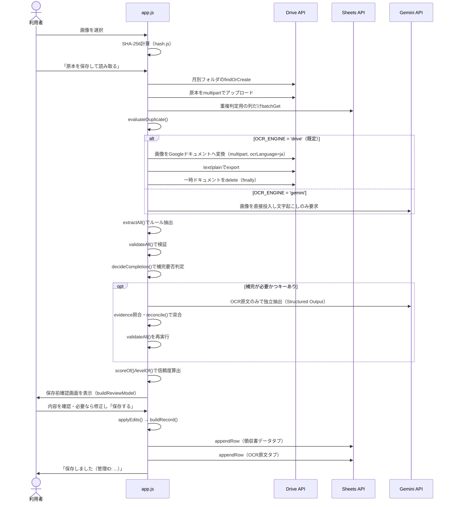
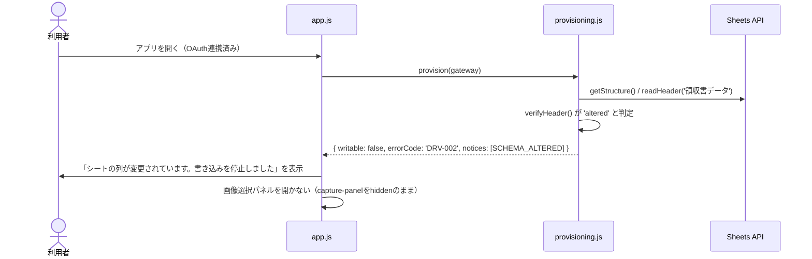
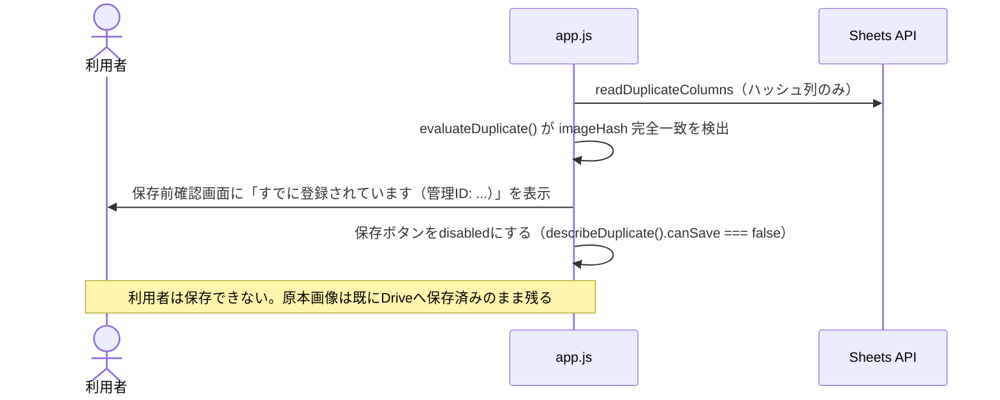

# receipt-ocr 詳細設計書

前提：[01_requirements.md](./01_requirements.md)・[02_basic-design.md](./02_basic-design.md)。

---

## 1. ファイル・モジュール構成

すべて `public/production-app/receipt-ocr/` 配下。ES Modulesとして`app.js`から`import`される（ビルド工程なし、ブラウザがそのまま解釈する）。

| パス | 主な公開関数・値 | 責務 |
| --- | --- | --- |
| `index.html` | — | 画面構造、CSP宣言（meta要素） |
| `app.js` | `start()`（エントリポイント） | 画面制御。3層ガード実行、各モジュールの呼び出し順序を統括 |
| `config.js` | `OAUTH` `OCR_ENGINE` `GEMINI` `DRIVE_NAMES` `TIME_ZONE` `IMAGE_MAX_EDGE_PX` `ACCEPTED_IMAGE_TYPES` `GOOGLE_API` `isOauthConfigured()` | 静的設定値の単一の置き場（詳細は§7） |
| `errors.js` | `AppError` `ERRORS` `PROGRESS` `GUIDE` `mapGoogleError()` `describeError()` | 表示用エラー体系 |
| `oauth.js` | `requestAccess()` `currentToken()` `forgetToken()` `hasValidToken()` `hasRequiredScope()` `isGisLoaded()` `resetGisLoader()` `resetPendingRequest()` | GIS読み込み（失敗時の再試行・10秒のタイムアウト）とOAuthトークンの保持（クロージャ変数のみ）、付与スコープの検証 |
| `google-api.js` | `callGoogle()` `callGoogleJson()` `callGoogleText()` `quoteDriveQueryValue()` | Google APIへのfetchラッパー。エラーをAppErrorへ変換 |
| `drive.js` | `getFileMeta()` `findByName()` `findByNameContains()` `createFolder()` `findOrCreateFolder()` `ensureMonthFolder()` `uploadImage()` `moveFile()` `deleteFile()` `createBoundary()` | Drive API v3操作、multipartのboundary生成（乱数由来） |
| `sheets.js` | `getStructure()` `readHeader()` `readColumn()` `readDuplicateColumns()` `writeRange()` `appendRow()` `batchUpdate()` `createSpreadsheet()` `writeAllHeaders()` `writeSchemaVersion()` `readSettings()` `writeStoreMaster()` `appendMissingColumns()` `createReviewViewAndProtection()` `escapeFormula()` | Sheets API v4操作、数式インジェクション対策 |
| `gateway.js` | `createGateway({accessToken})` | Drive/Sheetsの通信口を1つのオブジェクトに束ねる |
| `provisioning.js` | `provision()` `assertWritable()` | 保存先の検出・作成・健全性検査の判断ロジック |
| `schema.js` | `DATA_COLUMNS` `OCR_TEXT_COLUMNS` `STORE_MASTER_COLUMNS` `SETTINGS_COLUMNS` `TABS` `SCHEMA_VERSION` `verifyHeader()` `missingTabs()` `columnLetter()` | スプレッドシート構造の定義と検証純関数 |
| `store.js` | `readLocations()` `writeLocations()` `clearLocations()` `isStoreAvailable()` | 保存先IDのlocalStorageキャッシュ |
| `hash.js` | `sha256OfBlob()` `sha256Hex()` `findDuplicateIndex()` | 画像ハッシュの計算 |
| `datetime.js` | `yearMonthPath()` `timestamp()` `dateStamp()` | Asia/Tokyo基準の日時整形 |
| `amount.js` | `normalizeAmount()` `findAmounts()` `toHalfWidth()` | 金額の正規化・抽出前処理 |
| `ocr.js` | `recognize()` `activeEngine()` `requiresApiKey()` `collectOrphans()` `ENGINES` | OCRエンジンの差し替え口 |
| `ocr-drive.js` | `recognize()`（`ENGINE_ID='drive'`） `collectOrphanTempDocs()` `buildTempDocName()` `isTempDocName()` | 案A：画像→Googleドキュメント変換→テキスト取得→即時削除。消し損ねた一時ドキュメントの回収 |
| `ocr-gemini.js` | `recognize()`（`ENGINE_ID='gemini'`） | 案C：画像をGeminiへ直接投入し文字起こしのみさせる |
| `gemini-client.js` | `generate()` `textOf()` `mapGeminiError()` | Gemini API低レベル呼び出し、モデル404時1回フォールバック |
| `extract.js` | `extractAll()` `toValues()` `parseDate()` `extractUsedOn()` `extractTotalAmount()` `extractPayee()` 等 | ルール抽出（v1.3 §10全項目） |
| `validate.js` | `validateAll()` `validateAmount()` `validateDate()` `validateRequired()` `checkBaseSum()` | 妥当性検証（v1.3 §13） |
| `confidence.js` | `scoreOf()` `levelOf()` `shouldHighlight()` `POINTS` `DEFAULT_THRESHOLDS` | 信頼度スコアリング（v1.3 §14） |
| `completion-policy.js` | `needsCompletion()` `decideCompletion()` `SKIP_REASON` | Gemini補完要否判定（v1.3 §11） |
| `ai-complete.js` | `complete()` `reconcile()` `reconcileField()` `evidenceExists()` `parseResponse()` `responseSchema()` | Gemini独立抽出・突合・evidence照合（v1.3 §12.2〜12.5・§13.3） |
| `review.js` | `buildReviewModel()` `applyEdits()` `buildRecord()` `conflictedAiValues()` `REVIEW_FIELDS` | 保存前確認画面のモデル化と保存レコードの組み立て |
| `duplicate.js` | `evaluateDuplicate()` `describeDuplicate()` `toRows()` `DUPLICATE_COLUMN_KEYS` | 重複判定純関数 |
| `record.js` | `newRecordId()` `toDataRow()` `toOcrTextRow()` `saveRecord()` | 管理ID生成、行データ変換、2段階書き込み |
| `status.js` | `REVIEW_STATUS` `DUPLICATE_STATUS` `EXTRACTION_METHOD` `CONFIDENCE_LEVEL` `REGISTRATION_STATUS` `TAX_NOTATION` `decideExtractionMethod()` `toDuplicateStatus()` | ステータス体系の定数と決定関数 |
| `settings.js` | `resolveSettings()` `readInteger()` `readBoolean()` `RANGES` `FALLBACK_SETTINGS` | 「設定」タブの文字列 → 実行時のしきい値。読めない値は既定へ落とし、落とした設定名を返す（§3.4） |
| `image.js` | `shrinkToJpeg()` `fitSize()` `isHeic()` `shouldShrink()` `COMPRESSION_STEPS` `MAX_EDGE` | アップロード前の縮小（**利用者が選んだときだけ**）とHEICの判別（§14） |
| `style.css` | — | 画面スタイル |

---

## 2. 主要処理フロー

### 2.1 正常系：画像選択から保存まで

この図に現れない前後の処理が2つある（いずれも2026-08-18に追加）。

* **起動直後**：プロビジョニング成功後に、①「設定」タブの読み込み（`applySheetSettings()`）②消し損ねたOCR一時ドキュメントの回収（`collectTempDocs()`）を行う。どちらも失敗しても保存の妨げにはしない
* **画像選択後・原本保存前**：チェックボックスが有効なときだけ`shrinkToJpeg()`で縮小し、原本アップロードとOCRの両方にその画像を使う。**SHA-256は選ばれた元のファイルから計算する**（重複判定を安定させるため）

### 2.2 異常系：起動時にシート構造の改変を検出

列位置を推測して書き込むことはしない（利用者の過去データを静かに壊すことを避けるため。§9.3）。

### 2.3 異常系：完全一致の重複を検出

---

## 3. データモデル詳細

### 3.1 タブ「領収書データ」（`schema.js` `DATA_COLUMNS`。スキーマ版1.0）

v1.3 §16.1の列構成から、サーバー専用列（idempotencyKey・processingStatus・登録者〈申告値〉）を削除したもの。列は右端への追加のみ許可し、既存列の削除・並べ替え・改名は行わない（§9.4）。

| key | 見出し | 型 | 必須 |
| --- | --- | --- | --- |
| recordId | 管理ID | 文字列 | ○ |
| createdAt | 登録日時 | 文字列 | |
| usedOn | 利用日 | 文字列 | ○ |
| payee | 支払先 | 文字列 | ○ |
| phoneNumber | 電話番号 | 文字列 | |
| addressee | 宛名 | 文字列 | |
| note | 但し書き | 文字列 | |
| receiptNumber | レシートNo. | 文字列 | |
| summary | 摘要 | 文字列 | |
| accountCandidate | 勘定科目候補 | 文字列 | |
| accountSource | 科目候補の出所 | 文字列 | |
| accountConfirmed | 科目確定フラグ | 文字列（初期値「未確定」） | |
| totalAmount | 合計金額 | 数値 | ○ |
| taxTotal | 消費税合計 | 数値 | |
| tax8Base | 8％対象額 | 数値 | |
| tax8Amount | 8％消費税額 | 数値 | |
| tax10Base | 10％対象額 | 数値 | |
| tax10Amount | 10％消費税額 | 数値 | |
| taxNotation | 対象額の表記区分 | 文字列（税込/税抜/不明） | |
| paymentMethod | 支払方法 | 文字列 | |
| registrationNumber | 登録番号 | 文字列 | |
| registrationStatus | 登録番号状態 | 文字列（取得済み/記載なし（免税の可能性）/読取失敗） | |
| originalFileName | 原本ファイル名 | 文字列 | |
| originalFileId | 原本ファイルID | 文字列 | |
| originalUrl | 原本画像URL | 文字列 | ○ |
| imageHash | SHA-256 | 文字列 | |
| extractionMethod | extractionMethod | 文字列（RULE/GEMINI/HYBRID/MANUAL） | |
| completionUsed | 補完実施 | 文字列（実施/未実施） | |
| confidenceScore | 信頼度スコア | 数値 | |
| confidenceLevel | 信頼度区分 | 文字列（高/中/低） | |
| reviewStatus | reviewStatus | 文字列（NOT_REQUIRED/REQUIRED/REVIEWED） | |
| duplicateStatus | duplicateStatus | 文字列（NONE/CANDIDATE/EXACT） | |
| warnings | 警告内容 | 文字列（` / `区切り） | |
| updatedAt | 更新日時 | 文字列 | |

見出し名の一部はv1.3から改称している（`schema.js`のコメントに承認日を記録）：C「API受付日時」→「登録日時」、U「補完実施有無（第2段階）」→「補完実施」。v2.0にはAPIも2段階フローも存在しないため。

### 3.2 タブ「OCR原文」

| key | 見出し |
| --- | --- |
| recordId | 管理ID |
| text | OCR原文 |
| savedAt | 保存日時 |

メインシートと分離する理由：機密情報の集約回避、メインシートの可読性・性能維持、閲覧権限を分けられる構成にするため（v1.3 §16.2）。

### 3.3 タブ「店舗マスタ」

| key | 見出し |
| --- | --- |
| keyword | 店舗キーワード |
| officialName | 正式名称 |
| phoneNumber | 電話番号 |
| accountCandidate | 勘定科目候補 |
| summaryDefault | 摘要初期値 |
| enabled | 有効・無効 |
| note | 備考 |

初期値は空配列で作成される（`INITIAL_STORE_MASTER`）。経理担当による初期値定義は未確定（[01_requirements.md](./01_requirements.md) §9-3）。

### 3.4 タブ「設定」

`設定名` / `値` / `説明` の3列。1行目にスキーマバージョン、2行目以降に下表の初期値を新規作成時のみ書き込む（既存シートの値は上書きしない）。

| 設定名 | 初期値 | 用途 |
| --- | --- | --- |
| OCR文字数の最低基準 | 30 | これ未満はAI補完せず要確認 |
| 金額の上限 | 10,000,000 | これ以上は要確認 |
| 日付の過去閾値（日） | 365 | これより古い日付は要確認 |
| 信頼度しきい値（高） | 120 | このスコア以上を「高」とする（暫定値） |
| 信頼度しきい値（中） | 60 | このスコア以上を「中」とする（暫定値） |
| 重複判定 | TRUE | 同一画像の重複判定を行うか |
| 類似判定 | TRUE | 同日・同店舗・同金額の類似警告を出すか |
| Gemini使用 | TRUE | AI補完を使うか |

**2026-08-18に配線した。** それ以前は`readSettings()`の呼び出し元が存在せず、シート上で値を変えても挙動は変わらなかった（検証・信頼度計算は常に`DEFAULT_LIMITS`/`DEFAULT_THRESHOLDS`で行われていた）。

現在の経路は次のとおり。

1. `app.js`の`runProvisioning()`が、プロビジョニング成功後に`gateway.readSettings(spreadsheetId)`を呼ぶ
2. `settings.js`の`resolveSettings()`が「設定名 → 文字列」を実行時の設定へ変える
3. `app.js`が`validateAll(..., {limits})`・`levelOf(score, thresholds)`・`decideCompletion({minOcrLength, geminiEnabled})`へ渡す

| 設定名 | 反映先 | 受け付ける範囲 |
| --- | --- | --- |
| 金額の上限 | `validate.js`の`limits.maxAmount` | 1,000〜1,000,000,000の整数 |
| 日付の過去閾値（日） | `validate.js`の`limits.pastDateLimitDays` | 1〜36,500の整数 |
| 信頼度しきい値（高）／（中） | `confidence.js`の`levelOf()` | 0〜200（満点）の整数。**高 ≧ 中**であること |
| OCR文字数の最低基準 | `completion-policy.js`の`minOcrLength` | 0〜10,000の整数 |
| Gemini使用 | `completion-policy.js`の`geminiEnabled` | TRUE/FALSE（1/0・はい/いいえ等の揺れも受ける） |
| 重複判定／類似判定 | **未配線**（`duplicate.js`は常に判定する） | — |

設計上の約束が3つある。

* **読めない値は既定へ落とす（安全側）。** 例外を投げて画面を止めない。設定タブは利用者が自由に編集でき、空欄・全角・打ち間違いが入りうる
* **落としたことを黙っていない。** `resolveSettings()`は無視した設定名を`ignored`で返し、`app.js`が画面の案内へ書き足す。黙って落とすと、利用者は「変えたつもり」のまま使い続ける
* **信頼度の高・中は必ず対で採る。** 片方だけ有効な場合や高＜中の逆転がある場合は、両方とも既定へ戻す（`levelOf()`の分岐が意味を失うため）
* 極端な値（例：金額の上限に`1`）は打ち間違いとみなして既定へ落とす。全件が「上限超過」になる状態を、設定が原因だと気付ける利用者は多くない
* `taxToleranceYen`（税額逆算の許容差）は**設定タブに項目が無い**ため、コード側の既定のままである。設定名を実装側で勝手に増やさない

### 3.5 localStorageキャッシュ（`store.js`）

キー `tsam-receipt-ocr-locations` に、`rootFolderId` / `appFolderId` / `originalsFolderId` / `spreadsheetId` の4つのファイルIDをJSONで保持する。値は`isFileId()`（`/^[A-Za-z0-9_-]{10,200}$/`）で形式検証し、不正な値は無視する。

---

## 4. インターフェース仕様

サーバーAPIは存在しないため、「インターフェース」は①Google/Gemini APIの呼び出し規約と、②モジュール間の主要関数の入出力を指す。

### 4.1 主要関数の入出力

| 関数 | 入力 | 出力 |
| --- | --- | --- |
| `provision(gateway, {locations})` | gateway（§4.2）、既存キャッシュ | `{status, writable, locations, notices, errorCode?}` |
| `recognize({blob, accessToken, apiKey, displayName, engineId})`（ocr.js） | 画像Blob、トークン、キー（案C時必須） | `{engine, text, empty}` |
| `extractAll(ocrText, {storeMaster})` | OCR文字列、店舗マスタ配列 | `{lines, usedOn, payee, totalAmount, phoneNumber, receiptNumber, registration, tax, paymentMethod, account}`（各項目は`{value, confirmed, candidates, labelAdjacent, evidence}`の形） |
| `validateAll(values, {lines, tax, now, limits})` | 抽出値と補助情報 | `{ok, amount, date, required, baseSum, warnings}` |
| `decideCompletion({extracted, validation, ocrText, hasApiKey, geminiEnabled, minOcrLength})` | 抽出・検証結果、キー有無 | `{run, reason, needsReview, reasons}` |
| `complete({apiKey, ocrText, fields, signal})` | OCR原文、キー | `{ [field]: {value, evidence} } \| null`（2回とも解析失敗ならnull） |
| `reconcile({ruleValues, aiValues, ocrText, fields})` | ルール値・AI値・OCR原文 | `{fields: {[key]: {status, value, aiValue?, needsReview, source}}, needsReview}` |
| `evaluateDuplicate(candidate, rows)` | 候補行、既存行配列 | `{kind: 'none'\|'exact'\|'similar', match?, matches}` |
| `buildRecord({values, edited, usedRule, usedGemini, validation, reconciliation, confidence, duplicateStatus, keepReview, recordId, imageHash, original, now})` | 確定直前の全情報 | シートへ書き込む1件のレコード（`DATA_COLUMNS`のkeyを持つオブジェクト） |
| `saveRecord({accessToken, spreadsheetId, record, ocrText, signal, now})` | レコードとOCR原文 | 管理ID文字列（副作用として2回`appendRow`） |

### 4.2 gatewayインターフェース（`gateway.js`）

`createGateway({accessToken, signal})`が返すオブジェクトのメソッド：`getFileMeta` `findOrCreateFolder` `findSpreadsheets` `moveFile` `createSpreadsheet` `getStructure` `readHeader` `writeAllHeaders` `writeHeaderFor` `appendMissingColumns` `addTabs` `writeSchemaVersion` `readSettings` `writeStoreMaster` `createReviewViewAndProtection`。`provisioning.js`はこの形を通してのみDrive/Sheetsへ触れる。テストは同じ形の偽物（実通信なし）を渡す。

### 4.3 表示用エラーコード（`errors.js`）

2026-08-18に7コードを追加した（[docs/receipt-ocr-findings-20260804.md](../../receipt-ocr-findings-20260804.md) #2〜#5の修正。仕様書v2 §12の表も同日改訂）。

| コード | 意味 | 誘導 |
| --- | --- | --- |
| AUTH-001 | TSAM AI未ログイン | ログイン画面へ |
| OAUTH-001 | Google連携切れ・期限切れ・トークン取得失敗・GIS読み込み失敗 | 再連携ボタン表示、トークン破棄 |
| OAUTH-002 | 同意画面で`drive.file`のチェックを外された（新設） | 再連携ボタン表示、トークン破棄 |
| KEY-001 | Geminiキー未設定 | Portalのキー設定へ |
| KEY-002 | Geminiキー無効・権限不足（401/403のみ） | Portalのキー設定へ |
| AI-002 | Geminiクォータ超過（429） | なし（時間をおくか有料枠を案内） |
| AI-003 | Geminiへの要求形式が不正（400。新設） | なし（**キーの再設定では直らない旨を明示**） |
| DRV-001 | 保存先が見つからない（404） | なし（再作成） |
| DRV-002 | シート構造改変を検出（書き込み停止） | なし（修復案内） |
| DRV-003 | ドライブ容量不足（403 `storageQuotaExceeded`等） | なし |
| DRV-004 | ドライブへの操作が許可されない（上記以外の403。新設） | 再連携ボタン表示、トークン破棄 |
| RATE-001 | レート制限（429、403のレート制限系。新設） | **なし（トークンを捨てない）** |
| SRV-001 | Google/Gemini側の一時障害・混雑（5xx。新設） | なし（時間をおく） |
| NET-001 | 通信断・中断（新設） | なし |
| SYS-001 | こちらの要求が不正（Google APIの400。新設） | なし（利用者の操作では直らない） |
| OCR-001 | OCR失敗・文字数不足・Gemini応答異常 | なし |
| SHEET-001 | シート書き込み失敗・分類できないGoogle APIエラー | なし |
| DUP-001 | 完全一致の重複（画面表示。`AppError`は投げず`describeDuplicate()`で判定） | なし |

`mapGoogleError(status, reason)`のマッピング（実装ママ）：400→`SYS-001`、401→`OAUTH-001`、403のうち`storageQuotaExceeded`/`insufficientStorage`→`DRV-003`・レート制限系（`rateLimitExceeded`/`userRateLimitExceeded`/`sharingRateLimitExceeded`/`dailyLimitExceeded`/`quotaExceeded`/`RESOURCE_EXHAUSTED`）→`RATE-001`・それ以外→`DRV-004`、404→`DRV-001`、429→`RATE-001`、500番台→`SRV-001`、それ以外→`SHEET-001`。ネットワーク断は`google-api.js`側で`NET-001`。

403の判定は**順序に意味がある**（`storageQuotaExceeded`は`quotaExceeded`にも一致するため、容量不足を先に見る）。

`mapGeminiError(status)`のマッピング（実装ママ）：400→`AI-003`、401/403→`KEY-002`、404→モデルフォールバック用の内部コード、429→`AI-002`、500番台→`SRV-001`、それ以外→`OCR-001`。ネットワーク断は`NET-001`。

**誘導（`GUIDE.REAUTH`）はトークン破棄を伴う。** `app.js`の`showError()`が`forgetToken()`を呼ぶため、**待てば直る種類のエラーに`REAUTH`を付けてはならない**（レート制限を`OAUTH-001`にしていたのが以前の不具合そのものである）。

**応答本文は画面へ渡さない**（§13）。`AppError.detail`にはGoogleが定義したreason識別子だけを載せる（例：`http_403_userRateLimitExceeded`）。`card-ocr`は本文の要約を画面へ出しているが、`receipt-ocr`は利用者のファイル名等が混じりうる値を運ばない方針を採る。

---

## 5. 状態管理・セッション設計

サーバーセッションは存在しない。状態は3か所に分かれる。

| 状態 | 保持場所 | 生存期間 |
| --- | --- | --- |
| TSAM AIセッショントークン | `localStorage`（`public/auth/`が管理。本アプリは`guardPage()`経由でのみ触れる） | ログアウト・失効まで |
| Google OAuthアクセストークン | `oauth.js`のモジュールクロージャ変数（`accessToken` / `expiresAt`） | ページ滞在中のみ。`pagehide`で明示的に破棄、期限は取得から約59分（`expires_in - 60秒`） |
| Gemini APIキー | `localStorage`（`tsam-api-keys`。Portal共通KeyStore） | 利用者が明示的に削除するまで（ログアウトでは消えない） |
| 保存先ID（フォルダ・スプレッドシートID） | `localStorage`（`tsam-receipt-ocr-locations`） | あくまでキャッシュ。無効化されれば`provisioning.js`が名前検索で再取得 |
| 画面上の作業状態（`selected` `pending` `provisionResult` `saving`） | `app.js`のモジュール変数 | ページ滞在中のみ。リロードで消える（保存前確認の途中でリロードすると入力内容は失われる） |

---

## 6. エラーハンドリング詳細

* `google-api.js`の`callGoogle()`が通信の単一の入口であり、HTTPエラー・ネットワーク断のいずれも`AppError`へ正規化してから上位へ投げる。応答本文はエラー分類にのみ使い（`reasonOf()`）、画面へは渡さない
* `progress`（`PROGRESS.NONE` / `ORIGINAL_SAVED` / `SHEET_SAVED`）は各API呼び出し関数が呼び出し時点の進捗を明示的に渡す。たとえば`sheets.js`の`appendRow()`は`progress: PROGRESS.ORIGINAL_SAVED`を固定で渡しており、「ここで失敗したら原本のみ保存済み」という前提を関数定義自体に埋め込んでいる
* OCR結果が空文字列だった場合、`ocr.js`の`recognize()`は`empty: true`を返すが例外は投げない。`app.js`はこの`empty`フラグを参照しておらず、空文字のまま抽出・検証へ進む（`validateAll`の必須項目検証で`required.ok=false`となり結果的に`reviewStatus=REQUIRED`にはなるが、`OCR-001`の専用メッセージは表示されない）。**未対応の既知事項**：[docs/receipt-ocr-findings-20260804.md](../../receipt-ocr-findings-20260804.md) #8（読み直し回数の決定が仕様判断を伴うため、2026-08-18の修正対象から外した）
* Drive OCR（案A）の一時ドキュメント削除（`deleteFile()`）は失敗を握って`false`を返す。`ocr-drive.js`の`recognize()`はこの戻り値を`deleted`として返し、消し残った分は**起動時の回収**（`collectOrphanTempDocs()`）が片づける。回収は固定接頭辞`receipt-ocr-tmp-`（および旧名`ocr-tmp-`）で検索し、接頭辞で始まるものだけを対象とし、**作成から10分以内のものは触らない**（別タブで処理中のものを消さないため）。2026-08-18に追加（同文書 #6）
* GISスクリプトの読み込みは、失敗時にキャッシュを捨てて次回やり直せる。10秒のタイムアウトを置き、応答が返らない場合も待ち続けない。2026-08-18に修正（同文書 #1）
* OAuth同意でスコープを外された場合、`requestAccess()`が`hasRequiredScope()`で検出して`OAUTH-002`を投げる。最初のDrive呼び出しまで失敗が遅れない。2026-08-18に追加（同文書 #4）
* 縮小（`image.js`）の失敗は例外にせず`{ok:false, reason}`を返す。`app.js`は原本のまま保存を続ける（縮小は§14の「オプション」であって保存の前提ではない）

---

## 7. 設定値・環境変数一覧

本アプリはサーバー環境変数を持たない（静的アプリのため）。設定値はすべて`config.js`に集約する。値そのものはここに書かない（クライアントID・フォルダ名以外の固有値は本書の対象外）。

| 名前 | 役割 | 置き場所 |
| --- | --- | --- |
| `SCREEN_DEPTH` | サイトルートからの相対パス解決に使う深さ | `config.js` |
| `OAUTH.clientId` | Google Cloud発行のOAuthクライアントID（公開値だが本書には値を書かない。実質的な防御はGoogle Cloud側の「承認済みのJavaScript生成元」） | `config.js` |
| `OAUTH.scope` | 要求するOAuthスコープ（`drive.file`固定） | `config.js` |
| `OCR_ENGINE` | 使用するOCRエンジンの選択（`'drive'`または`'gemini'`） | `config.js` |
| `GEMINI.apiBase` / `apiVersion` | Gemini APIのエンドポイント | `config.js` |
| `GEMINI.model` / `fallbackModel` | 使用するGeminiモデル名（404時1回フォールバック） | `config.js` |
| `DRIVE_NAMES.root` / `app` / `originals` / `spreadsheet` | 作成するフォルダ・スプレッドシートの名前（IDではない。名前検索の手がかりになるため公開後は変更しない） | `config.js` |
| `TIME_ZONE` | 日付判定・フォルダ名生成の基準タイムゾーン（`Asia/Tokyo`固定） | `config.js` |
| `IMAGE_MAX_EDGE_PX` | アップロード前縮小の目標長辺px。`image.js`の`MAX_EDGE`として参照する（2026-08-18に配線。縮小は画面のチェックボックスで**既定は無効**） | `config.js` |
| `ACCEPTED_IMAGE_TYPES` | 受け付ける画像MIMEタイプ（JPEG/PNGのみ） | `config.js` |
| `GOOGLE_API.driveFiles` / `driveUpload` / `sheets` | Google公式APIのエンドポイントURL | `config.js` |
| 保存先ID（フォルダ・スプレッドシートID） | 起動時に検出・作成されるユーザー固有値。本書には書かない | 利用者の`localStorage`（`tsam-receipt-ocr-locations`） |
| Gemini APIキー | 利用者本人が発行するBYOKキー。本書には書かない | 利用者の`localStorage`（`tsam-api-keys`。Portal KeyStore） |
| 設定タブの各しきい値 | §3.4参照。利用者ごとのスプレッドシート内に存在する | 利用者のスプレッドシート「設定」タブ |

---

## 8. テスト構成

Node上のユニットテスト（Chrome不要）。`tests/run.mjs`の`SUITES`に登録され、`node tests/run.mjs <name>`で単体実行できる。実通信は行わず、Google API呼び出しは`gateway`等の偽物へ差し替えて検証する。

| スイート名 | ファイル | 主な検証対象 |
| --- | --- | --- |
| `receipt-ocr` | `tests/unit/receipt-ocr.mjs` | ヘッダー検証（§9.4）、タブ欠損検出、エラーコード表とHTTPステータスの分類、GIS読み込みの再試行とスコープ検証（§4-2）、設定タブ→しきい値の変換、画像縮小の純関数とHEIC判別（§14）、SHA-256、数式インジェクション対策、タイムゾーン、保存先ID記憶、プロビジョニングの全パターン（初回作成・2回目起動・シート削除・列改変・移動リネーム・タブ削除・2重複構造・容量不足・旧版アップグレード）、規約の静的検査（APP_REGISTRYの形式、`public/apps/`からのimport禁止、**設定タブの配線が消えていないこと**） |
| `receipt-ocr-phase2` | `tests/unit/receipt-ocr-phase2.mjs` | OCRエンジンの差し替え、一時ドキュメントの確実な削除・命名・孤児回収、multipart boundaryが内容から決まらないこと、Geminiのキー送信方法とエラー分類、重複判定（完全一致・類似・レシートNo.による除外）、行の組み立て、2段階書き込みの順序 |
| `receipt-ocr-extract` | `tests/unit/receipt-ocr-extract.mjs` | ルール抽出全項目（金額正規化・日付ラベル近接・合計金額・登録番号・電話番号とレシートNo.の取り違え防止・税内訳・支払方法・支払先の採用条件）、実機レシートの通しテスト |
| `receipt-ocr-phase3` | `tests/unit/receipt-ocr-phase3.mjs` | 独立抽出、Structured Output、サニタイズ、evidence照合、突合、リトライ1回、KEY/AI系エラー |
| `receipt-ocr-review` | `tests/unit/receipt-ocr-review.mjs` | 金額・日付・必須項目検証、信頼度算出、補完要否判定、保存前確認画面のモデル化、手修正の優先と記録、ステータス3軸、レコード組み立て、列構成の突き合わせ |

FR/NFRとの対応は概ね1:1ではなく、1スイートが複数のFRを横断して検証する構成になっている（例：`receipt-ocr`スイートはFR-02・FR-03・FR-04・FR-19・NFR-09を横断）。個別の対応関係は各テストファイルの`section()`見出しに§番号で明示されている。

`npm test`は本スイート群を含むリポジトリ全体のテストを直列実行する。CIが実行するのも`npm test`のみである（`CLAUDE.md`）。
