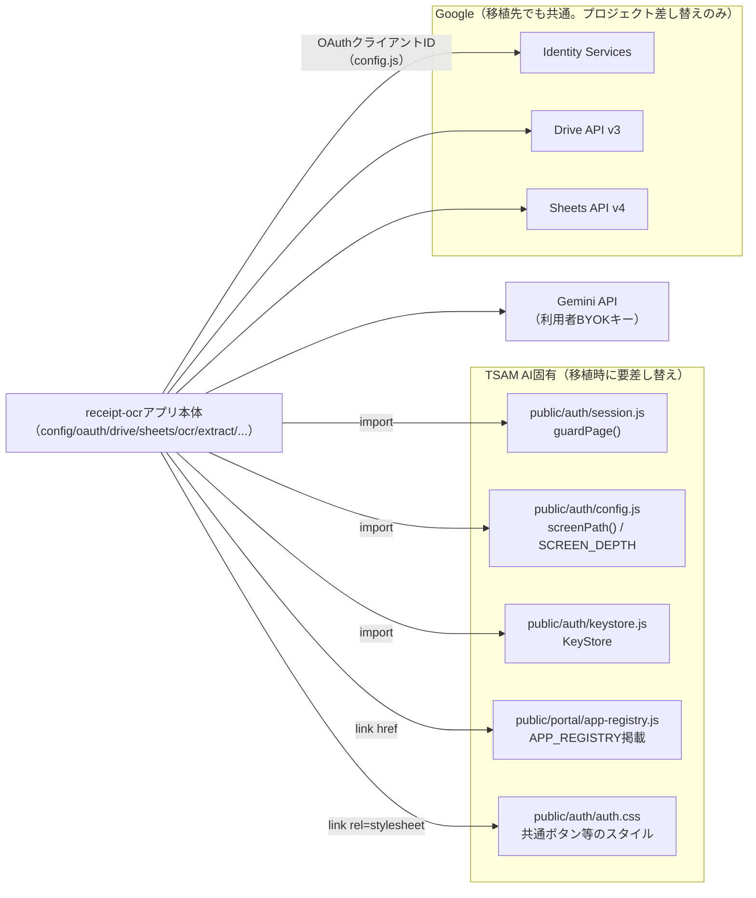

# receipt-ocr 組み込みガイド

このリポジトリ（TSAM AI）を知らない開発者が、`receipt-ocr`を自分のプロダクトへ移植することを想定した手引き。前提：[01_requirements.md](./01_requirements.md)〜[03_detailed-design.md](./03_detailed-design.md)。

---

## 1. 移植の前提条件

* 本アプリはサーバーコードを持たないブラウザ完結アプリであり、静的ファイルをホスティングできる環境（自社サイトの一角、GitHub Pages相当など）ならどこでも動く。移植先に固有のバックエンドは不要
* データの保管先は**利用者本人のGoogleアカウント**（Drive・Sheets）である。移植先プロダクトのデータベースへ書き込む構成には**なっていない**。この前提を変えたい場合、`gateway.js`より上の層（`app.js`・`provisioning.js`・`record.js`）に手を入れる必要があり、単純な移植では済まない
* Portalと同一オリジンでの配信を前提に、認証・キー管理を「共通実装を呼ぶだけ」で済ませている（§2）。移植先には、同等の役割を果たす仕組み（ログイン確認・APIキー保管）を用意するか、該当箇所を作り直す必要がある
* 対象は日本語の領収書・レシートを想定したルール抽出（正規表現・キーワード）である。他言語や海外様式のレシートには、抽出ロジック（`extract.js`）の作り直しが要る

---

## 2. 依存関係マップ

このアプリが実際に結合している先。

`public/production-app/`配下の他アプリ（`card-ocr`等）とは、共通層を介さず**それぞれ独立している**（[docs/repository-structure.md](../../repository-structure.md) §4-1）。したがって`receipt-ocr`を移植するとき、他の本番アプリを巻き込む依存は無い。

---

## 3. 切り離しポイント

移植時に必ず差し替える・作り直す箇所。

| 箇所 | 現在の実装 | 移植時にすること |
| --- | --- | --- |
| ログイン確認（`app.js`の`guardPage({next: 'portal'})`） | TSAM AIのセッショントークンをApps Script経由で検証する共通実装 | 移植先の認証機構に合わせて`guardPage()`相当の関数を用意し、差し替える。戻り値が「利用者情報 または null（すでにリダイレクト済み）」である契約だけ守ればよい |
| Gemini APIキーの保管（`app.js`の`KeyStore.get/has`） | `public/auth/keystore.js`（localStorageの`tsam-api-keys`） | 同等のBYOKキー保管の仕組みを用意するか、単純にlocalStorageの別キーで直接実装し直す。**移植先でもキーをサーバーへ送らない方針は維持すること**（NFR-03） |
| Portalへの誘導リンク（`app.js`の`el['ro-key-link'].href = screenPath('portal')`、`index.html`内の`../../portal/`） | TSAM AI Portalへの相対パス | 移植先のキー設定画面へのパスに書き換える |
| 相対パスの深さ（`config.js`の`SCREEN_DEPTH = 2`、CSSの`../../auth/auth.css`） | `production-app/receipt-ocr/`というディレクトリ階層前提 | 移植先の配置階層に合わせて`SCREEN_DEPTH`と相対パスを調整する |
| Googleプロジェクト固有値（`config.js`の`OAUTH.clientId`） | TSAM AI用のGoogle Cloudプロジェクトで発行したクライアントID | 移植先ドメイン用に新規のOAuthクライアントIDを発行し直す（§4） |
| CSPのconnect-src/script-src（`index.html`のmeta） | `self` + `accounts.google.com` + Google各APIドメイン | 移植先ドメインの`self`はそのまま有効。Googleドメインの並びは変更不要（Google API自体は共通） |
| Portalアプリ一覧への掲載（`public/portal/app-registry.js`） | TSAM AI Portal固有の仕組み | 移植先に同様の一覧機能があれば同種の登録を、無ければ単純にURLで公開するだけでよい |
| テストの参照パス（`tests/unit/receipt-ocr*.mjs`の`import('../../public/production-app/receipt-ocr/...')`） | リポジトリ内の相対パス | 移植先のディレクトリ構成に合わせてimportパスを書き換える。テストのassertロジック自体（`public/apps/tests/helpers/assert.mjs`）は本アプリと無関係なヘルパーなので、同等の軽量アサーションに置き換えるか複製する |

---

## 4. 必要な外部サービスと設定作業の概要

* **Google Cloud Console**：OAuth 2.0クライアントID（ウェブアプリケーション種別）を新規発行する。「承認済みのJavaScript生成元」に移植先の本番・開発オリジンを登録する。スコープは`https://www.googleapis.com/auth/drive.file`のみで足りる（追加しないこと。NFR-02）。client secretは使わない（暗黙フローのため不要）
* **Google Drive API / Sheets API**：同じGoogle Cloudプロジェクトで有効化する（利用者のOAuth同意で足り、サービスアカウント等は不要）
* **Gemini API（Google AI Studio）**：当社側での契約・キー発行は不要。**利用者本人**が自分のキーを発行し、移植先のBYOKキー保管の仕組みへ入力する運用にする
* 上記いずれも、フォルダID・スプレッドシートID・クライアントIDの実値は本書・移植先のドキュメントにも書かないこと（本アプリの方針。§13の踏襲を推奨する）

---

## 5. 複製時の注意

[docs/repository-structure.md](../../repository-structure.md) §4-1の方針どおり、本番アプリ間で共通層は作らない。同じロジックが要る場合は**複製**し、複製元のパスと複製日をコメントへ書く。

**複製元に既知の不具合がある場合、写す前に直す**（同§4-3）。[docs/receipt-ocr-findings-20260804.md](../../receipt-ocr-findings-20260804.md)に記録された7件の欠陥は、**2026-08-18に`receipt-ocr`本体で修正済み**である。したがって現在のコードをそのまま複製してよい。以下は「何がどう直っているか」の対応表で、複製後に**この形が崩れていないこと**を確かめるために使う。

| # | 場所 | 直っている形（2026-08-18以降） |
| --- | --- | --- |
| 1 | `oauth.js` `loadGis()` | 失敗時に`gisPromise`を捨てて再試行できる。10秒のタイムアウトあり。`isGisLoaded()`/`resetGisLoader()`を公開 |
| 2 | `errors.js` `mapGoogleError()` | 403を「容量不足（`DRV-003`）／レート制限（`RATE-001`）／権限不足（`DRV-004`）」の3つに分ける。**レート制限に再連携誘導を付けない** |
| 3 | `gemini-client.js` `mapGeminiError()` | 400は`AI-003`（送信内容の問題。キーを疑わせない）、401/403のみ`KEY-002` |
| 4 | `oauth.js` `requestAccess()` | `hasRequiredScope()`でスコープ付与を確認し、足りなければ`OAUTH-002`でその場で拒否。ポップアップの二重起動も抑止 |
| 5 | `errors.js` / `google-api.js` | 429→`RATE-001`、5xx→`SRV-001`、通信断→`NET-001`、400→`SYS-001`。`SHEET-001`は分類できないものの受け皿として残す |
| 6 | `ocr-drive.js` | 一時ドキュメントは`receipt-ocr-tmp-<時刻>-<連番>`。`collectOrphanTempDocs()`が起動時に回収する（旧名`ocr-tmp-*`も対象。作成10分以内は触らない） |
| 7 | `drive.js` `createBoundary()` | `crypto.randomUUID()`→`getRandomValues()`→時刻の三段。`uploadImage()`と`uploadForOcr()`の両方が使う |

**複製時に壊しやすい点**（いずれも上記の修正が意図的にそうしてある箇所）。

* `GUIDE.REAUTH`は`app.js`の`showError()`でトークン破棄を伴う。**待てば直るコード（`RATE-001`・`SRV-001`）に付けないこと。** 付けると#2の不具合が復活する
* `drive.js`の`getFileMeta()`は`DRV-001`/`OAUTH-001`/`DRV-004`を`null`に落とす。ここから`DRV-004`を外すと、記憶したIDへ触れなくなった利用者が名前検索による復旧（§9.2-3）へ進めなくなる
* 一時ドキュメントの接頭辞を他アプリと同じにしないこと。同じにすると、片方の回収がもう片方の処理中のドキュメントを消しうる

加えて、不具合ではないが実装状況を引き継ぐときに確認すべき2点。

* **未対応**：OCR結果が空文字列でも、それを画面へ明示的に伝える経路が無い（`ocr.js`が返す`empty`フラグを`app.js`が参照していない）。空の確認画面がそのまま出る。読み直し回数の決定が仕様判断を伴うため保留している（findings #8）
* **対応済み（選択式）**：アップロード前の縮小は`image.js`にあり、画面のチェックボックスで**既定は無効**。HEICは`isHeic()`で見分けて専用の案内を出すが、**ブラウザ内でのHEIC→JPEG変換は実装していない**

**逆方向（`receipt-ocr`にあって、複製元にできていない配慮）も併せて複製時に取り込む。** 同文書の「逆方向」節に一覧がある。特に、CSPのmeta宣言、数式エスケープの対象がタブ・CR等を含む点、`valueInputOption=RAW`による二重防御、既存シートの健全性検査（列改変時の書き込み停止）、`AbortSignal`の全層貫通、画像SHA-256による重複判定、保存先ID形式検証、`pagehide`でのトークン破棄は、他アプリへ複製する際にも維持すべき設計判断である。

---

## 6. 最小組み込み手順

1. `public/production-app/receipt-ocr/`配下の全ファイルを移植先の静的ホスティング領域へコピーする
2. §3の「切り離しポイント」表に従い、認証・KeyStore・相対パスをすべて移植先のものへ差し替える
3. Google Cloud Consoleで新規OAuthクライアントIDを発行し、`config.js`の`OAUTH.clientId`を差し替える。承認済みJavaScript生成元に移植先の本番・開発オリジンを登録する
4. §5の対応表で、7件の修正が複製後も崩れていないことを確かめる（特に#1・#2・#4は利用者体験に直結する）
5. `index.html`のCSPを移植先のドメイン・依存先に合わせて見直す（`script-src`に`accounts.google.com`以外を足さない方針は維持する）
6. テスト（`tests/unit/receipt-ocr*.mjs`）を移植先のテストランナーへ合わせて複製・調整し、実通信なしで抽出・検証・プロビジョニング判断のロジックを検証できる状態を保つ
7. 実際のGoogleアカウントでOAuth同意〜保存先自動作成〜画像1件の保存までを一通り手動確認する。特に、権限を一部外した同意（#4）、シート列を手で変更した状態（DRV-002）、同一画像の再アップロード（DUP-001）の3つは、自動テストだけでなく実機で確認する価値が高い（分岐が外部Google APIの挙動に依存するため）
