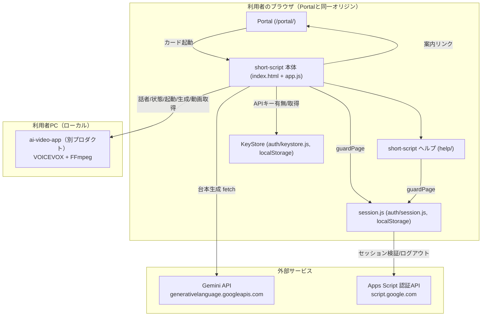
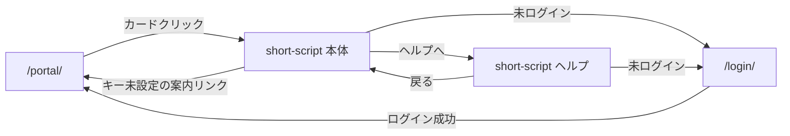

# ショート動画 台本メーカー（short-script）基本設計書

作成: 2026年8月18日

> 要件は [01_requirements.md](./01_requirements.md)（FR-nn/NFR-nn）を参照。実装の正は
> [docs/specs/short-script-spec-v1.md](../../specs/short-script-spec-v1.md)（以下「仕様書」）。

## 1. システム構成

サーバー処理を持たない静的アプリ（HTML＋CSS＋ES モジュール）。ブラウザから3つの外部先（Gemini・認証API・ローカル補助サービス）へ直接 `fetch` する（仕様書 §5）。

## 2. コンポーネント一覧と責務

| コンポーネント | パス | 責務 |
| --- | --- | --- |
| 画面（本体） | `index.html` | DOM 構造、CSP宣言（meta）。`guardPage()` が返すまで `#ss-content` を `hidden` にする。 |
| エントリ | `app.js` | 認証ガード、入力方式の切り替え、キー状態反映、台本生成/貼り付け/セグメント編集の各ハンドラ、結果描画、コピー/保存、Companion 連携のUI制御。 |
| 静的設定 | `config.js` | モデル名・エンドポイント・上限値・尺・Companion 既定URL・ポーリング間隔・版番号。秘密情報は置かない。 |
| プロンプト定義 | `prompt.js` | Gemini への指示文組み立て・構造化出力スキーマ（`SCRIPT_SCHEMA`）・リクエスト本体組み立て。 |
| Gemini 呼び出し | `gemini.js` | fetch による REST 呼び出し、エラー分類（`GeminiErrorCode`）、モデルフォールバック、台本の正規化（`normalizeScript`）。 |
| 貼り付け変換 | `paste.js` | 貼り付け本文を AI 生成と同じ形へ直す純関数。DOM 非依存。 |
| Companion 連携 | `companion.js` | ai-video-app との通信（話者取得・エンジン状態確認/起動・動画生成のNDJSON解釈・動画URL組み立て）。DOM 非依存。 |
| 見た目 | `style.css` | `css/style.css`・`auth/auth.css` を土台に不足分のみ追加。 |
| ヘルプ画面 | `help/index.html`, `help/help.js` | データの扱い・APIキー・商用利用の説明。`guardPage()` で保護。 |

共通層への依存は `public/auth/`（`session.js`／`config.js`／`keystore.js`／`session.js` が内部で使う `api.js`）のみ（仕様書 §5）。

## 3. 外部インターフェース一覧

| 連携先 | 通信方式 | 用途 | 認証 |
| --- | --- | --- | --- |
| Gemini API | HTTPS `POST /v1beta/models/{model}:generateContent`（`fetch`） | AI モードの台本生成 | `x-goog-api-key` ヘッダー（利用者のキー） |
| Apps Script 認証API | HTTPS（`public/auth/api.js` 経由。エンドポイントは `AUTH_CONFIG.apiUrl`） | セッション検証（`verifySession`）・ログアウト（`logout`） | セッショントークン（`tsam-auth-session`） |
| ai-video-app（Companion） | HTTP（既定 `http://127.0.0.1:3000`。`fetch`、`credentials: 'omit'`） | 話者取得・エンジン状態確認/起動・動画生成（NDJSONストリーミング）・完成動画取得 | なし（ローカル通信。CORS＋PNA ヘッダで許可オリジンを限定） |

いずれも `fetch` の直接呼び出しであり、外部SDKは使わない（仕様書 §6）。

## 4. データ設計概要

サーバー側の永続化は存在しない。保存先はすべてブラウザ内、またはその場限りの生成物。

| 保存先 | 内容 | 主なエンティティ |
| --- | --- | --- |
| localStorage（`tsam-api-keys`） | Gemini APIキー | `{ gemini: string }`（KeyStore が管理。値はプロバイダー名をキーにしたオブジェクト） |
| localStorage（`tsam-auth-session`） | セッショントークン | 文字列。判定の根拠はサーバー側の sessions シートであり、トークン自体は推測困難な文字列に過ぎない。 |
| メモリ（モジュール変数） | 表示中の台本 | `currentScript`: `{ title, scenes: [{ seconds, text }], source: 'ai'|'pasted'|'segments', theme?, durationSec?, segmentImages? }` |
| Blob（ダウンロード） | 台本のJSON保存 | `{ title, scenes, appVersion, source, theme?, durationSec?, promptVersion? }`（仕様書 §8.3） |
| Companion 側（ローカルPC） | 生成済み音声・動画 | short-script はクライアントに過ぎず、永続化の実体は ai-video-app 側にある（本アプリのスコープ外）。 |

台本オブジェクトの詳細は [03_detailed-design.md](./03_detailed-design.md) §3。

## 5. 画面一覧と画面遷移

| 画面 | パス | 保護 |
| --- | --- | --- |
| 本体 | `production-app/short-script/` | `guardPage()` + Gemini キー（AIモードのみ） |
| ヘルプ | `production-app/short-script/help/` | `guardPage()` のみ |

画面内の状態遷移（入力方式の切り替え、台本生成後の動画パネル表示、Companion の3状態）はいずれもページ遷移を伴わない。詳細は [03_detailed-design.md](./03_detailed-design.md) §2。

## 6. 認証・認可方式

- ログインは `guardPage()`（`public/auth/session.js`）が担う。判定根拠はサーバー（sessions シート）側の行の存在のみであり、ローカルのトークンの有無だけでは「ログイン済み」と扱わない（仕様書 §4、session.js 冒頭コメント）。
- 本体は `setScreenDepth(2)`、ヘルプは `setScreenDepth(3)`（サイトルートからの階層深さ。相対パス組み立てに使う）。
- Gemini APIキーの有無は `KeyStore.has(PROVIDERS.gemini)` で判定するだけで、値そのものは読まない。値を読むのは実際に生成リクエストを送る1行だけ（`app.js` `handleGenerate`）。
- キーの状態は画面が再表示されたとき（`visibilitychange`／`focus`）に読み直す。Portal の別タブでキーを設定して戻る利用導線を想定している（仕様書 §4）。
- 貼り付け・セグメント編集の2方式は Gemini を呼ばないため、キーの有無による制約を受けない（`currentMode() !== 'ai'` のとき `refreshKeyState()` は案内を出さずに `true` を返す）。
- 認可（ロールによる機能差）はこのアプリには存在しない。ログイン済みかどうかの二値のみ。

## 7. エラー処理方針

| 領域 | 方針 |
| --- | --- |
| Gemini 呼び出し | `GeminiError`（`code`/`status`/`detail`）を投げ、`describeGeminiError()` が画面文言・エラーコード・detail を必ずセットで返す。「不明なエラー」だけの画面を作らない（仕様書 §9）。 |
| HTTPステータス分類 | 400=リクエスト不正、401/403=キー拒否、404=モデル不在（フォールバック対象）、429=利用上限、5xx=サーバーエラー。400 をキーの問題にしない（仕様書 §9、gemini.js `mapStatus`）。 |
| モデルフォールバック | 404 のときのみ1回だけ `FALLBACK_MODEL` で再試行。503（混雑）では切り替えない（待って直すものという判断。仕様書 §7.4）。 |
| 台本の整形失敗 | `normalizeScript()` が `BAD_JSON`／`MISSING_FIELDS` を投げ、画面側は再試行を促す文言を出す。 |
| Companion 疎通失敗 | 例外にせず `{ ok: false, ... }` の形で返し、呼び出し側（app.js）が3状態（offline/engine-offline/online）に応じた案内を出す（仕様書 §13.3）。 |
| エンジン起動失敗 | 404（旧版）／409（未インストール）／通信断／タイムアウト／2連続到達失敗、をそれぞれ異なる文言に分岐（仕様書 §13.3）。 |
| 動画生成失敗 | NDJSON 中の `type:'error'` イベント、非2xx応答、通信断のいずれも `Error` として呼び出し側へ伝播し、`renderDetail` へ表示（companion.js `renderVideo`）。 |

エラーコード表の全量は仕様書 §9 を参照（本書では重複記載しない）。

## 8. 運用・デプロイ構成

- 配置は `public/production-app/short-script/`。Vercel/Cloudflare 等の配信構成は本リポジトリ共通のもの（[CLAUDE.md](../../../CLAUDE.md) 配信構成節）に従い、short-script 固有の配信設定は持たない（静的ファイルとしてそのまま配信される）。
- Portal への掲載は「アプリ一覧」スプレッドシートへの行追加が正であり、`public/portal/app-registry.js` の `APP_REGISTRY` はシート取得に失敗したときのフォールバックに過ぎない（仕様書 §2）。両者で `id`・`href` の形式規約が異なる（シート版はC列が絶対URL必須、`APP_REGISTRY` 版は相対パス必須）。
- CSP はページごとに `<meta>` 宣言（`index.html`／`help/index.html`）。`next.config.ts` の `headers()` は `public/` 全体に効くため、このアプリのために触ると本体サイトを巻き込む（仕様書 §10.2）。
- ローカル補助サービス（ai-video-app）は本リポジトリの配信対象外。利用者が各自のPCで起動する前提であり、その導入・起動状態はこのアプリの制御範囲外（3状態判定で吸収する）。

## 9. 主要な設計判断と採らなかった選択肢

仕様書 §14「採用しなかった提案とその理由」から、基本設計に関わるものを抜粋する（全量は仕様書側を参照）。

| 採った設計 | 採らなかった案 | 理由 |
| --- | --- | --- |
| APIキーは KeyStore 一本化・当社サーバーを経由しない | `.env.local` 等のサーバー環境変数に置く | 本アプリはサーバーを持たない静的アプリ。鍵をブラウザ・当社サーバーに送らない原則（§0.1）に反する。 |
| キー設定UIを持たず、有無だけを見る | アプリ独自の入力UIでキーを受ける | 設定箇所が増えると「どこかで送っていないか」の確認コストが増える。設定は Portal「API設定」に一本化。 |
| Companion の疎通判定を3状態（offline/engine-offline/online）に分ける | `/api/speakers` の成否1本で判定する | `/api/speakers` はエンジン停止中でもフォールバック一覧を返すため、「アプリに届かない」と「エンジンが止まっている」が1つに潰れ、誤判定が実際に起きていた。 |
| エンジン起動を `/api/engine/status` のポーリング（2秒間隔・最大30秒）で確認 | 固定8秒（実測値）だけ待つ | 起動時間は環境依存（低速機・コールドスタート）。固定待ちは速い環境で無駄、遅い環境で失敗扱いになる。 |
| `mock`（VOICEVOX_MOCK）は `engine-offline` 扱いのまま生成を止める | `mock` を online 扱いにする | mock は無音のダミー音声。online 扱いにすると無音動画が黙って生成され、気づくのは書き出し後になる。 |
| 503（混雑）ではモデルフォールバックしない | 503 でもフォールバックモデルへ切り替える | 混雑は待って直すもの。切り替えは廃止（404）への備えに限る。 |
| 貼り付けは全文を1シーンとして扱う | 空行・改行で自動的にシーン分割する | 分割規則を機械が決めると意図とずれやすい。分けたい場合は AI 生成かセグメント編集を使う。 |

このほか、リポジトリ全体の方針として、本番アプリ間の共通層を作らない判断（[repository-structure.md](../../repository-structure.md) §4-1）を踏襲し、`gemini.js` のエラー分類等は card-ocr から複製している（import しない）。
