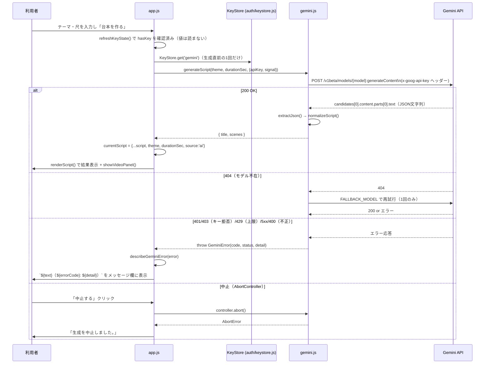
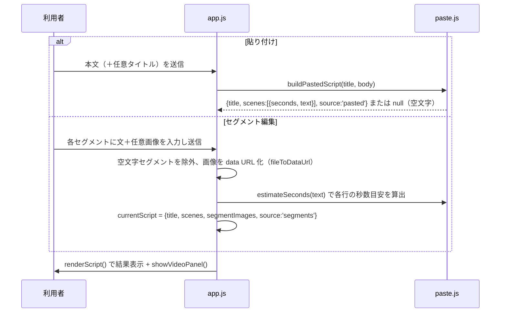
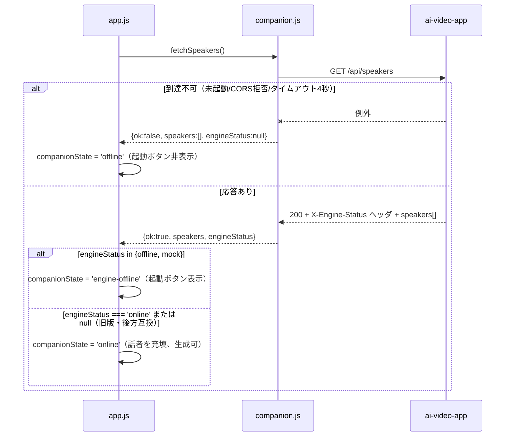
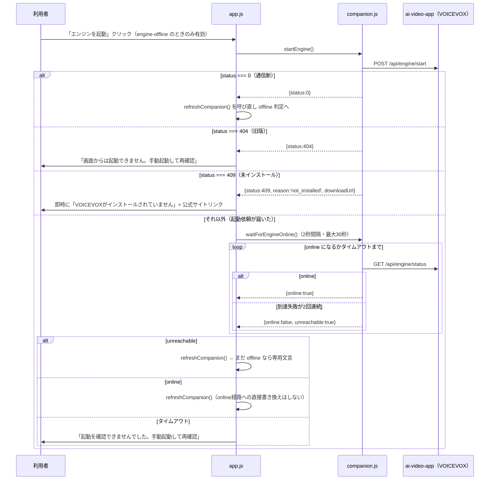
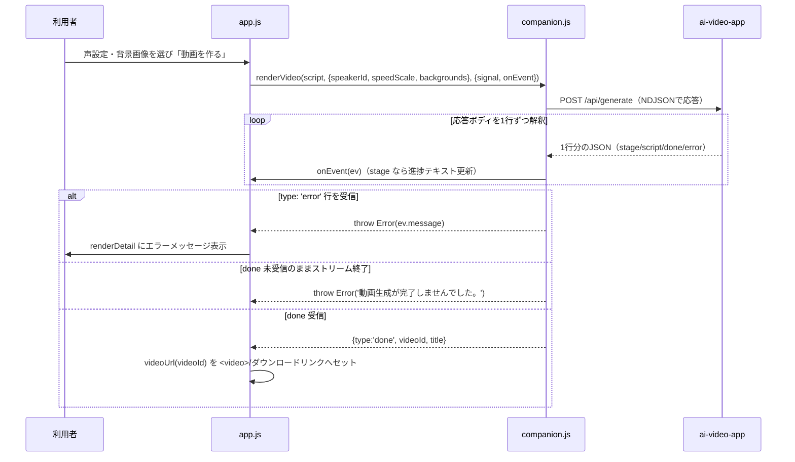

# ショート動画 台本メーカー（short-script）詳細設計書

作成: 2026年8月18日

> 実装の正は [docs/specs/short-script-spec-v1.md](../../specs/short-script-spec-v1.md)（以下「仕様書」）。
> 本書は実装ファイルを直接確認して書いており、行番号ではなく関数名・§番号で参照する。

## 1. ファイル・モジュール構成

| パス | 行数目安 | 責務 |
| --- | --- | --- |
| `index.html` | 254行 | DOM構造、CSP（meta）、3つの入力フォーム（AI/貼り付け/セグメント）、結果・動画パネルの器。 |
| `app.js` | 952行 | エントリ。認証ガード、DOM参照の集約（`dom` オブジェクト）、各ハンドラ、状態管理、Companion 連携のUI制御。 |
| `config.js` | 76行 | 定数の単一集約先。モデル名・エンドポイント・上限・尺・Companion URL・ポーリング値・版番号。 |
| `prompt.js` | 113行 | Gemini 向け指示文（`buildSystemInstruction`）、構造化出力スキーマ（`SCRIPT_SCHEMA`）、リクエスト組み立て（`buildScriptRequest`）。 |
| `gemini.js` | 310行 | Gemini 呼び出し本体（`callOnce`/`generateScript`）、エラー分類、台本正規化（`normalizeScript`）。card-ocr の同型実装から複製。 |
| `paste.js` | 49行 | 貼り付け本文→台本オブジェクトの純関数（`buildPastedScript`/`estimateSeconds`）。DOM非依存。 |
| `companion.js` | 272行 | ai-video-app との通信全般。DOM非依存。 |
| `style.css` | — | 見た目。`css/style.css`／`auth/auth.css` を土台に不足分のみ。 |
| `help/index.html` | 80行 | ヘルプ本文（静的）。 |
| `help/help.js` | 26行 | `guardPage()` のみを行い、本文の表示/非表示を切り替える。 |
| `icon.svg` | — | アプリアイコン（Portal のシート版掲載では未使用。`APP_REGISTRY` のフォールバックでは文字「台」を使用）。 |

## 2. 主要処理フロー

### 2.1 AI モードでの台本生成（正常系＋主要な異常系）



### 2.2 貼り付け／セグメント編集（Geminiを介さない）



### 2.3 ローカル補助サービスの疎通確認と3状態判定



### 2.4 「エンジンを起動」



### 2.5 動画生成（NDJSONストリーミング）



## 3. データモデル詳細

### 3.1 台本オブジェクト（`currentScript`。モジュール内メモリのみ）

| フィールド | 型 | 由来 | 備考 |
| --- | --- | --- | --- |
| `title` | string | 全て | 空不可（AI生成は `normalizeScript` が保証）。 |
| `scenes` | `{ seconds: number, text: string }[]` | 全て | AI: `seconds` は2〜20に丸め、`text` は最大60文字。貼り付け: 60文字への切り詰めなし。 |
| `source` | `'ai' \| 'pasted' \| 'segments'` | 全て | 表示・保存の分岐に使う。 |
| `theme` | string | AIのみ | 入力したテーマ。 |
| `durationSec` | `30 \| 60` | AIのみ | 選択した尺。 |
| `segmentImages` | `string[]`（data URL、空文字許容） | segmentsのみ | `scenes` と要素数1:1。空要素は既定背景。 |

### 3.2 JSON保存形式（`handleDownload`。仕様書 §8.3）

```
共通    : { title, scenes: [{ seconds, text }], appVersion, source }
AI      : + theme, durationSec, promptVersion
貼り付け/セグメント : 付随情報なし（source は 'pasted' または 'segments'）
```

### 3.3 Gemini 構造化出力スキーマ（`prompt.js` `SCRIPT_SCHEMA`）

```
OBJECT {
  title: STRING                                              // required
  scenes: ARRAY of OBJECT {                                  // required
    seconds: NUMBER                                          // required
    text: STRING                                             // required
  }
}
```

`type` は大文字固定（proto 列挙型。小文字は Gemini 側で 400 になる）。

### 3.4 localStorage スキーマ（`public/auth/` 側。参照のみで short-script は書式を定義しない）

| キー | 形式 | 管理元 |
| --- | --- | --- |
| `tsam-api-keys` | `{ "gemini": "<key>" }` | `public/auth/keystore.js` |
| `tsam-auth-session` | 文字列（セッショントークン） | `public/auth/session.js` |

### 3.5 Companion（ai-video-app）とのリクエスト/レスポンス形

`POST /api/generate` リクエスト本体（`companion.js` `renderVideo`）:

```
{
  script: { title, scenes },
  speakerId: number,
  speedScale: number,
  volumeScale?: number,
  pitchScale?: number,
  backgrounds?: string[]   // data URL 配列。省略可
  duration: 30             // 固定値（後段の互換のため送っているが、実尺は音声長で決まる）
}
```

`GET /api/speakers` レスポンスの話者要素: `{ id: number, label: string }`。

`GET /api/engine/status` レスポンス: `{ installed, running, version, mock }`（`running` のみ判定に使用）。

## 4. インターフェース仕様

### 4.1 Gemini API

| 項目 | 内容 |
| --- | --- |
| エンドポイント | `POST https://generativelanguage.googleapis.com/v1beta/models/{model}:generateContent` |
| 認証 | `x-goog-api-key` ヘッダー |
| 主モデル/フォールバック | `DEFAULT_MODEL`／`FALLBACK_MODEL`（config.js。404のときのみ切替） |
| リクエスト本体 | `buildScriptRequest(theme, durationSec, {maxOutputTokens})`（prompt.js） |

### 4.2 主要関数の入出力

| 関数 | ファイル | 入力 | 出力／例外 |
| --- | --- | --- | --- |
| `generateScript(theme, durationSec, {apiKey, model, fallbackModel, fetchImpl, signal, maxOutputTokens})` | gemini.js | テーマ・尺・オプション | `{ title, scenes }` / `GeminiError` |
| `normalizeScript(parsed)` | gemini.js | Gemini生応答のJSON | `{ title, scenes }` / `GeminiError(BAD_JSON\|MISSING_FIELDS)` |
| `describeGeminiError(error)` | gemini.js | `Error` または `GeminiError` | `{ text, errorCode, detail }` |
| `buildPastedScript(rawTitle, rawBody)` | paste.js | 入力文字列2つ | 台本オブジェクト / `null`（本文空） |
| `estimateSeconds(text)` | paste.js | 文字列 | 秒数（空白除く文字数×0.15、下限2） |
| `fetchSpeakers()` | companion.js | なし | `{ ok, speakers, engineStatus }` |
| `fetchEngineStatus()` | companion.js | なし | `{ ok, online }` |
| `startEngine()` | companion.js | なし | `{ ok, status, reason, downloadUrl }` |
| `waitForEngineOnline({intervalMs, timeoutMs, onTick})` | companion.js | 任意オプション | `{ online }` または `{ online:false, unreachable:true }` |
| `renderVideo(script, options, {onEvent, signal})` | companion.js | 台本・声設定・進捗コールバック | 完了イベント `{videoId, title}` / `Error` |
| `videoUrl(videoId)` | companion.js | 動画ID | Companion 側の動画URL文字列 |

### 4.3 Companion（ai-video-app）REST エンドポイント一覧

| メソッド/パス | 用途 | 成否の判定に使う値 |
| --- | --- | --- |
| `GET /api/speakers` | 話者一覧取得・疎通確認 | `X-Engine-Status` ヘッダ（online/offline/mock/欠落） |
| `GET /api/engine/status` | エンジン稼働状況 | 応答ボディ `running`（実疎通結果のみ） |
| `POST /api/engine/start` | エンジン起動依頼（冪等） | HTTPステータス（0=通信断／404=旧版／409=未インストール） |
| `POST /api/generate` | 台本から音声・動画を生成 | NDJSON各行の `type`（stage/script/done/error） |
| `GET /api/video/:id` | 完成MP4取得（Range対応） | — |

### 4.4 エラーコード（画面表示用）

仕様書 §9 の表を正とする。本書では体系のみ記す: `KEY-001`（キー未設定）、`KEY-002`（キー拒否）、`AI-001`（通信/サーバー）、`AI-002`（利用上限）、`AI-003`（リクエスト/応答不正）、`AI-004`（必要項目不足）、`AI-005`（モデル不在）、`SYS-999`（不明）。

## 5. 状態管理・セッション設計

### 5.1 モジュール変数（`app.js`。すべてメモリ上のみ、永続化しない）

| 変数 | 意味 |
| --- | --- |
| `currentScript` | 表示中の台本。コピー・保存・動画化の対象。 |
| `activeController` | 台本生成中の `AbortController`。中止ボタンで `abort()`。 |
| `renderController` | 動画生成中の `AbortController`。 |
| `companionState` | `'checking'\|'offline'\|'engine-offline'\|'online'`。3状態＋確認中。 |
| `companionReady` | `companionState === 'online'` の導出値（既存参照箇所の互換のため保持）。 |
| `engineStarting` | 「エンジンを起動」の多重クリック防止フラグ。 |

状態遷移はすべて `setCompanionState()` 経由、または `refreshCompanion()` の呼び直しに集約する。「online へ直接書き換える経路」を別に作らない設計判断がある（§2.4、仕様書 §13.3 末尾）。

### 5.2 セッション

- 認証状態はサーバー（sessions シート）にのみ根拠を持つ。ローカルの `tsam-auth-session` はただの不透明なトークンであり、`guardPage()` は毎回サーバー検証を行う（`public/auth/session.js`）。
- 本アプリ自身はセッションを発行・管理しない。読むのは `guardPage()` の戻り値（`user`）の有無のみで、ロール等は参照しない。

## 6. エラーハンドリング詳細

| 発生源 | 検知方法 | 復旧導線 |
| --- | --- | --- |
| Gemini fetch 失敗（通信断） | `try/catch` → `GeminiErrorCode.NETWORK` | 再試行はユーザー操作（生成ボタン再押下）。 |
| Gemini 非2xx応答 | `mapStatus(status)` | コード別文言。401/403は再試行しない設計（クォータ温存）。 |
| Gemini応答JSON不正 | `extractJson`/`normalizeScript` が `BAD_JSON`/`MISSING_FIELDS` を送出 | 再試行を促す文言。 |
| クリップボード不可 | `navigator.clipboard.writeText` の `catch` | 「手動で選択してコピー」に案内を切替。 |
| Companion 未起動 | `fetchSpeakers()` の `catch`（4秒タイムアウト含む） | `companionState:'offline'`。「再確認する」ボタンのみ表示。 |
| VOICEVOX 停止/mock | `X-Engine-Status` が offline/mock | `companionState:'engine-offline'`。「エンジンを起動」表示。 |
| エンジン起動が旧版未対応 | `startEngine()` の `status===404` | 手動起動を案内（画面からは起動不可）。 |
| VOICEVOX未インストール | `startEngine()` の `status===409` かつ `reason==='not_installed'` | ポーリングせず即時案内。`downloadUrl` が http(s) ならリンク化。 |
| ポーリング中のアプリ断 | `waitForEngineOnline()` の到達失敗2回連続 | `unreachable:true` で早期終了 → `refreshCompanion()` で offline 判定。 |
| 動画生成エラー | NDJSON `type:'error'` 行、非2xx応答、`res.body` なし、ストリーム終了まで`done`未受信 | いずれも `Error` として `handleRender` の `catch` へ集約し `renderDetail` に表示。 |
| 中止操作 | `AbortController.abort()` → `AbortError` | 生成中/動画生成中いずれも「中止しました」表示で復帰。 |

## 7. 設定値・環境変数一覧

このアプリはサーバー環境変数を持たない（静的アプリのため）。すべて `config.js` に定数として集約されている。**値は秘密情報ではない**（仕様書 §5 コメント、config.js 冒頭コメント）ため、参考として現在値を併記する。

| 名前 | 役割 | 置き場所 | 現在値 |
| --- | --- | --- | --- |
| `DEFAULT_MODEL` | Gemini 主モデル | config.js | `gemini-2.5-flash-lite` |
| `FALLBACK_MODEL` | 404時のフォールバックモデル | config.js | `gemini-3.5-flash-lite` |
| `GEMINI_HOST` / `GEMINI_ENDPOINT_BASE` | Gemini APIのホスト/ベースURL | config.js | `generativelanguage.googleapis.com` 他 |
| `MAX_OUTPUT_TOKENS` | Gemini応答の最大トークン数 | config.js | `1024` |
| `DURATIONS` / `DEFAULT_DURATION` | 選択可能な尺と既定値 | config.js | `[30, 60]` / `30` |
| `THEME_MAX_LENGTH` | テーマ入力の最大文字数 | config.js | `100` |
| `COMPANION_BASE_URL` | ローカル補助サービスの既定原点 | config.js | `http://127.0.0.1:3000` |
| `ENGINE_START_POLL_INTERVAL_MS` | エンジン起動確認のポーリング間隔 | config.js | `2000` |
| `ENGINE_START_TIMEOUT_MS` | エンジン起動確認のタイムアウト | config.js | `30000` |
| `APP_VERSION` | 台本JSONに添える版番号 | config.js | `short-script-1.0` |
| `PROMPT_VERSION` | プロンプトの版番号 | prompt.js | `short-script-1` |
| `SCENE_SECONDS_MIN`/`MAX` | 1シーン秒数の丸め範囲 | prompt.js | `2`〜`20` |
| `SCENE_TEXT_MAX_LENGTH` | 1シーンの最大文字数 | prompt.js | `60` |

一方、`public/auth/config.js` の `AUTH_CONFIG.apiUrl`（Apps Script の `/exec` URL）は仕様書のルールにより値を伏せる対象であり、本書でも名前と役割のみ記す（Apps Script Webアプリのエンドポイント、`guardPage()` のセッション検証先）。

## 8. テスト構成

| スイート名 | ファイル | kind | 対象 |
| --- | --- | --- | --- |
| `short-script-companion` | `tests/unit/short-script-companion.mjs` | unit | `config.js` の定数、`companion.js`（`fetchSpeakers`/`fetchEngineStatus`/`startEngine`/`waitForEngineOnline`）、および `index.html`/`app.js` に対する静的ソース検証（3状態の分岐・起動ボタン・文言の存在確認） |

実行方法: `node tests/run.mjs short-script-companion`（単体）、または `npm test` で全スイート内の一部として実行される。実サービス（ai-video-app・Gemini）へは通信せず、`fetch` をスタブして判定ロジックのみを検証する（同ファイル冒頭コメント）。

**確認できた事実として記す**: `gemini.js`（`generateScript`/`normalizeScript`/`mapStatus`等）、`prompt.js`（`buildScriptRequest`等）、`paste.js`（`buildPastedScript`/`estimateSeconds`）を対象とする単体テストは、本書作成時点の `tests/run.mjs` SUITES 一覧に存在しない。card-ocr など同型実装に対応するテストが別途あるかどうかは本書の調査範囲外。
