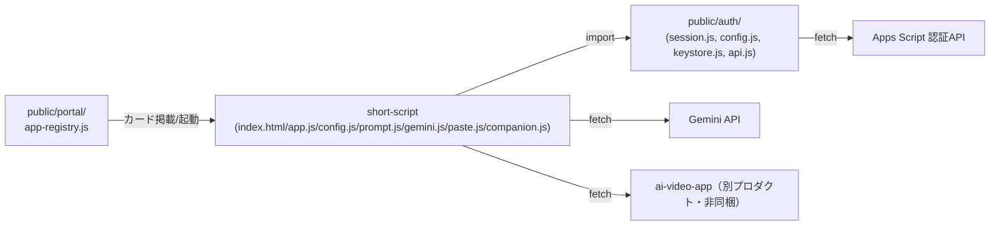

# ショート動画 台本メーカー（short-script）組み込みガイド

作成: 2026年8月18日

> このアプリを、このリポジトリ以外のプロダクトへ移植する開発者を読者として想定する。
> 実装の正は [docs/specs/short-script-spec-v1.md](../../specs/short-script-spec-v1.md)。複製方針は
> [repository-structure.md](../../repository-structure.md) §4 に従う。

## 1. 移植の前提条件

- **サーバーコードを持たない静的アプリである。** 移植先も「サーバーを介さずブラウザから直接 Gemini／ローカル補助サービスへ通信する」構成を許容できること（BYOK原則。仕様書 §0.1）。
- **KeyStore と同等の「APIキー保管庫」を用意できること。** 本アプリ自体はキー設定UIを持たず、Portal 側の設定画面に依存している。移植先で同じ分離を維持するか、独自のキー入力UIを足すかは移植側の判断になる。
- **ログイン基盤（`guardPage()` 相当）を用意できること、またはガードを外す判断をすること。** 本アプリは「ログイン済み利用者」を前提に作られている。認証不要な文脈へ移植する場合は、`guardPage()` 呼び出しと未ログイン時の分岐を丸ごと外す設計変更が要る。
- **音声・動画生成（第2段階）を使う場合、利用者が自分のPCで ai-video-app（VOICEVOX + FFmpeg）を起動できる環境であること。** ブラウザ完結ではない（仕様書 §1）。第1段階（台本生成）のみを移植するなら、この前提は不要。

## 2. 依存関係マップ

このアプリが**このリポジトリの中で**結合しているのは `public/auth/` の4ファイルのみである（[repository-structure.md](../../repository-structure.md) の「本番アプリ間で共通層を作らない」方針により、他の本番アプリ（card-ocr等）への import は存在しない）。ai-video-app 自体はこのリポジトリに同梱されておらず、通信先の1つとして参照されるのみ。

## 3. 切り離しポイント

移植時に必ず差し替え・見直しが必要な箇所。

| 箇所 | 現状 | 移植時の対応 |
| --- | --- | --- |
| `import { guardPage } from '../../auth/session.js'` ほか（app.js, help/help.js） | Portal共通の認証基盤に依存 | 移植先の認証機構に置き換えるか、認証を撤去する。 |
| `import { KeyStore, PROVIDERS, isKeyStoreAvailable } from '../../auth/keystore.js'`（app.js） | `tsam-api-keys` という固定の localStorage キーで Gemini キーを管理 | 移植先で同じ責務のモジュールを自前で用意する（キー入力UIを足す、または別の秘密管理に差し替える）。 |
| `COMPANION_BASE_URL`（config.js） | `http://127.0.0.1:3000` 固定 | 移植先の ai-video-app 配布形態に合わせて変更、または画面から変更できるUIを追加する（仕様書 §13.4 の将来拡張として未実装）。 |
| CSP の `<meta>` 宣言（index.html／help/index.html） | `connect-src` に `generativelanguage.googleapis.com`／`script.google.com`／`script.googleusercontent.com`／`127.0.0.1:3000`／`localhost:3000` を列挙 | 移植先のドメイン・認証先に合わせて書き換える。Apps Script 認証を使わないなら該当行を削除できる。 |
| `setScreenDepth(2)`／`setScreenDepth(3)`（`public/auth/config.js` の相対パス機構） | サイトルートからの階層深さに依存した相対パス組み立て | 認証基盤ごと外す場合はこの呼び出しも不要になる。 |
| Portal 掲載（`APP_REGISTRY` とアプリ一覧スプレッドシート） | TSAM AI Portal 固有の掲載機構 | 移植先の起動口（メニュー、リンク等）に置き換える。 |

## 4. 必要な外部サービスと設定作業の概要

| サービス | 用途 | 設定作業の概要 |
| --- | --- | --- |
| Gemini API | AIモードの台本生成 | 利用者ごとに Google AI Studio 等で APIキーを取得（本アプリは配布・課金を代行しない。BYOK）。移植先のキー保管庫にキーを登録できる導線を用意する。 |
| ai-video-app（VOICEVOX + FFmpeg） | 音声・動画生成（第2段階） | 利用者PCへの別途インストールが必要。CORS＋Private Network Access ヘッダを、移植先のオリジンに合わせて Companion 側で設定する（仕様書 §13.2）。第1段階のみ移植するなら不要。 |
| 認証基盤（移植先で用意する場合） | ログイン判定 | 本アプリの `guardPage()` 相当インターフェース（Promise を返し、未ログインなら遷移して `null` を返す）を実装する。 |

## 5. 複製時の注意

[repository-structure.md](../../repository-structure.md) §4-1「アプリ間で共通層を作らない」方針に従い、このアプリのロジックを別プロダクトへ複製する場合は、**複製元パスと複製日を複製先ファイルの冒頭コメントに書く**こと。`gemini.js`／`prompt.js` 自体が card-ocr（名刺OCR）からの複製である旨を明記しているのと同じ形式にする。

複製元に既知の不具合があれば、写す前に直すこと（§4-3）。本書作成時に見つかった、複製時に持ち込むべきでない不整合は次のとおり。

- **`help/index.html` の説明文が実装より古い。** 「無料枠と商用利用について」節の直前に「この台本から音声・字幕・縦型動画を作る工程は、次のフェーズで用意する予定です。」という文があるが、本体（`index.html`／`app.js`）にはすでに音声・動画生成パネル（仕様書 §13 相当。ai-video-app 連携）が実装されている。複製・移植の際は、ヘルプの説明文を実装の現状（音声・動画生成は実装済み）に合わせて書き直すこと。そのまま複製すると、まだ実装していないかのような誤った案内を利用者に見せることになる。

逆方向（このアプリにあって複製元〔card-ocr〕に無い配慮）がある場合も、複製時に取り込むこと。本書の調査範囲では逆方向の差分は確認していない。

## 6. 最小組み込み手順

第1段階（台本生成。音声・動画なし）のみを別プロダクトへ組み込む場合の最小手順を示す。

1. `public/production-app/short-script/` から `index.html`／`app.js`／`config.js`／`prompt.js`／`gemini.js`／`paste.js`／`style.css` をコピーする（`companion.js` と動画パネル関連のDOM・ハンドラ・CSSは第2段階なので除外可）。
2. `app.js` から `guardPage`／`setScreenDepth`／`KeyStore` 系 import を、移植先の認証・キー管理へ差し替える。認証不要にする場合はガード呼び出し自体を削除し、`init()` の先頭で直接 `hide(dom.loading); show(dom.content);` するよう変更する。
3. `index.html` の CSP `<meta>` から、Apps Script 関連ドメイン（`script.google.com`／`script.googleusercontent.com`）と Companion 関連（`127.0.0.1:3000`／`localhost:3000`）を、実際に使わないなら削除する。Gemini 用の `generativelanguage.googleapis.com` は AIモードを使う限り必須。
4. `config.js` の `APP_VERSION` を移植先の版管理に合わせて変更する。`PROMPT_VERSION`（prompt.js）も同様。
5. 利用者へ Gemini APIキーを入力させるUI（KeyStore相当）を用意し、`app.js` の `refreshKeyState()`／`handleGenerate()` が参照するキー取得処理をそこへ差し替える。
6. 動画生成（第2段階）を追加する場合は、`companion.js` と、`index.html` の `#ss-video` セクション以下、`app.js` の Companion 関連ハンドラ（`refreshCompanion`／`handleEngineStart`／`handleRender` 等）をあわせて移植し、CSP の `connect-src`／`media-src` に Companion の原点を追加する。
7. 移植後は、`tests/unit/short-script-companion.mjs` を参考に、移植先の環境でも fetch をスタブした単体テストを用意することを推奨する（本アプリ自体、`gemini.js`／`prompt.js`／`paste.js` の単体テストが未整備であるため、移植を機に追加する余地がある。[03_detailed-design.md](./03_detailed-design.md) §8）。
