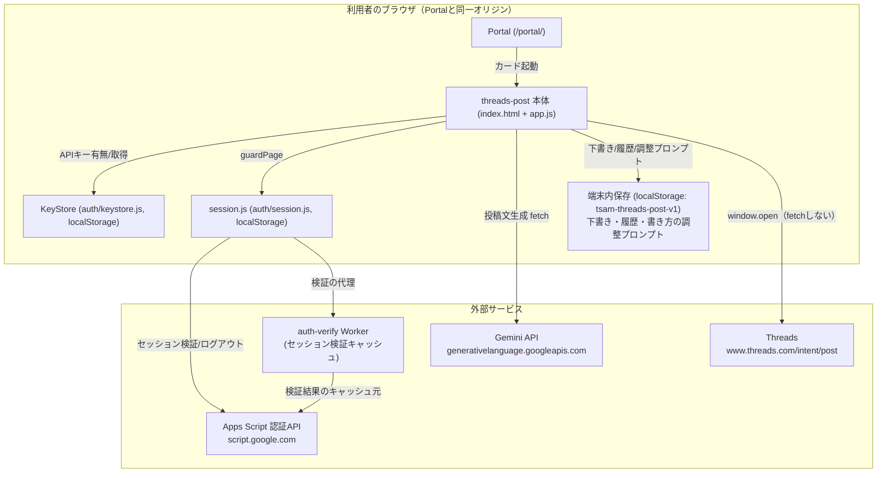
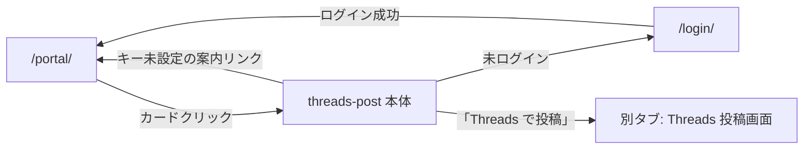

# Threads 投稿アプリ（threads-post）基本設計書

作成: 2026年8月18日

> 要件は [01_requirements.md](./01_requirements.md)（FR-nn/NFR-nn）を参照。実装の正は
> [docs/specs/threads-mvp-requirements-v1.md](../../specs/threads-mvp-requirements-v1.md)（以下「仕様書」）。

## 1. システム構成

サーバー処理を持たない静的アプリ（HTML＋CSS＋ES モジュール）。ブラウザから2つの
外部先（Gemini・認証API）へ直接 `fetch` し、Threads へは `window.open` で
別タブを開くのみで `fetch` はしない（仕様書 §7）。

## 2. コンポーネント一覧と責務

| コンポーネント | パス | 責務 |
| --- | --- | --- |
| 画面 | `index.html` | DOM構造、CSP宣言（meta）。`guardPage()` が返すまで `#tp-content` を `hidden` にする。 |
| エントリ | `app.js` | 認証ガード、DOM参照の集約、各ハンドラ（生成・保存・投稿・一覧描画）、キー状態の反映。ロジックは post.js／gemini.js に委譲する。 |
| 静的設定 | `config.js` | モデル名・エンドポイント・文字数上限・intent URL・保存キー・履歴上限。秘密情報は置かない。 |
| 検証・保存・intent | `post.js` | 文字数検証（コードポイント基準）、intent URLの組み立て、下書き／履歴／調整プロンプトの端末内保存。DOM非依存の純粋なロジック。 |
| Gemini 呼び出し | `gemini.js` | fetch による REST 呼び出し、エラー分類（`GeminiErrorCode`）、404時のみのモデルフォールバック。台本メーカー（short-script）と同方針で、エラー分類は複製。 |
| 見た目 | `style.css` | `css/style.css`・`auth/auth.css` を土台に不足分のみ追加。 |

共通層への依存は `public/auth/`（`session.js`／`config.js`／`keystore.js`。内部で `api.js` を使用）のみ。他の本番アプリへの import はしない（仕様書 §4）。

## 3. 外部インターフェース一覧

| 連携先 | 通信方式 | 用途 | 認証 |
| --- | --- | --- | --- |
| Gemini API | HTTPS `POST /v1beta/models/{model}:generateContent`（`fetch`） | 投稿文の生成 | `x-goog-api-key` ヘッダー（利用者のキー） |
| Apps Script 認証API／auth-verify Worker | HTTPS（`public/auth/api.js`／`session.js` 経由） | セッション検証（`verifySession`）・ログアウト（`logout`） | セッショントークン（`tsam-auth-session`） |
| Threads（`www.threads.com`） | `window.open(url, '_blank', 'noopener,noreferrer')` | 本文入りの投稿画面を開く | なし（このアプリからの通信ではなく、利用者のブラウザが直接開く別タブ）。CSP `connect-src` にも含めない。 |

外部SDKは使わない（仕様書 §4）。

## 4. データ設計概要

サーバー側の永続化は存在しない。保存先はすべてブラウザ内。

| 保存先 | 内容 | 主なエンティティ |
| --- | --- | --- |
| localStorage（`tsam-api-keys`） | Gemini APIキー | `{ gemini: string }`（KeyStore が管理） |
| localStorage（`tsam-auth-session`） | セッショントークン | 文字列。判定の根拠はサーバー側の sessions シートであり、トークン自体は不透明。 |
| localStorage（`tsam-threads-post-v1`） | 下書き・履歴・書き方の調整プロンプト | `{ drafts: [{id, text, createdAt}], history: [{id, at, kind, text}], stylePrompt: string }`（1件のJSONにまとめる） |

データモデルの詳細は [03_detailed-design.md](./03_detailed-design.md) §3。

## 5. 画面一覧と画面遷移

| 画面 | パス | 保護 |
| --- | --- | --- |
| 本体（1ページ） | `production-app/threads-post/` | `guardPage()`。Gemini キーは生成機能のみ任意で要求（未設定でも他機能は使える）。 |

画面内の状態遷移（入力欄の文字数表示、下書き・履歴一覧の再描画、キー状態の
再確認）はいずれもページ遷移を伴わない。詳細は [03_detailed-design.md](./03_detailed-design.md) §2。

## 6. 認証・認可方式

- ログインは `guardPage()`（`public/auth/session.js`）が担う。判定根拠はサーバー
  （sessions シート）側の行の存在のみで、ローカルのトークンの有無だけでは
  「ログイン済み」と扱わない（session.js 冒頭コメント）。
- `setScreenDepth(2)`（`/production-app/threads-post/` はサイトルートから2階層）。
- Gemini APIキーの有無は `KeyStore.has(PROVIDERS.gemini)` で判定するだけで、
  値そのものは読まない。値を読むのは実際に生成リクエストを送る直前の1行のみ
  （app.js `handleGenerate`）。
- キーの状態は画面が再表示されたとき（`visibilitychange`／`focus`）に読み直す。
  Portal の別タブでキーを設定して戻る利用導線を想定している。
- 認可（ロールによる機能差）は存在しない。ログイン済みかどうかの二値のみ。

## 7. エラー処理方針

| 領域 | 方針 |
| --- | --- |
| Gemini 呼び出し | `GeminiError`（`code`/`status`/`detail`）を投げ、`describeGeminiError()` が画面文言・エラーコード・detail を必ずセットで返す。 |
| HTTPステータス分類 | 400=リクエスト不正、401/403=キー拒否、404=モデル不在（フォールバック対象）、429=利用上限、5xx=サーバーエラー。400 をキーの問題にしない。 |
| モデルフォールバック | 404 のときのみ1回だけ `FALLBACK_MODEL` で再試行。429／503 では再試行しない（無料枠のクォータを削るだけという判断）。 |
| 投稿文検証 | `validatePostText()` が文字列（エラーメッセージ／null）を返す。例外にしないのは、画面がそのまま表示に使うため。 |
| intent リンクを開けない | `window.open` が `null` を返した場合（ポップアップブロック等）、その旨を案内する。 |
| 保存不可（localStorage不可） | `isStorageAvailable()` で検知し、画面に注記を出したうえで書く・生成する・投稿画面を開くだけは動かす。 |
| 壊れた保存データ | JSON パース失敗時は読み捨て、次の保存で作り直す（例外を投げない）。 |

エラーコード表（KEY-001／KEY-002／AI-001〜005／SYS-999）は [03_detailed-design.md](./03_detailed-design.md) §4.4 を参照。

## 8. 運用・デプロイ構成

- 配置は `public/production-app/threads-post/`。配信構成は本リポジトリ共通のもの
  （[CLAUDE.md](../../../CLAUDE.md) 配信構成節）に従い、固有の配信設定は持たない
  （静的ファイルとしてそのまま配信される）。
- Portal への掲載は `public/portal/app-registry.js` の `APP_REGISTRY` へ1件追加する
  ことで行う（`id: 'threads-post'`）。
- CSP はページ内 `<meta>` 宣言（`index.html`）。`next.config.ts` の `headers()` を
  使わないのは、`public/` 全体に効いて本体サイトを巻き込むため。
- 配信は `main` への反映と手動デプロイ（`npm run deploy`）のみ。Meta・Google Cloud
  側の作業は無い（OAuth を使わないため）。
- 本番デプロイの完了状況は未確定（[01_requirements.md](./01_requirements.md) §9）。

## 9. 主要な設計判断と採らなかった選択肢

仕様書 §9「採用しなかった提案とその理由」から抜粋する（全量は仕様書側を参照）。

| 採った設計 | 採らなかった案 | 理由 |
| --- | --- | --- |
| intent リンクで別タブを開き、最後の投稿は人が押す | Threads Graph API ＋ 長期トークン方式（v1.0） | トークン方式が必須なのは無人の予約投稿だけ。60日トークン・Meta審査・実地確認のコストに見合わない。 |
| 下書き・履歴を端末内（localStorage）のみに保存 | Drive/Sheets への保存 | OAuth（GIS）とスコープ管理が付いてくる。端末内保存なら当社サーバー送信ゼロのまま審査不要。端末をまたぐ必要が出た時点で再検討。 |
| Gemini キー入力欄をこのアプリに置かず、KeyStore の有無だけを見る | アプリ独自の入力UIでキーを受ける | KeyStore の一元管理（Portalで設定）に反する。他の本番アプリと同じ導線にする。 |
| `gemini.js` のエラー分類・`post.js` の保存ロジックを姉妹アプリ（x-post／note-post）と複製 | 共通モジュール化 | [repository-structure.md](../../repository-structure.md) §4-1「import はしない」方針。複製元・複製日を冒頭コメントに残す。 |
| 429／503 で自動再試行しない | リトライ機構を持つ | 結果は変わらず無料枠のクォータを削るだけ（台本メーカーと同じ判断）。 |
| 予約リマインダーを本アプリに含めない | v2.x の「自分宛メール」方式を残す | 静的配信にはサーバーもトリガーも無く、閉じたブラウザからは何も送れない。全く別機能として実装する方針（未着手）。 |

このほか、リポジトリ全体の方針として本番アプリ間の共通層を作らない判断
（[repository-structure.md](../../repository-structure.md) §4-1）を踏襲し、`gemini.js`／`post.js` は
`x-post`／`note-post` と相互に複製し合う関係にある（import はしない）。
