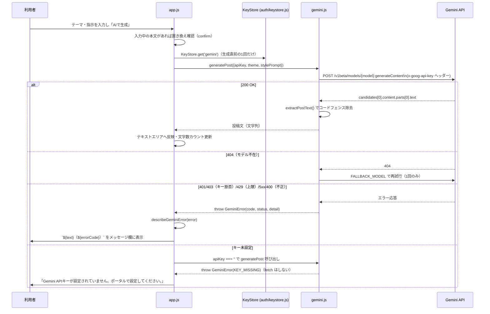
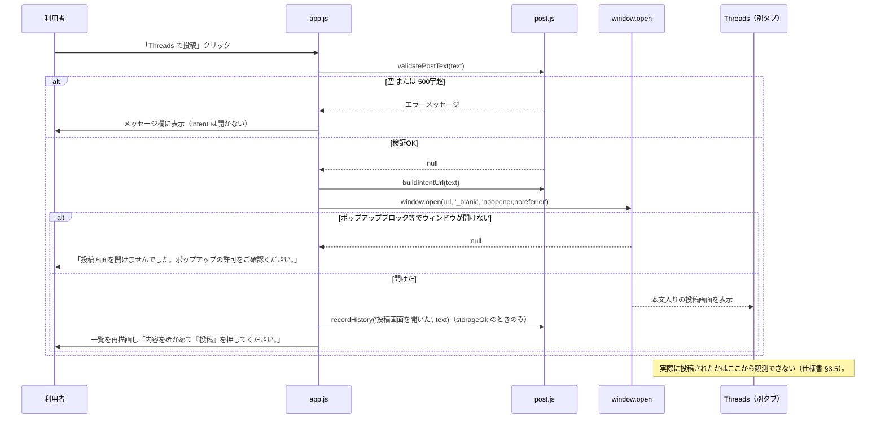
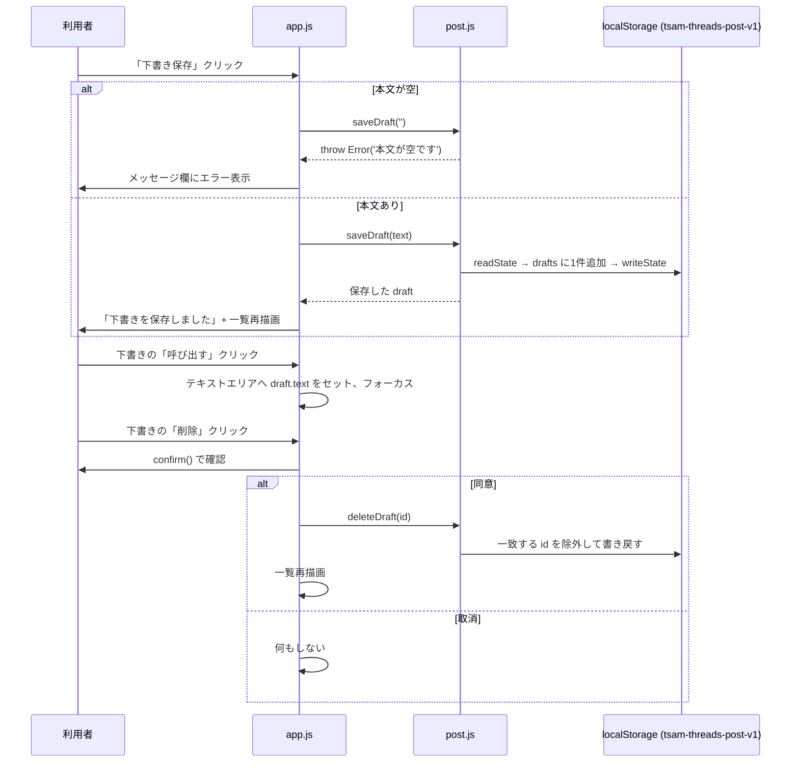

# Threads 投稿アプリ（threads-post）詳細設計書

作成: 2026年8月18日

> 実装の正は [docs/specs/threads-mvp-requirements-v1.md](../../specs/threads-mvp-requirements-v1.md)（以下「仕様書」）。
> 本書は実装ファイルを直接確認して書いており、行番号ではなく関数名・§番号で参照する。

## 1. ファイル・モジュール構成

| パス | 行数目安 | 責務 |
| --- | --- | --- |
| `index.html` | 128行 | DOM構造、CSP（meta）、生成フォーム・投稿文欄・下書き/履歴一覧の器。 |
| `app.js` | 284行 | エントリ。認証ガード、DOM参照の集約（`dom` オブジェクト）、各ハンドラ（生成・保存・投稿・一覧描画）、キー状態の反映。 |
| `config.js` | 61行 | 定数の単一集約先。モデル名・エンドポイント・文字数上限・intent URL・保存キー・履歴上限。 |
| `post.js` | 161行 | 検証（`validatePostText`/`countText`）、intent URL組み立て（`buildIntentUrl`）、端末内保存（下書き・履歴・調整プロンプト）。DOM非依存の純関数群。 |
| `gemini.js` | 279行 | Gemini 呼び出し本体（`callOnce`/`generatePost`）、エラー分類、プロンプト組み立て（`buildPostRequest`）、応答からの本文抽出（`extractPostText`）。台本メーカー（short-script）と同方針、エラー分類は複製。 |
| `style.css` | 155行 | 見た目。`css/style.css`／`auth/auth.css` を土台に不足分のみ。 |

## 2. 主要処理フロー

### 2.1 投稿文の生成（Gemini）



### 2.2 投稿（intent リンク）



### 2.3 下書きの保存・呼び出し・削除



## 3. データモデル詳細

### 3.1 localStorage スキーマ（`tsam-threads-post-v1`。post.js `readState`/`writeState`）

```
{
  "drafts":  [ { "id": string, "text": string, "createdAt": number(ms) }, ... ],
  "history": [ { "id": string, "at": number(ms), "kind": string, "text": string }, ... ],
  "stylePrompt": string
}
```

- `drafts`／`history` とも一覧表示は新しい順（`.slice().reverse()`）で返す。保存順は追記（末尾）。
- `history` は `HISTORY_LIMIT`（既定100）を超えたら `slice(length - HISTORY_LIMIT)` で古い順に切り詰める。
- `kind` に入る値は現状 `'投稿画面を開いた'` の1種類のみ（`app.js` `recordHistory` 呼び出し箇所）。列挙型としては定義していない。
- `id` は `crypto.randomUUID()`。非対応環境では `id-${Date.now()}-${random}` にフォールバックする（`makeId()`）。
- JSON パース失敗時は `{ drafts: [], history: [], stylePrompt: '' }` を返し、既存データを書き潰さず次回の保存時に上書きされる（読み捨てるだけで即座には消さない）。

### 3.2 localStorage スキーマ（`public/auth/` 側。参照のみで threads-post は書式を定義しない）

| キー | 形式 | 管理元 |
| --- | --- | --- |
| `tsam-api-keys` | `{ "gemini": "<key>" }` | `public/auth/keystore.js` |
| `tsam-auth-session` | 文字列（セッショントークン） | `public/auth/session.js` |

### 3.3 Gemini リクエスト本体（`gemini.js` `buildPostRequest`）

```
{
  contents: [{ role: 'user', parts: [{ text: <プロンプト文字列> }] }],
  generationConfig: { temperature: 0.4, maxOutputTokens: 1024 }
}
```

プロンプトは「500文字以内・誇張しない・創作の禁止・ハッシュタグは指示時のみ・
前置き/後書き/コードブロックなし」の方針＋（任意）「# 書き方の調整（利用者設定）」
＋「# テーマ・指示」の順で組み立てる。調整プロンプトは先頭2000字で頭打ちにする
（`buildPostRequest` の `stylePrompt` 処理）。

## 4. インターフェース仕様

### 4.1 Gemini API

| 項目 | 内容 |
| --- | --- |
| エンドポイント | `POST https://generativelanguage.googleapis.com/v1beta/models/{model}:generateContent` |
| 認証 | `x-goog-api-key` ヘッダー |
| 主モデル／フォールバック | `DEFAULT_MODEL`（`gemini-2.5-flash-lite`）／`FALLBACK_MODEL`（`gemini-3.5-flash-lite`）。404のときのみ切替 |

### 4.2 主要関数の入出力

| 関数 | ファイル | 入力 | 出力／例外 |
| --- | --- | --- | --- |
| `countText(text)` | post.js | 文字列 | コードポイント数（`Array.from().length`） |
| `validatePostText(text)` | post.js | 文字列 | エラーメッセージ文字列 または `null` |
| `buildIntentUrl(text)` | post.js | 文字列 | intent URL（`encodeURIComponent` 済み） |
| `isStorageAvailable(storage?)` | post.js | 任意の storage 実装 | `boolean`（probe書き込みの成否） |
| `saveDraft(text, {storage, now})` | post.js | 本文・保存先・時刻 | 保存した1件 `{id, text, createdAt}` ／ `Error`（空文字） |
| `listDrafts({storage})` | post.js | 保存先 | 下書き配列（新しい順） |
| `deleteDraft(id, {storage})` | post.js | id・保存先 | なし（副作用のみ） |
| `recordHistory(kind, text, {storage, now})` | post.js | 種別・本文・保存先・時刻 | なし（副作用のみ。上限超過分を破棄） |
| `listHistory({storage})` | post.js | 保存先 | 履歴配列（新しい順） |
| `saveStylePrompt(text, {storage})` / `loadStylePrompt({storage})` | post.js | 文字列／保存先 | なし／保存済み文字列（既定 `''`） |
| `generatePost({apiKey, theme, stylePrompt, fetchImpl, signal})` | gemini.js | テーマ・キー・調整プロンプト・オプション | 生成された本文（文字列） / `GeminiError` |
| `mapStatus(status)` | gemini.js | HTTPステータス | `GeminiErrorCode` の値 |
| `describeGeminiError(error)` | gemini.js | `Error` または `GeminiError` | `{ text, errorCode, detail }` |

### 4.3 エラーコード（画面表示用）

| コード | 意味 |
| --- | --- |
| `KEY-001` | Gemini APIキー未設定 |
| `KEY-002` | キーが拒否された（401/403） |
| `AI-001` | 通信失敗／サーバーエラー（5xx） |
| `AI-002` | 利用上限（429） |
| `AI-003` | リクエストの形式が不正（400。キーの問題にはしない） |
| `AI-004` | 生成結果が空 |
| `AI-005` | モデルが利用できない（404。フォールバック後もダメだった場合） |
| `SYS-999` | 不明なエラー |

## 5. 状態管理・セッション設計

### 5.1 モジュール変数（`app.js`。すべてメモリ上のみ、永続化しない）

| 変数 | 意味 |
| --- | --- |
| `dom` | 画面要素への参照を集約したオブジェクト。DOM取得は起動時に1回だけ行う。 |
| `storageOk` | `isStorageAvailable()` の結果。起動時に1回判定し、以後は各ハンドラがこれを見て保存可否を分岐する。 |

生成中・投稿処理中を示す専用の状態変数は持たない（`AbortController` による
中止機構も無い。生成ボタンは呼び出し中のみ `disabled` にする程度）。

### 5.2 セッション

- 認証状態はサーバー（sessions シート）にのみ根拠を持つ。ローカルの
  `tsam-auth-session` は不透明なトークンであり、`guardPage()` は毎回サーバー検証を
  行う（`public/auth/session.js`）。
- 本アプリ自身はセッションを発行・管理しない。読むのは `guardPage()` の戻り値
  （`user`）の有無のみで、ロール等は参照しない。

## 6. エラーハンドリング詳細

| 発生源 | 検知方法 | 復旧導線 |
| --- | --- | --- |
| Gemini fetch 失敗（通信断） | `try/catch` → `GeminiErrorCode.NETWORK` | 再試行はユーザー操作（生成ボタン再押下）。 |
| Gemini 非2xx応答 | `mapStatus(status)` | コード別文言。429では再試行しない設計（クォータ温存）。 |
| Gemini応答が空／JSONでない | `extractPostText`／応答パースの `catch` が `EMPTY_TEXT` を送出 | テーマ・指示を変えて再試行を促す文言。 |
| キー未設定 | `generatePost` 冒頭で `apiKey` の空判定 → `fetch` せず `KEY_MISSING` | Portal での設定を促す文言（「ポータル」を含む）。 |
| 投稿文検証エラー | `validatePostText()` の戻り値（空／500字超） | メッセージ欄に表示し、intent リンクは開かない。 |
| ポップアップブロック | `window.open()` の戻り値が falsy | 「ポップアップの許可をご確認ください」を案内。 |
| 下書き保存（空文字） | `saveDraft()` が `Error` を送出 | メッセージ欄にエラー表示。 |
| localStorage 不可 | `isStorageAvailable()` の probe 書き込み失敗 | 起動時に注記を表示し、保存系ボタンは押下時にエラーメッセージを返す。 |
| 壊れた保存データ | `readState()` の `JSON.parse` 失敗 | 読み捨てて空状態を返す。次の保存で作り直される。 |

## 7. 設定値・環境変数一覧

このアプリはサーバー環境変数を持たない（静的アプリのため）。すべて `config.js`
に定数として集約されている。**値は秘密情報ではない**ため、参考として現在値を
併記する。

| 名前 | 役割 | 置き場所 | 現在値 |
| --- | --- | --- | --- |
| `DEFAULT_MODEL` | Gemini 主モデル | config.js | `gemini-2.5-flash-lite` |
| `FALLBACK_MODEL` | 404時のフォールバックモデル | config.js | `gemini-3.5-flash-lite` |
| `GEMINI_HOST` / `GEMINI_ENDPOINT_BASE` | Gemini APIのホスト／ベースURL | config.js | `generativelanguage.googleapis.com` 他 |
| `MAX_OUTPUT_TOKENS` | Gemini応答の最大トークン数 | config.js | `1024` |
| `THREADS_INTENT_BASE` | intent リンクのベースURL | config.js | `https://www.threads.com/intent/post`（2026-08-12 実機確認で選定） |
| `TEXT_LIMIT` | 投稿文の文字数上限 | config.js | `500` |
| `THEME_MAX_LENGTH` | テーマ入力の最大文字数 | config.js | `100` |
| `STORAGE_KEY` | 端末内保存のlocalStorageキー | config.js | `tsam-threads-post-v1` |
| `HISTORY_LIMIT` | 履歴の保持件数 | config.js | `100` |

一方、`public/auth/config.js` の `AUTH_CONFIG.apiUrl`／`verifyApiUrl`
（Apps Script Web アプリの `/exec` URL・auth-verify Worker のURL）は、仕様書の
ルールにより値を伏せる対象であり、本書でも名前と役割のみ記す。

## 8. テスト構成

| スイート名 | ファイル | kind | 対象 |
| --- | --- | --- | --- |
| `threads-post` | `tests/unit/threads-post.mjs` | unit | `post.js`（500字検証・コードポイント基準・intent URLエンコード・下書きの保存/一覧/削除・履歴の記録と100件上限・壊れた保存データの読み捨て・調整プロンプトの保存と Gemini リクエストへの反映）、`gemini.js`（キーはヘッダーでURLに載せない・テーマ/500字/創作禁止がプロンプトに載る・404のみフォールバック・429は再試行しない・状態分類400/401/429/503・空応答・キー未設定は通信しない） |

実行方法: `node tests/run.mjs threads-post`（単体）、または `npm test` で全スイート
内の一部として実行される。画面（app.js）は DOM の付け外ししか行わないため、
テストはロジック層（post.js／gemini.js）を直接 import して固定しており、
実サービス（Gemini・Threads）へは通信しない（`fetchImpl` の差し替え／偽の
`localStorage` 実装で検証。テストファイル冒頭コメント）。

旧実装（`gas-threads/`）に対応する別スイート `threads-mvp`
（`tests/unit/threads-mvp.mjs`）が存在するが、対象は旧GASアプリであり
本アプリ（threads-post）の対象ではない。
