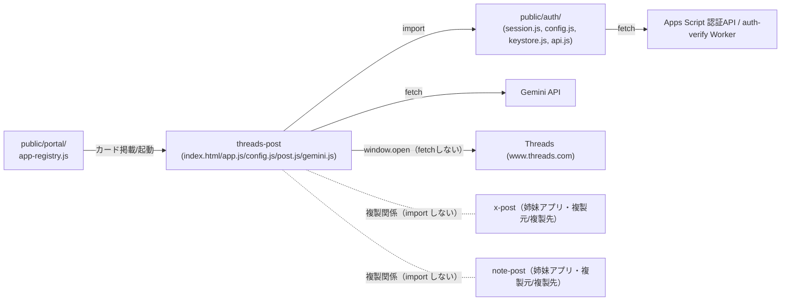

# Threads 投稿アプリ（threads-post）組み込みガイド

作成: 2026年8月18日

> このアプリを、このリポジトリ以外のプロダクトへ移植する開発者を読者として想定する。
> 実装の正は [docs/specs/threads-mvp-requirements-v1.md](../../specs/threads-mvp-requirements-v1.md)。複製方針は
> [repository-structure.md](../../repository-structure.md) §4 に従う。

## 1. 移植の前提条件

- **サーバーコードを持たない静的アプリである。** 移植先も「サーバーを介さずブラウザ
  から直接 Gemini へ通信し、Threads へは別タブを開くだけ」という構成を許容できる
  こと（BYOK・intent リンク原則。仕様書 §2）。
- **KeyStore と同等の「APIキー保管庫」を用意できること。** 本アプリ自体はキー設定
  UIを持たず、Portal 側の設定画面に依存している。AI生成を使わない構成にするなら
  この前提は不要（書く・貼る・下書き・投稿は Gemini キー無しで動く）。
- **ログイン基盤（`guardPage()` 相当）を用意できること、またはガードを外す判断を
  すること。** 本アプリは「ログイン済み利用者」を前提に作られている。
- **Threads 側の intent URL 形式が変わらないこと。** `www.threads.com/intent/post?text=…`
  は非公式の挙動確認（2026-08-12 実機確認）に基づく選定であり、Threads 側の仕様
  変更で壊れうる。移植後も定期的な実機確認が要る。

## 2. 依存関係マップ

このアプリが**このリポジトリの中で**結合しているのは `public/auth/` の4ファイルの
みである（[repository-structure.md](../../repository-structure.md) の「本番アプリ間で共通層を
作らない」方針により、他の本番アプリへの import は存在しない）。

## 3. 切り離しポイント

移植時に必ず差し替え・見直しが必要な箇所。

| 箇所 | 現状 | 移植時の対応 |
| --- | --- | --- |
| `import { guardPage } from '../../auth/session.js'`、`import { setScreenDepth } from '../../auth/config.js'`（app.js） | Portal共通の認証基盤に依存 | 移植先の認証機構に置き換えるか、認証を撤去する（`init()` の先頭でガードを外し直接描画に変更）。 |
| `import { KeyStore, PROVIDERS, isKeyStoreAvailable } from '../../auth/keystore.js'`（app.js） | `tsam-api-keys` という固定の localStorage キーで Gemini キーを管理 | 移植先で同じ責務のモジュールを自前で用意する（キー入力UIを足す、または別の秘密管理に差し替える）。AI生成を使わないなら丸ごと不要。 |
| `THREADS_INTENT_BASE`（config.js） | `https://www.threads.com/intent/post` 固定 | Threads側の仕様変更時はここだけ直せば良いよう作られている。実機確認のうえ更新する。 |
| CSP の `<meta>` 宣言（index.html） | `connect-src` に `generativelanguage.googleapis.com`／`script.google.com`／`script.googleusercontent.com`／`auth-verify.potenitas-lp.workers.dev` を列挙。`threads.com`／`threads.net` は含めない（fetchしないため） | 移植先のドメイン・認証先に合わせて書き換える。Apps Script 認証を使わないなら該当行を削除できる。 |
| `setScreenDepth(2)`（`public/auth/config.js` の相対パス機構） | サイトルートからの階層深さに依存した相対パス組み立て | 認証基盤ごと外す場合はこの呼び出しも不要になる。 |
| Portal 掲載（`APP_REGISTRY`） | TSAM AI Portal 固有の掲載機構 | 移植先の起動口（メニュー、リンク等）に置き換える。 |
| `STORAGE_KEY`（`tsam-threads-post-v1`。config.js） | 他の本番アプリと衝突しないよう `tsam-` 接頭辞を付けた固定キー | 移植先で他アプリと衝突しないキー名に変更する。 |

## 4. 必要な外部サービスと設定作業の概要

| サービス | 用途 | 設定作業の概要 |
| --- | --- | --- |
| Gemini API | 投稿文の生成（任意機能） | 利用者ごとに Google AI Studio 等で APIキーを取得（本アプリは配布・課金を代行しない。BYOK）。移植先のキー保管庫にキーを登録できる導線を用意する。生成を使わないなら不要。 |
| Threads | intent リンクによる投稿画面の表示 | 事前設定・審査は不要（API・トークンを使わないため）。ただし非公式挙動への依存であることを踏まえ、実機での定期確認を運用に組み込む。 |
| 認証基盤（移植先で用意する場合） | ログイン判定 | 本アプリの `guardPage()` 相当インターフェース（Promiseを返し、未ログインなら遷移して `null` を返す）を実装する。 |

## 5. 複製時の注意

[repository-structure.md](../../repository-structure.md) §4-1「アプリ間で共通層を作らない」
方針に従い、このアプリのロジックを別プロダクトへ複製する場合は、**複製元パスと
複製日を複製先ファイルの冒頭コメントに書く**こと。

このリポジトリの中では、`threads-post` は姉妹アプリ `x-post`（X投稿）・
`note-post`（note下書き）と相互に複製し合う関係にある（import はしない）。
実際に確認できた対応関係は次のとおり。

| 観点 | threads-post | x-post | note-post |
| --- | --- | --- | --- |
| 文字数制限の数え方 | コードポイント数（`countText`）。上限500字 | 重み付け（`countWeight`。twitter-text の既定に合わせ、Latin系1・日本語/絵文字2）。上限280ウェイト | （本書調査範囲では config.js／post.js の差分のみ確認。文字上限の仕組みはアプリごとの投稿先仕様に依存） |
| 投稿方式 | intent リンク（URLに本文を載せて別タブを開く） | intent リンク（同方式） | 本文プリフィルURLが存在しないため、クリップボードへコピー→作成画面を開く方式（`config.js` コメント） |
| Gemini 出力上限 | `MAX_OUTPUT_TOKENS: 1024`（投稿文は最大500字） | 同型 | `4096`（note は記事想定で1500〜2000字目安のため大きく取る） |
| 保存キー | `tsam-threads-post-v1` | `tsam-x-post-v1` | 別キー（本書では未調査） |

複製元に既知の不具合があれば、写す前に直すこと（§4-3）。本書作成時点で
`threads-post` 側に見つかった、複製時に持ち込むべきでない事項は次のとおり。

- **仕様書の intent URL 例が実装と食い違っている。** 仕様書
  （`docs/specs/threads-mvp-requirements-v1.md`）§3.3 の本文中の例は
  `https://www.threads.net/intent/post?text=…` のままだが、実装（`config.js`）は
  2026-08-12 の実機確認により `https://www.threads.com/intent/post` を使っている
  （config.js のコメントに経緯あり）。複製・移植の際は実装側（`threads.com`）を
  正として写すこと。仕様書側の記述更新は本書の対象外（[01_requirements.md](./01_requirements.md) §9）。

逆方向（`x-post`／`note-post` にあって `threads-post` に無い配慮）は、本書の調査
範囲では確認していない。

## 6. 最小組み込み手順

1. `public/production-app/threads-post/` から `index.html`／`app.js`／`config.js`／
   `post.js`／`gemini.js`／`style.css` をコピーする（構成がシンプルなため、
   short-script のような「一部モジュールを除外する」判断は不要）。
2. `app.js` から `guardPage`／`setScreenDepth`／`KeyStore` 系 import を、移植先の
   認証・キー管理へ差し替える。認証不要にする場合はガード呼び出し自体を削除し、
   `init()` の先頭で直接 `dom.loading.hidden = true; dom.content.hidden = false;`
   するよう変更する。
3. `index.html` の CSP `<meta>` から、Apps Script 関連ドメイン（`script.google.com`／
   `script.googleusercontent.com`）と `auth-verify.potenitas-lp.workers.dev` を、
   実際に使わないなら削除する。Gemini 用の `generativelanguage.googleapis.com` は
   AI生成を使う限り必須。
4. `config.js` の `THREADS_INTENT_BASE`／`STORAGE_KEY` を移植先の用途に合わせて
   変更する（`STORAGE_KEY` は他アプリと衝突しない値にする）。
5. 利用者へ Gemini APIキーを入力させるUI（KeyStore相当）を用意し、`app.js` の
   `refreshKeyState()`／`handleGenerate()` が参照するキー取得処理をそこへ差し替える。
   AI生成を使わないなら、生成フォーム一式（`tp-generate-form` 関連のDOM・
   ハンドラ・`gemini.js`）を丸ごと除外できる。
6. 移植後は、`tests/unit/threads-post.mjs` を移植先へコピーし、import パスと
   `STORAGE_KEY`（変更した場合）を合わせて実行できることを確認する。実サービス
   （Gemini・Threads）への通信は発生しないため、CI等でそのまま流用しやすい
   （[03_detailed-design.md](./03_detailed-design.md) §8）。
