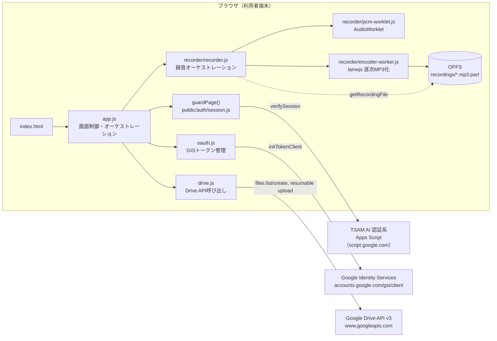
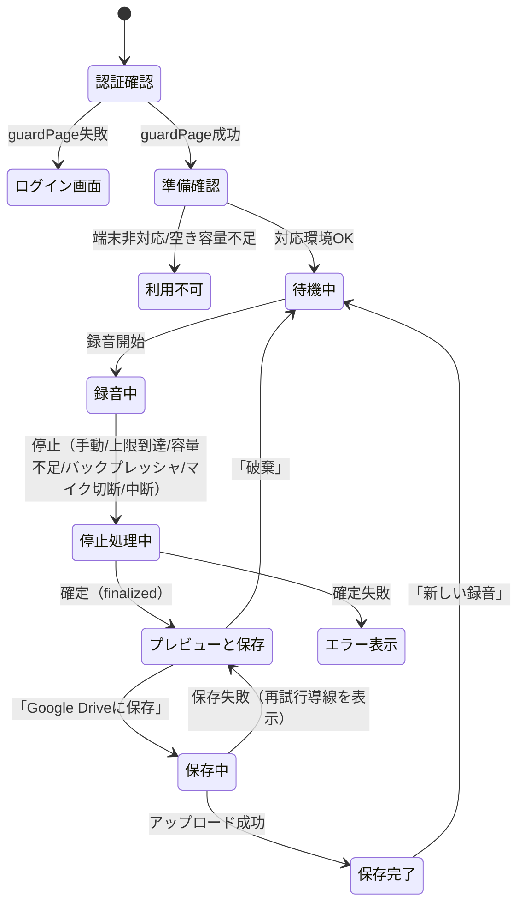

# ブラウザ録音アプリ（voice-recorder）基本設計書

対象要件: [01_requirements.md](./01_requirements.md)（既存要件定義書 [mvp-requirements.md](../../requirements/mvp-requirements.md) §5〜§10 が実装準拠範囲）

## 1. システム構成

録音・変換・一時保存・プレビューはすべて端末内で完結し、当社のサーバーを音声が経由しない。保存操作時にかぎり、MP3が利用者自身のGoogle Driveへ直接送信される。バックエンドAPIは存在せず、外部通信は「TSAM AI認証系（セッション検証）」と「Google（OAuth・Drive API）」の2系統のみに限定される（CSPで強制）。

## 2. コンポーネント一覧と責務

| ファイル | 責務 |
| --- | --- |
| `index.html` | 画面構造。`guardPage()` が利用者を返すまで `<main>` を `hidden` にする。CSPをmetaタグで宣言 |
| `app.js` | 画面制御の中心。各モジュールを呼び出し、DOM更新・状態遷移・エラー表示を行う。**トークンそのものは保持せず、呼び出し直前に取り出して渡すだけ** |
| `config.js` | 静的設定の単一の置き場所（録音上限・ビットレート・フォルダ名・OAuthスコープ等）。秘密情報は置かない |
| `oauth.js` | GISのトークンモデルによるGoogle認可。アクセストークンをクロージャ変数にのみ保持し、外部へ参照を返さない |
| `drive.js` | Google Drive API v3の呼び出し（フォルダ解決・作成、同名検索、resumable upload）。DOM操作・画面文言は持たない |
| `errors.js` | `AppError` クラスとエラーコード、画面文言（GUIDE）、進捗文言（PROGRESS）の一元管理 |
| `filename.js` | ファイル名の生成・検証・連番付与のための純粋関数群 |
| `recorder/recorder.js` | 録音のオーケストレーション（メインスレッド）。マイク取得・AudioContext・AudioWorklet・Workerの起動と監視、状態機械の管理。画面を知らない |
| `recorder/capabilities.js` | 対応環境の判定と空き容量確認。通信・録音は行わない |
| `recorder/pcm-worklet.js` | AudioWorkletProcessor。入力をモノラル化し、約0.2秒ごとにメインスレッドへ転送するだけ |
| `recorder/encoder-worker.js` | 専用Worker。PCMをInt16化し、lamejsで1152サンプル単位に逐次MP3エンコードしてOPFSへ書き込む |
| `recorder/opfs-storage.js` | メインスレッド側のOPFS操作（起動時クリーンアップ、File取得、削除、SyncAccessHandle実対応の検証委譲） |
| `recorder/sync-access-probe-worker.js` | `createSyncAccessHandle` の実対応を専用Worker内で検証する使い捨てWorker |
| `vendor/lamejs.iife.js` | MP3エンコードライブラリ（LGPL-3.0、同梱）。NOTICE/LICENSEを画面フッターから参照可能にする |
| `style.css` | 画面スタイル。`prefers-reduced-motion` 対応を含む |

## 3. 外部インターフェース一覧

| 連携先 | 通信方式 | 用途 |
| --- | --- | --- |
| TSAM AI認証系（Apps Script） | `public/auth/api.js` 経由のHTTP POST（`verifySession`） | ポータルのログインセッション検証（`guardPage()` が呼ぶ） |
| Google Identity Services | `<script>` タグでの読み込み＋`google.accounts.oauth2.initTokenClient()` | OAuth 2.0 トークンモデルによる認可。ポップアップUI |
| Google Drive API v3（`files`） | REST（`fetch`、Bearerトークン） | フォルダの検索・作成、同名ファイル検索、about（連携アカウント表示用） |
| Google Drive API v3（`upload`） | REST resumable upload（`fetch`、PUT・8MBチャンク） | MP3ファイルの保存 |

外部SDKは使わず、いずれも `fetch` でRESTを直接呼ぶ（リポジトリ全体の方針と整合）。GISのスクリプトのみ例外的にGoogleドメインから読み込む（第三者CDNではなく認可そのものの提供元であるため）。

## 4. データ設計概要

本アプリはデータベースを持たない。永続化される実体は次の2つ。

| 保存先 | 内容 | 生存期間 |
| --- | --- | --- |
| OPFS（`recordings/` ディレクトリ） | 録音中に逐次書き込まれる一時MP3（`rec-YYYYMMDD-HHmmss-<token>.mp3.part`） | 録音停止後、保存または破棄で削除。異常終了で残った場合は次回起動時に無条件で自動削除（24時間待たない） |
| Google Drive（利用者本人のマイドライブ） | 確定したMP3ファイル（`name`・`mimeType: audio/mpeg`・`parents: [folderId]`） | 恒久（本アプリは削除・移動を行わない） |

追加のメタデータ（Driveのカスタムプロパティ等）は設定しない。フォルダIDはどこにも永続化せず、毎回名前から解決する。

## 5. 画面一覧と画面遷移

画面はindex.html 1枚のみ（1画面構成）。パネルの表示・非表示で状態を切り替える。

画面要素の一覧は既存要件書 §7 のとおり（アプリ名、Google連携ボタン・連携アカウント表示、保存先フォルダ表示、録音操作、経過時間・残り時間予告、推定サイズ・空き容量、音声プレビュー、ファイル名入力、保存・破棄ボタン、進捗表示、保存結果、エラーメッセージ）。

## 6. 認証・認可方式

二層構造になっている。

1. **ポータル認証（画面ゲート）**: `guardPage()` が画面描画前にセッショントークンをApps Scriptで検証する。通信できない場合・未認証の場合は画面へ入れない。ただし静的配信であるため、HTML/JSファイルそのものの取得は防げない。これは「画面に入れないための制御」であって機密の保護ではない。
2. **Google OAuth（実質的なアクセス制御）**: Driveのデータに触れるには利用者本人がGoogleの同意画面で許可する必要があり、許可されない限り保存先フォルダにもファイルにも到達できない。GISのトークンモデル（暗黙フロー）を使い、スコープは `drive.file` のみに限定。アクセストークンはメモリ上のみで保持し、リフレッシュトークン・client secretは扱わない。OAuthクライアントIDは公開値であり、実質的な防御はGoogle Cloud側の「承認済みのJavaScript生成元」に本番・開発オリジンのみを登録することで行う。

アプリを開いただけでは認可を要求せず、利用者が「連携する」または保存操作を行った時点で要求する（ポップアップブロック回避と、意図しない認可要求の防止）。

## 7. エラー処理方針

- 例外は唯一の型 `AppError`（`code` を持つ）に統一する。分岐に使うのは `code` だけで、`message`（原文の英語文等）は画面へ出さない。
- 画面文言は `errors.js` の `GUIDE` テーブルで一元管理し、「次に何をすればよいか」まで含める。未知のコードにも既定文言（フォールバック）を用意し、黙って失敗させない。
- 生の例外は `console.error` へ出す（トークンを含まないことを保証したうえで、実装バグの原因追跡のため）。
- 録音側のエラー（`RecorderErrorCode`）は `app.js` の `toAppErrorCode()` で画面用の `ErrorCode` へ変換する。録音とMP3変換は同時に進むため、変換失敗は録音失敗として扱う（部分ファイルからの復旧はしない）。
- Google Drive APIのHTTPステータスは `drive.js` の `toErrorCode()` でエラーコードへ分類する（401→認証切れ、403→原因別に3種、404→フォルダ利用不可、429→レート制限、その他→アップロード失敗）。
- 失敗時の再試行導線は原因ごとに出し分ける（認証切れ→「連携しなおす」、それ以外→「保存をやり直す」）。録音データは再試行可能な間、端末内ストレージから破棄しない。

## 8. 運用・デプロイ構成

- 配信は `public/production-app/voice-recorder/` 配下の静的ファイルとして行われ、このアプリ専用のビルド工程はない（プレーンなESモジュール）。
- 本番配信基盤はCloudflare Workers（OpenNext）。本番デプロイは手動 `npm run deploy` で行い、`main` へのpushでは自動デプロイされない（`CLAUDE.md` §配信構成）。
- Portalのアプリ一覧（`public/portal/app-registry.js`）に「ブラウザ録音」として登録済み（`href: 'production-app/voice-recorder/'`）。
- CI（`.github/workflows/test.yml`）は `npm test` のみを実行する。これに含まれるのはNode実行のユニットテスト（`tests/unit/voice-recorder.mjs` 等）であり、実ブラウザでの録音を伴うE2E（Playwright）はCIに含まれず、`npm run test:e2e` 系のコマンドで手動実行する（詳細は [03_detailed-design.md](./03_detailed-design.md) §8）。
- バックエンドを持たないため、サーバープロセスの監視・スケーリング・定期クリーンアップ等の運用作業が発生しない。一時ファイルの後始末は「次回起動時にクライアント側で自動削除する」設計で完結させている。

## 9. 主要な設計判断と採らなかった選択肢

- **バックエンドAPI（v1.1想定）を採らず、ブラウザ完結（v1.2）を採用した。** 当時のホスティング（Vercel）の関数では90分・約86MBの受信とFFmpeg実行が成立しないこと、および逐次エンコード方式によりサーバー側変換が不要になったことが理由（既存要件書 §14）。トレードオフとして、録音全体の変換失敗は即・録音のやり直しになる（部分復旧を持たない）。
- **録音全体をメモリに保持する方式（MediaRecorderでチャンク蓄積、v1.1想定）を採らず、AudioWorklet→Worker→OPFSの逐次エンコードを採用した。** メモリ使用量を録音時間に依存させないため。Workerが追いつかない場合に備え、バックプレッシャ監視（5秒警告・10秒安全停止）を持つ。
- **フォルダIDの固定登録（v1.1想定）を採らず、名前解決＋自動作成を採用した。** `drive.file` スコープではアプリが作成していないフォルダへ書き込めず、かつフォルダIDは利用者ごとに異なるため、固定登録では他の利用者のドライブで必ず失敗する。
- **`drive`／`drive.readonly` スコープを採らず `drive.file` のみに限定した。** 利用者のドライブ全体が見える状態を避け、「保存先以外のGoogle Driveデータを読み取らない」という要件を、実装ではなくスコープ自体で担保する。トレードオフとして、利用者が手動で作成した同名ファイルは検索に出てこず、Drive上に同名が2つ並ぶ場合がある（`drive.js` に明記）。
- **サーバー側トークン管理（v1.1想定）を採らず、メモリ上のみの保持を採用した。** 静的サイトにclient secretを置けないため。トレードオフとして、アクセストークンの寿命（約1時間）が録音上限（90分）より短く、90分録音後は保存前に再連携が必要になる場合がある（画面側で「認証の期限切れ」を明示的に区別して案内する設計にしている）。
- **本番アプリ間の共通層（`shared/`等）を作らず、複製を採用した。** 別々に進む開発を互いに止めないための判断（[docs/repository-structure.md](../../repository-structure.md) §4-1）。録音ロジックは `public/apps/voice-recorder/` から、OAuth処理は `receipt-ocr/oauth.js` から複製している。
- **カレンダー通知機能を本番から一時的に除外した。** もとは本番アプリに同居していたが、2026-08-11にテスト環境（`public/apps/voice-recorder/`）へ移設し、CSPの `connect-src` から通知ゲートの許可を外した。試験の先送りであり廃止ではないが、本番への復帰時期は未定（`docs/notifier-v2-resume.md`）。通知の入口だった `?eventId=` パラメータの引き継ぎ（ログイン画面往復時の復元）だけは、認証系の元画面復帰と独立して効いているため本番に残してある。
