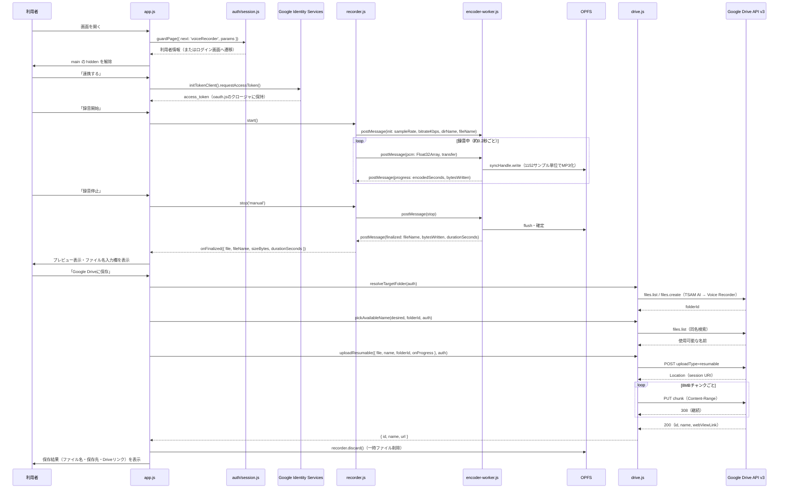
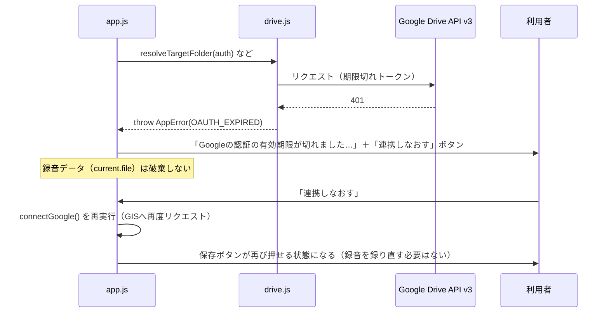

# ブラウザ録音アプリ（voice-recorder）詳細設計書

対象要件: [01_requirements.md](./01_requirements.md) / [02_basic-design.md](./02_basic-design.md)

## 1. ファイル・モジュール構成

| パス | 責務 |
| --- | --- |
| `public/production-app/voice-recorder/index.html` | 画面構造・CSP宣言。`guardPage()` が利用者を返すまで `<main id="vr-main">` を `hidden` にする |
| `public/production-app/voice-recorder/app.js` | 画面制御。DOM要素の取得、状態遷移、各モジュールの呼び出し、エラー表示、離脱警告 |
| `public/production-app/voice-recorder/config.js` | 静的設定（OAuthスコープ、録音上限、ビットレート、フォルダ名、空き容量閾値、Google APIエンドポイント） |
| `public/production-app/voice-recorder/oauth.js` | GISトークン管理。`requestAccess()` / `currentToken()` / `hasValidToken()` / `forgetToken()` |
| `public/production-app/voice-recorder/drive.js` | Drive API呼び出し。フォルダ解決・作成、同名検索、resumable upload |
| `public/production-app/voice-recorder/errors.js` | `AppError`、`ErrorCode`、画面文言（`GUIDE`）、進捗文言（`PROGRESS`）、`describeError()` |
| `public/production-app/voice-recorder/filename.js` | ファイル名の生成・検証・連番付与（純粋関数のみ） |
| `public/production-app/voice-recorder/recorder/recorder.js` | `Recorder` クラス。マイク取得、AudioContext/AudioWorklet構築、Worker起動・監視、状態機械 |
| `public/production-app/voice-recorder/recorder/capabilities.js` | 対応環境判定、空き容量確認、表示用フォーマット関数 |
| `public/production-app/voice-recorder/recorder/pcm-worklet.js` | `AudioWorkletProcessor`。モノラル化＋約0.2秒バッファリング |
| `public/production-app/voice-recorder/recorder/encoder-worker.js` | 専用Worker。Int16化・1152サンプル単位のMP3エンコード・OPFS書き込み・定期flush |
| `public/production-app/voice-recorder/recorder/opfs-storage.js` | OPFSのメインスレッド側操作（起動時クリーンアップ、File取得・削除、SyncAccessHandle実対応の検証委譲、一時ファイル命名） |
| `public/production-app/voice-recorder/recorder/sync-access-probe-worker.js` | `createSyncAccessHandle` 実対応の検証用使い捨てWorker |
| `public/production-app/voice-recorder/vendor/lamejs.iife.js` | MP3エンコードライブラリ（LGPL-3.0、同梱） |
| `public/production-app/voice-recorder/style.css` | 画面スタイル（`prefers-reduced-motion` 対応含む） |

## 2. 主要処理フロー

### 2.1 正常系（連携済み → 録音 → 保存）

### 2.2 異常系（代表例: 保存操作中のOAuth期限切れ）

その他の代表的な異常系（本文中の処理は上記と同様の構造で、`errors.js` の `GUIDE` に対応する文言を出す）:

| 事象 | 検知箇所 | 結果 |
| --- | --- | --- |
| マイク許可拒否 | `recorder.start()` の `getUserMedia` 例外（`NotAllowedError`） | `RecorderErrorCode.PERMISSION_DENIED` → `ErrorCode.MIC_DENIED`。録音は開始しない |
| サンプルレート規格外 | `recorder.start()` 内 `isSupportedSampleRate()` | `UNSUPPORTED_SAMPLE_RATE` → OSのサウンド設定変更を案内。録音は開始しない |
| 録音中の空き容量不足 | `recorder.js` の定期監視（15秒間隔、安全下限100MB） | `stop('capacity')` で自動停止・確定。ここまでの録音は保存できる |
| バックプレッシャ超過 | `checkBackpressure()`（未処理秒数が10秒以上） | `stop('backpressure')` で自動停止・確定 |
| アップロード中の通信断 | `drive.js` の `fetch` 例外 | `ErrorCode.NETWORK` → 「保存をやり直す」導線。録音データは破棄しない |
| 保存先フォルダへの権限不足 | Drive APIの403（`storageQuotaExceeded` 以外） | `ErrorCode.FOLDER_FORBIDDEN` |

## 3. データモデル詳細

### 3.1 OPFS（一時保存）

- ディレクトリ: `recordings/`（`RECORDINGS_DIR`、OPFSルート直下、なければ作成）
- ファイル名: `rec-YYYYMMDD-HHmmss-<token>.mp3.part`（`buildPartName()`。`token` は多重起動の衝突回避用の乱数＋サンプルレート由来の文字列）
- 書き込み: 専用Worker内の `SyncAccessHandle` による同期書き込み。10秒ごとに `flush()` してディスクへ確定
- 削除: 保存成功後・破棄操作後に削除。異常終了で残った `.mp3.part` は次回起動時に `cleanupStaleFiles()` が無条件で列挙・削除（24時間の猶予を設けない）

### 3.2 Google Drive（最終保存先）

| リソース | フィールド | 備考 |
| --- | --- | --- |
| フォルダ（`application/vnd.google-apps.folder`） | `name`, `parents: [parentId]` | ルート（`TSAM AI`）は `parents: ['root']`、アプリフォルダ（`Voice Recorder`）は `parents: [rootId]`。既存があれば再利用、無ければ作成（`trashed=false` で検索） |
| ファイル（MP3） | `name`, `mimeType: 'audio/mpeg'`, `parents: [folderId]` | カスタムプロパティなし。`webViewLink` が取得できない場合はIDから `https://drive.google.com/file/d/<id>/view` を組み立てて代用 |

フォルダIDはメモリ上でも次回に持ち越さず、保存操作のたびに `resolveTargetFolder()` で解決し直す（`config.js` にも書かない）。

## 4. インターフェース仕様

### 4.1 主要モジュールのエクスポート関数

| モジュール | 関数 | 入出力 |
| --- | --- | --- |
| `oauth.js` | `requestAccess({ prompt })` | GISへ認可要求。成功でアクセストークンをクロージャへ保持、失敗で `AppError` を投げる |
| | `currentToken()` | 有効なら文字列を返し、期限切れなら `AppError(OAUTH_EXPIRED)` を投げる |
| | `hasValidToken()` / `forgetToken()` | 真偽値 / なし（トークンを破棄） |
| `drive.js` | `resolveTargetFolder(auth)` | `Promise<folderId: string>` |
| | `pickAvailableName(desiredName, folderId, auth)` | `Promise<finalName: string>`（同名があれば連番付与） |
| | `uploadResumable({ file, name, folderId, onProgress, signal }, auth)` | `Promise<{ id, name, url }>` |
| | `fetchAccountEmail(auth)` | `Promise<string|null>`（失敗しても例外を投げず `null`） |
| `filename.js` | `buildDefaultFileName(date)` | `YYYYMMDD_HHmmss_録音.mp3` 形式の文字列 |
| | `resolveFileName(input, fallback)` | 入力値から保存名を決定（空・空白のみは `fallback`） |
| | `withSequence(name, sequence)` | 拡張子の前に `_2`, `_3`… を挿入 |
| `recorder/recorder.js` | `new Recorder(options)` | `options` は `onStateChange` / `onTick` / `onWarning` / `onStopped` / `onFinalized` / `onError` のコールバック |
| | `start()` / `stop(reason)` / `discard()` / `dispose()` | 開始・停止・破棄・後片付け |
| `recorder/capabilities.js` | `detectSupport()` | `{ supported: boolean, reasons: {...} }` |
| | `checkFreeSpace(minBytes)` | `{ ok, reason, freeBytes, quota, usage }` |
| | `formatDuration(seconds)` / `formatBytes(bytes)` / `estimateMp3Bytes(seconds)` | 表示用フォーマット |
| `recorder/opfs-storage.js` | `cleanupStaleFiles()` | `Promise<{ removed, failed }>` |
| | `getRecordingFile(fileName)` / `deleteRecording(fileName)` | `Promise<File>` / `Promise<boolean>` |
| | `probeSyncAccessSupport(timeoutMs)` | `Promise<{ supported, error? }>` |

### 4.2 Worker間メッセージ仕様

**`recorder/encoder-worker.js`（classic worker）**

| 方向 | type | ペイロード |
| --- | --- | --- |
| in | `init` | `{ sampleRate, bitrateKbps, dirName, fileName }` |
| in | `pcm` | `{ pcm: Float32Array }`（`transfer` で送出） |
| in | `stop` | なし（残余サンプルをエンコードして確定） |
| in | `abort` | なし（一時ファイルを削除して中断） |
| out | `ready` | なし（初期化完了） |
| out | `progress` | `{ encodedSeconds, bytesWritten }` |
| out | `finalized` | `{ fileName, bytesWritten, durationSeconds }` |
| out | `aborted` | なし |
| out | `error` | `{ code, detail?, errorName? }`（`code` は `WORKER_LOAD_FAILED` / `ENCODER_INIT_FAILED` / `OPFS_OPEN_FAILED` / `OPFS_WRITE_FAILED` / `ENCODE_FAILED` / `FINALIZE_FAILED`） |

**`recorder/pcm-worklet.js`（AudioWorkletProcessor の port）**

| 方向 | 内容 |
| --- | --- |
| in | 文字列 `'stop'`（残バッファを送出してから停止） |
| out | `Float32Array`（約0.2秒ぶん、`transfer` で送出） |

**`recorder/sync-access-probe-worker.js`（classic worker）**

| 方向 | type | ペイロード |
| --- | --- | --- |
| in | `probe` | `{ dirName }` |
| out | `result` | `{ supported: boolean, error?: string }`（`error` は `NotSupportedError` 等のDOM例外名） |

### 4.3 エラーコード対応表

`recorder.js` は `RecorderErrorCode` を、`app.js` の `toAppErrorCode()` が画面用の `ErrorCode`（`errors.js`）へ変換する。

| RecorderErrorCode | ErrorCode（画面） |
| --- | --- |
| `PERMISSION_DENIED` | `MIC_DENIED` |
| `NO_DEVICE` / `DEVICE_BUSY` | `MIC_NOT_FOUND` |
| `UNSUPPORTED_SAMPLE_RATE` | `UNSUPPORTED_SAMPLE_RATE` |
| `INSUFFICIENT_STORAGE` | `STORAGE_LOW` |
| `UNSUPPORTED` / `SYNC_ACCESS_UNSUPPORTED` / `WORKLET_FAILED` / `WORKER_FAILED` | `UNSUPPORTED_ENVIRONMENT` |
| `OPFS_FAILED` / `ENCODE_FAILED` / `FINALIZE_FAILED`（既定） | `ENCODE_FAILED` |

Drive APIのHTTPステータスは `drive.js` の `toErrorCode()` が分類する。

| HTTPステータス／reason | ErrorCode |
| --- | --- |
| 401 | `OAUTH_EXPIRED` |
| 429、または403で `rateLimitExceeded`/`userRateLimitExceeded` | `DRIVE_RATE_LIMITED` |
| 403で `accessNotConfigured`（API未有効） | `DRIVE_API_DISABLED` |
| 403で `storageQuotaExceeded` | `DRIVE_QUOTA` |
| 403（上記以外）、404 | `FOLDER_FORBIDDEN` |
| その他 | `UPLOAD_FAILED` |
| `fetch` 自体の失敗（通信断・中断） | `NETWORK` |

## 5. 状態管理・セッション設計

- **録音の状態機械（`RecorderState`）**: `IDLE` → `PREPARING` → `RECORDING` → `STOPPING` → `FINALIZED`（正常終了）または `ERROR`（異常終了）。`Recorder` クラスがこの状態を単独で保持し、画面（`app.js`）はコールバックで通知を受けるのみ。
- **画面側の状態（`app.js` の `current` オブジェクト）**: 確定MP3（`file`）、OPFS上の一時ファイル名（`fileName`）、プレビューURL（`previewUrl`、必ず`revokeObjectURL`する）、初期ファイル名（`defaultName`）、保存済みフラグ（`saved`）を保持。`saved=false` かつ `file !== null`（または録音中）は「未保存」とみなし、離脱警告の判定に使う。
- **Google連携の表示状態（`google.linkedAccount`）**: **トークンそのものは保持しない**、表示用のメールアドレスのみを保持する。これにより「未連携」と「連携したが期限切れ」を区別できる（トークンの寿命は約1時間で録音上限90分より短いため、区別しないと利用者が困る設計上の理由がコードコメントに明記されている）。
- **本アプリ自身のセッション永続化はない。** ポータルのログインセッションは `public/auth/session.js` が管理する別モジュールの責務であり（localStorageキー `tsam-auth-session`）、本アプリはそれを `guardPage()` 経由で参照するのみ。

## 6. エラーハンドリング詳細

- 例外は `AppError`（`code`, `message`, `cause`）に統一。`describeError(error)` が `code` から `errors.js` の `GUIDE` を引いて画面文言を返す。未知のコード・非`AppError`は既定文言（`FALLBACK`）へ丸める。
- **例外の `message` は画面へ出さない**（Google/DOMが返す英語文の漏出を防ぐ）。生の例外は `console.error('[voice-recorder]', error)` へ記録する（トークンは例外に含めないため漏れない）。
- 進捗文言は4段階固定（`PREPARING` → `RESOLVING_FOLDER` → `UPLOADING` → `FINISHING`）。v1.1にあった「変換中」の段階は無い（変換は録音時点で完了しているため）。
- 停止理由（`reason`）ごとに利用者向けの一言を出し分ける（`describeStopReason()`）: `limit`（上限到達）／`capacity`（空き容量不足）／`backpressure`（処理遅延）／`mic-ended`（マイク切断）／`interrupted`（AudioContext中断）／`manual`（手動、メッセージなし）。
- 警告（`onWarning`）も種別ごとに文言を分ける: `limit-approaching`（残り5分）／`capacity-low`／`backpressure`／`hidden`（タブ非表示）／`interrupted`。
- 保存失敗時の再試行導線は原因で分岐する。`OAUTH_EXPIRED` は「連携しなおす」（`connectGoogle` を再実行）、それ以外は「保存をやり直す」（`saveToDrive` を再実行）。いずれも録音データ（OPFS上の一時ファイル）は保持したまま。

## 7. 設定値・環境変数一覧

すべて `public/production-app/voice-recorder/config.js` に集約。値を書き換える場所を1か所に限定する設計。

| 名前 | 役割 | 備考 |
| --- | --- | --- |
| `SCREEN_DEPTH` | サイトルートからのこの画面の深さ（`setScreenDepth()` へ渡す） | 値: `2` |
| `OAUTH.clientId` | Google Cloud Console発行のOAuthクライアントID | **値は本書に記載しない。** `receipt-ocr` と共用。client secretは扱わない |
| `OAUTH.scope` | 要求するOAuthスコープ | 値: `https://www.googleapis.com/auth/drive.file` の1つのみ |
| `MAX_SECONDS` | 録音上限（秒） | 既定 `90 * 60`。`localhost` 限定でクエリパラメータ `testMaxSeconds` による上書きを許容（本番では到達しない） |
| `WARNING_SECONDS` | 残り時間予告のしきい値（秒） | 既定 `MAX_SECONDS - 5*60`。同じく `testWarningSeconds` で上書き可（localhost限定） |
| `BITRATE_KBPS` | MP3ビットレート | 値: `128`（モノラル） |
| `MP3_BYTES_PER_SECOND` | サイズ見積もりに使う秒あたりバイト数 | `BITRATE_KBPS * 1000 / 8` |
| `SUPPORTED_SAMPLE_RATES` | 対応するAudioContextサンプルレート | `[44100, 48000]` |
| `MIN_FREE_BYTES` | 録音開始前に要求する空き容量 | 値: `250 * 1024 * 1024`（250MB） |
| `SAFE_MIN_BYTES` | 録音中の自動停止しきい値 | 値: `100 * 1024 * 1024`（100MB） |
| `DRIVE_NAMES.root` / `DRIVE_NAMES.app` | 保存先フォルダ名（フォルダIDではない） | `'TSAM AI'` / `'Voice Recorder'`。音声文字起こしアプリ（`public/apps/drive-folders.js`）と一致させる必要がある |
| `TIME_ZONE` | ファイル名生成の時間帯の位置づけ | `'Asia/Tokyo'`（実際の生成はブラウザのローカル日時基準） |
| `FILE_NAME_SUFFIX` / `FILE_EXTENSION` / `MP3_MIME` | ファイル名・MIMEタイプの既定値 | `'_録音'` / `'.mp3'` / `'audio/mpeg'` |
| `GOOGLE_API.driveFiles` / `GOOGLE_API.driveUpload` | Google Drive APIのエンドポイント | 公開URL。当社ドメインは含まれない |
| `CHUNK_BYTES`（`drive.js` 内定数） | resumable uploadのチャンク長 | 値: `8 * 1024 * 1024`（8MB。256KBの倍数という仕様制約を満たす） |

## 8. テスト構成

| スイート | 実行方法 | 対象・観点 |
| --- | --- | --- |
| `tests/unit/voice-recorder.mjs` | `npm test` に含む／単体 `node tests/run.mjs voice-recorder` | 純ロジックのみ（Chrome不要）。§10暫定決定事項の値、経過時間・サイズのフォーマット、対応サンプルレート、ファイル名生成・連番、全エラーコードに文言が存在すること、進捗段階が4つ（「変換中」が無いこと） |
| `tests/unit/voice-recorder-notifier.mjs` | `npm test` に含む | 対象はテスト環境（`public/apps/voice-recorder/`）側の通知機能。本番側については「通知関連ファイルが本番に存在しないこと」「`?eventId=` の引き継ぎと本番の既存機能（録音・Drive保存・ログイン）が無傷であること」を本番のソースを読んで確認する |
| `tests/e2e/voice-recorder/recorder.spec.mjs` | `npm run test:e2e`（Playwright、Chromium・偽デバイス使用） | 録音の開始・停止・上限到達・破棄・バックプレッシャ等、実ブラウザでのみ検証可能な挙動 |
| `tests/e2e/voice-recorder/drive.spec.mjs` | 同上 | GISとDrive APIを差し替えたうえでの、フォルダ解決・連番・分割送信・後片付け・エラー分類 |
| `tests/e2e/voice-recorder/a11y.spec.mjs` | 同上 | 320/375/768/1024/1440pxでの横スクロール、キーボード到達、ARIAロール、`prefers-reduced-motion` |
| `tests/e2e/voice-recorder/soak.spec.mjs` | `npm run test:e2e:soak`（既定実行から除外） | 30分の連続録音 |
| `tests/e2e/voice-recorder/soak-90min.spec.mjs` | `npm run test:e2e:soak90`（既定実行から除外） | 90分の連続録音。上限到達・約86MB・8MBチャンク分割送信までを通しで確認 |
| `tests/e2e/voice-recorder/MANUAL_CHECKS.md` | 人手 | 自動化できない項目（実マイクでの音質、タブ非表示中の継続、実機のサンプルレート規格外、実ディスク枯渇、配色コントラスト、実OAuth同意画面〜実Driveへの保存） |

CI（`.github/workflows/test.yml`）が実行するのは `npm test` のみ。E2E（Playwright）はCIに含まれず、手動実行が前提（`playwright.config.mjs` のコメントに明記）。
