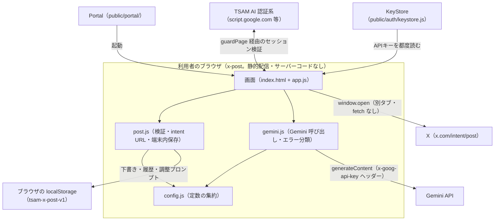
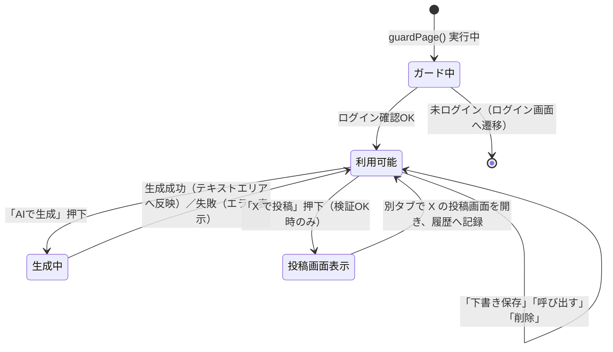

# X 投稿アプリ（x-post）基本設計書

対象要件は [01_requirements.md](./01_requirements.md)。実装の正は [docs/specs/x-post-requirements-v1.md](../../specs/x-post-requirements-v1.md)（差分仕様）と [docs/specs/threads-mvp-requirements-v1.md](../../specs/threads-mvp-requirements-v1.md)（基底仕様）。

## 1. システム構成

当社サーバーはどの経路にも登場しない。通信先は `index.html` の CSP（`<meta http-equiv="Content-Security-Policy">`）で Gemini・TSAM AI 認証系に固定しており、`x.com` は `connect-src` に**含めない**（fetch せず `window.open` で別タブを開くだけのため）。

## 2. コンポーネント一覧と責務

| ファイル | 責務 |
| --- | --- |
| `index.html` | 画面構造。CSP の宣言。`#xp-content` は既定で `hidden`、`app.js` が `guardPage()` 通過後に表示を切り替える |
| `config.js` | 静的設定の集約（Gemini モデル・エンドポイント、X intent のベースURL、280ウェイト上限、保存キー `tsam-x-post-v1`、履歴保持件数）。秘密情報を置かない |
| `post.js` | 280ウェイトの計数・検証、intent URL の組み立て、端末内保存（下書き・履歴・調整プロンプト） |
| `gemini.js` | Gemini 呼び出し（キーはヘッダー、404のみフォールバック）とエラー分類。台本メーカー（`../short-script/gemini.js`）と同方針で、複製している |
| `app.js` | DOM の付け外しのみ。`guardPage()` → 描画 → イベント接続。ロジックは持たない |
| `style.css` | `auth.css` の土台に乗せるアプリ固有の並び |

判定・組み立てのロジックを `post.js` / `gemini.js` に寄せ、`app.js` を画面反映専任にしているのは、DOM を持たない側にロジックを置くことでテスト（`tests/unit/x-post.mjs`）がブラウザなしで検証できるようにするためである（`app.js` 冒頭コメント）。

## 3. 外部インターフェース一覧

| 連携先 | 通信方式 | 主なエンドポイント／API |
| --- | --- | --- |
| Gemini API | `fetch` + `x-goog-api-key` ヘッダー | `POST https://generativelanguage.googleapis.com/v1beta/models/{model}:generateContent` |
| X（x.com） | `window.open()` による別タブ表示（fetch はしない） | `https://x.com/intent/post?text=…` |
| TSAM AI 認証系 | `public/auth/session.js` の `guardPage()` 経由（本アプリ固有の実装は持たない） | `script.google.com` / `script.googleusercontent.com`、`auth-verify.potenitas-lp.workers.dev`（セッション検証のキャッシュ付き代理） |

## 4. データ設計概要

本アプリは自前のサーバー側データストアを持たない。

| 保存先 | 内容 | 備考 |
| --- | --- | --- |
| ブラウザの `localStorage`（キー `tsam-x-post-v1`） | 下書き配列・履歴配列・調整プロンプト（1件のJSON） | Threads 版と保存キーが別のため、下書き・履歴は混ざらない |
| ブラウザの `localStorage`（キー `tsam-api-keys`。KeyStore 経由） | Gemini APIキー | `x-post` 固有の保存ではなく、他の本番アプリと共用の KeyStore（`public/auth/keystore.js`）が管理する |
| ブラウザのメモリ（JSモジュール内変数） | なし（APIキーは `KeyStore.get()` で都度読み、変数へ保持しない） | — |

## 5. 画面一覧と画面遷移

画面は1つ（単一HTML・単一ページ内の状態遷移）。

画面内のセクション構成は `index.html` を参照（AIで作る／投稿文／下書き／履歴の4セクション）。保存領域が使えない環境への注記（`#xp-storage-note`）は、成功時にのみ意味を持つセクションの外に常設し、非表示条件（`storageOk`）で出し分ける。

## 6. 認証・認可方式

1種類の認証のみを用いる。

1. **TSAM AI ログイン**: `public/auth/session.js` の `guardPage()` を通過するまで内容（`#xp-content`）を描画しない。セッション確認はサーバー側で行い、ローカルの値だけでログイン済みと判断しない。
2. **Gemini APIキー**: OAuth ではなく、利用者自身が発行した APIキーを KeyStore（`public/auth/keystore.js`）から都度読む。このアプリはキー入力欄を持たず、未設定時は Portal での設定を案内するのみ（KeyStore の一元管理）。

Google OAuth（GIS）は使わないため、本アプリに Google Cloud 側の設定は無い。

## 7. エラー処理方針

| 対象 | 方針 |
| --- | --- |
| 投稿文の検証（`post.js` の `validatePostText`） | 例外を投げず、問題があれば理由文字列（またはなし＝`null`）を返す。呼び出し側（`app.js`）はこれを見て intent リンクを開くかどうかを判断する |
| 端末内保存の読み取り（`post.js` の `readState`） | 壊れた保存データ（JSONとして読めない等）は例外にせず、空の初期状態として読み捨てる。次の保存で正しい形に作り直される |
| Gemini 呼び出し（`gemini.js` の `GeminiError`） | HTTPステータスを `mapStatus()` で `KEY_REJECTED` / `BAD_REQUEST` / `RATE_LIMITED` / `MODEL_NOT_FOUND` / `SERVER_ERROR` 等へ分類し、`describeGeminiError()` で画面文言とエラーコード（`KEY-001` 等）へ変換する。例外にAPIキーを含めない |

400 をキーの問題にしない（400 はリクエストの形が不正、キーが悪いのは401/403）という判定は台本メーカー（`../short-script/gemini.js`）由来の方針を踏襲している（`gemini.js` のコメント）。

## 8. 運用・デプロイ構成

- 配信は `public/production-app/x-post/` 配下の静的ファイルとして行う。ビルド工程を持たない。
- 本番反映は手動の `npm run deploy`（`opennextjs-cloudflare build && opennextjs-cloudflare deploy`）で行い、`main` へのマージだけでは公開されない（ルートの `CLAUDE.md` の配信構成の記述と同じ運用）。
- CSP は `next.config.ts` の `headers()` ではなく `index.html` の `<meta>` で宣言する（台本メーカーと同じ方式。`next.config.ts` は `public/` 全体の配信に効くため）。
- Portal のアプリ一覧（`public/portal/app-registry.js`）に `id: 'x-post'`、名前「X 投稿」、アイコン「X」で掲載済み。

## 9. 主要な設計判断と採らなかった選択肢

- **X API・アクセストークンを使わず intent リンク方式にする。** 「最後の投稿は人が押す」を構造的に保証でき、API 変更・審査・トークン管理のコストを負わない（基底仕様の判断を X 版でも継続）。
- **280ウェイトを自前実装で数える。** twitter-text ライブラリは導入せず、重み判定に必要な4つのコードポイント範囲だけを実装している。外部ライブラリを増やさない方針と、URL 特例（23ウェイト固定）が現時点で不要なため（既存仕様書 §3）。
- **保存キーを Threads 版と別にする（`tsam-x-post-v1`）。** 下書き・履歴が投稿先ごとに混ざらないようにするため。
- **本番アプリ間の共通層（`shared/`）を作らない。** `threads-post` と重なるロジック（検証・intent・端末内保存の骨格、Gemini エラー分類）は複製する。共有層は別々に進む開発を互いに止める同期点になるため（[docs/repository-structure.md](../../repository-structure.md) §4-1）。
- **キー入力欄をこのアプリに置かない。** KeyStore の一元管理（Portalで設定）に反するため、他の本番アプリと同じ導線にする。
- **Gemini の自動再試行をしない（429/503）。** 結果は変わらず無料枠のクォータを削るだけ（台本メーカーと同じ判断）。
- **書き方の調整プロンプトを下書き・履歴と同じ保存領域に置く。** 保存場所を増やすと消し忘れ・同期漏れの経路が増えるため、`STORAGE_KEY` の1つのJSONにまとめる。

これらの判断とその他の採用しなかった案は既存仕様書 §3、基底仕様 §9 に詳しい。
