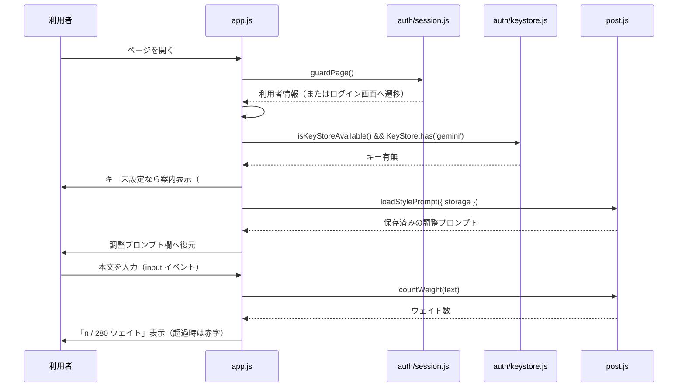
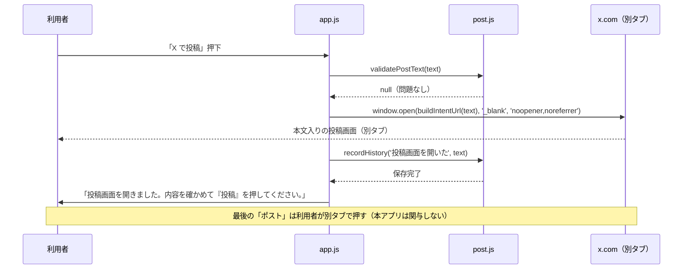
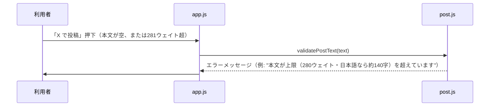
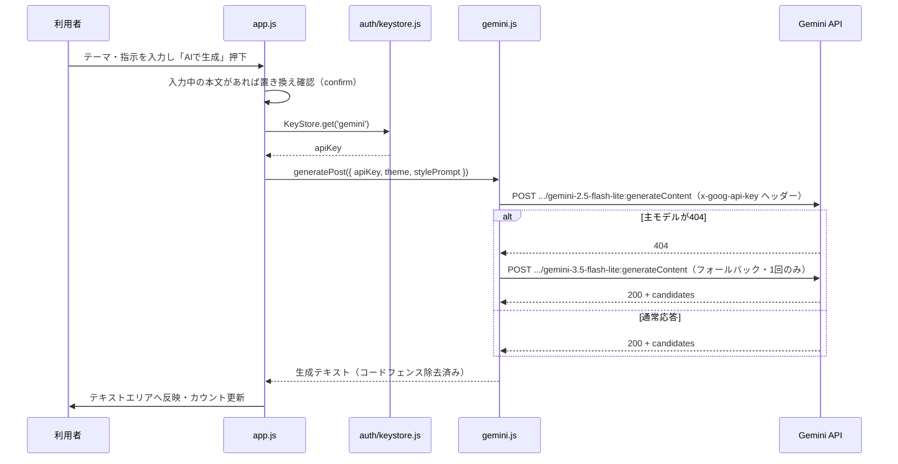
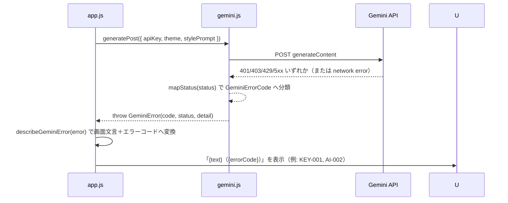

# X 投稿アプリ（x-post）詳細設計書

対象は [02_basic-design.md](./02_basic-design.md) のコンポーネント構成。実装の正は [docs/specs/x-post-requirements-v1.md](../../specs/x-post-requirements-v1.md)（差分仕様）と [docs/specs/threads-mvp-requirements-v1.md](../../specs/threads-mvp-requirements-v1.md)（基底仕様）。

## 1. ファイル・モジュール構成

| パス | 責務 |
| --- | --- |
| `public/production-app/x-post/index.html` | 画面構造・CSP宣言 |
| `public/production-app/x-post/config.js` | 静的設定一覧（§7） |
| `public/production-app/x-post/post.js` | 280ウェイトの計数・検証、intent URL の組み立て、端末内保存（下書き・履歴・調整プロンプト）。`../threads-post/post.js` と同じ実装方針の複製（保存キー等の定数のみ差分） |
| `public/production-app/x-post/gemini.js` | Gemini呼び出しとエラー分類。方針は台本メーカー（`../short-script/gemini.js`）と同一で、複製している（`import` はしない。[docs/repository-structure.md](../../repository-structure.md) §4-1） |
| `public/production-app/x-post/app.js` | 画面制御。`public/auth/config.js`（`setScreenDepth`）、`public/auth/session.js`（`guardPage`）、`public/auth/keystore.js`（`KeyStore` / `PROVIDERS` / `isKeyStoreAvailable`）を参照 |
| `public/production-app/x-post/style.css` | 見た目の差分 |
| `tests/unit/x-post.mjs` | Node実行のユニットテスト（ブラウザ不要） |

`post.js` の保存まわり・`gemini.js` は `threads-post` からの複製であり、`import` はしていない（各ファイル冒頭コメント、[docs/repository-structure.md](../../repository-structure.md) §4-1）。実ブラウザでの結線確認スイート（`tests/browser/x-post.mjs` 相当）は本書執筆時点で存在しない（§8、01_requirements.md §9）。

## 2. 主要処理フロー

### 2.1 起動〜文字数カウント（正常系）

### 2.2 投稿（intent リンク・正常系）

### 2.3 投稿（検証失敗・異常系）

### 2.4 Gemini 生成（正常系・404フォールバック）

### 2.5 Gemini 生成の異常系（エラー分類）

401/403 で GeminiError.code は `KEY_REJECTED` となるが、KeyStore からキーを消す等の副作用は行わない（利用者自身が Portal で管理する資産のため、アプリ側からは触らない）。

## 3. データモデル詳細

### 3.1 localStorage（キー `tsam-x-post-v1`）

`post.js` の `readState` / `writeState` が管理する1件のJSON。

| フィールド | 型 | 内容 |
| --- | --- | --- |
| `drafts` | `Array<{ id, text, createdAt }>` | 下書き。`id` は `crypto.randomUUID()`（フォールバックあり）、`createdAt` は `Date.now()` のミリ秒 |
| `history` | `Array<{ id, at, kind, text }>` | 履歴。`kind` は現在 `'投稿画面を開いた'` のみ。直近100件（`HISTORY_LIMIT`）を超えると古い順に切り捨て |
| `stylePrompt` | `string` | 書き方の調整プロンプト。空文字なら未設定 |

壊れたJSON・想定外の型（配列でない等）は `readState()` が握りつぶし、各フィールドの初期値（空配列・空文字列）へフォールバックする。

### 3.2 localStorage（キー `tsam-api-keys`。KeyStore 経由・本アプリ固有ではない）

Gemini APIキーを保持する。本アプリはこのキーを直接読み書きせず、`public/auth/keystore.js` の `KeyStore.get(PROVIDERS.gemini)` / `KeyStore.has(PROVIDERS.gemini)` のみを呼ぶ。詳細スキーマは `public/auth/keystore.js` および [docs/specs/keystore-spec-v1.md](../../specs/keystore-spec-v1.md) を参照（本書のスコープ外）。

### 3.3 メモリ上の状態（ページを離れると消える）

`app.js` はモジュールスコープの永続変数を持たない。DOM要素への参照（`dom` オブジェクト）と、イベントハンドラのクロージャのみが存在する。APIキーは `handleGenerate()` 実行中のローカル変数としてのみ存在し、関数を抜けると参照が残らない。

## 4. インターフェース仕様

### 4.1 外部API呼び出し

| API | メソッド／パス | 用途 | 主要パラメータ |
| --- | --- | --- | --- |
| Gemini API v1beta | `POST /v1beta/models/{model}:generateContent` | テーマ・指示からの投稿文生成 | ヘッダー `x-goog-api-key`。body は `buildPostRequest()` が組み立てる `{ contents, generationConfig: { temperature: 0.4, maxOutputTokens: 1024 } }` |

### 4.2 主要関数（入出力）

| 関数 | 所在 | 入力 | 出力／例外 |
| --- | --- | --- | --- |
| `countWeight(text)` | `post.js` | 本文文字列 | `number`（合計ウェイト。半角系1・それ以外2） |
| `validatePostText(text)` | `post.js` | 本文文字列 | `string \| null`（エラーメッセージ、問題なければ `null`） |
| `buildIntentUrl(text)` | `post.js` | 本文文字列 | `string`（`https://x.com/intent/post?text=...` の完全URL。`encodeURIComponent` でエンコード） |
| `isStorageAvailable(storage?)` | `post.js` | 省略可（既定 `localStorage`） | `boolean` |
| `saveDraft(text, { storage?, now? })` | `post.js` | 本文文字列 | `{ id, text, createdAt }`。空文字は `Error` |
| `listDrafts({ storage? })` | `post.js` | オプション | `Array`（新しい順） |
| `deleteDraft(id, { storage? })` | `post.js` | 下書きID | `void` |
| `recordHistory(kind, text, { storage?, now? })` | `post.js` | 種別・本文 | `void`（保持上限は `HISTORY_LIMIT`=100） |
| `listHistory({ storage? })` | `post.js` | オプション | `Array`（新しい順） |
| `saveStylePrompt(text, { storage? })` / `loadStylePrompt({ storage? })` | `post.js` | 調整プロンプト文字列 | `void` / `string` |
| `generatePost({ apiKey, theme, stylePrompt, fetchImpl?, signal? })` | `gemini.js` | APIキー・テーマ・調整プロンプト | `Promise<string>`（生成テキスト）。失敗時は `GeminiError` |
| `describeGeminiError(error)` | `gemini.js` | 任意の例外 | `{ text, errorCode, detail }`（画面表示用） |
| `mapStatus(status)` | `gemini.js` | HTTPステータス | `GeminiErrorCode` の値 |

### 4.3 エラーコード一覧（画面表示用・`describeGeminiError` が返す `errorCode`）

| コード | 発生源（`GeminiErrorCode`） | 意味 |
| --- | --- | --- |
| `KEY-001` | `KEY_MISSING` | Gemini APIキーが未設定 |
| `KEY-002` | `KEY_REJECTED` | キーが拒否された（HTTP 401/403） |
| `AI-003` | `BAD_REQUEST` | リクエストの形式が不正（HTTP 400。キーの問題ではない） |
| `AI-002` | `RATE_LIMITED` | 利用上限（HTTP 429） |
| `AI-005` | `MODEL_NOT_FOUND` | モデルが利用できない（HTTP 404。フォールバック後もなお404の場合） |
| `AI-004` | `EMPTY_TEXT` | 生成結果が空、または応答本文が読めない |
| `AI-001` | `NETWORK` / `SERVER_ERROR` | 通信失敗、または Gemini 側のエラー（HTTP 5xx。503は「混雑」として個別文言） |
| `SYS-999` | `UNKNOWN` | 上記いずれにも当てはまらない例外 |

投稿文の検証（`validatePostText`）・下書き保存（`saveDraft`）の失敗は、専用のエラーコード体系を持たず、日本語メッセージ文字列（または `Error.message`）をそのまま画面に表示する。

## 5. 状態管理・セッション設計

- **TSAM AIセッション**: `public/auth/session.js` の仕組みに従う（本アプリ固有の実装は持たない）。根拠はサーバー側のセッションであり、`guardPage()` が利用者情報を返すまで `#xp-content` を描画しない。
- **Gemini APIキー**: `KeyStore`（`public/auth/keystore.js`）のモジュール変数ではなく localStorage（`tsam-api-keys`）に永続化される（本アプリのライフサイクルとは独立）。`app.js` は Portal からの遷移・タブのフォーカス復帰時（`focus` イベント、`visibilitychange`）に `refreshKeyState()` を呼び、キー設定状態の表示を更新する。
- **下書き・履歴・調整プロンプト**: `localStorage`（`tsam-x-post-v1`）に永続化され、ページ再読み込み・タブを閉じても残る。
- **画面上の一時状態（本文入力・生成中フラグ）**: DOM要素の値・`disabled` 属性で表現し、専用の状態変数は持たない。ページ再読み込みで消える。

## 6. エラーハンドリング詳細

- **投稿文の検証は例外を投げない。** `validatePostText()` はエラー文字列または `null` を返す関数であり、`handlePost()` はこれを見て intent リンクを開くかどうかを分岐する。空・280ウェイト超のいずれも intent は開かれない。
- **`window.open()` の失敗（ポップアップブロック等）を検知する。** 戻り値が falsy の場合、「投稿画面を開けませんでした。ポップアップの許可をご確認ください。」を表示し、履歴には記録しない（実際に開けていないため）。
- **壊れた保存データは読み捨てる。** `readState()` の `JSON.parse` が失敗、または `drafts`/`history` が配列でない場合、初期状態（空配列・空文字列）へフォールバックする。次の `saveDraft()` 等の呼び出しで正しい形の状態が書き戻される。
- **Gemini のエラーは `GeminiError` に統一して分類する。** `callOnce()` は fetch 自体の失敗を `NETWORK`、HTTPエラーを `mapStatus()` で分類、応答本体のJSONパース失敗・空テキストを `EMPTY_TEXT` として扱う。例外メッセージ（`gemini:${code}`）にAPIキー・応答本体を含めない。
- **400 をキーの問題にしない。** `mapStatus()` は 400 を `BAD_REQUEST`、401/403 のみを `KEY_REJECTED` として区別する（`gemini.js` のコメント。台本メーカー由来の既知の知見）。
- **404 は主モデルのときだけフォールバックする。** `generatePost()` は主モデル呼び出しで `MODEL_NOT_FOUND` を受けた場合のみ、フォールバックモデルへ1回だけ切り替える。フォールバックモデルでも失敗した場合はそのまま例外を投げる（再帰的なフォールバックはしない）。

## 7. 設定値・環境変数一覧

いずれも `public/production-app/x-post/config.js` に定義。値そのものは実運用値であるため本書には書かない（役割のみ）。環境変数（`.env` 等）は使用しない。

| 名前 | 役割 |
| --- | --- |
| `DEFAULT_MODEL` / `FALLBACK_MODEL` | Gemini の主モデル・フォールバックモデル名 |
| `GEMINI_HOST` / `GEMINI_ENDPOINT_BASE` | Gemini API のホスト名・エンドポイントのベースURL |
| `MAX_OUTPUT_TOKENS` | Gemini 生成の最大出力トークン数 |
| `X_INTENT_BASE` | X intent リンクのベースURL（`https://x.com/intent/post`） |
| `WEIGHT_LIMIT` | X投稿の上限ウェイト数（280） |
| `THEME_MAX_LENGTH` | テーマ・指示入力欄の上限文字数 |
| `STORAGE_KEY` | 端末内保存（下書き・履歴・調整プロンプト）の localStorage キー |
| `HISTORY_LIMIT` | 履歴の保持件数上限 |

## 8. テスト構成

| スイート | 実行方法 | 検証範囲 |
| --- | --- | --- |
| `tests/unit/x-post.mjs` | `node tests/run.mjs x-post`（または `npm test` に含まれる） | 280ウェイトの数え方（半角=1・全角=2・絵文字=2・混在）、境界値（280は通り281は拒否）、intent URL が `x.com` 向けであることとエンコードの往復一致、保存キーが Threads 版と別であること、下書きの保存・一覧、履歴の記録、壊れた保存データの読み捨て、調整プロンプトの保存・復元、Gemini プロンプトへの調整プロンプト差し込み、X向けプロンプト文言（「X（旧 Twitter）」「140文字以内」「全角1文字が2」「創作の禁止」）、キーはヘッダーで渡されること、キー未設定は `KEY_MISSING` になること |

Threads版との違い（280ウェイト計数・`x.com` intent）を重点的に固定し、保存・Gemini の骨格は Threads 版の複製であるため要点のみを通す方針（`tests/unit/x-post.mjs` 冒頭コメント）。

本書執筆時点で `tests/browser/x-post.mjs` 相当の実ブラウザ結線確認スイートは存在しない。DOM描画（`app.js`）自体はテストされておらず、`countWeight` / `validatePostText` / `buildIntentUrl` / 保存関数 / `generatePost` などロジック層の直接呼び出しのみで検証している（§9 未確定事項）。

CI（`.github/workflows/test.yml`）が実行するのは `npm test`（`node public/apps/tests/run.mjs && node tests/run.mjs`）のみ。各スイートは別プロセスで直列に実行される（偽Apps Script環境やグローバルの差し替えが漏れるため、およびChromeのポート競合を避けるため）。
